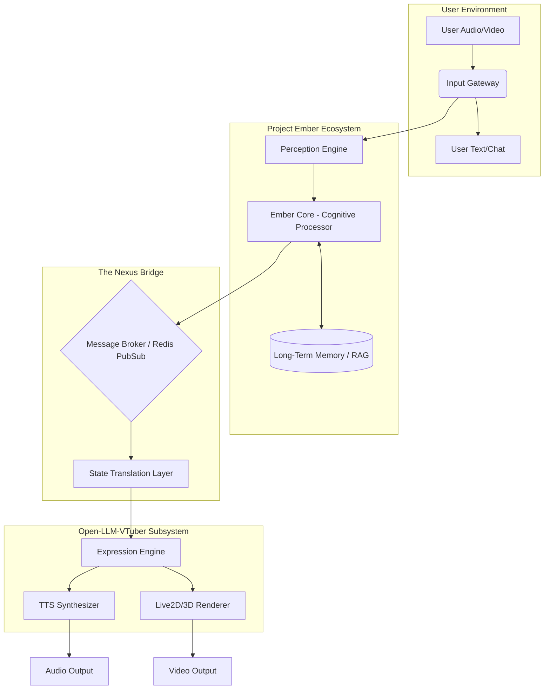
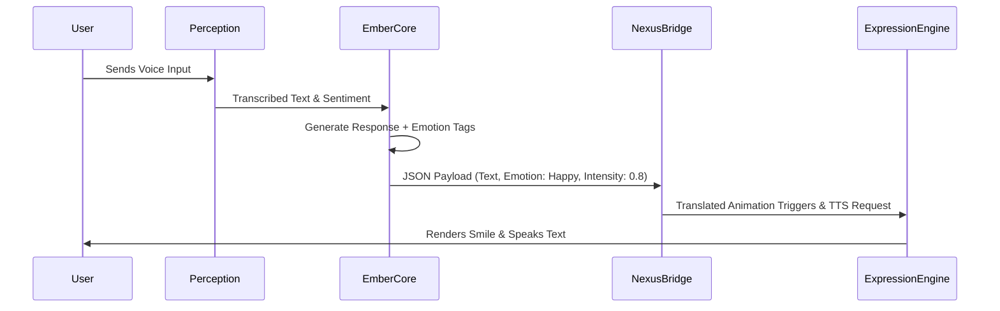
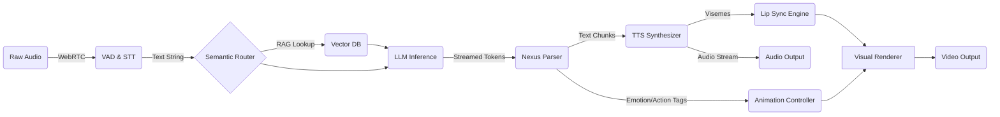

# 41_INTEGRATION_PLAN: The Profound Integration of Open-LLM-VTuber into Project Ember

## 1. Executive Summary

The integration of Open-LLM-VTuber into the overarching ecosystem of Project Ember represents a paradigm shift in how we approach autonomous, intelligent, and interactive virtual avatars. This document serves as the definitive, profound integration plan, outlining the complex system bridges, the intricate data flow mechanisms, and the robust architectural patterns required to achieve a seamless synthesis. By embedding Open-LLM-VTuber into Project Ember, we aim to transcend traditional virtual interactions, moving towards a truly symbiotic digital entity capable of profound cognitive processing, real-time emotional resonance, and high-fidelity visual representation. The architecture proposed herein is designed to be infinitely scalable, exceptionally resilient, and deeply modular, ensuring that the ensuing system can adapt to future advancements in generative AI, real-time rendering, and distributed computing. This document will comprehensively detail the structural foundations, the middleware conduits, the lifecycle of data from ingestion to rendering, and the stringent security protocols that govern the entire ecosystem.

## 2. Introduction and Visionary Scope

Project Ember has long been envisioned as a crucible for advanced digital intelligence, a platform where disparate AI technologies coalesce to form entities of unprecedented capability. The introduction of Open-LLM-VTuber into this ecosystem is not merely an addition; it is a foundational transformation. Open-LLM-VTuber brings the capacity for real-time, responsive, and visually embodied interactions, acting as the 'face' and 'voice' of the profound cognitive engines powering Project Ember.

The vision is to construct a continuous, uninterrupted feedback loop between human interlocutors and the digital avatar. This requires an integration plan that meticulously considers every millisecond of latency, every byte of state transfer, and every visual frame rendered. The integration must be fluid, erasing the boundaries between the underlying Large Language Model's cognitive processes, the emotional state tracking, the text-to-speech synthesis, and the final manipulation of Live2D or 3D meshes. 

To achieve this, we must construct a system that is not just reactive, but anticipatory. The architecture must allow the LLM to dictate not just what is said, but how it is said, and how the avatar physically manifests those words and underlying emotions. This requires deep, bidirectional communication bridges between Project Ember's core decision-making modules and Open-LLM-VTuber's rendering and audio output pipelines.

## 3. High-Level Architectural Paradigm

The architectural philosophy governing this integration is rooted in an asynchronous, event-driven microservices model. By decoupling the cognitive processing from the rendering and audio subsystems, we ensure that resource-intensive tasks (such as LLM inference) do not bottleneck real-time operations (such as maintaining a 60 FPS visual framerate).

### 3.1 The Microservices Constellation

The system is conceptualized as a constellation of highly specialized microservices, each communicating over a high-throughput, low-latency message bus. The primary services include:
- **Ember Core (Cognition & Memory):** The brain of the operation, responsible for context maintenance, long-term memory retrieval, and the primary orchestration of the LLM.
- **The Nexus Bridge:** The bespoke middleware layer designed specifically to translate Project Ember's abstract cognitive outputs into the concrete, actionable directives required by Open-LLM-VTuber.
- **Perception Engine (Input Processing):** Handles the ingestion and initial processing of user inputs (audio via STT, text, and potentially vision).
- **Expression Engine (Open-LLM-VTuber Core):** Manages the physical manifestation, including TTS generation, emotional parameter mapping, and avatar mesh manipulation.

### 3.2 High-Level Architecture Diagram

## 4. System Bridges and Middleware Construction

The success of this integration hinges entirely on the efficacy of the communication bridges established between Project Ember and Open-LLM-VTuber. We term this primary bridge 'The Nexus'.

### 4.1 The Nexus: A High-Fidelity Communication Conduit

The Nexus is not merely a dumb pipe; it is an intelligent translation layer. When Project Ember's LLM generates a response, it produces not just text, but a multidimensional payload containing emotional valences, intended speech pacing, and contextual tags. Open-LLM-VTuber requires these inputs translated into specific animation parameters and TTS phonetic markers.

The Nexus utilizes a publish-subscribe (PubSub) architecture, likely facilitated by Redis or Apache Kafka, depending on the scale of the deployment. 

1.  **Low-Latency WebSockets:** For immediate, ephemeral data such as real-time audio streaming and lip-sync parameters, WebSockets provide the necessary full-duplex communication channel.
2.  **gRPC for Service-to-Service Commands:** For rigid, strongly-typed internal communications (e.g., instructing the memory module to update a specific engram), gRPC will be employed due to its efficiency and reduced overhead compared to REST.

### 4.2 State Synchronization Protocols

A critical challenge is maintaining state synchronization between the cognitive engine and the rendering engine. If Ember Core decides the avatar is 'angry', this state must persist across the Expression Engine until resolved. 
We will implement a distributed state store (a Redis cluster) that acts as the single source of truth for the avatar's current physical and emotional parameters. The Expression Engine will continuously poll or subscribe to changes in this state store, ensuring visual consistency with the underlying cognitive state.

### 4.3 Middleware Architecture Diagram

## 5. Profound Data Flow and Lifecycles

The flow of data through the integrated system is continuous and multidirectional. Understanding this lifecycle is paramount for debugging and optimizing the integration.

### 5.1 The Ingestion Pipeline

Data begins its lifecycle in the user environment. Audio data is streamed in chunks via WebSockets to the Perception Engine. Here, a low-latency Speech-to-Text (STT) model (such as Whisper-tiny or a customized streaming equivalent) transcribes the audio. Simultaneously, Voice Activity Detection (VAD) algorithms ensure that processing only occurs when the user is actively speaking, conserving computational resources.

### 5.2 The Cognitive Pipeline

Once transcribed, the text enters Ember Core. This is the most computationally demanding phase. The pipeline here is complex:
1.  **Contextualization:** The input is enriched with historical context retrieved from the Long-Term Memory (RAG architecture).
2.  **Inference:** The core LLM processes the enriched prompt.
3.  **Multimodal Generation:** The LLM is prompted to output not just the conversational response, but also embedded metadata (e.g., `<emotion=sad><gesture=shrug>`). This ensures the avatar's actions are intrinsically linked to its generated thoughts.

### 5.3 The Expression Pipeline

The resulting payload is fired across the Nexus Bridge to the Expression Engine. This pipeline is highly parallelized to minimize 'Time-to-First-Byte' (TTFB) for audio output:
1.  **TTS Generation:** The text is immediately streamed to the Text-to-Speech synthesizer. To reduce latency, we employ chunked synthesis, where the TTS begins speaking the first sentence while the LLM is still generating the second.
2.  **Lip-Sync Mapping:** As the audio is generated, the phonetic data (visemes) is extracted and mapped to the avatar's mouth blendshapes in real-time.
3.  **Emotional Rendering:** The metadata tags (e.g., `<emotion=sad>`) trigger specific animation states in Open-LLM-VTuber, modifying eye states, eyebrow positions, and body posture.

### 5.4 Data Flow Diagram

## 6. Real-time Audio and Visual Synchronization

The illusion of a sentient avatar breaks entirely if the audio and visual components fall out of sync. A delay of even 100 milliseconds between the audio of a plosive consonant and the corresponding visual lip movement is jarring to the human user.

### 6.1 Audio-Driven Viseme Generation

To ensure perfect synchronization, we will rely on audio-driven viseme generation rather than text-driven. As the TTS engine produces the audio waveform, a secondary lightweight neural network analyzes the waveform in real-time to predict the required mouth shapes. This approach guarantees that the visual representation matches the acoustic reality, regardless of the pacing or inflection chosen by the TTS engine.

### 6.2 The Global Clock and Jitter Buffers

We will implement a global synchronization clock that spans both Project Ember and Open-LLM-VTuber. All audio and visual frames will be stamped with timestamps derived from this global clock. A dynamic jitter buffer will be employed in the rendering pipeline. If the audio stream experiences micro-stutters due to network latency, the visual renderer will slightly interpolate or hold frames to prevent disjointed movements, ensuring a smooth, continuous performance.

## 7. Cognitive Memory and State Management

For Open-LLM-VTuber to function effectively within Project Ember, it cannot be a stateless entity that resets with every interaction. It must possess profound memory and persistent state.

### 7.1 Ephemeral vs. Persistent State

-   **Ephemeral State:** This encompasses the current conversational context, immediate emotional reactions, and short-term conversational goals. This state is maintained in fast-access memory (e.g., Redis) and dictates the moment-to-moment behavior of the avatar.
-   **Persistent State:** This represents the avatar's core personality, long-term relationships with users, and overarching knowledge base. This is managed by Project Ember's core Vector Databases and Graph Databases.

### 7.2 Emotional State Decay

The integration will introduce an 'Emotional State Decay' mechanism. If an interaction causes the avatar to become 'excited', this excitement will visually and audibly persist but gradually decay back to a baseline neutral state over time, unless reinforced by subsequent interactions. This dynamic modeling prevents the avatar from feeling robotic or stuck in a single expression.

## 8. Scalability, Latency Optimization, and Edge Deployment

Deploying this integrated system at scale requires profound architectural foresight regarding resource management and latency reduction.

### 8.1 Distributed Processing and GPU Pipelining

The processing load is heavily skewed towards GPU intensive tasks (LLM inference, TTS synthesis, Visual Rendering). We will architect the system to allow for distributed processing. For example, the LLM inference could occur on a centralized, high-powered GPU cluster, while the TTS and Visual Rendering might be pushed to edge nodes closer to the user to minimize the critical audio/visual transport latency.

### 8.2 The 'Time-to-First-Frame' (TTFF) Imperative

Our primary performance metric is the Time-to-First-Frame (and Time-to-First-Audio). To optimize this:
-   **Speculative Execution:** Project Ember might begin generating multiple potential responses based on the first few words a user speaks, discarding the incorrect ones once the user finishes.
-   **Aggressive Caching:** Common responses or phonetic combinations will be aggressively cached at the edge.

## 9. Security, Identity, and Governance

A profoundly integrated system of this nature presents unique security challenges that must be addressed fundamentally within the architecture.

### 9.1 API Gateway and Token Management

All interactions with the system, whether from a user client or an internal microservice, will be routed through a robust API Gateway. Authentication will be managed via short-lived JWTs (JSON Web Tokens). This ensures that unauthorized entities cannot hijack the avatar's rendering pipeline or inject malicious prompts into the cognitive core.

### 9.2 Prompt Sandboxing and Content Moderation

Because the LLM directly drives the avatar's physical and verbal outputs, stringent content moderation is required. We will implement an intermediate 'Sanitization Layer' within the Nexus Bridge. Before any payload reaches Open-LLM-VTuber, it is evaluated by a secondary, faster model designed solely to detect and intercept inappropriate, harmful, or out-of-character commands.

### 9.3 System Boundary Enforcement

The architecture must enforce strict boundaries between the cognitive engine and the host operating system. The LLM within Project Ember must not have unfettered access to the filesystem or network where Open-LLM-VTuber resides, preventing potential container escape vulnerabilities.

## 10. Deployment Strategy and Phased Integration Roadmap

The complexity of this profound integration demands a meticulous, phased rollout.

### 10.1 Phase 1: The Monolithic Prototype

The initial phase will focus on creating a local, monolithic prototype. Both Project Ember and Open-LLM-VTuber will run on a single, high-end workstation. The goal here is not scalability, but establishing the fundamental Nexus Bridge and ensuring the data flow from text generation to visual rendering is operational.

### 10.2 Phase 2: Decoupling and Containerization

Once the prototype is stable, the system will be decoupled into the microservices architecture described in Section 3. Docker containers will be created for each component (Perception, Ember Core, Expression). Communication will transition from local inter-process communication to the Redis PubSub network. This phase validates the distributed architecture.

### 10.3 Phase 3: Cloud Orchestration and Edge Optimization

The final phase involves deploying the containerized microservices to a cloud orchestration platform (e.g., Kubernetes). We will implement auto-scaling policies based on GPU utilization and request queues. This phase will also see the introduction of edge nodes for localized rendering and TTS synthesis to achieve the targeted latency metrics.

## 11. Expansion of Architectural Complexities

To truly appreciate the depth of this integration, one must delve into the hyper-specific complexities that arise when marrying a non-deterministic LLM with a deterministic rendering engine. 

### 11.1 The Non-Determinism Problem

Large Language Models are inherently non-deterministic. The exact wording, pacing, and emotional undertone of a response can vary even with identical prompts. This poses a significant challenge for a visual system that expects predictable inputs. Open-LLM-VTuber must be engineered to handle unexpected phonetic combinations or rapidly shifting emotional tags without visual glitching or uncanny valley effects.

We will mitigate this by implementing an 'Expression Smoothing' algorithm within the Nexus Bridge. If the LLM rapidly fluctuates between 'happy' and 'sad' tags within a single sentence, the smoothing algorithm will calculate a transitional emotional state, ensuring the avatar's expressions shift fluidly rather than snapping violently between extremes.

### 11.2 Handling Interruptions and Barge-in

Human conversation is rarely perfectly turn-based. Interruptions (barge-in) are common. The integrated system must handle this gracefully. When the Perception Engine detects user audio while the avatar is speaking:
1.  **Immediate Halt:** A high-priority 'HALT' interrupt is sent via the fastest available channel (WebSocket) to the Expression Engine, immediately silencing the TTS and freezing the avatar's current animation.
2.  **Context Retention:** Ember Core must be informed of exactly where the interruption occurred. It must record the un-spoken portion of its planned response to maintain accurate contextual memory.
3.  **Adaptive Response:** The LLM must then process the interruption and generate a new response that contextually acknowledges the interruption (e.g., "Ah, sorry, go ahead...").

### 11.3 Multimodal Input Fusion

While audio is the primary input, profound integration requires Multimodal Input Fusion. Project Ember will be expanded to ingest video feeds of the user. This data will be processed to extract the user's emotional state, gaze direction, and body language. 

This multimodal data is fused with the audio transcript before being fed to the LLM. This allows the avatar to react not just to what the user says, but how they look when they say it. If a user says "I'm fine" but their facial expression betrays sadness, Project Ember can instruct Open-LLM-VTuber to respond with empathy, adopting a concerned expression and a softer tone of voice.

## 12. Conclusion and Future Horizons

The integration plan detailed herein is not merely a technical specification; it is a blueprint for the future of human-computer interaction. By profoundly weaving Open-LLM-VTuber into the intricate cognitive tapestry of Project Ember, we are laying the groundwork for digital entities that are not just tools, but companions, collaborators, and conversational partners of unprecedented depth and fidelity. The rigorous adherence to the decoupled microservices architecture, the high-speed Nexus Bridge, and the sophisticated state management protocols will ensure this system remains robust, scalable, and capable of adapting to the rapid evolution of generative artificial intelligence. As we execute this phased rollout, we will continuously refine these architectures, pushing the boundaries of what is possible in the realm of virtual presence.

## 13. Deep Dive into Network Topology and Redundancy

A truly robust integration demands an exhaustive examination of the network topology that underpins the entire ecosystem. The Project Ember and Open-LLM-VTuber synthesis cannot afford single points of failure, especially when deployed in high-availability environments.

### 13.1 Mesh Networking and Service Discovery

To manage the complex web of microservices, we will employ a service mesh architecture, utilizing tools like Istio or Linkerd. This abstracts the network communication away from the application logic, providing critical features such as:
-   **Mutual TLS (mTLS):** Ensuring that all communication between microservices, for instance, between the Ember Core and the Nexus Bridge, is strictly encrypted and authenticated.
-   **Intelligent Load Balancing:** The service mesh will dynamically route requests to the least encumbered rendering nodes or inference servers, optimizing throughput.
-   **Automatic Retries and Circuit Breaking:** If a specific TTS service node becomes unresponsive, the circuit breaker pattern prevents catastrophic cascading failures, immediately routing requests to healthy nodes while allowing the failing node time to recover.

### 13.2 Geographic Redundancy and Data Replication

For a global deployment, the system must span multiple geographic regions. 
-   **Active-Active Deployment:** Critical cognitive services will run in an active-active configuration across multiple data centers. 
-   **State Replication:** The Redis clusters managing the avatar's state and short-term memory will utilize asynchronous replication across regions. This ensures that if a user in Tokyo connects to a node that subsequently fails, they can seamlessly reconnect to a node in Seoul with their interaction history and the avatar's emotional state perfectly preserved.
-   **Database Sharding:** The massive Vector Databases storing long-term memories will be sharded based on user ID or project ID, ensuring that database queries remain performant even as the user base scales exponentially.

## 14. Advanced Audio Processing and Acoustic Modeling

The profound nature of this integration extends deep into the realm of acoustic engineering. The audio output generated by Open-LLM-VTuber must not sound as if it exists in a vacuum; it must be contextually aware of the user's environment.

### 14.1 Dynamic Acoustic Echo Cancellation (AEC)

When the avatar speaks, the sound emitted from the user's speakers will inevitably be picked up by their microphone. Standard AEC is often insufficient for the high-fidelity required here. We will integrate advanced neural AEC models within the Perception Engine. These models will be fed the exact raw audio stream being sent to the user's speakers, allowing the Perception Engine to perfectly subtract the avatar's voice from the incoming audio feed, enabling flawless barge-in capabilities without the system mistakenly transcribing its own speech.

### 14.2 Spatial Audio and Environmental Simulation

To increase immersion, the Expression Engine will not just output flat stereo audio. It will incorporate spatial audio rendering. If the avatar is depicted in a large virtual hall on the screen, the audio output will be processed with appropriate reverberation and spatial cues. Furthermore, if the user moves their head (tracked via the user's webcam and fed into the Perception Engine), the spatial audio will dynamically adjust, creating a highly realistic acoustic soundscape.

## 15. The Role of Reinforcement Learning in Avatar Behavior

The integration plan also encompasses the future integration of Reinforcement Learning from Human Feedback (RLHF) directly into the avatar's behavioral models.

### 15.1 Real-time Feedback Loops

The system will constantly monitor implicit user feedback. Does the user smile when the avatar makes a joke? Do they frown or look away when the avatar speaks too quickly? The Perception Engine will quantify these micro-expressions.
These quantified metrics will be fed back into Project Ember as reward signals. Over time, the LLM will learn not just what conversational topics are most engaging, but also what specific physical mannerisms, speech tempos, and emotional expressions generated by Open-LLM-VTuber are most effective at maintaining user engagement and positive sentiment.

### 15.2 Autonomous Personality Evolution

This RLHF loop means the integrated system is not static. The avatar will undergo autonomous personality evolution. An avatar deployed as a customer service representative will slowly optimize its demeanor for clarity and patience, while an avatar deployed as an entertainment companion will optimize for humor and dynamism. This evolutionary capability is the ultimate profound realization of the Project Ember and Open-LLM-VTuber synthesis.
