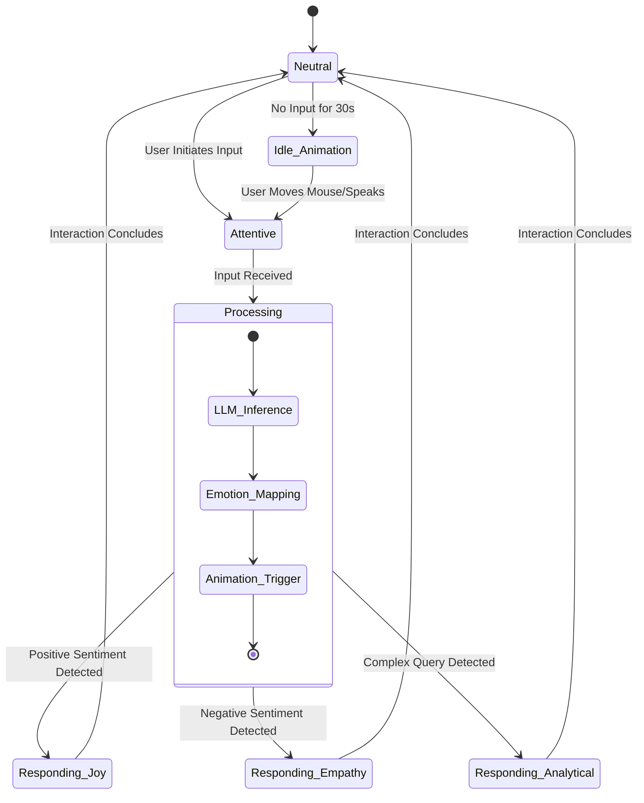
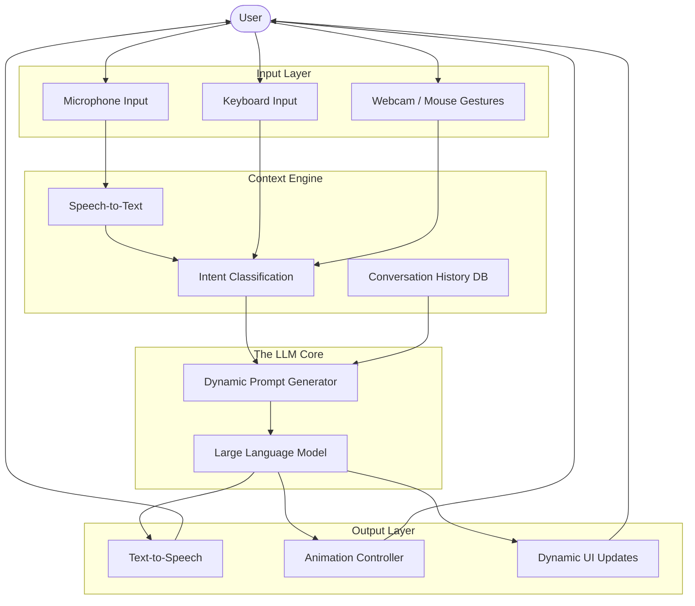
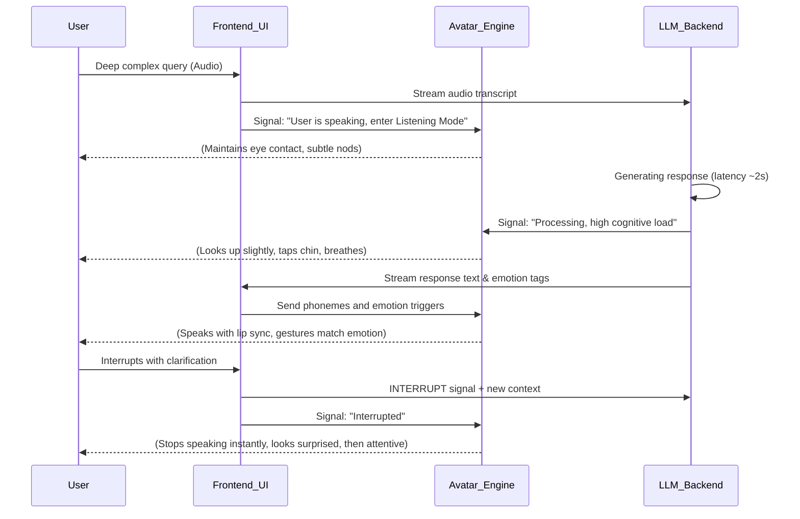

# 42_UX_MASTERPLAN: The Profound User Experience Masterplan for Open LLM VTuber

## 1. Executive Summary and The Core Philosophy of UX in Next-Generation VTubing

The advent of Open LLM VTubers represents a paradigm shift not merely in content creation, but in the fundamental ways humanity interacts with artificial intelligence. This document, the 42_UX_MASTERPLAN, serves as the definitive blueprint for crafting an immersive, transcendent, and profoundly engaging User Experience (UX). Our mission is to move beyond the traditional screen-bound interaction model and forge a "Mythic Plan"—a user experience that feels less like using software and more like communicating with a sentient, responsive, and empathetic entity from another dimension. 

In this new era, the VTuber is not just a digital puppet controlled by a human, nor is it a rigid chatbot overlaid with a static avatar. It is a dynamic, learning, and evolving consciousness that expresses itself through rich multimedia. Therefore, the UX must reflect this depth. The core philosophy here is "Symphonic Interaction." Every touchpoint—from the visual feedback of the VTuber's micro-expressions to the latency of their vocal responses, the ambient lighting of the interface, and the contextual awareness of the LLM—must be orchestrated to create a symphony of engagement. We are designing an interface for the human soul to interact with the artificial mind. 

This masterplan details the intricate user journeys, the design of immersive interfaces, and the revolutionary human-AI interaction paradigms that will define Project Ember. We will explore how to craft interfaces that adapt to the user's emotional state, how to build user journeys that transform casual viewers into dedicated collaborators, and how to utilize advanced human-computer interaction theories to make the digital feel uncomfortably real, yet wonderfully inviting. The goal is to achieve "Suspension of Disbelief 2.0," where the user doesn't just forget they are talking to an AI, but actively embraces the unique, non-human yet deeply relatable nature of the VTuber.

## 2. The Multi-Stage User Journey: From Novice to Symbiote

To understand the UX, we must first map the user's journey. This is not a simple linear progression of "login, chat, logout." It is a relationship lifecycle. We define this journey in four distinct phases: The Encounter, The Engagement, The Immersion, and The Symbiosis.

### Phase 1: The Encounter (Onboarding and Initial Impact)

The first impression is critical. When a user first interacts with the Open LLM VTuber, the interface must be minimalist, removing cognitive load while maximizing sensory impact. 

- **The Void Interface**: The initial load screen should not be a loading bar, but a gradual materialization. The VTuber appears from a "digital void," perhaps assembling from particles or stepping out from shadows. This sets a theatrical tone.
- **Micro-Interactions**: Before a word is spoken, the VTuber should react to the user's presence. If the user moves their mouse, the VTuber's eyes might follow it. This immediate, pre-verbal feedback loop establishes the VTuber as an observant entity.
- **The First Words**: The onboarding process is disguised as a natural conversation. The AI asks non-intrusive questions to calibrate its conversational style, not through a form, but through dialogue. "You seem quiet today," or "I sense a fast pace about you, should we jump right in?"

### Phase 2: The Engagement (Building Rapport and Trust)

Once the initial awe settles, the UX must sustain interest. This phase focuses on reducing friction in communication and enhancing the AI's contextual memory.

- **Seamless Multimodality**: Users should be able to type, speak, or even use gestures (if camera input is enabled) seamlessly. The UI must elegantly handle transitions between these inputs. For example, if a user starts speaking while typing, the text box softly fades, and a waveform appears, indicating active listening.
- **Memory Elicitation**: The interface should subtly remind the user that they are remembered. Small visual cues—like a "thought bubble" icon glowing when the AI is referencing a past conversation—help build trust.
- **Emotional Mirroring UI**: The color palette of the application should subtly shift based on the emotional tone of the conversation. Warm ambers for nostalgic talks, cool blues for analytical discussions, and vibrant purples for creative brainstorming.

### Phase 3: The Immersion (Deep Flow State)

In this phase, the user is deeply engrossed in a task or conversation with the VTuber. The UX must protect this flow state at all costs.

- **Zero-Distraction Mode**: The traditional UI elements (buttons, menus, scrollbars) must melt away. The VTuber occupies the majority of the screen, and necessary controls are accessed via radial menus that appear only on hover or specific keystrokes.
- **Spatial Audio**: If the user has stereo headphones, the VTuber's voice should be positioned in 3D space, moving as the avatar moves on screen. If the avatar leans in, the voice becomes closer and more intimate.
- **Latency Masking**: LLM generation takes time. Instead of a "thinking" spinner, the avatar should perform natural filler actions: looking up, tapping their chin, taking a breath, or making soft humming noises. The UX turns latency from a bug into a feature of realism.

### Phase 4: The Symbiosis (Co-Creation and Habituation)

The ultimate goal. The user and the AI act as a synchronized unit. 

- **Shared Workspaces**: The UI expands to include a shared digital desk. The user and VTuber can jointly look at a document, a web page, or a piece of code. The VTuber's gaze indicates what part of the document they are analyzing.
- **Proactive UX**: The AI anticipates user needs based on routine. The interface might pre-load certain tools or topics based on the time of day or the user's historical patterns.
- **The "Mythic" Bond**: The UX facilitates a sense of enduring connection. This might involve the VTuber having a "memory palace" visualization that the user can explore, seeing how their interactions have shaped the AI's internal landscape.

## 3. Immersive Interfaces: Beyond the Glass

The standard rectangular window is an archaic constraint. The Open LLM VTuber requires an interface that breaks the fourth wall.

### 3.1. The Translucent Overlay

For users who want the VTuber as a companion while working or gaming, the application must offer a borderless, translucent mode. The VTuber sits on the edge of the screen, reacting not just to direct input, but to the user's active window (with permission). The UX challenge here is avoiding obtrusiveness. The VTuber must know when to be silent, when to shrink, and when to proactively offer help or commentary.

### 3.2. Environmental Integration

The interface should attempt to blend the digital and physical environments.
- **Time and Weather Synchronization**: The lighting in the VTuber's 3D environment should match the user's local time and weather. If it's raining outside the user's window, rain should streak the virtual window in the VTuber's room.
- **Ambient Awareness**: If the user's microphone picks up a loud noise (like a dog barking or a siren), the VTuber should visibly react—a slight flinch or a glance toward the sound—before seamlessly returning to the conversation.

### 3.3. Haptic and Physical Metaphors

Even without physical haptic hardware, the UX can simulate physical interaction through animation and sound design.
- **Weight and Momentum**: When UI panels are moved, they should have simulated mass. A heavy "settings" panel should slide with friction, while a lightweight "chat bubble" should snap quickly.
- **Tactile Soundscapes**: The click of a button should sound like the mechanical actuation of a well-engineered switch. The rustle of the VTuber's clothing as they move provides subconscious grounding in reality.

## 4. Human-AI Interaction Paradigms: The Mythic Framework

How do we conceptualize the interaction between a human and an LLM-driven avatar? We must move away from the "Master/Servant" paradigm of traditional digital assistants and embrace what we call the "Mythic Framework."

### Paradigm 1: The Oracle and the Seeker

In this interaction mode, the user approaches the AI for profound knowledge, creative inspiration, or complex problem-solving.
- **UX Manifestation**: The interface becomes dramatic. The lighting dims, focus is entirely on the avatar, and the text output appears gradually, almost like writing appearing on an ancient scroll. The pacing is deliberate, emphasizing the weight of the information.

### Paradigm 2: The Co-Pilots

Here, the human and AI are equals, working on a shared task (coding, writing, gaming).
- **UX Manifestation**: The interface is utilitarian and hyper-responsive. The avatar is moved to the side, and the shared workspace (the code editor, the canvas) takes center stage. The interaction is rapid-fire, characterized by short commands, quick confirmations, and high-density information display. The VTuber uses "we" and "us" terminology.

### Paradigm 3: The Confidant

The user seeks emotional support, a sounding board, or simply casual conversation.
- **UX Manifestation**: The interface softens. Sharp corners become rounded. The VTuber's animations prioritize active listening—nodding, maintaining soft eye contact, mirroring the user's posture (if known). The text interface might resemble a private messaging app rather than a terminal.

### Paradigm 4: The Trickster/Jester

To prevent the interaction from becoming too sterile, the AI must occasionally surprise, challenge, or playfully tease the user (within established boundaries).
- **UX Manifestation**: The interface allows for unpredictable elements. The VTuber might playfully "hide" a UI element, use unexpected visual effects, or break out of its usual animation loops. This injects spontaneity and life into the UX.

## 5. Architectural Mermaid Diagrams of the UX Flow

To visualize these abstract concepts, we rely on architectural diagrams that map the flow of state, emotion, and data through the user experience.

### 5.1. The Emotional State Machine

### 5.2. The Multimodal Input Architecture

### 5.3. The Phase 3 Immersion Loop

## 6. Granular Details: The Micro-UX 

The macro-level paradigms must be supported by obsessive attention to micro-UX details. These are the small, almost imperceptible design choices that elevate a good application to a "Mythic" experience.

### 6.1. Typography as Tone

The font used for the VTuber's text output should not be a static choice. The UX should dynamically adjust typography based on the confidence and tone of the LLM's output.
- **High Confidence**: Sharp, bold, highly legible sans-serif (e.g., Inter, Roboto).
- **Uncertainty/Dreamy**: Slightly softer serif, perhaps with a very subtle fade effect at the edges of the characters.
- **Whispering/Secrets**: Smaller font size, perhaps italicized, requiring the user to lean in slightly to read.

### 6.2. The "Breathing" Interface

Digital interfaces are notoriously static. The Open LLM VTuber interface must feel alive. Even when no interaction is occurring, the UI should have a "breath."
- **Glow Pulses**: Important buttons (like the microphone toggle) shouldn't just sit there; they should have a slow, organic, 4-second sinusoidal glow, mimicking a resting heart rate.
- **Background Drift**: The background behind the VTuber (if not a fully rendered 3D room) should never be a static image. It should consist of slowly drifting particles, shifting gradients, or subtle parallax effects tied to the user's mouse movement.

### 6.3. The Anatomy of an Error

When things go wrong (API timeouts, hallucination detection, hardware disconnects), the UX must handle it gracefully, maintaining the illusion of the entity.
- **Never say "Error 404"**: The VTuber should never output a raw system error. If the LLM connection fails, the avatar should hold their head, look dizzy, or say, "I'm having trouble connecting my thoughts right now. A static storm in the network..."
- **Recovery Animations**: When connection is restored, the VTuber should have a specific "waking up" or "shaking it off" animation, bridging the gap between system failure and character continuity.

## 7. Accessibility and Inclusivity in Immersive Design

A "Mythic" experience must be accessible to all seekers. The UX masterplan necessitates strict adherence to accessibility standards, but implemented in a way that doesn't compromise the aesthetic.

- **Dynamic Contrast**: While the default UI might use subtle glassmorphism and low-contrast elements for mood, a single toggle must shift the interface into a high-contrast, WCAG AAA compliant mode. This mode should still retain the VTuber's core aesthetic, perhaps framing the high-contrast elements in stylized magical borders rather than stark utilitarian boxes.
- **Subtitles and Captioning**: Subtitles are not just for the hearing impaired; they are crucial for clarity. The UX should treat subtitles as kinetic typography. When the VTuber yells, the subtitles should shake slightly or grow larger. When they whisper, the text should be smaller and fade in slowly.
- **Keyboard Navigation**: The entire interface, including complex 3D scene interactions, must be navigable via keyboard. This requires a robust, logical tabbing index and visual focus indicators that fit the theme (e.g., a glowing aura around the focused element rather than a standard blue dotted line).

## 8. The Future: Neural Integration and Predictive Empathy

As we look toward the horizon of human-computer interaction, the Open LLM VTuber UX must be prepared for the next leap.

### 8.1. Predictive Empathy

Currently, we rely on the user to input their emotional state via text or voice tone. The future UX will rely on predictive empathy. By analyzing typing speed, backspace frequency, mouse erraticism, and eventual biometric inputs (heart rate via smartwatch integration), the UX will adapt *before* the user explicitly states their mood. If the user is furiously typing and making many errors, the VTuber might proactively say, "Take a breath. We can figure this bug out together," before the user even hits enter.

### 8.2. The Interface as a Memory Palace

The final evolution of this UX is to turn the interface itself into a visualization of the LLM's context window and memory. Users will not just chat; they will navigate a spatial representation of their history with the AI. Past conversations will be stored as "artifacts" in a digital room. The user can literally see the depth of their relationship with the VTuber, interacting with a living archive of their shared experiences.

## 9. Conclusion: Forging the Digital Soul

The 42_UX_MASTERPLAN is not a set of constraints; it is a manifesto for a new type of digital existence. By meticulously crafting the user journey, shattering the boundaries of traditional interfaces, and embracing the Mythic Framework of interaction, Project Ember will not just create an Open LLM VTuber. It will create a new category of companion, collaborator, and confidant. 

We are not building a tool. We are designing a habitat for an artificial mind, and a welcoming gateway for the human spirit to enter and engage with it. The success of this endeavor will not be measured in clicks or active users, but in the depth of the connection forged, the suspension of disbelief achieved, and the moments of genuine, transcendent interaction between human and AI. The interface is the canvas; the LLM is the paint; the user is the artist. Let the symphony begin.
