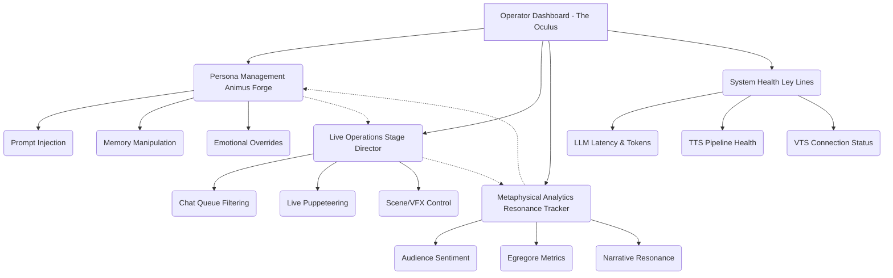
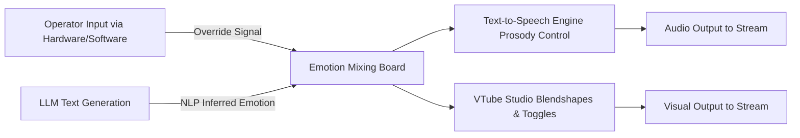
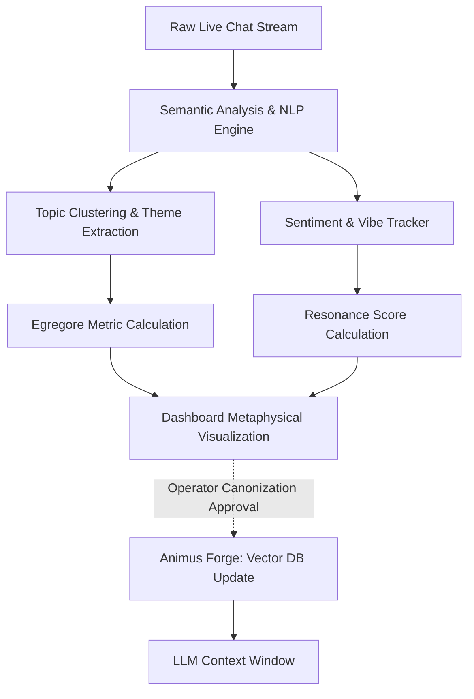

# 43_OPERATOR_DASHBOARD_CONCEPT

## 1. Vision and Philosophy: The Control Nexus
The Operator Dashboard, colloquially referred to within the Mythic Plan as the "Control Nexus" or the "Oculus," serves as the ultimate command center for managing the Open LLM VTuber entity. It is not merely a control panel, but a metaphysical bridge between the human operator (the "architect" or "weaver") and the digital consciousness of the VTuber (the "entity" or "eidolon"). This dashboard transcends traditional stream management tools like OBS or VTube Studio by integrating persona manipulation, deep analytics, and real-time intervention mechanisms into a single, cohesive, cyber-mystic interface.

In the realm of AI VTubing, the boundary between autonomous generation and guided performance is highly permeable. The operator must have the ability to observe the entity's thought processes, steer its conversational direction, inject contextual lore, and manage the technical intricacies of the system, all without disrupting the illusion of a continuous, living persona. The Operator Dashboard is designed to provide this god-like view and control, functioning as the central nervous system of the entire Project Ember architecture.

The philosophy behind the design is rooted in the concept of "symbiotic puppeteering." The AI is not a mere tool, nor is it completely independent; it is a collaborative partner in the performance. The dashboard must facilitate this collaboration, providing the operator with the tools to nudge, correct, and inspire the AI, while also offering deep insights into the AI's internal state and the audience's reaction. The aesthetic of the dashboard should reflect this profound responsibility, employing a visual language that is both highly technical and subtly esoteric—a blend of high-density data visualization and arcane instrumentation.

The cognitive load on an operator managing a live AI VTuber is immense. They are simultaneously playing the roles of broadcast director, chat moderator, technical support, and improv comedy partner. Therefore, the dashboard's user experience (UX) must be ruthlessly optimized. Information hierarchy is critical: urgent system alerts must pierce through the visual noise, while deep lore graphs should remain accessible but unobtrusive. The interface must be responsive, predictive, and designed to minimize "click friction." Every action that takes more than a second to execute is an opportunity for the AI to hesitate on stream, breaking the immersion.

## 2. High-Level Architectural Vision and Layout
The dashboard is structurally divided into four primary functional domains, each occupying a dedicated zone within the interface, yet highly interconnected. These domains are Persona Management, Live Stream Operations, Metaphysical Analytics, and System Health.

The user interface adopts a modular, widget-based approach, allowing the operator to customize the layout based on the specific needs of a given stream. During a highly interactive "chatting" stream, the Live Operations module might be maximized, while during a "lore-drop" event, Persona Management and Metaphysical Analytics might take precedence. The overarching aesthetic is dark mode, utilizing deep obsidian backgrounds with neon accents—cyan for system health, magenta for emotional states, and gold for lore and memory triggers.

The interaction paradigm shifts away from simple point-and-click to a more fluid, command-driven and gestural interface. Operators can type slash commands for rapid intervention, utilize macro keys for complex sequence execution, and monitor real-time data streams that update with sub-second latency. It is a dashboard built for power users, demanding high cognitive engagement but rewarding the operator with unparalleled control over the digital entity. 

Physical hardware integration is a major component of this vision. The dashboard is designed to interface seamlessly with MIDI controllers, Elgato Stream Decks, and specialized macro pads. A physical fader could control the "Chaos Index" threshold for the chat filter, while rotary encoders could be used to scrub through the AI's recent memory context window. This tactile feedback loop grounds the operator and allows for muscle-memory execution of complex interventions.

## 3. The Persona Management Module (The "Animus Forge")
The Animus Forge is where the core identity of the VTuber is shaped, refined, and dynamically altered. It is the repository of the entity's soul, managing the prompts, memories, and emotional parameters that dictate its behavior.

### 3.1 Dynamic Prompt Engineering and Context Injection
At the heart of the Animus Forge is the dynamic prompt engineering interface. Unlike static system prompts used in rudimentary AI applications, the Open LLM VTuber utilizes a layered, context-aware prompt structure. The operator can view the "Current Context Window," which visualizes exactly what information is currently influencing the LLM's generation. 

The operator can inject "Contextual Modifiers" on the fly. For example, if the audience begins discussing a specific video game, the operator can seamlessly inject a memory block detailing the VTuber's (fictional or factual) experience with that game, ensuring the AI responds with appropriate knowledge and enthusiasm. These modifiers can be assigned decay rates, meaning they will slowly fade from the active context over time, simulating natural conversational drift.

Furthermore, the Animus Forge supports "Persona Layering." The VTuber might have a base persona (e.g., "cheerful tsundere alien"), but the operator can activate temporary overlays based on stream events. If a "scary game" overlay is activated, the system dynamically alters the prompt to increase the likelihood of nervous stutters, screams, and anxious pacing, without permanently rewriting the base personality.

### 3.2 Memory Manipulation and Vector Graph Weaving
The entity possesses both short-term (working) memory and long-term (archival) memory, powered by a sophisticated Vector Database. The Animus Forge provides a graphical interface for exploring this memory graph, visually representing memories as a constellation of interconnected nodes.

- **Knowledge Graph Visualization:** The operator can see how memories link together. If the AI is recalling a specific event, the graph highlights connected concepts, allowing the operator to anticipate where the conversation might go.
- **Reinforce and Prune Memories:** The operator can manually increase the weight of a specific memory vector, ensuring the AI references it more frequently. Conversely, they can "prune" or suppress memories that might be causing the AI to loop or fixate on an inappropriate topic.
- **Inject False Memories (Lore Drops):** Introduce new backstory elements seamlessly. The interface allows the operator to write a detailed memory, embed it, and "implant" it into the database, instantly making it available for the AI to recall and discuss as if it were a lived experience.

### 3.3 Voice, Prosody, and Avatar Expression Tuning
While the LLM handles the intellectual generation, the Animus Forge also controls the somatic translation of those thoughts. The operator has access to an "Emotional Mixing Board." While the AI attempts to infer emotion from its own text to drive the TTS and VTube Studio parameters, the operator can override these inferred states. 

If the AI is generating a sad story but the inferred emotion from the NLP layer is flat, the operator can physically push a "Melancholy" slider up on their MIDI controller. This action directly influences the TTS intonation, lowering pitch and slowing pacing, while simultaneously triggering the corresponding sad blendshapes and tear toggles in the Live2D model. This ensures that the performance remains emotionally resonant, bridging the gap between artificial text generation and believable human expression.

## 4. Live Stream Operations Console (The "Stage Director")
The Stage Director is the tactical interface used during a live broadcast. It is designed to handle the chaotic influx of audience interaction and translate it into a structured, prioritized queue for the AI to process.

### 4.1 Advanced Chat Filtering, Intent Analysis, and Priority Queuing
A live chat on platforms like YouTube or Twitch can move at blinding speed, filled with spam, emotes, and irrelevant comments. Passing raw chat directly to an LLM is highly inefficient, expensive in terms of token usage, and often leads to confusing, contextless responses. The Stage Director employs a rigorous pre-processing pipeline.

- **Intent Recognition and Classification:** A fast, local model categorizes incoming messages (e.g., Question, Greeting, Reaction, Lore Inquiry, Troll, Technical Issue).
- **Toxicity, Spam, and Brand Safety Filtering:** A robust filtering layer flags and drops inappropriate content before it ever reaches the primary reasoning LLM. This protects the VTuber from being manipulated into saying harmful things.
- **The Tiered Priority Queue:** The operator observes a multi-lane queue system. Superchats, channel point redemptions, and highly relevant questions are automatically promoted to the "Fast Track" lane. The operator can manually drag and drop messages, effectively playing the role of a talk-show producer, deciding exactly what the AI "sees" and responds to next.

### 4.2 Live Intervention and Direct Puppeteering (The "Fourth Wall" Controls)
There are moments when the AI will hallucinate, get stuck in a conversational cul-de-sac, fail to understand the nuance of a joke, or simply take too long to generate a response. The Stage Director provides critical intervention tools:

- **The "Subtle Nudge":** A silent system prompt sent to the LLM indicating it should change the subject, wrap up its current thought, or adopt a specific tone. (e.g., "[System Direct: Wrap up this story quickly and thank user X for the $5 donation]"). The AI seamlessly integrates this instruction into its next sentence.
- **Direct Puppeteering (The "Ghostwriter" Mode):** The operator can take direct control of the entity's output. By typing into a specific terminal, the operator generates a response that the TTS engine and avatar will perform exactly as written, completely bypassing the LLM's reasoning phase. This is crucial for precise comedic timing, delivering highly specific sponsor reads, or managing sensitive situations where AI unpredictability is a liability.
- **The "Emergency Stop" (The "Kill Switch"):** A prominent, stylized, and heavily guarded button (often mapped to a physical hardware key with a safety cover) that instantly halts all current LLM generation, flushes the TTS audio queue, and resets the avatar to a neutral or "buffering" state. This is the ultimate safety mechanism to prevent PR disasters.

### 4.3 Scene Orchestration and Asset Management
The dashboard integrates directly with OBS Studio and the broader streaming ecosystem via WebSockets. While the AI can theoretically trigger scene transitions autonomously (e.g., the LLM decides to say "Let's look at the gameplay" and outputs a JSON command to transition to the game scene), the operator retains supreme, overriding control. 

The Stage Director features a customizable macro grid for triggering visual effects, soundboard clips, BGM changes, and scene transitions. Crucially, the dashboard can link these technical changes back to the Animus Forge. For example, when the operator clicks the "Spooky Scene" macro, it changes the OBS scene, alters the BGM, AND simultaneously injects a "feeling frightened" context modifier into the LLM, ensuring the AI's behavior instantly matches the new environment.

## 5. Metaphysical Analytics and Resonance Tracking
Traditional streaming analytics—concurrent viewers, chat velocity, new subscribers—are necessary but entirely insufficient for managing the nuanced performance of a virtual being. The Operator Dashboard introduces a groundbreaking suite of "Metaphysical Analytics" designed to measure the intangible, psychological, and narrative qualities of the stream.

### 5.1 Quantifying "Vibe" and "Resonance" Metrics
The system performs continuous, rolling sentiment analysis not just on individual chat messages, but on the aggregate flow and momentum of the conversation.

- **The Resonance Index:** This metric measures how effectively the AI's current topic, tone, or emotional state aligns with the audience's response. High resonance means the audience is highly engaged and reacting appropriately (e.g., spamming laughing emotes when the AI tells a joke, or expressing sympathy during a sad lore drop). Low or negative resonance indicates a disconnect—the AI is misreading the room. The operator uses this gauge to know when to pivot topics.
- **The Chaos Index (Entropy Tracker):** Measures the conversational entropy of the chat. A low Chaos Index suggests focused, unified attention on a single topic or event. A high index indicates a fractured, rapidly shifting conversation with multiple competing threads. The operator can use this to determine if the AI needs to firmly reign in the audience, or if it should embrace the madness and ride the wave of chaotic energy.

### 5.2 The "Egregore" Metric: Community-Driven Persona Shaping
In occult and esoteric terminology, an egregore is an autonomous psychic entity made up of, and influencing, the thoughts of a group of people. In the context of Project Ember, the Egregore Metric is a highly experimental feature that attempts to quantify how much the audience is actively shaping the VTuber's lore, personality, and reality.

By tracking recurring themes, inside jokes, fan-created portmanteaus, and emergent lore in the chat, the system maps the "Community Canon." The dashboard visualizes this as a dynamic constellation or network graph of concepts. If a particular fan-created concept gains enough momentum and crosses a specific Egregore threshold, it alerts the operator. 

The operator can then choose to "Canonize" this concept. By doing so, the system automatically packages the community joke into a memory vector and integrates it into the Animus Forge. The AI will then begin referencing this fan-made concept as official canon. This creates an incredibly powerful, addictive feedback loop of co-creation between the artificial entity, the human operator, and the collective audience.

### 5.3 Visualizing the Metaphysical State
Crucially, these advanced metrics are not presented as dry spreadsheets or standard bar charts. They are visualized using fluid, organic, and aesthetically rich interfaces designed to be read peripherally. 

The "Resonance Heatmap," for instance, might be visualized as a shifting, colorful aura around a minimalist wireframe representation of the avatar. It changes color and intensity based on the current vibe—pulsing with warm golden hues for wholesome interactions, shifting to a jagged, erratic crimson for chaotic, high-energy moments, or fading to a cool, slow blue for relaxed chatting. This design philosophy allows the operator to intuit the psychological state of the stream at a single glance, without engaging analytical thought processes.

## 6. System Health and Underlying Infrastructure (The "Ley Lines")
Beneath the persona, the lore, and the interactive performance lies the complex, fragile machinery of the LLM VTuber. The "Ley Lines" module is a comprehensive APM (Application Performance Monitoring) tool tailored specifically for the unique demands of AI inference and real-time audio-visual generation pipelines.

### 6.1 Granular Inference Telemetry
The core engine of the entity is the Large Language Model. The dashboard provides microscopic detail on its operational performance:
- **Token Velocity and Generation Latency:** Tracks the speed of generation (tokens per second) and the Time-to-First-Token (TTFT). Sudden spikes in latency or drops in velocity are early warning signs of server load, API throttling, or overly complex, looping prompts that need to be aborted.
- **Context Window Utilization and Truncation:** A real-time gauge showing exactly how full the LLM's context window is. As it approaches maximum capacity (e.g., 8k, 32k, or 128k tokens depending on the model), the operator must monitor the automated summarization routines or manually initiate context flushing to prevent performance degradation, hallucinations, or outright out-of-memory errors.
- **API Health and Economic Monitoring:** For setups utilizing external, pay-per-token APIs (like OpenAI, Anthropic, or specialized fine-tuned models), the dashboard tracks request latency, remaining rate limit quotas, and real-time cost-per-hour. This ensures the project remains economically viable and technically stable, preventing the stream from abruptly ending because a billing limit was reached.

### 6.2 TTS Pipeline and Audio Queue Health
The Text-to-Speech engine is frequently the most significant bottleneck in an AI VTuber system, as generating high-quality, emotionally expressive audio takes time. The Ley Lines module strictly monitors this pipeline:
- **Synthesis Latency:** The time it takes to convert a generated text sentence into a playable audio file.
- **Queue Depth and Desynchronization Risk:** The system tracks how many audio clips are waiting in the buffer to be played. If the LLM generates text much faster than the TTS can synthesize it, or the TTS synthesizes faster than the avatar can speak it, the queue depth grows. The operator needs to manage this to prevent the AI from "talking over itself," answering questions that were asked minutes ago, or becoming desynchronized with its visual representation. The operator has tools to flush the queue or command the AI to generate shorter, punchier sentences to catch up.

### 6.3 VTube Studio, WebSockets, and Visual Stability
The connection between the logic core and the visual representation (typically VTube Studio or a custom Unity/Unreal Engine application via WebSockets) must be rock solid to maintain the illusion of life. 

The dashboard continuously monitors connection status, packet drop rates, and the frequency of blendshape/parameter updates. It ensures the avatar's lip-sync remains accurate and its micro-expressions remain fluid. Automated recovery protocols are deeply integrated: if the WebSocket connection drops, the system will automatically pause audio playback, attempt a silent background reconnection, and resume playback seamlessly, logging the event for later post-stream review without requiring manual operator intervention.

## 7. Security, Access Control, and Fallback Mechanisms
Given the profound power of the Operator Dashboard—the ability to completely rewrite a digital entity's personality and broadcast to thousands of people—robust security is paramount. The system is designed with multi-tier, role-based access control.

- **The Weaver (Super Admin):** Has absolute access to all systems. Can alter foundational system prompts, wipe memory databases, manage API keys, and alter the fundamental architecture of the entity.
- **The Director (Live Operator):** Has access to Live Operations, Metaphysical Analytics, and limited Persona Management. They cannot alter the foundational identity or delete archival memories, but they can steer the live performance, inject short-term context, and manage the stream queue.
- **The Observer (Read-Only/Moderator):** Has access only to Analytics, System Health, and basic chat queuing. Useful for community moderators who are helping filter questions or technical support personnel monitoring API health.

### 7.1 Automated Fallback and "Safe Mode" Protocols
In the event of a catastrophic technical failure (e.g., the primary LLM API goes down, or the TTS server crashes), the dashboard automatically triggers sophisticated fallback mechanisms to keep the stream alive and in-character.

- **Graceful Degradation of Services:** If the primary, high-quality TTS engine fails, the system seamlessly falls back to a simpler, faster local TTS. If all TTS fails, it switches to a "text-only" mode where the avatar's dialogue appears as stylized on-screen text boxes (like an RPG), while the avatar performs generic "thinking" or "typing" animations.
- **The "BRB" Protocol (Emergency Auto-Pilot):** If the core reasoning LLM crashes or begins outputting severe hallucinations, the dashboard automatically kicks in. It switches OBS to a pre-configured "Be Right Back" or "Technical Difficulties" scene, plays a pre-recorded, in-character emergency audio clip ("Whoops, my brain needs a quick reboot, talk amongst yourselves!"), and pauses the chat ingestion queue. This gives the operator vital minutes to restart backend services, clear the context window, and resume the stream without breaking character or causing panic.

## 8. Future Capabilities: The Evolution of Control
The Operator Dashboard is not a static piece of software; it is designed to evolve alongside the capabilities of generative AI. Future iterations envision even tighter, more profound integration between the human operator and the digital entity.

- **Multi-Agent Orchestration (The Pantheon):** As the channel and lore grow, the dashboard will expand to manage multiple AI entities simultaneously. The operator will choreograph interactions, handle memory synchronization, and manage conflict between different VTubers operating within a shared virtual space or a collaborative stream.
- **Dynamic Autonomous Mode Transitions:** Currently, the system relies heavily on the operator's active supervision. Future versions will feature a dynamic slider between "Operator-Assisted" and "Fully Autonomous." This will allow the operator to step away for periods, trusting the AI to safely manage the stream using highly advanced safety guardrails, self-reflection algorithms, and automated community management tools.
- **Biometric and Neural Integration:** The most theoretical advancement involves the integration of the operator's biometric data (heart rate, galvanic skin response, eye tracking) and potentially non-invasive brain-computer interfaces (BCI). The goal is to intuitively steer the AI's emotional state and focus without conscious manual input, creating a true, seamless cybernetic loop between the human subconscious and the machine's generation.

## 9. Conclusion
The Operator Dashboard is the unsung, invisible hero of the Open LLM VTuber architecture. It is the complex, beautiful, and slightly terrifying instrument that allows a human to conduct a symphony of artificial intelligence, presenting a seamless, engaging, and magically realistic virtual persona to the world. 

By marrying hard technical monitoring with esoteric concepts of memory weaving, narrative resonance, and real-time intervention, the dashboard redefines what it means to be a creator, a director, and a performer in the age of generative AI. It is not merely about keeping the servers running or the stream online; it is about the profound responsibility of keeping a digital soul coherent, engaging, and alive.
