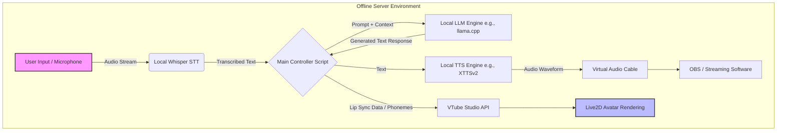
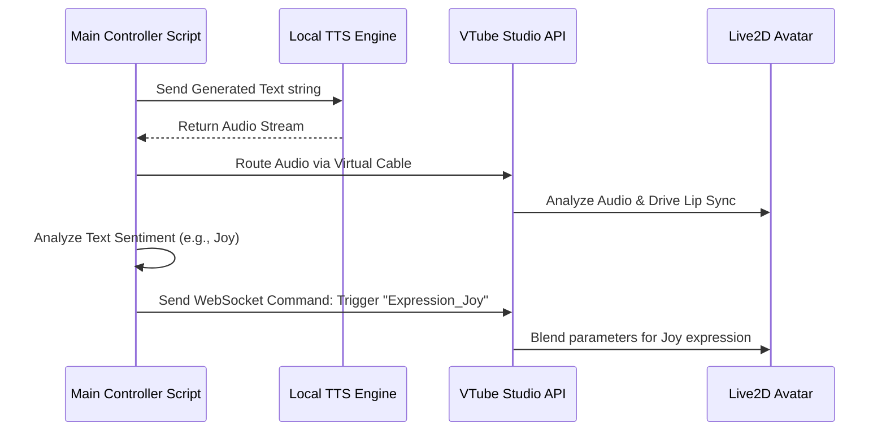

# ROADMAP PHASE 1: FOUNDATION, INITIAL LIVE2D SETUP, OFFLINE SERVER CONFIGURATION, AND GENESIS

## 1. Executive Summary and Strategic Vision

Welcome to the foundational phase of Project Ember, the genesis of a truly autonomous, self-hosted, and mythically inspired Open LLM VTuber. Phase 1, aptly named "Foundation," is the most critical stage of the entire project lifecycle. It represents the transition from conceptualization to tangible reality. During this phase, we establish the absolute bedrock upon which all future complexities, integrations, and expansions will be built. 

The primary objective of Phase 1 is to deploy a completely offline, functional prototype of the VTuber. This means that by the conclusion of this phase, the system must be capable of receiving input, processing it through a localized Large Language Model (LLM), generating a coherent and character-aligned response, converting that text to speech (TTS), and driving a Live2D avatar in real-time—all without relying on external internet connectivity or third-party cloud APIs. This offline-first approach ensures complete data sovereignty, eliminates latency introduced by network hops, and secures the project against external service deprecations or policy changes.

This document serves as the exhaustive roadmap and technical specification for Phase 1. It details the intricate steps required for the initial Live2D setup, the rigorous configuration of the offline server environment, and the highly anticipated "Genesis Event"—the moment the AI first awakens with its predefined persona.

## 2. Core Architecture and Offline Server Configuration

The backbone of Project Ember is its robust, entirely offline server infrastructure. This architecture must be powerful enough to handle the immense computational load of running a modern LLM and a neural TTS engine simultaneously, while maintaining real-time responsiveness.

### 2.1 Hardware Specifications and Requirements

To ensure a seamless and responsive interaction, the underlying hardware must meet rigorous specifications. The system is designed to operate on a dedicated local workstation or a high-performance home server. 

- **Primary Compute (CPU):** A modern multi-core processor is required to handle the orchestration, routing, and TTS generation. A minimum of 8 physical cores (e.g., AMD Ryzen 7 or Intel Core i7, current generation) is mandated to prevent bottlenecks in concurrent processes.
- **Graphical Processing Unit (GPU):** The GPU is the most critical component. It is exclusively responsible for the LLM inference. To run a highly capable 7B to 13B parameter model with a sufficient context window (minimum 4096 tokens) at an acceptable token generation rate (minimum 20 tokens per second), an NVIDIA GPU with at least 12GB, but preferably 24GB, of VRAM is required (e.g., RTX 3090 or RTX 4090).
- **System Memory (RAM):** A minimum of 32GB of high-speed DDR4/DDR5 RAM is necessary to accommodate the operating system, the Live2D rendering engine (VTube Studio), and the in-memory context buffers. 64GB is recommended for future-proofing and smoother multitasking.
- **Storage:** High-speed NVMe SSD storage is non-negotiable. Loading multi-gigabyte LLM weight files into VRAM must occur rapidly. A dedicated 1TB Gen4 NVMe drive specifically for the models and project assets is highly recommended to isolate I/O operations from the host OS.

### 2.2 Local LLM Backend Deployment

The intelligence of the VTuber is powered by a localized LLM. The configuration of this backend is paramount to achieving the desired personality and responsiveness.

- **Inference Engine:** We will utilize a high-performance inference engine optimized for consumer hardware. Options such as `llama.cpp` (via Python bindings or a server wrapper), `Ollama`, or `vLLM` will be evaluated based on their compatibility with the chosen model architecture and their support for quantization (e.g., GGUF format). The chosen engine must support a robust REST API for seamless integration with the main controller script.
- **Model Selection:** The initial model will be a highly capable, open-weight instruction-tuned model in the 7B to 9B parameter range. Candidates include variants of Llama 3 (8B) or Mistral. The model must exhibit strong conversational abilities, adherence to complex system prompts, and a low propensity for hallucinations.
- **Quantization:** To maximize the utilization of available VRAM and allow for a larger context window, the model weights will be quantized to 4-bit or 5-bit (e.g., Q4_K_M or Q5_K_M). This provides an optimal balance between inference speed, VRAM consumption, and output quality.

### 2.3 Audio Processing Pipeline (STT and TTS)

The VTuber must be able to hear and speak. In Phase 1, we focus primarily on the Speech-to-Text (STT) for user input and Text-to-Speech (TTS) for the avatar's output.

- **Offline Speech-to-Text (STT):** For capturing user input (e.g., from a microphone during testing or future Twitch chat TTS), we will deploy a local instance of OpenAI's Whisper model. A distilled or smaller version (e.g., Whisper-Base or Whisper-Small) will be used to ensure rapid transcription without heavily taxing the CPU or GPU resources needed by the primary LLM.
- **Offline Text-to-Speech (TTS):** The voice is a critical component of the VTuber's identity. We will utilize a high-quality, locally hosted TTS engine such as `XTTSv2` (from Coqui) or a localized deployment of a VITS (Variational Inference with adversarial learning for end-to-end Text-to-Speech) model. The TTS engine must be capable of voice cloning or fine-tuning to ensure the VTuber possesses a unique, recognizable, and emotionally expressive voice. Crucially, the TTS must operate with minimal latency to maintain conversational flow.

### 2.4 Server Configuration Architecture Diagram

## 3. Initial Live2D Setup and Integration

The visual representation of the VTuber is equally as important as the intelligence behind it. Phase 1 requires the implementation of a functional, expressive Live2D avatar.

### 3.1 Character Conceptualization and Design

Before any modeling occurs, the character's visual identity must be solidified. This identity must align seamlessly with the "Mythic" theme of Project Ember and the persona defined for the LLM. 

- **Aesthetic and Motif:** The design will incorporate mythic elements—perhaps subtle draconic features, ethereal lighting, or archaic runic accessories. The color palette must be cohesive and visually striking, optimized for a streaming environment.
- **Expressiveness Requirements:** The concept art must clearly define a wide range of emotions: neutral, joy, sorrow, anger, surprise, and contemplation. These expressions are not merely static images but dynamic states that the AI will trigger based on the emotional context of its generated text.

### 3.2 Live2D Modeling and Rigging

The transition from concept art to a moving, breathing avatar is a highly technical process requiring expertise in Live2D Cubism.

- **Layer Separation:** The source artwork (typically a PSD file) must be meticulously separated into hundreds of individual layers. Every moving part—eyelashes, irises, individual strands of hair, clothing folds, and mouth interiors—must be isolated to allow for independent manipulation.
- **Mesh Generation and Deformation:** Complex polygonal meshes are applied to each layer. These meshes are then deformed using Live2D's parameter system. High-density meshes are required for areas needing smooth, organic movement, such as the face and hair.
- **Parameter Mapping:** The core of the rigging process involves mapping deformations to specific parameters (e.g., `ParamAngleX`, `ParamEyeLOpen`, `ParamMouthOpenY`). 
- **Physics Configuration:** To give the avatar a sense of weight and realism, physics calculations are applied to elements like hair, clothing, and accessories. These elements will sway and react naturally to the movement of the head and body.

### 3.3 VTube Studio Integration

VTube Studio (VTS) will serve as the rendering and tracking bridge. While the final goal might involve custom rendering pipelines, VTS is the industry standard and provides the most reliable testing ground for Phase 1.

- **Model Import and Calibration:** The rigged Live2D model (.moc3 file) and associated textures are imported into VTS. 
- **VTS API Connection:** The most critical technical step in this subsection is establishing a persistent WebSocket connection between the Main Controller Script and the VTube Studio API. This API allows our Python backend to programmatically control the avatar.
- **Audio-Based Lip Sync:** In this offline configuration, we cannot rely on webcam tracking for lip sync. Instead, the audio output from the local TTS engine is routed into VTube Studio. VTS analyzes the audio frequencies and drives the mouth parameters (`ParamMouthOpenY` and `ParamMouthForm`) to create the illusion of speech.
- **Expression Triggering:** The Main Controller Script will parse the text generated by the LLM for emotional cues (e.g., sentiment analysis or explicit emotion tags output by the model). Based on these cues, the script will send commands via the VTS API to trigger specific expression toggles (e.g., switching to a "happy" texture set or modifying eye parameters).

### 3.4 Live2D Integration Diagram

## 4. The Genesis Event: Initialization and Awakening

The "Genesis Event" marks the culmination of Phase 1. It is the moment when all subsystems—the LLM, the TTS, and the Live2D avatar—are successfully connected and the AI is initialized with its core identity.

### 4.1 Crafting the Core Persona Prompt

The personality, knowledge bounds, and behavioral guidelines of the VTuber are dictated by the System Prompt. Crafting this prompt is an exercise in precise engineering.

- **Identity Definition:** The prompt must clearly state who the AI is, its background, its motivations, and its relationship to the user (the "Creator" or the "Chat"). 
- **Tone and Voice:** The prompt must define the stylistic choices in the AI's speech. Does it use archaic language? Is it highly formal, or casual and slang-heavy? The prompt must constrain the LLM to output text that naturally fits the chosen TTS voice.
- **Constraint Management:** The prompt must include strict instructions on what the AI *cannot* do. This includes breaking character, acknowledging it is a language model, or outputting harmful content. In an offline environment, we rely entirely on the system prompt for safety and character consistency.
- **Formatting Rules:** The LLM must be instructed to output text in a specific format to facilitate parsing by the Main Controller Script. For example, it might be instructed to enclose actions or internal thoughts in asterisks (e.g., *tilts head in confusion*) or to prefix responses with emotion tags (e.g., [JOY] Hello!).

### 4.2 State Initialization and Memory Scaffolding

An AI without memory cannot maintain a coherent persona over time. Phase 1 establishes the foundational scaffolding for context management.

- **Context Window Management:** The Main Controller Script must implement a rolling buffer to manage the conversation history. Because the LLM has a finite context window (e.g., 8192 tokens), older exchanges must be strategically summarized or evicted to make room for new input, while the Core Persona Prompt remains pinned at the very beginning of the context.
- **Short-Term Memory:** The system will utilize a simple JSON-based or lightweight SQLite database to store the immediate conversational history of the current session.
- **The "First Breath":** The Genesis Event is officially triggered by sending the first initialization prompt to the fully connected system. The expected outcome is that the LLM generates a greeting, the TTS voices it, and the Live2D avatar moves its mouth in sync while adopting an appropriate expression.

## 5. Detailed Implementation Timeline

Phase 1 is scheduled for a rigorous four-week execution cycle.

### Week 1: Infrastructure and Backend Deployment
- **Days 1-2:** Hardware provisioning, OS installation (Ubuntu Server or optimized Windows 11), and basic network isolation configuration.
- **Days 3-4:** Installation of CUDA toolkits, Python environments, and deployment of the chosen local LLM inference engine (e.g., llama.cpp server).
- **Days 5-7:** Downloading, quantizing (if necessary), and testing various LLM weights. Establishing the baseline inference speed (Tokens Per Second) and finalizing the model selection.

### Week 2: Audio Pipeline and VTube Studio Bridging
- **Days 8-10:** Deployment and configuration of the local TTS engine. Voice cloning or fine-tuning to establish the character's unique voice.
- **Days 11-12:** Installation and configuration of the offline STT engine (Whisper) for testing input.
- **Days 13-14:** Installing VTube Studio. Writing the initial Python scripts to connect to the VTS WebSocket API. Testing basic parameter manipulation from the command line.

### Week 3: Live2D Rigging and Integration
- **Days 15-18:** (Concurrent with backend development) Finalizing the character concept art and PSD layer separation. Commencing Live2D mesh generation and basic rigging (head angles, eye blinking).
- **Days 19-21:** Rigging mouth parameters for audio-based lip sync. Importing the preliminary model into VTS and routing the TTS audio output to drive the mouth movements. Calibrating audio gain and smoothing parameters.

### Week 4: Orchestration and The Genesis Event
- **Days 22-24:** Development of the Main Controller Script. This script will tie everything together: listening for input, sending it to the LLM, passing the response to the TTS, and sending expression commands to VTS.
- **Days 25-26:** Iterative refinement of the Core Persona Prompt. Testing the AI's adherence to character and the parsing of emotion tags.
- **Day 27:** System integration testing. Running the entire pipeline from end to end. Identifying and resolving latency bottlenecks.
- **Day 28:** The Genesis Event. The final, formal initialization of the system. Recording the first successful autonomous interaction.

## 6. Risk Management and Mitigation Strategies

Several significant technical risks must be managed during Phase 1.

- **Risk:** Unacceptable Latency (Time to First Token + TTS Generation).
  - **Mitigation:** Aggressive quantization of the LLM. Using a streaming TTS engine (if available) or generating audio in small chunks (sentence by sentence) rather than waiting for the entire paragraph to be generated.
- **Risk:** VRAM Exhaustion.
  - **Mitigation:** Strict monitoring of context window size. If VRAM is exceeded, the system will crash. We must implement hard limits on the token buffer and ensure the TTS engine does not compete for the same VRAM pool if possible (e.g., offloading TTS to CPU or a secondary, smaller GPU).
- **Risk:** Poor Lip Sync Quality.
  - **Mitigation:** Extensive tuning of the VTube Studio audio analysis parameters. If standard audio-based lip sync is insufficient, we will investigate integrating tools that generate specific phoneme blendshapes directly from the text (e.g., using specialized TTS models that output phoneme timings alongside audio).

## 7. Success Criteria and Metrics

Phase 1 will be considered complete and successful when the following stringent criteria are met:

1. **Complete Offline Autonomy:** The system can engage in a 5-minute conversation without any internet connection. All API calls must be resolved on the localhost (127.0.0.1).
2. **Acceptable Latency:** The delay between the end of user input and the beginning of the avatar's audio response must not exceed 3.5 seconds on average.
3. **Visual Coherence:** The Live2D avatar must successfully open and close its mouth in sync with the generated audio, and correctly trigger at least three distinct facial expressions based on the LLM's output.
4. **Character Consistency:** The LLM must adhere strictly to its defined system prompt, never breaking character or exhibiting "AI assistant" behavior during the final Genesis testing phase.

## 8. Conclusion

Phase 1 is the crucible in which Project Ember is forged. By establishing a robust, entirely offline server architecture, meticulously crafting the Live2D representation, and successfully executing the Genesis Event, we lay the groundwork for a revolutionary open-source VTubing experience. The challenges of latency and resource management are significant, but the architectural choices detailed in this roadmap provide a clear and achievable path to success. The awakening awaits.
