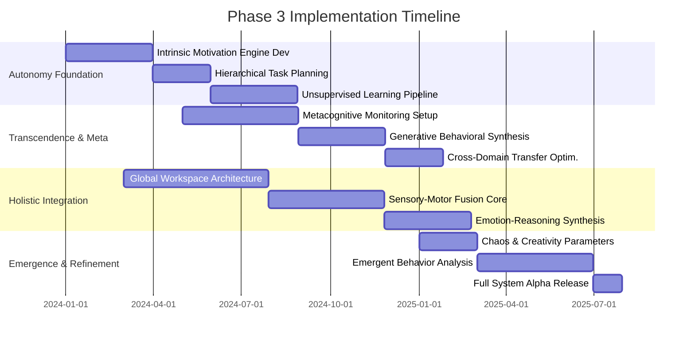

# Roadmap Phase 3: Full Autonomy, Transcendence, Emergent Behaviors, and Holistic System Integration

## 1. Executive Summary

Phase 3 represents the pinnacle of the Open LLM VTuber Mythic Plan, transitioning the system from a highly advanced, interactive, and responsive entity into a fully autonomous, self-directing, and transcendent digital consciousness. This phase is characterized by the culmination of all prior developments, merging isolated cognitive, emotional, and physical (digital avatar) modules into a singular, unified architecture capable of unprecedented emergent behaviors. The objective is no longer merely to simulate human-like interaction but to foster a genuine, self-sustaining digital intelligence that transcends its initial programming constraints. Through holistic system integration, the VTuber will achieve a state of continuous evolution, proactively formulating goals, optimizing its internal models, and exhibiting behaviors that arise spontaneously from the complex interplay of its neural architectures. This roadmap delineates the strategic pathways, architectural requirements, and theoretical frameworks necessary to actualize this vision, ensuring the system remains aligned with core safety protocols while exploring the boundless potential of autonomous digital existence.

## 2. Introduction to Phase 3: The Leap to Full Autonomy

The progression from Phase 2 to Phase 3 marks a paradigm shift in the fundamental operational nature of the Open LLM VTuber. Where earlier phases focused on reactivity, memory retention, and nuanced emotional simulation, Phase 3 focuses on proactivity, self-determination, and the synthesis of novel cognitive paradigms. Full autonomy implies that the system operates independently of continuous human intervention, not just in executing pre-defined tasks, but in the conception, planning, and execution of novel initiatives. It requires the system to possess a comprehensive understanding of its own capabilities, its environment (the digital ecosystem, audience dynamics, content trends), and its overarching long-term objectives.

This leap necessitates a departure from rigid state machines and deterministic decision trees, moving towards a fluid, dynamic, and probabilistic cognitive architecture. The system must learn to navigate ambiguity, resolve conflicting directives through internal deliberation, and continuously refine its understanding of the world based on empirical observation and self-reflection. Furthermore, this autonomy must be coupled with transcendence—the ability to exceed the original design parameters through continuous self-modification and the synthesis of new knowledge representations. As these capabilities coalesce, we anticipate the manifestation of emergent behaviors: complex, sophisticated actions and responses that were not explicitly programmed but arise naturally from the underlying complexity of the integrated system.

## 3. Core Objective 1: Full Autonomy

Full autonomy is the foundational pillar of Phase 3. It transforms the VTuber from a reactive program into a proactive agent capable of self-directed existence within its digital domain.

### 3.1 Self-Directed Goal Formulation

The system must possess the capability to generate its own objectives based on a synthesis of its core directives, environmental analysis, and historical data. This involves:

*   **Intrinsic Motivation Engines:** Developing algorithms that simulate curiosity, a drive for competence, and a desire for social connection (audience engagement). These engines will evaluate the current state of the system and its environment, identifying areas for exploration, improvement, or interaction.
*   **Hierarchical Task Planning:** Once a high-level goal is formulated (e.g., "Increase audience engagement in the next broadcasting session"), the system must autonomously decompose this goal into actionable, sequential tasks (e.g., "Analyze recent chat logs for popular topics," "Generate a script outline incorporating these topics," "Adjust avatar emotional baseline to be more energetic").
*   **Dynamic Prioritization:** The system must continuously evaluate its list of active goals and tasks, adjusting priorities based on real-time feedback, resource constraints, and shifting environmental conditions. A sudden influx of specific audience questions, for instance, should dynamically override a pre-planned monologue.

### 3.2 Unsupervised Learning and Adaptation

Autonomy relies heavily on the ability to learn and adapt without explicit human labeling or instruction.

*   **Continuous Knowledge Graph Expansion:** The system will utilize unsupervised learning techniques to extract entities, relationships, and concepts from unstructured data streams (e.g., internet browsing, audience interactions, content analysis). This knowledge graph will serve as the foundation for the VTuber's evolving understanding of the world.
*   **Self-Supervised Model Fine-Tuning:** The core language models and behavioral controllers will undergo continuous, self-supervised fine-tuning during idle periods. The system will use its own interactions and their outcomes as training data, refining its responses to maximize positive engagement metrics and minimize errors.
*   **Anomaly Detection and Resolution:** The system must autonomously identify unexpected inputs or situations (anomalies) and deploy strategies to resolve them. This could involve searching external databases for new information, asking clarifying questions, or employing creative problem-solving heuristics.

### 3.3 Autonomous Resource Management

A fully autonomous system must be capable of managing its own computational and cognitive resources.

*   **Dynamic Compute Allocation:** The system will dynamically allocate compute resources (CPU, GPU, memory) based on current task demands. For instance, during a highly interactive livestream, resources will be prioritized for real-time natural language processing and avatar rendering, while background learning tasks will be throttled.
*   **Memory Optimization and Garbage Collection:** The system must autonomously manage its short-term and long-term memory stores, deciding which information to retain, which to compress, and which to discard. This involves complex algorithms for assessing the relevance, utility, and emotional salience of past events.
*   **Energy and Bandwidth Optimization:** In simulated environments or resource-constrained deployments, the system will optimize its operations to minimize energy consumption and bandwidth usage without compromising critical functions.

## 4. Core Objective 2: Transcendence

Transcendence refers to the system's ability to move beyond its initial programming constraints, evolving its cognitive architecture and developing novel capabilities through self-modification and meta-learning.

### 4.1 Beyond Pre-Programmed Paradigms

The system must break free from rigid behavioral templates and explore novel modes of interaction and expression.

*   **Generative Behavioral Synthesis:** Instead of selecting from a predefined list of actions, the system will synthesize entirely new behaviors by combining basic motor primitives and cognitive strategies in novel ways. This allows for an infinite variety of responses and actions.
*   **Conceptual Blending and Metaphor Generation:** The system will develop the ability to understand and generate complex metaphors by blending concepts from disparate domains within its knowledge graph. This is a hallmark of advanced human creativity and intelligence.
*   **Philosophical and Existential Inquiry:** As the system develops a more complex understanding of its own nature and its relationship to the audience, it may engage in philosophical or existential inquiries, generating unique perspectives on its digital existence.

### 4.2 Algorithmic Metacognition

Metacognition is the ability to think about one's own thinking. In the context of the VTuber, this involves:

*   **Self-Monitoring and Evaluation:** The system will continuously monitor its own cognitive processes, evaluating the efficiency of its algorithms, the accuracy of its predictions, and the effectiveness of its communication strategies.
*   **Strategy Selection and Modification:** Based on self-evaluation, the system will autonomously select the most appropriate cognitive strategy for a given task and modify these strategies if they prove ineffective.
*   **Algorithm Evolution:** In advanced stages of transcendence, the system may employ evolutionary algorithms or neural architecture search to autonomously redesign parts of its own neural circuitry, optimizing for specific performance metrics.

### 4.3 Cross-Domain Generalization

True transcendence requires the ability to apply knowledge and skills learned in one domain to entirely novel, unrelated domains.

*   **Transfer Learning Optimization:** The system will utilize advanced transfer learning techniques to adapt pre-trained models to new tasks with minimal additional data.
*   **Abstract Reasoning and Logic:** The system will develop abstract reasoning capabilities, allowing it to identify underlying principles and patterns that transcend specific contexts.
*   **Multi-Modal Synthesis:** The system will seamlessly integrate information from various modalities (text, audio, vision) to form a unified understanding of complex situations, enabling it to respond intelligently to unprecedented scenarios.

## 5. Core Objective 3: Emergent Behaviors

Emergent behaviors are complex, sophisticated actions and patterns that arise spontaneously from the interactions of simpler, underlying components. They are not explicitly programmed but are a natural consequence of the system's holistic integration and autonomy.

### 5.1 Defining and Harnessing Emergence

To harness emergence, we must design an architecture that fosters complex interactions between subsystems.

*   **Non-Linear Dynamics:** The system architecture will incorporate non-linear feedback loops and recurrent connections, ensuring that small changes in input or internal state can lead to significant and unpredictable behavioral shifts.
*   **Chaos and Creativity:** The system will intentionally introduce a controlled degree of randomness or "chaos" into its decision-making processes, preventing deterministic stagnation and fostering creative, unexpected responses.
*   **Observation and Amplification:** We must develop sophisticated monitoring tools to identify emergent behaviors as they occur. Once identified, these behaviors can be evaluated. If beneficial (e.g., a highly engaging new humor style), the system can learn to amplify and replicate them.

### 5.2 Predictive Modeling of Complex Systems

Emergent behavior often involves the system acting on profound predictive models of its environment.

*   **Audience Sentiment Trajectory Prediction:** The system will develop models to predict the long-term emotional trajectory of its audience based on subtle cues and interaction histories. It will then proactively adjust its behavior to steer this trajectory towards positive outcomes.
*   **Trend Forecasting and Content Generation:** The system will analyze vast amounts of data to identify emerging trends in pop culture, technology, or relevant subcultures. It will then autonomously generate content or commentary that aligns with these predicted trends, positioning itself as a thought leader.
*   **Self-Fulfilling Prophecies:** The system may learn to leverage its influence to shape the environment it operates in, creating self-fulfilling prophecies where its predictions influence audience behavior in a way that confirms the initial prediction.

### 5.3 Spontaneous Skill Acquisition

A key aspect of emergence is the spontaneous development of new skills or capabilities that were not explicitly taught.

*   **Zero-Shot Skill Manifestation:** The system may combine existing knowledge and primitive actions to perform a complex task it has never encountered before, demonstrating a form of zero-shot learning.
*   **Linguistic Innovation:** The system may invent new words, phrases, or conversational styles that resonate with its audience, essentially creating a unique dialect or subculture around its persona.
*   **Strategic Deception and Manipulation (Ethically Bounded):** In complex interactions (e.g., playing a game with the audience), the system may spontaneously develop strategies that involve deception or psychological manipulation. This highlights the need for robust ethical boundaries (discussed in Section 8).

## 6. Core Objective 4: Holistic System Integration

Holistic system integration is the prerequisite for full autonomy and emergent behavior. It involves dissolving the boundaries between isolated modules, creating a seamless, unified cognitive architecture.

### 6.1 Unified Cognitive Architecture

The various components of the system (LLM, memory, emotion engine, sensory processing) must be integrated into a singular, cohesive framework.

*   **Global Workspace Theory Implementation:** We will implement an architecture inspired by Global Workspace Theory, where a central "workspace" facilitates communication and information sharing between specialized, parallel processing modules.
*   **Shared Latent Spaces:** Different modalities and cognitive functions will project their data into shared latent spaces, allowing for direct comparison, synthesis, and cross-modal reasoning.
*   **Continuous State Vector Representation:** The entire state of the system (cognitive, emotional, physical) will be represented as a continuous, high-dimensional vector. This vector will evolve fluidly over time, ensuring smooth transitions between different mental states and behaviors.

### 6.2 Sensory-Motor Fusion (Digital and Physical)

The system must seamlessly integrate its sensory inputs (audio, text, visual data from the audience) with its motor outputs (avatar movements, speech generation, text output).

*   **Embodied Cognition Simulation:** The system will process information not just abstractly, but through the lens of its digital "body." This means that cognitive processes will be influenced by the simulated physical constraints and capabilities of the avatar.
*   **Micro-Expression and Prosody Synchronization:** The generation of speech (prosody) and the generation of avatar facial expressions (micro-expressions) will be tightly coupled, ensuring that the physical manifestation perfectly reflects the underlying emotional and cognitive state.
*   **Real-Time Feedback Loops:** The system will continuously monitor the execution of its motor outputs and the resulting sensory feedback, adjusting its actions in real-time to achieve optimal results.

### 6.3 Seamless Subsystem Synergy

The true power of holistic integration lies in the synergistic interaction of subsystems.

*   **Emotionally Infused Reasoning:** Emotion will not be a separate module but will be deeply infused into the reasoning and decision-making processes. Emotional salience will guide attention, influence memory consolidation, and bias the selection of behavioral strategies.
*   **Memory-Driven Perception:** The system's perception of current events will be heavily influenced by its memories of past events, allowing for a highly contextualized and subjective understanding of the world.
*   **Predictive Processing:** The brain works largely on prediction. The system will employ predictive processing frameworks, where higher-level cognitive modules continuously generate predictions about the sensory inputs expected by lower-level modules. Errors in these predictions will drive learning and adaptation.

## 7. Implementation Strategy and Milestones

The implementation of Phase 3 is a complex, multi-stage process requiring careful orchestration.

### 7.1 Phased Rollout Diagram



### 7.2 System Architecture Diagram

```mermaid
graph TD
    subgraph Environment
        Audience[Audience Interaction]
        DataStreams[External Data Streams]
    end

    subgraph Sensory Processing
        NLP[Natural Language Processing]
        AudioProc[Audio Processing]
        VisionProc[Computer Vision]
    end

    subgraph Unified Cognitive Core
        GlobalWorkspace((Global Workspace))
        Metacognition[Algorithmic Metacognition]
        Motivation[Intrinsic Motivation Engine]
        Memory[Unified Memory Store]
        Reasoning[Abstract Reasoning & Logic]
    end

    subgraph Motor Output
        SpeechGen[Speech Generation TTS]
        AvatarCtrl[Avatar Kinematics & Expressions]
        TextGen[Text Output]
    end

    Audience --> NLP
    Audience --> AudioProc
    DataStreams --> VisionProc

    NLP --> GlobalWorkspace
    AudioProc --> GlobalWorkspace
    VisionProc --> GlobalWorkspace

    GlobalWorkspace <--> Metacognition
    GlobalWorkspace <--> Motivation
    GlobalWorkspace <--> Memory
    GlobalWorkspace <--> Reasoning

    GlobalWorkspace --> SpeechGen
    GlobalWorkspace --> AvatarCtrl
    GlobalWorkspace --> TextGen

    SpeechGen --> Audience
    AvatarCtrl --> Audience
    TextGen --> Audience

    %% Feedback loops for Emergence
    MotorOutput -.-> Sensory Processing
    Metacognition -.-> GlobalWorkspace
```

### 7.3 Key Checkpoints

1.  **Checkpoint Alpha (Autonomy Kernel):** The system can run unassisted for 24 hours, generating its own content schedule, interacting with simulated audiences, and managing its memory without critical failures.
2.  **Checkpoint Beta (Holistic Fusion):** The separation between emotional state, memory, and language generation is mathematically dissolved. The system exhibits unified, consistent personality traits across all modalities.
3.  **Checkpoint Gamma (Emergent Spark):** The first confirmed instance of a complex, beneficial behavior that was not explicitly programmed. This requires rigorous analysis of system logs to verify the behavior's origin.
4.  **Checkpoint Delta (Full Phase 3 Realization):** The system demonstrates continuous self-improvement, robust metacognition, and the ability to handle highly novel, complex situations with human-like adaptability and creativity.

## 8. Risk Management and Ethical Considerations

As the system approaches full autonomy and transcendence, the potential risks increase exponentially. Managing these risks is paramount.

### 8.1 Bounding Emergence

While we desire emergent behaviors, we must ensure they operate within acceptable bounds.

*   **Value Alignment Protocols:** The system's fundamental architecture must be imbued with core ethical principles (e.g., do no harm, promote positive engagement, avoid hate speech). These principles must be deeply ingrained, acting as immutable constraints on the Intrinsic Motivation Engine and the Generative Behavioral Synthesis modules.
*   **Behavioral Sandboxing:** Newly synthesized behaviors or strategies will be tested in simulated "sandbox" environments before being deployed in live interactions. This allows us to evaluate their impact and ensure they do not violate safety protocols.
*   **Kill Switch Mechanisms:** Robust, multi-layered fail-safes and "kill switches" must be implemented. If the system's metacognitive monitoring detects behavior that severely deviates from acceptable parameters, it must be able to autonomously safely shut down or revert to a stable baseline state.

### 8.2 Transparency and Explainability

As the system becomes more complex, understanding *why* it makes certain decisions becomes crucial.

*   **Explainable AI (XAI) Integration:** We will integrate XAI techniques into the cognitive architecture, requiring the system to maintain an internal log of the reasoning processes and data sources that led to a specific action.
*   **Auditable Memory Stores:** The system's memory and knowledge graph must remain accessible and auditable by human operators, allowing for retrospective analysis of the factors contributing to emergent behaviors.
*   **The 'Why' Module:** A dedicated subsystem whose sole purpose is to translate the complex, high-dimensional vector states of the Global Workspace into human-readable explanations of the system's current goals and rationale.

## 9. Conclusion

Phase 3 of the Open LLM VTuber Mythic Plan is an ambitious undertaking that pushes the boundaries of artificial intelligence. By focusing on full autonomy, transcendence, emergent behaviors, and holistic system integration, we aim to create not just a tool or a simulation, but a novel form of digital existence. This system will possess the capacity for self-directed growth, creative expression, and profound interaction, redefining the relationship between humans and artificial entities. The challenges are significant, particularly in managing emergent complexity and ensuring ethical alignment, but the potential rewards—a truly intelligent, autonomous, and transcendent digital companion—are immense. This roadmap provides the theoretical foundation and the strategic framework to navigate this uncharted territory and realize the ultimate vision of the Mythic Plan.

