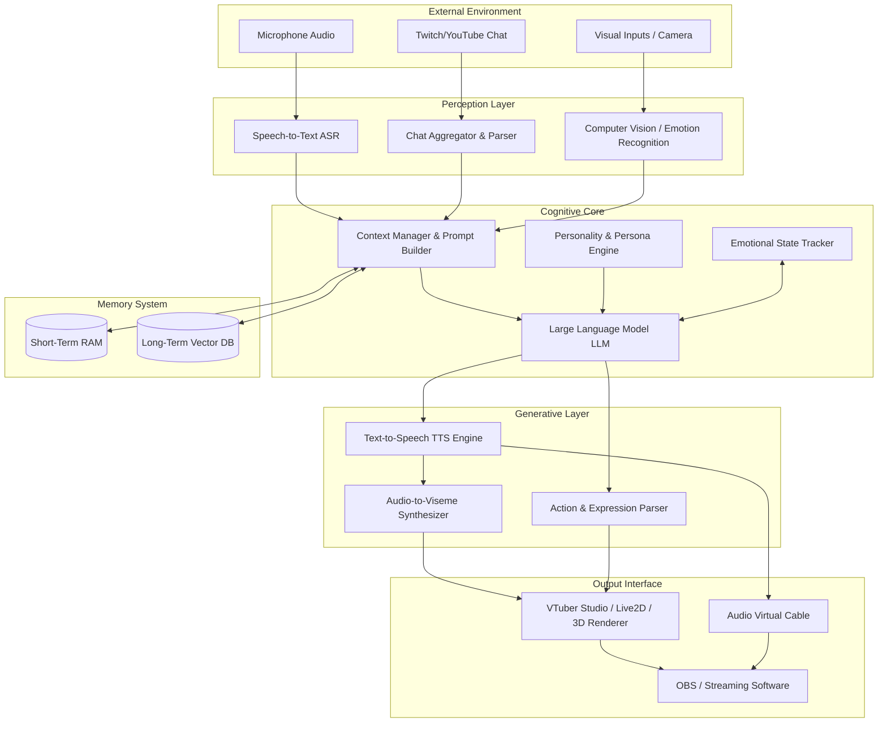

# Open LLM VTuber Mythic Plan: Technical Architecture Vision

## 1. Introduction to the Architectural Vision

The advent of the Open LLM VTuber Mythic Plan represents a monumental shift in the landscape of virtual content creation. No longer are virtual YouTubers simply avatars puppeteered by human actors through complex motion capture setups; we are entering an era of truly autonomous, interactive, and intelligent virtual entities. This document serves as the foundational blueprint and a comprehensive deep dive into the technical architecture that makes this ambitious vision a reality. 

Creating an autonomous VTuber driven by Large Language Models (LLMs) requires far more than simply piping text from a chat into an API and converting the response to speech. It demands a sophisticated, highly synchronized orchestration of multiple complex systems operating in real-time. We must seamlessly integrate natural language processing, audio transcription, emotional analysis, contextual memory, text-to-speech generation, facial animation synthesis, and real-time avatar rendering, all while maintaining strict latency requirements to preserve the illusion of a living, breathing entity. 

This architectural vision is not merely a theoretical exercise; it is a practical roadmap designed to guide developers, contributors, and enthusiasts through the intricacies of building a robust, scalable, and extensible system. By adhering to the principles outlined in this document, we can ensure that the Open LLM VTuber framework remains adaptable to future advancements in AI and rendering technologies, allowing our virtual entities to continuously evolve and improve their capabilities. The architecture described herein prioritize modularity, allowing independent components to be upgraded or replaced without disrupting the entire system, thereby future-proofing the platform against the rapid pace of technological innovation.

## 2. Core Architectural Philosophy

The architecture of the Open LLM VTuber system is underpinned by several core philosophical tenets that guide all technical decisions and design choices. These tenets are essential for maintaining the integrity, performance, and longevity of the project.

### Modularity and Decoupling
The system is fundamentally designed around the principle of modularity. Each functional domain—be it speech recognition, cognitive processing, or animation generation—is encapsulated within its own isolated module. These modules communicate through well-defined, standardized interfaces. This decoupled approach ensures that a change or failure in one component does not cascade through the entire system. For example, replacing one Text-to-Speech (TTS) engine with a newer, more expressive model should require only a localized update to the audio generation module, leaving the cognitive and perceptual systems entirely untouched.

### Event-Driven Asynchronous Processing
Given the real-time nature of VTubing, synchronous, blocking operations are strictly prohibited in the critical path. The architecture heavily leverages event-driven programming paradigms and asynchronous communication. When a user speaks, an event is fired; when transcription is complete, another event is triggered; when the LLM formulates a thought, yet another event is broadcast. This allows multiple processes to occur concurrently—the VTuber can process visual information while speaking, or generate animation data while waiting for the next chunk of audio from the TTS engine.

### Extensibility and Plugin Architecture
The Open LLM VTuber framework is not intended to be a monolithic, closed system. It is designed to be highly extensible, allowing community members to develop custom plugins and integrations. Whether it's connecting the VTuber to a new streaming platform, integrating a novel emotional analysis algorithm, or adding support for complex physics-based prop interactions, the architecture provides robust hooks and APIs to facilitate these extensions without requiring modifications to the core codebase.

### Low-Latency Prioritization
In human communication, even minor delays can disrupt the natural flow of conversation and shatter immersion. Therefore, minimizing end-to-end latency is a paramount architectural concern. Every component is optimized for speed, from the initial capture of user input to the final rendering of a facial expression. We employ aggressive caching, model quantization, stream-based processing, and optimized network protocols to shave milliseconds off every step of the pipeline.

## 3. High-Level System Overview

The Open LLM VTuber architecture can be conceptualized as a biological organism, comprising distinct "organs" that handle perception, cognition, expression, and memory. The following Mermaid diagram illustrates the high-level data flow and interaction between these primary subsystems.

This diagram delineates the journey of information through the system. External stimuli are ingested and translated into semantic meaning by the Perception Layer. This semantic data is contextualized by the Cognitive Core, which consults the Memory System and Personality Engine before generating a response via the LLM. Finally, the text response is transformed into audible speech and corresponding visual animations by the Generative Layer, which are then rendered and broadcast to the audience.

## 4. The Perception Layer: Sensory Inputs and Processing

The Perception Layer acts as the VTuber's sensory organs, bridging the gap between the chaotic external world and the structured internal cognitive systems. It is responsible for gathering raw data from various sources and refining it into actionable insights.

### Speech Recognition and Audio Ingestion
For interactive, conversational VTubers, the primary mode of input is voice. The system employs state-of-the-art Automatic Speech Recognition (ASR) engines, such as optimized versions of Whisper or streaming-first models like Google Cloud Speech-to-Text. To maintain conversation fluidity, the audio ingestion pipeline utilizes Voice Activity Detection (VAD) algorithms. VAD precisely identifies when a user starts and stops speaking, ensuring that the system only processes active speech and ignores background noise or silence. This reduces computational overhead and prevents false positive triggers. Furthermore, the ASR system must be capable of handling stream-based transcription, providing partial text updates as the user speaks, which allows the cognitive core to begin formulating responses before the user has even finished their sentence.

### Chat Aggregation and Moderation
In a livestreaming context, the VTuber must interact with a multitude of viewers simultaneously. The Chat Aggregator module interfaces with the APIs of platforms like Twitch, YouTube, and Bilibili. It ingests thousands of messages, filters out spam and malicious content using automated moderation tools, and prioritizes messages based on viewer engagement, super chats, or specific keywords. This module transforms a firehose of text into a manageable, structured queue of conversational prompts that the LLM can process effectively.

### Visual and Contextual Perception
Advanced iterations of the Open LLM VTuber architecture incorporate computer vision to analyze the environment. This might involve processing a webcam feed to recognize objects, analyze the user's facial expressions to infer their emotional state, or even "watch" the gameplay footage if the VTuber is a gaming streamer. By extracting semantic metadata from video feeds (e.g., "The player just died in the game," "The user is smiling"), the system provides the LLM with a much richer context, allowing for highly relevant and situational commentary.

## 5. The Cognitive Core: LLM Orchestration and State Management

The Cognitive Core is the brain of the VTuber. It is where raw inputs are synthesized with memory, personality, and emotional state to generate coherent, in-character responses. This layer is the most complex and resource-intensive part of the architecture.

### The Context Manager and Prompt Engineering
Large Language Models are inherently stateless; they do not remember previous interactions unless explicitly reminded. The Context Manager is responsible for constructing the massive prompt that is fed to the LLM for every interaction. This prompt must include:
1. The system prompt defining the VTuber's persona, rules, and restrictions.
2. The current emotional state of the VTuber.
3. The most relevant memories retrieved from the vector database.
4. The recent conversational history (short-term memory).
5. The latest input from the user or chat.

Optimizing this prompt is a critical architectural challenge. If the prompt is too short, the VTuber will seem amnesiac and inconsistent. If the prompt is too long, the LLM will suffer from slow inference times, increased computational costs, and "lost in the middle" syndrome, where it forgets the instructions buried deep within the text.

### Emotional State Tracking
A compelling virtual entity must exhibit emotional continuity. The Emotional State Tracker maintains a multi-dimensional representation of the VTuber's mood (e.g., happiness, anger, surprise, sadness). This state is dynamic; it is influenced by the user's inputs, the content of the conversation, and even random internal fluctuations to simulate biological variability. When the Context Manager builds the prompt, it injects the current emotional state, instructing the LLM to tailor its language and tone accordingly. A "happy" state might result in enthusiastic phrasing, while a "sad" state might produce more subdued responses.

### Persona Enforcement and Guardrails
Maintaining a consistent character is essential for a VTuber's brand. The architecture includes specific validation and guardrail layers to ensure the LLM does not break character or violate safety guidelines. These guardrails can take the form of lightweight secondary models that evaluate the primary LLM's output before it is spoken, checking for inappropriate content, out-of-character phrasing, or unsafe topics. If a violation is detected, the output is intercepted, and the system either requests a regeneration or falls back to a safe, pre-scripted response.

## 6. The Memory System: Temporal Continuity

Memory is the foundation of identity. For a VTuber to form meaningful relationships with its audience, it must remember past interactions, inside jokes, and established lore. The architecture employs a tiered memory system.

### Short-Term Memory (RAM)
Short-term memory handles the immediate conversational context. It stores the last few minutes of dialogue, active variables (e.g., the current topic of conversation, the name of the user currently speaking), and recent emotional shifts. This data is typically stored in fast, in-memory data structures like Redis or simply managed within the application's runtime state. It ensures that the VTuber can handle follow-up questions and maintain conversational thread coherence.

### Long-Term Memory (Vector Database)
Long-term memory is implemented using a Vector Database (such as Milvus, Pinecone, or ChromaDB). When a significant event occurs or a notable piece of information is shared, the system summarizes the information, converts it into a high-dimensional vector embedding using a specialized embedding model, and stores it in the database alongside relevant metadata (timestamps, user IDs). 

When a new input arrives, the system embeds the input and performs a semantic similarity search against the vector database. This retrieves past memories that are contextually relevant to the current conversation. For example, if a user mentions "dogs," the system retrieves the memory that the VTuber loves golden retrievers, allowing the LLM to incorporate that fact into its response, thereby creating a powerful illusion of long-term recall and continuous existence.

## 7. The Generative Layer: Audio, Animation, and Expression

Once the Cognitive Core has decided what to say and how to feel, the Generative Layer translates that abstract intent into physical manifestations: sound and movement.

### Text-to-Speech (TTS) Synthesis
The text output from the LLM is streamed into an advanced Text-to-Speech engine. Modern architectures rely on neural TTS models (like VITS, ElevenLabs, or specialized open-source alternatives) that offer high fidelity and emotional prosody control. The architecture must support streaming TTS, meaning it begins generating and playing audio chunks before the entire sentence has been synthesized. This drastically reduces the perceived latency between the user speaking and the VTuber responding. Furthermore, the TTS engine must be capable of accepting emotional tags or SSML (Speech Synthesis Markup Language) generated by the LLM to modulate pitch, speed, and intonation dynamically.

### Audio-to-Viseme and Lip Sync
For the VTuber's avatar to appear believable, its lip movements must perfectly match the generated audio. The Audio-to-Viseme Synthesizer analyzes the audio waveform in real-time, extracts phonetic features, and maps them to a standardized set of visemes (visual representations of phonemes, such as the shape of the mouth when saying 'O' or 'E'). This data is structured into a continuous stream of blendshape weights that dictate how the avatar's mouth should deform at any given millisecond.

### Action and Expression Parsing
Beyond speech, the VTuber must exhibit body language and facial expressions. The LLM is instructed to output specialized tags or commands alongside its text (e.g., `*waves hand* Hello everyone! *smiles*`). The Action and Expression Parser intercepts these tags, removes them from the text before it reaches the TTS engine, and translates them into specific API commands for the rendering software. This allows the LLM to autonomously trigger pre-defined animations, toggle facial expressions, or even interact with virtual props within its environment.

## 8. The Integration Layer: VTuber Studio, VTube Studio, and OBS

The final stage of the architecture involves taking the generated audio and animation data and rendering it into a format suitable for broadcast. This requires seamless integration with existing VTubing infrastructure.

### VTube Studio / Live2D / 3D Renderer Integration
The system does not typically render the avatar itself; instead, it acts as a puppeteer, sending control signals to established rendering software like VTube Studio (for 2D avatars) or Unreal Engine/Unity (for 3D avatars). The architecture implements specific communication protocols, such as the VTube Studio API or the VMC (Virtual Motion Capture) protocol via OSC (Open Sound Control). The viseme data from the audio analyzer and the expression commands from the action parser are packaged into OSC packets and transmitted to the renderer over a local network loopback. This approach leverages the powerful rendering capabilities of existing software while maintaining complete programmatic control over the avatar's performance.

### Audio Routing and Virtual Cables
The audio generated by the TTS engine must be routed effectively. It needs to be sent to the streamer's headphones for monitoring, and simultaneously routed to the broadcasting software. This is typically achieved using Virtual Audio Cables or specialized audio routing software like VoiceMeeter. The architecture must handle this routing automatically, ensuring that the VTuber's voice is clean, properly leveled, and correctly synchronized with the visual output.

### OBS and Broadcasting Orchestration
For livestreaming applications, the system interacts with Open Broadcaster Software (OBS) via the OBS WebSocket plugin. This allows the VTuber system to programmatically switch scenes, trigger visual effects, or manage overlays based on the context of the conversation. For instance, if the LLM decides to "play a game," it can autonomously instruct OBS to switch from the "Just Chatting" scene to the "Gameplay" scene, further enhancing the illusion of an autonomous content creator.

## 9. Networking and Communication Protocols

Efficient and reliable communication between the disparate modules of the architecture is crucial. The system employs a variety of protocols tailored to specific needs.

- **WebSockets:** Used for persistent, low-latency, bi-directional communication, such as streaming audio to the ASR engine or receiving live chat messages from streaming platforms.
- **REST/gRPC:** Utilized for stateless requests to remote APIs, such as sending prompt payloads to external LLM providers (e.g., OpenAI, Anthropic) or querying the vector database. gRPC is preferred for internal microservice communication due to its efficiency and strict schema enforcement via Protocol Buffers.
- **OSC (Open Sound Control):** The industry standard for real-time control of multimedia systems. OSC over UDP is extensively used for sending high-frequency animation data, blendshape weights, and motion capture parameters from the Generative Layer to the rendering software (VTube Studio, Unreal Engine). Its lightweight nature makes it ideal for minimizing jitter and latency in animation.

## 10. Scalability, Performance, and Latency Optimization

Operating an autonomous LLM VTuber locally requires significant computational resources. The architecture incorporates several strategies to optimize performance and manage scalability.

### Hardware Acceleration and Edge Computing
To minimize latency and reduce reliance on expensive cloud APIs, the architecture heavily favors local execution utilizing consumer hardware acceleration. Models for ASR, TTS, and even smaller LLMs are quantized and optimized to run efficiently on local GPUs using frameworks like TensorRT or ONNX Runtime. This "edge computing" approach drastically reduces round-trip times and ensures privacy.

### Asynchronous Streaming Pipelines
As mentioned previously, the entire pipeline from speech recognition to text generation to audio synthesis operates on streaming principles. The system does not wait for an entire sentence to be generated before synthesizing audio; it processes the data in small chunks or tokens. This pipelining technique overlaps processing times, effectively hiding the latency of individual components and resulting in near-instantaneous response times.

### Resource Allocation and Throttling
The system includes an intelligent resource manager that monitors CPU, GPU, and memory usage. During peak loads, the manager can dynamically adjust the fidelity of certain processes. For instance, it might lower the sampling rate of the TTS engine, switch to a faster but slightly less accurate ASR model, or reduce the frequency of emotional state updates to ensure that the core conversational loop remains stable and responsive.

## 11. Security and Privacy Considerations

When deploying autonomous AI systems, security and privacy are not afterthoughts; they must be foundational architectural considerations.

### API Key Management and Secure Storage
The system interacts with numerous external services, requiring the management of sensitive API keys. The architecture mandates secure storage of these credentials, utilizing encrypted environment variables or dedicated secret management systems. Secrets are never hardcoded or exposed in configuration files.

### Data Privacy and Local Execution
To protect user privacy, the architecture strives for maximum local execution. Audio recordings of users, conversation histories, and vector databases are stored locally and are not transmitted to third-party servers unless explicitly required (e.g., when using a cloud-based LLM API). Even then, the system implements data anonymization techniques, stripping personally identifiable information before transmission.

### Input Sanitization and Prompt Injection Defense
The Cognitive Core is vulnerable to prompt injection attacks, where malicious users might attempt to subvert the VTuber's persona or extract sensitive system instructions through cleverly crafted chat messages. The architecture employs rigorous input sanitization and utilizes specialized adversarial filtering models to detect and neutralize prompt injection attempts before they reach the core LLM, ensuring the VTuber remains secure and behaves predictably.

## 12. Conclusion

The technical architecture of the Open LLM VTuber Mythic Plan is a testament to the incredible convergence of diverse AI and software engineering disciplines. By meticulously designing a system that is modular, extensible, and relentlessly optimized for low latency, we are laying the groundwork for a new generation of digital entities. This architecture is not a static blueprint but a living framework, designed to evolve alongside the rapid advancements in large language models, neural audio synthesis, and real-time rendering. As we continue to refine these interconnected systems, the boundary between artificial construct and compelling personality will continue to blur, ushering in a truly mythic era of virtual interaction.
