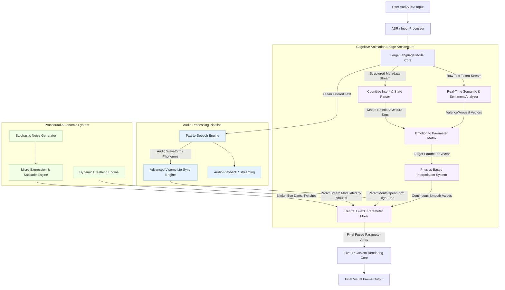

# 49 Cognitive Animation Bridge: Integrating LLM Reasoning with Live2D Animation States

## 1. Introduction: The Sentient Avatar Imperative

The Holy Grail of virtual companionship, interactive digital entities, and advanced VTubing lies not merely in the generation of contextually relevant text or flawlessly synthesized, expressive speech, but in the harmonious and inextricably linked integration of cognitive output with high-fidelity visual representation. The "Cognitive Animation Bridge" (CAB) represents the critical architectural nexus within the Open LLM VTuber Mythic Plan where the ethereal, abstract thoughts of a Large Language Model (LLM) are transcribed into the tangible, physicalized expressions of a Live2D avatar. Historically, virtual avatars and conversational agents have relied on rudimentary synchronization methods—primarily audio-reactive lip-syncing accompanied by randomly triggered, pre-baked idle animations or manually invoked macro expressions via hotkeys. While functionally adequate for basic applications, this disjointed paradigm fundamentally fails to convey the profound depth, subtle nuance, and complex intentionality inherent in genuine human interaction or truly "sentient" communication. When the body merely reacts to the sound of its own voice, rather than the thought preceding the voice, the illusion of consciousness shatters.

The CAB transcends these profound limitations by treating the Live2D model not as a static, disconnected puppet awaiting explicit string-pulls from audio triggers, but as a seamlessly reactive, continuous physical extension of the LLM's evolving cognitive state. The technical challenge is immense and multifaceted: an LLM outputs discrete tokens representing abstract thought, semantic meaning, and logical structure, while a Live2D model requires the continuous, real-time, analog-style manipulation of hundreds of interdependent spatial parameters (such as `ParamAngleX`, `ParamEyeOpenL`, `ParamMouthForm`, etc.). The bridge must parse complex intent, underlying emotional subtext, conversational urgency, and semantic meaning from the generative text stream, translate these abstract linguistic dimensions into quantifiable, normalized animation vectors, and apply them with sub-millisecond latency to maintain the fragile illusion of spontaneous, biological life. This document extensively details the theoretical framework, mathematical modeling, architectural design, state mapping methodologies, and highly advanced synchronization techniques required to forge this unbroken link between the artificial mind and its digital body.

## 2. Core Architecture and The Mind-Body Paradigm

The foundational philosophy underpinning the development of the Cognitive Animation Bridge is defined as the "Mind-Body Paradigm." In traditional, modular setups, the process is strictly sequential and inherently flawed: the LLM generates a complete response, the Text-to-Speech (TTS) engine synthesizes the audio, and finally, the avatar reacts to the resulting audio envelope. This creates a sequential bottleneck and an inescapable reactive delay; the avatar only "knows" it is happy because it hears itself speaking a happy sentence. It is a reactive automaton rather than a proactive conversationalist.

The CAB paradigm completely inverts this archaic relationship. The LLM's generative process is continuously, incrementally monitored token-by-token. Its internal cognitive state, evolving emotional valence, and semantic trajectory are explicitly extracted and broadcasted *ahead* of, or parallel to, the final audio synthesis and playback. This architectural revolution allows the avatar's body to prepare for the utterance before it happens, initiating critical micro-expressions, subtle shifts in posture, and anticipatory changes in gaze *before* the very first syllable is vocalized. This mirrors the preemptive physical cues exhibited by biological organisms, where thought precedes physical action.

### 2.1 Latency Masking and Preemptive Animation Execution

One of the most profound, practical benefits of the CAB is its inherent ability to perform sophisticated latency masking. LLM inference, even on the most optimized, state-of-the-art hardware, incurs noticeable latency. By extracting cognitive intent early in the generation process—for instance, recognizing within the first few generated tokens that the LLM is formulating an apology or expressing deep sorrow—the system can immediately trigger an appropriate preliminary animation state. This might involve lowering the gaze, dropping the shoulders, narrowing the eyes, and slowing the breathing rate.

These preemptive physical reactions occur while the remainder of the sentence is still being generated by the LLM and processed by the TTS. This immediate, proactive physical response occupies the user's perceptual attention, effectively masking the computational delay of the spoken response. By the time the audio begins playing, the avatar is already physically and emotionally positioned for the delivery, significantly enhancing the perceived responsiveness, empathy, and fluid realism of the avatar.

## 3. The Extraction of Cognitive State: Deciphering the LLM

The initial technical hurdle in the Cognitive Animation Bridge is extracting a structured, usable, and continuously updating cognitive state from an inherently unstructured text generation model. This is achieved through a multi-layered, highly optimized analytical pipeline that operates concurrently with the primary conversational generation loop.

### 3.1 Dual-Stream Generation and Advanced Prompt Engineering

The most direct, although structurally demanding, method of state extraction relies on highly sophisticated prompt engineering designed to force the LLM into a dual-stream generation mode. The core system prompt explicitly instructs the model to output not only the conversational dialogue intended for the user but also parallel metadata tags representing its internal state, a multi-dimensional emotional vector, and intended physical actions or semantic gestures.

For example, instead of merely outputting a flat string: "I am absolutely thrilled to see you again today!", the model is conditioned via few-shot prompting and explicit schema definition to output a structured, machine-readable format, such as: 
`[CAB_STATE: Emotion=Joy_High, Valence=0.9, Arousal=0.85, Intent=Greeting, Gesture=Excited_Nod] <dialogue> I am absolutely thrilled to see you again today! </dialogue>`.

This structured metadata provides the CAB with explicit, high-level directives that can immediately be parsed, normalized, and mapped into animation triggers. However, relying solely on explicit, conscious self-reporting from the LLM can occasionally lead to rigid, exaggerated, or unnaturally compartmentalized performances if the model fails to capture subtle emotional shifts.

### 3.2 Real-time Semantic, Sentiment, and Prosodic Analysis

To robustly complement and refine the explicit metadata stream, the CAB employs real-time, continuous sentiment analysis on the generated text stream as it is produced. As individual tokens or small chunks are streamed out, a lightweight, highly optimized secondary classification model (or a fast, deterministic heuristic engine based on valence-arousal dictionaries) analyzes the evolving sentence structure. This detects subtle shifts in tone, sarcasm, or complex mixed emotions that the primary LLM might not have explicitly tagged in its macroscopic metadata.

This real-time semantic analysis operates on a continuously updating sliding window, evaluating the emotional valence (positive vs. negative) and arousal (calm vs. excited) of the output. If the semantic engine detects a sudden shift towards aggression or frustration within a sentence that was initially tagged as generally "neutral," it can smoothly interpolate the avatar's expression to reflect this changing internal weather. This ensures that the physical representation remains fluidly and dynamically responsive to the immediate, microscopic spoken context, rather than being locked into a monolithic macro-state.

### 3.3 Intent Detection and Semantic Classification

Beyond base emotions (joy, sadness, anger, fear), the CAB heavily utilizes intent classification to drive specific, meaningful semantic gestures. Is the LLM asking a probing question? Firmly denying a premise? Expressing profound uncertainty? Silently pondering a complex logical problem? By classifying the abstract intent of the utterance, the system can map these concepts to universally understood, instinctual physical gestures:

*   **Questioning/Inquisitive:** Slight horizontal head tilt (`ParamAngleZ`), raised eyebrows (`ParamBrowY`), sustained, unbroken eye contact to demand a response.
*   **Denial/Rejection:** Firm horizontal head shake (`ParamAngleX` oscillation), narrowing of the eyes (`ParamEyeOpen` reduction), slight backward physical lean (`ParamBodyAngleZ`).
*   **Pondering/Processing:** Gaze explicitly averted upwards and to the side, slow and deliberate blinking, minimal to no mouth movement, a general stilling of extraneous body motion.
*   **Affirmation/Agreement:** Rapid, short vertical head nods (`ParamAngleY` oscillation), softening of the eye curves, slight forward lean to indicate engagement.

These semantic gestures provide a crucial, undeniable layer of non-verbal communication that heavily grounds the digital interaction in physical, biological reality.

## 4. The Emotion to Parameter Mapping Matrix: The Mathematical Translation

Once the comprehensive cognitive state is successfully extracted and normalized, it must be mathematically translated into the specific, strictly numerical language of the Live2D model. This complex translation is governed by the Emotion to Parameter Mapping Matrix, a highly complex, multi-dimensional lookup and interpolation array that defines exactly how high-level psychological concepts influence low-level rendering geometry.

### 4.1 Deconstructing the Live2D Parameter Space

A standard, commercially viable, high-quality Live2D model contains dozens, and sometimes hundreds, of precisely controllable floating-point parameters, typically ranging from -1.0 to 1.0 or 0.0 to 1.0. The core parameters most critically relevant to the CAB typically include, but are not limited to:

*   **Head and Body Spatial Tracking:** `ParamAngleX` (Yaw), `ParamAngleY` (Pitch), `ParamAngleZ` (Roll).
*   **Complex Eye Dynamics:** `ParamEyeLOpen`, `ParamEyeROpen` (eyelid droop/widen), `ParamEyeBallX`, `ParamEyeBallY` (gaze direction), `ParamEyeForm` (smile curve vs. neutral).
*   **Granular Brow Dynamics:** `ParamBrowLY`, `ParamBrowRY` (vertical position), `ParamBrowLX`, `ParamBrowRX` (horizontal squeeze), `ParamBrowLAngle`, `ParamBrowRAngle` (tilt), `ParamBrowLForm`, `ParamBrowRForm` (deformation curve).
*   **Mouth Dynamics (Beyond Basic Lip-Sync):** `ParamMouthForm` (smile vs. frown curve), `ParamMouthOpenY` (jaw drop).
*   **Overall Body Posture and Physiology:** `ParamBodyAngleX`, `ParamBodyAngleY`, `ParamBodyAngleZ` (core spine manipulation), `ParamBreath` (autonomic chest expansion).

### 4.2 The Multi-Dimensional Translation Matrix

The translation matrix maps a continuous, multi-dimensional emotional vector (most commonly using the Circumplex Model of Affect: Valence, Arousal, and sometimes Dominance) onto this vast parameter space.

For instance, an emotional state mathematically defined as **High Joy (Valence: 0.85, Arousal: 0.70)** might deterministically translate to the following parameter manipulations:
*   `ParamEyeForm`: Driven strongly towards 1.0 (a tight "smiling eye" curve).
*   `ParamBrowLY` / `ParamBrowRY`: Elevated slightly to 0.4.
*   `ParamMouthForm`: Driven towards a positive value of 0.8 (a distinct smile).
*   `ParamBodyAngleY`: Slight upward shift (simulating bouncing, kinetic energy).
*   `ParamBreath`: Frequency multiplier increased by 1.5x to simulate excitement and elevated heart rate.

Conversely, a state calculated as **Deep Sorrow (Valence: -0.90, Arousal: 0.15)** would induce a drastically different, heavy mapping:
*   `ParamEyeOpen`: Clamped to a maximum of 0.6 (half-closed, conveying heavy, exhausted eyelids).
*   `ParamBrowLAngle` / `ParamBrowRAngle`: Angled severely downwards towards the center bridge of the nose.
*   `ParamMouthForm`: Driven to a negative value of -0.7 (a pronounced frown).
*   `ParamBodyAngleY`: Significant downward shift to -0.5 (slumped, defeated posture).
*   `ParamAngleZ` (Head Roll): Slight, slow tilt to indicate physical vulnerability and lack of energy.

### 4.3 Parameter Blending, Interpolation Physics, and Conflict Resolution

Human emotions are rarely binary, mutually exclusive, or entirely static; they flow, blend, and contradict. The CAB must utilize sophisticated interpolation algorithms—such as multi-dimensional Bezier curves, Hermite splines, or spring-damper physics simulations (modeling mass, tension, and friction)—to transition smoothly and organically between disparate emotional states. A harsh, linear mathematical transition from "Joy" to "Rage" instantly shatters immersion, appearing robotic. The transition must simulate the actual muscular resistance, physiological buildup, and latency of a biological face changing its underlying expression.

Furthermore, the system must elegantly handle heavily conflicting states. What precisely happens when the real-time semantic analysis detects intense "Sadness" in the subtext, but the explicit LLM metadata tags the output as "Sarcastic Joy"? The CAB must implement a strict conflict resolution hierarchy. This often involves employing dynamic blending weights to create complex, nuanced, layered expressions—such as a painfully sad smile or a frighteningly angry laugh—by mathematically averaging and prioritizing parameters from multiple competing matrices.

### 4.4 Non-Deterministic Autonomic Micro-Expressions

To breathe genuine, unpredictable life into the avatar and escape the rigid determinism of state machines, the CAB must interject non-deterministic, procedurally generated micro-expressions. These must operate entirely independently of the primary cognitive state, simulating the autonomic nervous system. These include:

*   **Saccadic Eye Movements:** Small, rapid, randomized eye movements (`ParamEyeBallX/Y` micro-jitters) that simulate realistic visual processing, gaze shifting, and completely prevent the terrifying "dead stare" effect common in older avatars.
*   **Asymmetrical and Variable Blinking:** Occasional uneven blinking (one eye closing slightly faster than the other) and variable blink rates to simulate organic imperfection and eye lubrication needs.
*   **Postural Shifting:** Subtle, extremely low-frequency changes in body weight distribution over time, manipulating `ParamBodyAngleX/Z` slightly to prevent the avatar from appearing frozen in carbonite during long monologues.
*   **Breathing Variance:** Continuously modulating the baseline speed and total depth of the `ParamBreath` parameter strictly based on the current cognitive Arousal level, interspersed with occasional, randomized deep breaths or heavy sighs.

These vital autonomic systems run as continuous background daemon processes, ensuring that even when the LLM is completely idle, the avatar remains physically and undeniably "alive."

## 5. System Workflow and Architectural Diagrams

To properly visualize the intricate flow of data, state changes, and parameter control within the Cognitive Animation Bridge, we employ Mermaid diagrams to explicitly illustrate the system architecture and the underlying state machine logic.

### 5.1 Comprehensive Data Flow Architecture

The following diagram illustrates the complete, end-to-end pipeline from the initial user input to the final rendering of the Live2D frame.



**Detailed Diagram Explanation:**
This high-level architecture diagram highlights the fundamentally parallel processing nature of the CAB. While the Audio Processing Pipeline handles the immediate, high-frequency task of vocalization and physical lip-syncing (mapping specific phonetic sounds and audio volume to mouth shapes), the Cognitive Animation Bridge operates concurrently to establish the broader, lower-frequency emotional and physical context. The `Central Live2D Parameter Mixer` acts as the critical final arbiter and blending node. It accepts distinct inputs from the cognitive bridge (determining the overall facial expression, head tilt, and body posture), the audio pipeline (driving the rapid mouth movements), and the autonomic nervous system (providing continuous background lifelike noise), mathematically fusing them into a single, cohesive set of parameters for the Cubism renderer.

### 5.2 Dynamic Emotional State Machine Transition Logic

The transition between profound emotional states is not a simple boolean switch; it requires highly complex state machine logic to ensure physical plausibility and prevent visual jarring.

```mermaid
stateDiagram-v2
    direction LR
    [*] --> Baseline_Neutral

    state Baseline_Neutral {
        [*] --> Idle_Calm
        Idle_Calm --> Micro_Postural_Shift : Random Interval T
        Micro_Postural_Shift --> Idle_Calm
    }

    state Elevated_Joy {
        [*] --> Gentle_Smile
        Gentle_Smile --> Exuberant_Laugh : Arousal > 0.8
        Exuberant_Laugh --> Gentle_Smile : Arousal < 0.5
    }

    state Deep_Sorrow {
        [*] --> Subtle_Frown
        Subtle_Frown --> Weeping_State : Valence < -0.8
        Weeping_State --> Subtle_Frown : Valence Recovers
    }
    
    state High_Aggression {
        [*] --> Frustrated_Glare
        Frustrated_Glare --> Angry_Outburst : Arousal > 0.9
        Angry_Outburst --> Frustrated_Glare : Arousal normalizes
    }

    Baseline_Neutral --> Elevated_Joy : Sustained Positive Valence Vector
    Elevated_Joy --> Baseline_Neutral : Valence Normalizes towards 0
    
    Baseline_Neutral --> Deep_Sorrow : Sustained Negative Valence Vector
    Deep_Sorrow --> Baseline_Neutral : Valence Normalizes towards 0
    
    Baseline_Neutral --> High_Aggression : Negative Valence + High Arousal
    High_Aggression --> Baseline_Neutral : Arousal Drops
    
    Elevated_Joy --> Deep_Sorrow : Direct Transition (Shock Override)
    Deep_Sorrow --> High_Aggression : Frustration Escalation

    note top of Elevated_Joy : Parameters: Brow Up, Eye Arc, Mouth Smile, Light Breath
    note bottom of Deep_Sorrow : Parameters: Brow Down/Center, Eye Narrow, Frown, Heavy Breath
```

**State Machine Logic Explanation:**
The state machine governs the macroscopic, overarching emotional state of the avatar over time. It visually demonstrates that transitions are primarily driven by continuous mathematical vector changes (Valence and Arousal thresholds crossing specific boundaries) rather than simple explicit, hard-coded string triggers. Within each major state (Joy, Sorrow, Aggression), there exist highly specific sub-states that modulate the immediate intensity of the expression based on rapid arousal fluctuations. The transition logic ensures that the avatar must physically traverse logical intermediate parameter spaces when shifting between extreme emotions (e.g., Joy to Sorrow must pass through Neutral or trigger a specific "Shock" animation). The "Shock Override" represents a critical interrupt system, which commands an immediate, high-velocity parameter override for sudden, startling stimuli, bypassing normal slow interpolation.

## 6. Advanced Synchronization Techniques

To truly elevate the digital avatar from a highly responsive interactive puppet to a compelling, convincing digital entity, the Cognitive Animation Bridge must employ advanced synchronization techniques that aggressively utilize absolutely every available layer of generated data.

### 6.1 Prosody Analysis and Secondary Audio-Driven Animation

Text and metadata provide the conceptual "what" and the psychological "why," but the synthesized audio itself provides the physical "how." The CAB does not merely rely on the TTS for basic lip-sync; it actively analyzes the generated audio file (or audio stream) for detailed prosodic features—primarily pitch (the fundamental F0 contour), volume (the amplitude envelope), and localized speech rate.

These prosodic features are mathematically mapped to secondary, high-frequency animation parameters to create highly dynamic, energetic performances:
*   **Pitch to Eyebrow Articulation:** Rapid increases in vocal pitch (often signifying surprise, questioning, or intense emphasis) can dynamically drive the `ParamBrowY` parameter upwards in perfect sync, creating an incredibly organic link between vocal inflection and facial expression.
*   **Volume to Posture and Gaze:** Sudden spikes in audio volume (indicating emphasis, anger, or projection) can trigger a subtle, rapid forward lunge (`ParamAngleZ` or `ParamBodyAngleZ`) and a momentary widening of the eyes (`ParamEyeOpen`), physically underscoring the vocal stress exactly as a human would.
*   **Speech Rate to Autonomic Movement Frequency:** Exceptionally fast, excited speech can dynamically increase the baseline frequency multiplier of autonomic movements (blinking, breathing), making the avatar appear physically energized and out of breath.

### 6.2 Sophisticated Gaze Control and Attention Simulation

Unbroken eye contact is often the most powerful tool for conveying attention and intelligence, but it is easily misused. The CAB implements a highly complex, psychological gaze control system that simulates genuine cognitive focus and distraction. The system explicitly prevents locking the avatar's eyes onto the camera indefinitely; this creates an unnerving, predatory, or unnatural "uncanny" effect.

Instead, the gaze system implements distinct, context-aware "attention cycles."
1.  **Direct Engagement:** Firm, direct eye contact when the user is actively speaking to the avatar, or when the avatar is delivering a highly crucial piece of information that demands attention.
2.  **Cognitive Load Aversion:** When the LLM is demonstrably processing a highly complex user query or actively generating a lengthy, logical response, the CAB purposefully breaks eye contact. It shifts the gaze slowly upwards and to the side. This visually signals to the user that the avatar is "thinking," effectively masking processing latency and perfectly mimicking human cognitive behavior when accessing memory or formulating complex thoughts.
3.  **Environmental Awareness Scans:** Random, brief, rapid saccades away from the user to simulate awareness of a broader virtual environment, completely preventing the phenomenon of static staring and grounding the avatar in a 3D space.

### 6.3 Semantic Gestures and Theatrical Micro-Choreography

The absolute most advanced, cutting-edge function of the CAB is the execution of highly specific semantic gestures synchronized with precise theatrical timing. By deep-parsing the semantic structure and dependency trees of the generated text, the system identifies key grammatical phrases and structural clauses that warrant specific, physical punctuation.

For example, if the generated text is "On one hand, we could deploy the server, but on the other hand, the cost is high," the CAB can intelligently trigger subtle, alternating head tilts corresponding exactly to the spoken clauses "On one hand" and "on the other hand." If the avatar dramatically says "Absolutely not," the system triggers a firm, negative horizontal head shake precisely synchronized with the vocalization of the word "not." This staggering level of micro-choreography transforms the output from a simple spoken text-to-speech string into a meticulously performed, theatrical monologue.

## 7. Implementation Challenges, Constraints, and Mitigation Strategies

The practical realization and deployment of the Cognitive Animation Bridge presents several formidable, real-world technical challenges that require robust, highly engineered mitigation strategies.

### 7.1 Hardware Constraints, Latency Budgets, and Real-Time Processing

The continuous, uninterrupted analysis of text streams, the real-time extraction of metadata, the heavy prosody analysis of audio buffers, and the complex, physics-based parameter interpolation must all occur simultaneously within an incredibly strict latency budget (typically <16.6ms per frame to maintain a flawless 60 FPS output). Heavy reliance on complex, large-parameter machine learning models for sentiment analysis can instantly shatter this strict budget, causing visual stuttering and desynchronization.

**Mitigation:** The system architecture must employ highly lightweight, heavily optimized, potentially compiled heuristic models or highly distilled, quantized neural networks specifically for the real-time sentiment and prosody analysis. Furthermore, the core mathematical interpolation and parameter mixing engine must absolutely be written in a high-performance, systems-level language (e.g., C++, Rust, or optimized C# within Unity) to ensure maximum possible throughput, thereby minimizing the CPU overhead required to drive the final Live2D rendering core.

### 7.2 The Model Context Limit, Prompt Drift, and Persona Consistency

As a prolonged conversation progresses over hours, the LLM's finite context window inevitably fills up. If the generation of emotional metadata is not strictly and continuously regulated via system prompt enforcement, the LLM may begin to suffer from "prompt drift," outputting contradictory, hallucinated, or nonsensical physical directives, leading to deeply erratic avatar behavior. Furthermore, ensuring that the avatar maintains a consistent, believable physical persona (e.g., a canonically shy avatar should rarely exhibit aggressive, wide-stance, dominant postures) requires strict mathematical adherence to character bibles.

**Mitigation:** The CAB must implement a non-negotiable "Persona Override Matrix." This matrix acts as a final, absolute hard-coded filter, brutally clamping or scaling parameter values that violate the pre-established physical boundaries of the specific character's defined personality. If the LLM erroneously outputs a command for an intensely aggressive posture for a character explicitly defined as timid and fearful, the override matrix intercepts and severely dampens the command. This ensures unbroken character consistency regardless of the LLM's internal logical drift or temporary hallucinations.

### 7.3 Over-Animation, Jitter, and Escaping the Uncanny Valley

A widespread, common pitfall in procedural, data-driven animation systems is the severe tendency to over-animate—reacting to absolutely every minor semantic fluctuation or tiny audio spike with a major physical movement. This predictably results in an avatar that appears jittery, hyper-active, nervously unstable, or physically unwell, plunging the user deep into the dreaded uncanny valley.

**Mitigation:** The physics interpolation system must implement extensive damping algorithms, low-pass mathematical smoothing, and a strict "minimum energy threshold for actuation." Minor, insignificant fluctuations in the emotional vector or low-volume audio should only influence extremely subtle parameters (like a slight change in eye shape or breathing rate), while major, sweeping postural shifts should require sustained, high-intensity emotional signals over a period of time. The system design must fundamentally prioritize deliberate stillness and purposeful motion over continuous, aimless, jittering noise.

### 7.4 Data Logging, Telemetry, and Continuous Performance Tuning

Tuning a system with hundreds of parameters driven by an unpredictable LLM is impossible without robust data. Without seeing what the LLM asked for versus what the physics engine actually rendered, debugging strange behaviors is impossible.

**Mitigation:** The CAB must include a high-frequency, low-impact telemetry logging system. This system records the raw LLM metadata, the output of the semantic analyzer, the raw prosody values, and the final normalized parameters sent to Live2D at 60Hz. This data allows developers to visually graph the "thought process" of the avatar over time, identifying exactly where a transition failed or why a particular emotion was suppressed by the damping algorithms.

## 8. Future Vistas, Multi-Modal Integration, and The Road Ahead

The current, advanced iteration of the Cognitive Animation Bridge focuses primarily on translating internal text generation and vocal output into visual representation. While revolutionary, the future, ultimate evolution of this system involves the full, closed-loop integration of multi-modal sensory inputs.

As user-facing hardware, such as 4K cameras and spatial microphone arrays, becomes more sophisticated and accessible, the CAB will inevitably evolve to ingest the user's own emotional state, physical posture, and facial expressions in absolute real-time. The avatar will no longer merely react to its own internal, isolated thoughts; it will begin to physicalize genuine empathy. It will subconsciously mirror the user's posture to build deep psychological rapport, or physically recoil from sudden aggressive movements by the user. The underlying LLM will process the user's visual data, generating a complex cognitive state that reflects true situational awareness, and the CAB will seamlessly translate that awareness into immediate, instinctive, biologically plausible physical reactions. This creates a true, unbroken feedback loop between human and machine.

## 9. Conclusion

The Cognitive Animation Bridge is not merely a feature; it is the absolute, indispensable linchpin of the Open LLM VTuber Mythic Plan. It is the complex mechanical and software mechanism by which raw, cold computational logic is miraculously transmuted into the convincing illusion of a living, breathing, deeply feeling digital entity. By decisively moving beyond archaic reactive lip-syncing and fully embracing a paradigm of proactive, cognitively-driven, physics-based animation, the CAB ensures that absolutely every generated word is supported by a rich, undeniable tapestry of non-verbal communication. Through the meticulous mathematical mapping of emotional vectors, highly sophisticated interpolation physics, and the precise, theatrical synchronization of semantic gestures, the Cognitive Animation Bridge definitively elevates the digital avatar from a mere user interface into a compelling, expressive, and profoundly resonant virtual companion.
