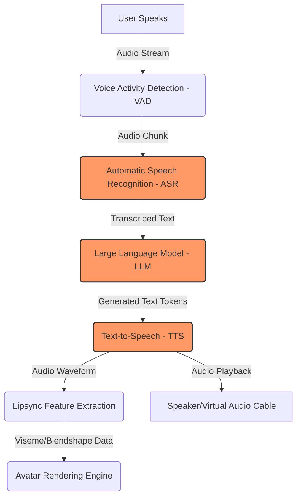
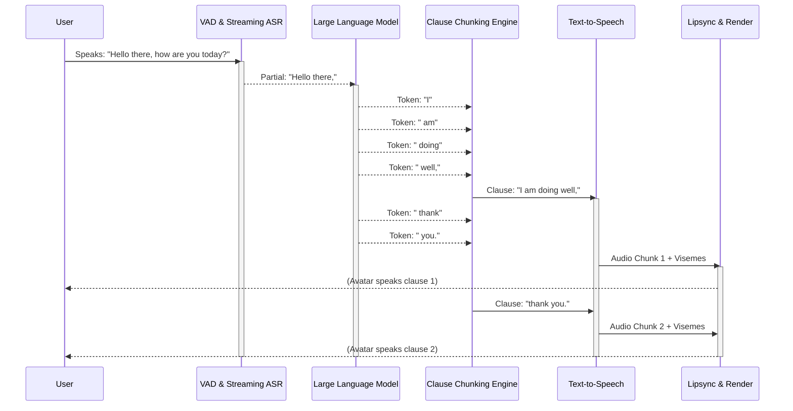
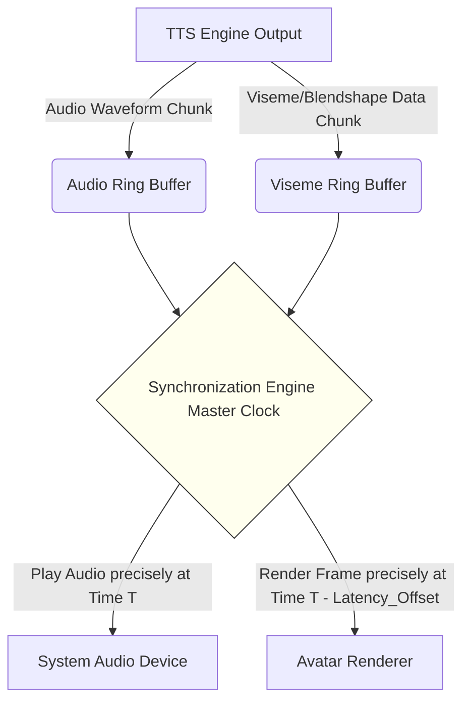

# Latency Optimization, Offline Performance, and Speech-to-Lipsync Synchronization Strategy

## 1. Introduction

The pursuit of absolute real-time interaction is the defining technical challenge in the development of artificial intelligence-driven virtual YouTubers (VTubers) and interactive digital avatars. Within the context of the Open LLM VTuber ecosystem, and specifically under the ambit of Project Ember, achieving seamless, instantaneous communication is not merely a feature—it is the foundational requirement for creating a believable, immersive, and engaging user experience. When a human interacts with an AI VTuber, any perceptible delay in the conversational flow shatters the illusion of presence, reminding the user that they are conversing with a machine rather than a sentient digital entity. This document serves as a comprehensive, exhaustive exploration of the methodologies, architectures, and theoretical frameworks required to ruthlessly eliminate latency, maximize offline performance capabilities, and ensure flawless speech-to-lipsync synchronization.

The uncanny valley is not solely a visual phenomenon; it extends profoundly into the temporal domain. A visually perfect avatar that responds with a two-second delay or whose lip movements lag behind the spoken audio by even a fraction of a second induces severe cognitive dissonance in the observer. Therefore, the optimization strategies discussed herein treat latency not as a minor inconvenience to be mitigated, but as a critical defect to be eradicated entirely from the system. We must consider the entire end-to-end pipeline: from the moment the user's vocalization ceases, through the intricate stages of Automatic Speech Recognition (ASR), Large Language Model (LLM) inference, Text-to-Speech (TTS) generation, and finally, the translation of that audio into precise facial morph target manipulations. 

Furthermore, this document places a paramount emphasis on offline performance. The reliance on cloud-based APIs for core cognitive and vocal functions introduces unacceptable variables: network latency, bandwidth fluctuations, API rate limits, and profound privacy concerns. A truly robust AI VTuber must be capable of executing its entire sensory, cognitive, and expressive pipeline entirely on local consumer-grade hardware. This necessitates a paradigm shift in how we approach resource management, model selection, and algorithmic efficiency. We must extract maximum utility from every available tensor core and CPU cycle, employing advanced quantization, aggressive caching, and dynamic resource allocation to ensure that the offline experience rivals, or even surpasses, cloud-dependent alternatives.

Finally, the synchronization of generated speech with the avatar's visual lip movements (lipsync) represents the ultimate test of the system's temporal precision. We will dissect the mechanisms required to align acoustic features with visual visemes, exploring the delicate balance between look-ahead buffering and instantaneous reactivity, ensuring that the avatar's performance is not only fast but breathtakingly accurate.

## 2. System Architecture and the Latency Pipeline

To effectively optimize the system, we must first anatomize the conversational pipeline. The interaction loop of an AI VTuber is a sequential chain of complex, computationally intensive operations. Each link in this chain contributes to the total conversational latency—the time elapsed between the user finishing their sentence and the avatar beginning its verbal response.

The standard, unoptimized pipeline operates in a purely sequential, batch-processing mode. The VAD waits for absolute silence to confirm the end of speech. The ASR transcribes the entire audio clip at once. The LLM generates the entire response before passing any text forward. The TTS waits for the complete text to generate the entire audio file. Finally, the lipsync algorithm analyzes the complete audio file before rendering begins. This naive approach results in cumulative latencies that frequently exceed three to five seconds—an eternity in human conversation.

To dismantle this latency trap, we must transition from a sequential batch architecture to a highly asynchronous, deeply pipelined streaming architecture. The core philosophy is to process data in the smallest possible increments and to begin the next stage of the pipeline the instant the prerequisite data is available, overlapping computation wherever physically possible.

## 3. Advanced Latency Optimization Strategies

### 3.1. Asynchronous Pipelining and Deep Streaming

The cornerstone of latency reduction is the implementation of a continuous streaming architecture across the ASR, LLM, and TTS boundaries. 

Instead of waiting for the user to completely stop speaking, an aggressive Voice Activity Detection (VAD) system must employ predictive endpointing, anticipating the end of a sentence based on intonation and brief pauses, feeding continuous audio chunks to a streaming ASR model. The ASR model must output partial transcripts in real-time, sending them to the LLM before the user has even finished their complete thought.

The true magic, however, occurs at the LLM-to-TTS interface. The LLM must be configured to yield its output token by token. However, a TTS engine cannot generate natural-sounding speech from isolated sub-word tokens; it requires context, specifically intonation boundaries, to accurately synthesize pitch and prosody. Therefore, we must implement a highly intelligent buffering mechanism—a sentence or clause boundary detector. As the LLM yields tokens, this intermediary buffer accumulates them until it detects a natural syntactic break (a comma, period, question mark, exclamation point, or newline). 

Once a complete clause is detected, that specific chunk of text is immediately dispatched to the TTS engine, while the LLM continues generating the subsequent clauses in the background. The TTS engine synthesizes the audio for the first clause and immediately begins playback and lipsync rendering. 

By overlapping the LLM generation of clause B with the TTS synthesis of clause A, and the rendering of clause A, we effectively hide the latency of all subsequent processing. The perceived latency becomes merely the time it takes the LLM to generate the *first* clause plus the time for the TTS to synthesize that *first* clause. This can often be driven down to sub-500 milliseconds.

### 3.2. Hardware Acceleration and Computational Optimization

Achieving these unprecedented speeds, particularly in an offline, local-first environment, requires exploiting every ounce of hardware capability available to the system. 

For the LLM, we must aggressively utilize model weight quantization. Loading full-precision (FP16 or FP32) models into Video RAM (VRAM) is prohibitively expensive and excruciatingly slow on consumer-grade hardware. We must employ techniques such as GPTQ, AWQ, or EXL2 to reduce the model weights to 4-bit, 3-bit, or even highly optimized lower-bit precision formats. This drastically reduces the memory bandwidth bottleneck, which is typically the primary limiting factor in LLM inference speed, allowing for much faster token generation rates. Furthermore, implementing FlashAttention-2 or similar highly optimized attention mechanisms is absolutely mandatory to reduce the computational complexity of the context window processing.

For the ASR component, utilizing highly optimized, heavily quantified implementations like Whisper.cpp or Faster-Whisper (which leverages the CTranslate2 engine) provides massive, order-of-magnitude speedups over native, unoptimized PyTorch implementations. We must also carefully select the appropriate ASR model size; a "base" or "small" model often provides more than sufficient accuracy for casual conversational English while executing in a tiny fraction of the time required by a computationally heavy "large" model.

Similarly, the TTS engine must be hyper-optimized for speed. Autoregressive TTS models, while often producing high-quality audio, are notoriously slow. We should heavily prioritize non-autoregressive models, flow-matching models, or heavily optimized variants of VITS architectures that can synthesize audio significantly faster than real-time (for example, generating 1 second of audio in less than 0.05 seconds of raw compute time).

### 3.3. Semantic Caching and Speculative Decoding

To further drive down latency to theoretical minimums, we can implement speculative decoding. In this advanced paradigm, a smaller, much faster "draft" LLM rapidly generates a sequence of speculative future tokens. The main, larger, and smarter LLM then evaluates these speculative tokens in a single, parallel forward pass. If the main model agrees with the draft model's predictions, it accepts them, effectively generating multiple tokens in the time it would normally take to generate just one. If it disagrees, it corrects the sequence and the process continues. This can provide substantial speedups without sacrificing the output quality or reasoning capabilities of the larger model.

Additionally, sophisticated semantic caching can be employed for common conversational prompts, greetings, or filler words. If the system detects a highly common, predictable input, it can completely bypass the heavy, computationally expensive LLM processing and immediately serve a pre-generated, highly appropriate response, reducing perceived latency to near absolute zero for specific types of interactions.

## 4. Achieving Uncompromising Offline Performance

The philosophical core of Project Ember explicitly dictates that the VTuber must be capable of totally autonomous existence, entirely severed from the umbilical cord of the internet. This local-first, offline architecture ensures absolute data privacy, guarantees zero ongoing API costs, and provides total immunity to server outages, network congestion, and arbitrary API rate limits. However, achieving this level of autonomy on standard consumer-grade hardware (e.g., a system equipped with a single RTX 3060, 4070, or 4090 GPU) presents formidable, complex resource management challenges that must be overcome.

### 4.1. The Resource Juggling Act: Dynamic VRAM Allocation

The primary, most critical battleground for offline performance is Video RAM (VRAM). We must simultaneously host the ASR model, the primary LLM, the TTS model, and the avatar rendering engine (which may include complex 3D environments, physics simulations, and heavy shaders) all within a highly constrained memory footprint. 

To accomplish this seemingly impossible task, we must design and implement an aggressive, highly intelligent dynamic resource manager. 

1.  **Context Window Management:** The LLM's Key-Value (KV) cache grows linearly with the length of the ongoing conversation, rapidly consuming precious VRAM. We must implement smart context summarization, rolling context windows, and aggressive eviction policies. When the KV cache approaches a predefined critical VRAM threshold, older, less relevant conversation turns must be seamlessly compressed into a dense, token-efficient summary, freeing up critical memory while preserving the overall conversational context and narrative arc.
2.  **Model Offloading and Paging:** If VRAM is strictly and unavoidably limited, we must employ intelligent CPU offloading for less latency-critical or sporadically used components. For example, while the main LLM *must* remain entirely in VRAM for fast, responsive generation, the ASR model (which is used only when the user is actively speaking) could be temporarily offloaded to much slower system RAM and paged back into high-speed VRAM only when the VAD explicitly detects speech. 
3.  **Quantization Hierarchy:** We must carefully and deliberately select the optimal, most efficient quantization level for every single component in the pipeline. The LLM might use an ultra-aggressive 4-bit EXL2 format, the ASR might use standard 8-bit integer quantization, and the TTS might use 16-bit floats if it is small enough to fit. The overarching goal is to pack the maximum possible amount of "intelligence" and processing capability into the available VRAM footprint without triggering out-of-memory errors.

### 4.2. Graceful Degradation and Fallback Heuristics

A truly robust offline system must be highly resilient. If the user decides to run another demanding application simultaneously (for example, playing a graphically intensive AAA video game while simultaneously streaming the VTuber via OBS), the VTuber system must degrade gracefully rather than suffering a catastrophic crash or entering a hard lock state.

The core system should constantly, continuously monitor underlying hardware metrics (VRAM usage, GPU compute utilization, CPU load, thermal throttling status). If resources become critically constrained or temperatures rise dangerously high, the system should automatically, transparently trigger predefined fallback mechanisms:
- Switch the LLM from a large, intelligent 14B parameter model to a smaller, faster, but less nuanced 8B parameter model seamlessly mid-conversation.
- Reduce the TTS output sample rate or switch to a fundamentally less computationally intensive, lower-fidelity voice model.
- Temporarily disable speculative decoding to save precious CPU/GPU compute cycles.
- Automatically throttle the avatar rendering framerate slightly to ensure that audio processing and LLM generation remain uninterrupted and responsive.

This dynamic, intelligent scalability ensures that the VTuber remains constantly responsive and entirely functional regardless of the underlying hardware constraints or external system loads, making the technology highly accessible to a much wider audience with varying hardware capabilities.

## 5. Masterclass: Speech-to-Lipsync Synchronization Strategy

The final, and perhaps most immediately perceptible, aspect of the entire latency pipeline is the absolute synchronization between the generated audio output and the avatar's visual lip movements. Even if the entire ASR-LLM-TTS computational pipeline operates in well under 500 milliseconds, if the final lipsync rendering is misaligned by even 50 to 100 milliseconds, the illusion of life is instantly destroyed.

### 5.1. The Fundamental Challenge of Temporal Synchronization

The immense challenge lies in the fundamental fact that audio playback is continuous, highly precise, and strictly governed by the hardware audio buffer, while visual rendering is inherently discrete (framerate-dependent) and subject to the vagaries, delays, and fluctuations of the GPU rendering pipeline. Furthermore, high-quality, organic-looking lipsync algorithms require a small amount of "look-ahead" data to smoothly, naturally interpolate between different mouth shapes (visemes). If we force the audio to play instantly the millisecond it is generated, the lipsync algorithm has absolutely no future context to create smooth, natural transitions, resulting in jerky, robotic mouth snapping.

### 5.2. Phoneme vs. Viseme vs. Amplitude Mapping Frameworks

There are three primary, distinct methodologies for generating lipsync data, each with different performance and quality profiles:

1.  **Amplitude-based Mapping (The lowest tier):** The avatar's jaw opening blendshape is simply mapped directly to the root-mean-square (RMS) volume of the audio waveform. This is computationally trivial, guarantees absolute zero-latency, but looks incredibly unnatural, strongly resembling a crude puppet or a nutcracker rather than a complex speaking entity. We comprehensively reject this primitive approach for the high standards of Project Ember.
2.  **Phoneme-to-Viseme Mapping (The standard tier):** The TTS engine, during the intricate synthesis process, generates a sequence of phonemes (the distinct, fundamental sounds of human speech) alongside their precise, millisecond-accurate timestamps. These phonemes are then algorithmically mapped to corresponding visemes (the visual representation of the mouth making that specific sound, e.g., 'Ah', 'Oh', 'Ee', 'Consonant'). This approach provides highly accurate mouth shapes but can sometimes look jerky or overly snappy if not smoothed properly using spline interpolation.
3.  **Audio-Feature Neural Networks (The highest tier):** A dedicated, lightweight, highly specialized neural network (e.g., an optimized variant of Wav2Lip or a custom trained ML model) ingests the raw audio waveform or Mel-spectrogram data and directly, continuously outputs a stream of continuous blendshape weights (jaw open, mouth smile, lip pucker, tongue position, etc.). This approach produces the most organic, nuanced, and breathtakingly realistic lip movements available.

For optimal quality while strictly maintaining low latency, we advocate for a highly integrated hybrid approach: extracting phoneme timestamps directly from the TTS engine itself (thereby incurring exactly zero extra computational overhead) and utilizing a mathematically rigorous, lightweight smoothing algorithm to interpolate the final blendshape weights, or, if compute budget allows, deploying a highly optimized, localized, real-time audio-to-blendshape neural network.

### 5.3. The Precision Synchronization Buffer Engine

To achieve absolutely frame-perfect synchronization across all hardware configurations, we must fundamentally decouple the audio generation thread from the audio playback thread, interposing a highly precise, rigidly controlled timing engine.

When a chunk of audio and its corresponding lipsync data (visemes, phonemes, or raw blendshapes) are generated by the TTS/Lipsync pipeline, they must not under any circumstances be played immediately. Instead, they must be systematically pushed into parallel, strictly managed ring buffers.

**The Rigorous Synchronization Logic:**

1.  **The Master Clock Foundation:** We establish a high-resolution, monotonically increasing master clock that serves as the absolute source of truth for the entire application.
2.  **Controlled Buffering and Look-Ahead:** We intentionally, deliberately introduce a tiny, strictly fixed delay (for example, exactly 60 to 100 milliseconds) into the audio playback pipeline. This is formally known as the "look-ahead buffer."
3.  **Deterministic Timestamping:** Every single individual sample in the audio buffer and every single discrete viseme frame in the viseme buffer is stamped with a precise, deterministic future execution time based strictly on the overarching master clock.
4.  **The Render Loop Execution:** The avatar rendering engine operates on a continuous, hardware-slaved loop (e.g., 60, 90, or 120 FPS). At the absolute beginning of each render frame, the engine queries the Master Clock to get the exact current time `T`.
5.  **Spline Interpolation:** The renderer requests the viseme data for the exact time `T` from the Viseme Ring Buffer. Because of the intentional, engineered look-ahead delay, the buffer is guaranteed to already contain data for time `T`, `T+1`, `T+2`, etc. The renderer uses the data exactly at `T` alongside the immediate future data to perform highly smooth, mathematically continuous cubic spline interpolation, creating incredibly organic, flowing mouth movements.
6.  **Audio Playback Execution:** Simultaneously, completely independently, the hardware audio thread, which operates at a much higher frequency (e.g., 44100 Hz or 48000 Hz), pulls strictly those audio samples from the Audio Ring Buffer whose mathematically assigned timestamps exactly, perfectly match the current master clock time.

By rigidly slaving both the visual avatar renderer and the hardware audio playback thread to an exact, uncompromising, shared master clock, and by utilizing a tiny, mathematically calculated imperceptible look-ahead buffer, we absolutely guarantee that the audio and the lip movements remain perfectly, flawlessly, and mathematically locked in absolute synchronization, entirely regardless of minor, unpredictable fluctuations in the rendering framerate, system load spikes, or minor processing hiccups.

## 6. Inter-Process Communication (IPC) for Local Execution

In a truly robust local deployment, the various components (ASR, LLM, TTS, Rendering) should ideally not be running in a single, massive, monolithic blocking process. The Python Global Interpreter Lock (GIL) and general threading inefficiencies make a monolithic approach highly susceptible to micro-stutters and latency spikes.

Instead, a distributed, multi-process architecture communicating over highly optimized IPC mechanisms is heavily favored.

### 6.1. Shared Memory over Sockets

While WebSockets or ZeroMQ over TCP are acceptable for network-distributed systems, for pure, single-machine offline performance, nothing beats Shared Memory (POSIX shm or Windows Shared Memory).
By allocating a block of RAM that is mapped into the address space of both the generating process (e.g., the TTS engine) and the consuming process (e.g., the Unity or Godot rendering engine), data can be transferred with literally zero copying overhead. The TTS engine writes the audio bytes directly into the shared memory segment, flips a highly optimized mutex or semaphore, and the rendering engine instantly reads those exact same bytes from the exact same physical RAM location. This entirely bypasses the operating system's networking stack, resulting in microsecond-level data transfer latencies.

### 6.2. Lock-Free Data Structures

When utilizing shared memory, traditional locking mechanisms (mutexes, semaphores) can themselves become a source of subtle latency due to context switching overhead and kernel involvement. To achieve the absolute zenith of IPC performance, lock-free or wait-free ring buffers must be implemented. In a Single-Producer/Single-Consumer (SPSC) ring buffer architecture, atomic read/write pointers allow the generating process and the consuming process to interact with the buffer simultaneously without ever locking each other out. This guarantees that the critical audio playback thread will never be blocked waiting for the generation thread to release a lock, ensuring perfectly smooth, uninterrupted audio playback and zero-jitter lipsync.

## 7. Conclusion and Future Horizons

The architecture outlined exhaustively in this document represents a radical, necessary departure from conventional, high-latency, batch-processed conversational AI systems. By enforcing uncompromising asynchronous pipelining, aggressive clause-based streaming, deep hardware optimization via aggressive quantization, and a mathematically rigorous synchronization clock backed by shared memory IPC, we can achieve conversational latencies that closely approach human-level reactivity, all while running entirely offline on standard consumer hardware.

This is not the end of the optimization journey, but rather the essential foundation. Future iterations of this architecture will undoubtedly explore entirely end-to-end multimodal models—massive neural networks that natively ingest raw audio and directly output both generated audio and avatar blendshape weights simultaneously, completely bypassing the intermediate, inherently lossy text representation. Such architectures promise to obliterate latency almost entirely, creating a truly seamless bridge between human and machine.

Until that theoretical horizon is reached, the meticulous, uncompromising engineering of the pipeline, the ruthless, systematic culling of sequential bottlenecks, and the precise, intelligent management of local hardware resources remain our most potent weapons in the ongoing quest to create a truly lifelike, instantly responsive, and captivating Open LLM VTuber. The uncompromising standards set forth in Project Ember demand absolutely nothing less than sheer perfection in the temporal domain.
