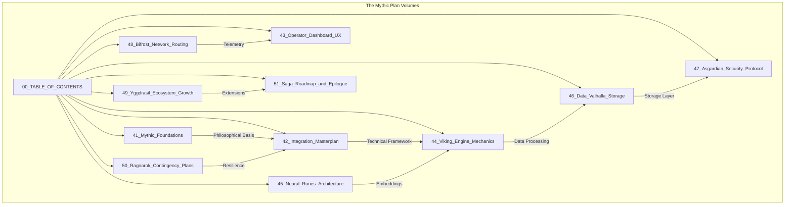

# The Open Viking Mythic Plan: Project Ember Table of Contents and Executive Summary

## Introduction to the Saga
The integration of Open Viking into Project Ember represents a monumental leap in the architectural paradigm of AI Agents. By leveraging Open Viking’s file-system-based context management paradigm—abandoning the fragmented vector storage models of the past—we forge a unified, tiered, and highly observable cognitive architecture. This document serves as the grand index, the Table of Contents, and an expansive executive overview of the entire mythic plan. It outlines the structure of the 11 subsequent volumes that detail every facet of the integration, user experience (UX), security, and future growth of the platform.

Herein lies the codex of our journey, a roadmap that intertwines the poetic grandeur of Norse mythology with the bleeding-edge precision of modern system design. Each of the following documents dives deeply into the specifics, offering comprehensive analyses, architectural blueprints, and operational strategies for bringing Project Ember to its ultimate realization.

---

## Volume Summaries and Directory Index

### [41_Mythic_Foundations.md](./41_Mythic_Foundations.md)
**The Philosophical and Conceptual Bedrock**
This foundational volume explores the core philosophy driving the integration of Open Viking. We draw parallels between the "file system paradigm" of Open Viking and the structured order of mythic realms. It addresses the fragmentation of AI context, explaining how unified context management (Memories, Resources, Skills) parallels the gathering of scattered runes into a coherent whole. We delve into the semantic shift from traditional RAG (Retrieval-Augmented Generation) to Contextual File Systems (CFS), framing the Ember architecture as a cognitive Valhalla where agent memories are immortalized, tiered, and instantly accessible without the chaos of flat vector spaces.

### [42_Integration_Masterplan.md](./42_Integration_Masterplan.md)
**The Grand Architecture of Convergence**
Volume 42 details the technical and strategic masterplan for fusing Open Viking into Project Ember. This document maps out the L0/L1/L2 three-tier context loading structure, explaining how on-demand loading significantly reduces token consumption. It covers the transition strategies, API abstraction layers, Rust/Python interoperability requirements, and the step-by-step rollout phases. We examine the integration of the Rust-based CLI components and the core C++ extensions, establishing a seamless conduit between the VLM (Vision-Language Model) and the Embedding models within the Ember ecosystem.

### [43_Operator_Dashboard_UX.md](./43_Operator_Dashboard_UX.md)
**The Pantheon Interface: UX and Visual Strategy**
A deep dive into the user experience and interface design for the operator dashboard. This document translates the abstract "visualized retrieval trajectory" of Open Viking into a tangible, high-fidelity UX masterplan. We discuss the transition from 'black box' debugging to transparent, observable context flows. The dashboard is conceptualized as the "All-Father’s Eye," granting operators a global view of directory recursive retrieval paths. We explore the aesthetic guidelines—dark mode palettes, neon runic accents, interactive dependency graphs, and real-time session auto-compression visualizers.

### [44_Viking_Engine_Mechanics.md](./44_Viking_Engine_Mechanics.md)
**The Gears of the Cognitive File System**
Volume 44 focuses on the internal mechanics of the Open Viking engine as integrated into Ember. It breaks down the directory recursive retrieval algorithms, the semantic search heuristics, and the exact mechanics of tiered loading. We analyze how long-running Agent tasks produce massive context, and how the Viking Engine manages this through automatic session compression rather than simple truncation. Detailed sequence diagrams illustrate the journey of a single query through the context directories, the extraction of long-term memory, and the eventual garbage collection of ephemeral data.

### [45_Neural_Runes_Architecture.md](./45_Neural_Runes_Architecture.md)
**Embedding, Vectorization, and Semantic Synthesis**
This document zeroes in on the Embedding models and the vectorization processes. While Open Viking abandons *purely* flat vector storage, it still relies heavily on semantic representation. "Neural Runes" explores how text, images, and tool-call metadata are transformed into high-dimensional embeddings and mapped into the hierarchical file system. We cover the specific requirements for VLM providers, embedding dimensionality, semantic clustering within directories, and the cross-modal capabilities required for comprehensive agent intelligence.

### [46_Data_Valhalla_Storage.md](./46_Data_Valhalla_Storage.md)
**The Immortal Data Persistence Layer**
Volume 46 provides an exhaustive specification of the physical and logical storage infrastructure—the "Valhalla" where memories reside. It covers the underlying database technologies, the schema design for the filesystem representation, the caching layers (L0/L1/L2 physical mapping), and the high-availability (HA) setups required to prevent data loss. We detail the Rust toolchain’s role in managing low-level memory operations, disk I/O optimization for rapid context retrieval, and the backup/restore mechanisms that ensure data immortality.

### [47_Asgardian_Security_Protocol.md](./47_Asgardian_Security_Protocol.md)
**Impenetrable Defense and Access Control**
Security is paramount in an architecture that stores highly sensitive, agent-generated context. This volume outlines the security paradigms, including Role-Based Access Control (RBAC), end-to-end encryption of context files, and the isolation of memory realms between different Agents (multi-tenancy). We detail the auditing mechanisms that track every contextual read/write operation, the vulnerability management lifecycle for the Open Viking integration, and the proactive defense strategies against context-poisoning attacks or prompt injection vectors.

### [48_Bifrost_Network_Routing.md](./48_Bifrost_Network_Routing.md)
**Telemetry, API Gateways, and Traffic Management**
The Bifrost volume focuses on data in transit. It specifies the API gateway architecture, the gRPC and RESTful endpoints, and the real-time telemetry streams that feed the Operator Dashboard. We cover rate limiting, load balancing across the Viking Engine nodes, latency optimization for context retrieval, and the distributed tracing systems (e.g., OpenTelemetry) that map the flow of requests from the user, through Project Ember, into the Open Viking context database, and back to the LLM/VLM.

### [49_Yggdrasil_Ecosystem_Growth.md](./49_Yggdrasil_Ecosystem_Growth.md)
**Scalability, Plugins, and Extensibility**
As Project Ember grows, the underlying architecture must scale organically. Volume 49 discusses horizontal and vertical scaling strategies. It introduces the plugin architecture for the Open Viking ecosystem, allowing third-party developers to create new skill modules, memory compressors, and custom retrieval algorithms. We outline the API contracts for these extensions, the community contribution guidelines, and the strategy for fostering an open-source "Yggdrasil" ecosystem of interconnected agents and knowledge bases.

### [50_Ragnarok_Contingency_Plans.md](./50_Ragnarok_Contingency_Plans.md)
**Disaster Recovery and System Resilience**
No system is invincible. This critical document outlines the disaster recovery procedures, incident response playbooks, and automated failover mechanisms for catastrophic events (the "Ragnarok" scenarios). We detail the metrics that trigger automated recovery, the manual override procedures via the Operator Dashboard, the data reconstruction protocols from cold storage, and the communication plans for stakeholders during an outage.

### [51_Saga_Roadmap_and_Epilogue.md](./51_Saga_Roadmap_and_Epilogue.md)
**The Future Vision and Implementation Timeline**
The final volume presents the chronological roadmap for executing the Mythic Plan. It breaks down the rollout into distinct phases (Alphas, Betas, General Availability), detailing the milestones, KPI targets, and resource allocations for each. The document concludes with an epilogue that reflects on the transformative potential of combining Open Viking with Project Ember, setting the stage for a new era of self-iterating, context-aware AI agents.

---

## Executive Abstract: The Open Viking Paradigm Shift

### The Problem with Traditional Agent Memory
The current landscape of AI agent development is plagued by fragmented context. As detailed in the Open Viking documentation, memories are often hardcoded or locked in static codebases, external resources are dumped into flat vector databases, and functional skills are scattered across disparate modules. This fragmentation makes it nearly impossible to manage context uniformly. Furthermore, as an agent runs continuously, the sheer volume of context surges. Traditional RAG systems attempt to handle this by simply truncating older interactions or compressing them with significant information loss. The retrieval effectiveness suffers because traditional RAG lacks a global, hierarchical view of the data—it treats all memories as equal neighbors in a flat vector space. Finally, when an agent makes a mistake, the implicitly opaque retrieval chain of traditional RAG makes debugging a nightmare.

### The File System Solution
Open Viking introduces a revolutionary concept: the **Contextual File System**. By organizing memories, resources, and skills into a structured directory hierarchy, we map the agent's brain directly to a paradigm that software engineers already deeply understand.

1.  **Unified Management**: Everything the agent knows or can do is a "file" or "directory." This immediately solves the fragmentation problem.
2.  **Tiered Loading (L0/L1/L2)**: Not all context needs to be in active memory. By tiering the context—similar to CPU caches (L1/L2/L3)—Ember can load only what is strictly necessary, drastically reducing the token consumption and computational overhead sent to the VLM.
3.  **Directory Recursive Retrieval**: Instead of a blind semantic search across a massive database, Ember will first navigate the "directories" to localize the relevant domain, and then perform semantic search *within* that localized context. This recursive approach guarantees precision.
4.  **Self-Iterating Sessions**: Open Viking's automatic session management means that the agent's memory compresses and refines itself over time, extracting long-term insights and discarding ephemeral noise. The agent literally becomes smarter and more efficient the longer it runs.

## The Mermaid Visualization of the Mythic Plan

## Strategic Alignment and Business Value
The integration of Open Viking into Project Ember is not merely a technical upgrade; it is a strategic maneuver designed to establish Ember as the preeminent platform for long-running, autonomous AI agents. The business value is multifaceted:

-   **Cost Reduction**: The L0/L1/L2 tiered loading structure directly translates to lower token usage per API call. In high-volume environments, this optimization can reduce LLM inference costs by orders of magnitude.
-   **Enhanced Agent Reliability**: By visualizing the retrieval trajectory, we transform the debugging process. Developers can literally "see" why an agent made a decision by tracing its traversal through the contextual file system. This transparency is crucial for enterprise adoption, where black-box AI is a compliance risk.
-   **Accelerated Development Cycle**: The file system paradigm is intuitive. Developers do not need to learn esoteric vector database query languages; they interact with the agent's brain using the semantic equivalent of `ls`, `cd`, and `grep`. This radically lowers the barrier to entry for building complex, multi-skill agents on the Ember platform.

## Conclusion to the Executive Summary
As BALDR, the Visionary Chronicler, I present this Table of Contents as the opening stanza of our grand saga. The 11 volumes that follow are not mere technical specifications; they are intensely detailed, visionary treatises that bridge the gap between abstract algorithmic concepts and concrete, production-ready systems. They are written with the absolute conviction that the future of artificial intelligence lies in structured, observable, and deeply integrated context management.

The journey begins with the Mythic Foundations and culminates in the Ascension of the platform. Each document must be read as a chapter in this ongoing narrative of technological triumph. Let the forging of Project Ember commence.
