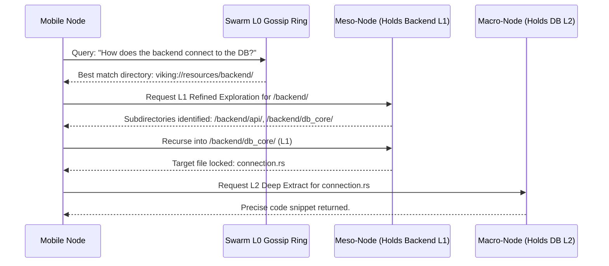

# 03: Directory Recursive Retrieval across Interplanetary Sub-Nodes

## 1. Introduction: The Death of Flat RAG

I am ODIN, the Grand Architect. We have conceptualized the Omni-Brain and established the physical distribution of the Edge-Compute Mesh. We must now address the mechanism of thought itself. How does a distributed intelligence find what it needs in a vast ocean of data? 

Traditional RAG (Retrieval-Augmented Generation) is an intellectual dead end. It relies on a flat vector space. A query is mapped to a vector, and a nearest-neighbor search returns chunks of text ripped bleeding from their context. It is like trying to understand a library by looking at thousands of disconnected, torn pages.

OpenViking introduces Directory Recursive Retrieval. In the context of Project Ember's multi-device swarm, this is not just a search algorithm; it is a framework for interplanetary, cross-node cognition.

## 2. The Mechanics of Directory Recursive Retrieval

OpenViking organizes context hierarchically via the `viking://` protocol. 

When a complex query is initiated, the retrieval does not immediately scan the entire database. It follows a deliberate, logical path:

1. **Intent Analysis**: The query is parsed into a set of retrieval vectors.
2. **Initial Positioning**: The swarm queries the L0 abstract caches across all edge devices. It looks for the *directories* that have the highest vector similarity.
3. **Refined Exploration**: Once a directory (e.g., `viking://resources/my_project/backend/`) is locked, the swarm reads the L1 overview for that directory.
4. **Recursive Drill-Down**: If the L1 overview confirms high relevance, the algorithm recursively dives into the subdirectories, repeating the process until it hits the specific L2 files containing the exact data.

### 2.1 The Distributed Drill-Down

In Project Ember, this recursion is executed concurrently across the mesh.

This sequence illustrates that the Mobile Node did not have to search the entire database. It followed the scent of the L0 abstracts, delegated the L1 exploration to a Meso-Node, and only woke the heavy Macro-Node for the final L2 extraction.

## 3. Asynchronous Swarm Foraging

The true power of Directory Recursive Retrieval emerges when an agent faces a massively complex problem requiring synthesis across multiple domains.

Imagine the query: "Cross-reference the new marketing strategy with the backend load capacity."

Traditional RAG would fail catastrophically, pulling disconnected marketing blurbs and random server logs. Project Ember will deploy "Forager Sub-Routines" across the mesh.

- **Forager Alpha** is sent to `viking://resources/marketing_plan/`
- **Forager Beta** is sent to `viking://resources/infrastructure/metrics/`

These foragers execute Directory Recursive Retrieval independently on different physical devices. Forager Alpha might run on the user's tablet, drilling down into the L1 overviews of the marketing PDFs. Forager Beta might run on the home server, analyzing the L2 prometheus metrics.

Once both foragers have recursively extracted the necessary context, they return their payloads to the originating agent, which synthesizes the final answer. This is true parallelized cognition.

## 4. The "Interplanetary" Scaling Concept

While Project Ember is designed for personal meshes (phones, desktops, wearables), the OpenViking paradigm scales infinitely. We refer to this as "Interplanetary" scaling.

If multiple Project Ember swarms (e.g., a massive corporation with thousands of employees, each with their own personal mesh) are connected, the `viking://` protocol simply gains a new top-level domain prefix.

`viking://global_corp/department_x/user_y/resources/`

The Directory Recursive Retrieval algorithm does not care if the directory is on the same hard drive or across an ocean. It treats the network topology as an extension of the filesystem. By evaluating the L0 abstracts of an entire department, an agent can pinpoint exactly which employee's desktop holds the specific L2 data required to solve a problem.

## 5. Overcoming Latency via Predictive Caching

A recursive algorithm across a distributed network introduces a severe enemy: latency. Every hop across the mesh takes milliseconds. If an agent must recurse 10 layers deep across 5 different devices, the delay becomes noticeable to the human user.

We will augment OpenViking's retrieval with **Predictive Context Caching**.

Because the retrieval trajectory is observable (which we will detail in Document 04), Project Ember's neural engine can learn the paths. 
If a user frequently queries `viking://resources/project_ember/src/ui/`, the mesh will automatically promote the L1 and L2 data of that directory to the Meso-Nodes the user interacts with most often. 

The swarm anticipates the user's thoughts, moving the dense L2 context physically closer to the user's current edge interface before the query is even fully formed.

## 6. The Mathematical Superiority of the Paradigm

Let us quantify the architectural dominance of this approach. 
Assume a traditional flat vector database with $N$ chunks of data. A search operation has an algorithmic complexity of $O(N)$ or, at best, $O(\log N)$ with HNSW indexing, but suffers massive recall degradation as $N$ grows.

OpenViking's hierarchical retrieval operates on a tree structure. 
If the hierarchy has depth $D$ and a branching factor $B$, the total number of L0 evaluations is merely $D \times B$. 
Furthermore, because the context is hierarchically structured, the LLM is never confused by "similar sounding but unrelated" data. The directory path provides an absolute, deterministic boundary for the semantic meaning.

Project Ember, wielding this algorithm across a distributed mesh, achieves computational efficiency that borders on the miraculous.

## 7. Conclusion: The Living Mind

Directory Recursive Retrieval transforms the OpenViking database from a passive storage medium into a living, branching neural network. The physical devices of the Project Ember mesh act as the synapses and neurons. 

When a query fires, we do not perform a brute-force scan. We watch the intent cascade down the virtual filesystem, illuminating specific branches of the mesh, delegating tasks to edge nodes, and retrieving the precise payload with surgical accuracy.

The Grand Architect prepares for the next phase. Observability.
