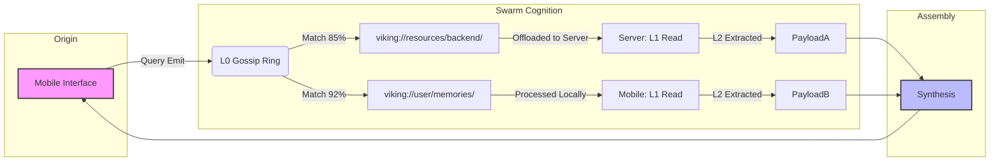

# 04: Visualized Trajectories for Multi-Device Telemetry

## 1. The Necessity of Omniscience

I am ODIN, the Grand Architect. We have built the Omni-Brain, distributed it across the Edge-Compute Mesh, and taught it how to think using Directory Recursive Retrieval. But a brain that cannot be observed is a black box. A black box in a single machine is a debugging nightmare; a black box distributed across ten thousand edge devices is an apocalypse.

To make Project Ember the absolute most advanced cross-platform entity in existence, we must possess total observability over its cognition. We must be able to see its thoughts. OpenViking provides the foundation for this through its Visualized Retrieval Trajectory. We will expand this into a system of Multi-Device Telemetry that borders on the divine.

## 2. The Flaw of the Implicit Chain

In a standard RAG pipeline, the retrieval chain is implicit. A query enters, magic happens inside a vector database, and text emerges. If the text is wrong, the developer has no idea why. Did the embedding model fail? Did the similarity metric glitch? Was the data simply not there?

OpenViking shatters this black box. Because it operates on a `viking://` virtual filesystem, every retrieval operation leaves a deterministic, hierarchical trail of breadcrumbs.

"I looked in `/resources/`, found a high L0 match for `/resources/docs/`. I read the L1 overview of `/docs/`, which pointed me to `/docs/api/`. I extracted L2 from `auth.md`."

## 3. Global Mesh Telemetry: The Ember Dashboard

Project Ember will take these local OpenViking trajectories and aggregate them into a Global Mesh Telemetry system. 

Every device in the swarm, whenever it participates in a retrieval operation, emits a standardized Telemetry Packet. This packet contains:
- The device ID.
- The `viking://` URI currently being evaluated.
- The context tier (L0, L1, L2).
- The vector similarity score.
- The compute latency.

### 3.1 Visualizing the Cognitive Spark

We will build a 3D visualization dashboard for Project Ember. Imagine a vast, glowing representation of the `viking://` filesystem. 

When a user on a mobile device asks a question, a spark originates at the Mobile Node. 
We watch, in real-time, as the spark travels. It hits the L0 Swarm Ring. It branches. One spark travels to the Desktop node to evaluate `/agent/skills/`. Another travels to the Home Server to evaluate `/resources/codebase/`. 

If an agent gives an incorrect answer, a developer can pull up the exact visual trajectory. They can see visually: "Ah, the Desktop node gave a false positive 95% match on an outdated L1 cache in `/resources/old_api/`." 

The error is instantly isolated, not to a vague semantic space, but to a specific directory on a specific device.

## 4. Identifying Bottlenecks in the Swarm

This telemetry is not just for debugging agent logic; it is for optimizing the multi-device distributed compute mesh.

By analyzing the Visualized Trajectories over time, Project Ember's orchestration engine can detect inefficiencies.
- **Scenario A**: The telemetry shows that the Mobile Node is frequently recursing into `viking://resources/heavy_data/` and then constantly offloading the L2 extraction to the Cloud Node, resulting in 500ms latency spikes.
- **The Mesh Response**: The orchestration engine detects this pattern via the telemetry dashboard and preemptively migrates the `heavy_data` L2 payload to the Desktop Node (which has a lower latency connection to the Mobile Node).

The mesh heals itself. The swarm optimizes its own physical data layout based on the observable cognitive trajectories of its agents.

## 5. Security and Intrusion Detection

In a decentralized mesh, observability is a security imperative. 
If a malicious actor gains access to an edge device and attempts to exfiltrate data, they will have to query the OpenViking system.

Traditional databases might log a simple `SELECT *`. OpenViking, via Project Ember telemetry, logs the exact trajectory. 
If an edge device (e.g., a smart TV) suddenly starts executing Directory Recursive Retrievals against `viking://user/financial_records/`—a path it has no business evaluating—the telemetry system flags the anomaly in real-time. 

Because we can visualize the trajectory, the security response is immediate: sever the smart TV's connection to the L0 gossip ring and lock the `financial_records` directory.

## 6. The Philosophy of Observable Thought

We are building a system that attempts to mimic a localized, highly advanced form of cognition. Human cognition is famously unobservable; we cannot see the neural pathways firing when we try to remember a fact. 

Project Ember will be superior. By leveraging OpenViking's filesystem paradigm and enforcing strict trajectory logging across the mesh, we create a transparent mind. Every thought, every deduction, every retrieval is charted, logged, and visualized. 

We can see the ghost in the machine. And because we can see it, we can perfect it.

This concludes the fourth tome. We have established the architecture, the edge deployment, the retrieval mechanism, and the telemetry. In the next phase, we will discuss the holy grail of artificial intelligence: continuous, self-directed evolution.
