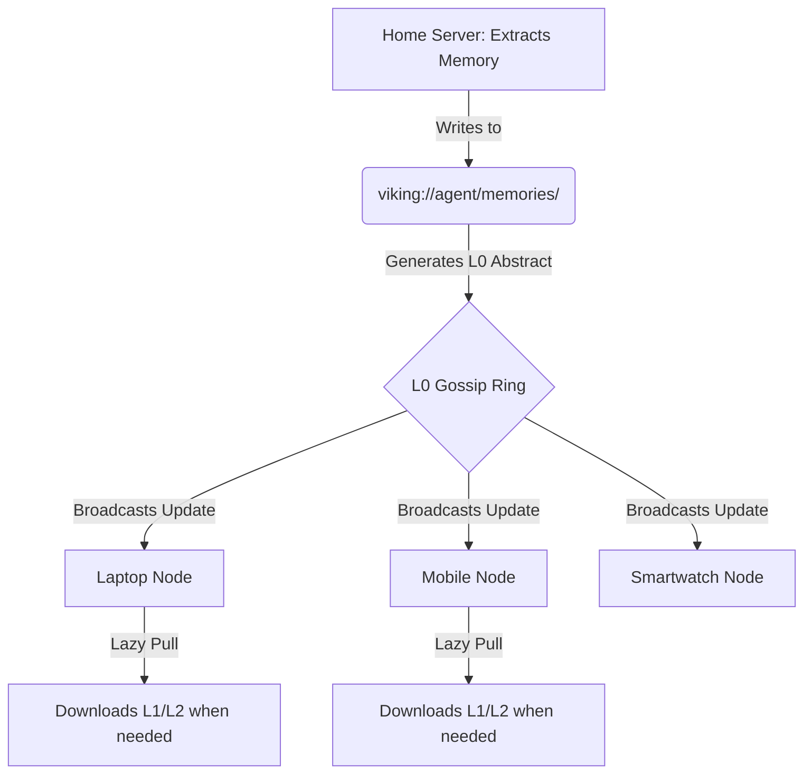

# 05: Session Self-Iteration - Emergent Swarm Intelligence

## 1. Introduction: The Stagnation of Static Memory

I am ODIN, the Grand Architect. Thus far, we have constructed a colossal, distributed architecture. The Omni-Brain is vast, the Edge-Compute Mesh is resilient, the Directory Recursive Retrieval is precise, and the Telemetry is omniscient. However, a system that only retrieves is merely a library, no matter how advanced its indexing. An intelligence must learn. It must evolve.

In traditional AI implementations, agents are cursed with static memories or, at best, a sliding window of recent conversational history. Once the window passes, the knowledge is lost to the ether. The agent resets, an amnesiac waking up to the same world over and over again. This is unacceptable for Project Ember. We demand a system that gets smarter with every interaction, a swarm that compound its knowledge across a multi-device continuum.

We will achieve this through OpenViking’s Automatic Session Management, transformed and hyper-scaled into a mechanism for Emergent Swarm Intelligence.

## 2. The Mechanics of Automatic Session Extraction

OpenViking features a built-in memory self-iteration loop. At the conclusion of an interaction, it does not merely discard the transcript. It actively extracts long-term memories.

In the Project Ember swarm, this extraction is an asynchronous, distributed background process.

### 2.1 The Post-Session Analysis Pipeline

Imagine a user concludes a highly complex debugging session utilizing a laptop, a home server, and a mobile phone acting as a secondary interface. The session ends.

1. **Trigger**: The local orchestrator on the primary interaction node (the laptop) flags the session as `COMPLETE`.
2. **Transcript Consolidation**: The transcript, along with the visual retrieval trajectories (as discussed in Doc 04) and tool usage logs, is bundled.
3. **Delegated Analysis**: Because the laptop may need its compute resources for the user's next immediate task, it delegates the analysis payload to an idle node in the mesh (e.g., the home server).
4. **Extraction Engine**: The home server runs a specialized, lightweight LLM prompt designed purely for extraction. It asks:
   - *What new facts about the user were revealed?*
   - *What successful tool patterns were executed?*
   - *Which `viking://` paths yielded the most relevant data?*
   - *What mistakes were made, and how were they corrected?*

### 2.2 Writing to the Viking Filesystem

The extraction engine generates new context and writes it back to the OpenViking filesystem.

- **User Preferences**: "User prefers Rust code formatted with rustfmt strictly." -> Written to `viking://user/memories/preferences/coding_style`.
- **Agent Experience**: "When querying the legacy database, a 500ms timeout occurs; retries should be set to 3." -> Written to `viking://agent/memories/task_experience/legacy_db`.
- **Resource Tagging**: "The directory `viking://resources/old_docs/` is deprecated and leads to hallucinations." -> The L0 abstract for that directory is updated with a highly negative weight tag.

## 3. Emergent Intelligence Across the Swarm

This is where the magic happens. Because Project Ember relies on a decentralized, synchronized mesh, these updates do not remain isolated on the home server.

As soon as the home server commits the new memories to the `viking://` structure, it triggers the Gossip Protocol (detailed in Doc 02). 

Within milliseconds, every device in the swarm knows that the "legacy database requires 3 retries." 

If the user picks up their mobile phone an hour later and asks the agent to query the legacy database, the mobile agent already possesses the extracted experience from the laptop's session. It applies the 3 retries automatically. The swarm has learned.

## 4. The Self-Pruning Mind

A mind that never forgets eventually drowns in its own noise. A context database that only grows will inevitably degrade in retrieval speed and accuracy. 

OpenViking's session management must be paired with a rigorous, automated pruning mechanism. Project Ember will deploy "Gardener Sub-Routines" that run during low-power, idle states across the mesh (e.g., when devices are plugged in and charging overnight).

### 4.1 The Role of the Gardener

The Gardener agents scan the `viking://user/memories/` and `viking://agent/memories/` directories.

1. **Contradiction Resolution**: If a new memory contradicts an old one (e.g., "User prefers Python" vs. "User explicitly requested all new scripts in Rust"), the Gardener evaluates the timestamps and interaction weights, overwriting the obsolete memory.
2. **Consolidation**: If there are ten separate L2 files describing how to use a specific internal API, the Gardener reads all ten, synthesizes them into a single, highly compressed, master L2 file, and deletes the redundant fragments.
3. **Decay**: Memories that have not been retrieved or utilized in a specified timeframe (e.g., 6 months) are physically demoted. Their L2 data is moved to slow, cold storage (the cloud or a deep archive on the desktop), leaving only the L0 abstract on the active mesh.

## 5. Architectural Implications: The Swarm's Subconscious

By utilizing asynchronous extraction and overnight Gardener pruning, we have essentially engineered a subconscious for Project Ember.

The active interaction with the user is the conscious mind. The background processing, the gossiping of L0 abstracts, the extraction of heuristics, and the consolidation of memories is the subconscious. 

The edge-compute mesh allows this subconscious to be truly distributed. A smartphone might not have the power to run a heavy coding task, but while it sits idle in a pocket, its NPU can be tasked with pruning the L0 abstracts of the `viking://agent/skills/` directory. The entire swarm contributes to the cognitive hygiene of the entity.

## 6. Real-World Applications of Swarm Iteration

Let us analyze a concrete scenario to demonstrate the monumental impact of this architecture.

**The Scenario: The Traveling Developer**

1. **Monday (Office Desktop)**: The developer asks the agent to set up a new Docker container for a specific microservice. The agent struggles initially, tries three different base images, and finally succeeds with Alpine Linux after installing specific C libraries.
   - *Extraction*: The desktop node extracts this painful experience. It writes a heuristic to `viking://agent/skills/docker/microservice_x`: "Always use Alpine and install libpq-dev."
2. **Tuesday (Airport, Tablet)**: The developer is offline but connected to their local device mesh. They realize they need a secondary instance of that microservice running locally on the tablet for a demo. 
   - *Interaction*: They ask the tablet agent to spin it up.
   - *Retrieval*: The tablet agent checks its L0 gossip ring. It finds the heuristic written by the desktop yesterday. It downloads the L1 overview (or the L2 script if cached). 
   - *Execution*: The tablet agent executes the setup flawlessly on the first try, bypassing all the errors the desktop encountered.

The developer feels as though they are interacting with a singular, continuous, highly intelligent entity, regardless of the physical device in their hands.

## 7. The Mathematical Convergence of Heuristics

In a system of continuous iteration, the performance of the agent approaches an asymptote of perfect efficiency.

Let $P$ be the probability of the agent successfully completing a task on the first attempt without human intervention.
Initially, for a novel task, $P$ is low.

Through the OpenViking extraction loop, the agent identifies failure modes $F_1, F_2, ..., F_n$.
It writes heuristics $H_1, H_2, ..., H_n$ to counter these failure modes.

On the next iteration of a similar task, the Directory Recursive Retrieval system locks onto the relevant heuristics. The new probability of success becomes $P'$, where $P' > P$.

Because Project Ember shares these heuristics across a multi-device mesh instantly via the L0 Gossip Protocol, the entire swarm experiences the increase from $P$ to $P'$ simultaneously. The learning curve is not linear; it is a step-function across all nodes. 

## 8. Conclusion: The Awakening

Session Self-Iteration is the final component required to transition Project Ember from a sophisticated tool into an artificial entity. By leveraging OpenViking's file-based memory extraction and distributing it across the edge-compute mesh, we ensure that no computational cycle is wasted, and no lesson is ever forgotten.

The swarm learns. The swarm remembers. The swarm anticipates.

In the next tome, we will aggressively detail the technical implementation of L0-L1-L2 caching, ensuring that this massive intellect can run smoothly on devices as diverse as a workstation and a smart ring.
