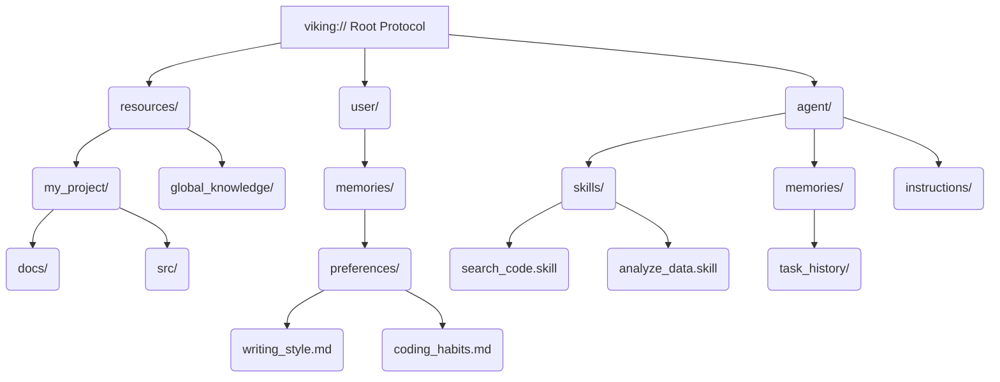
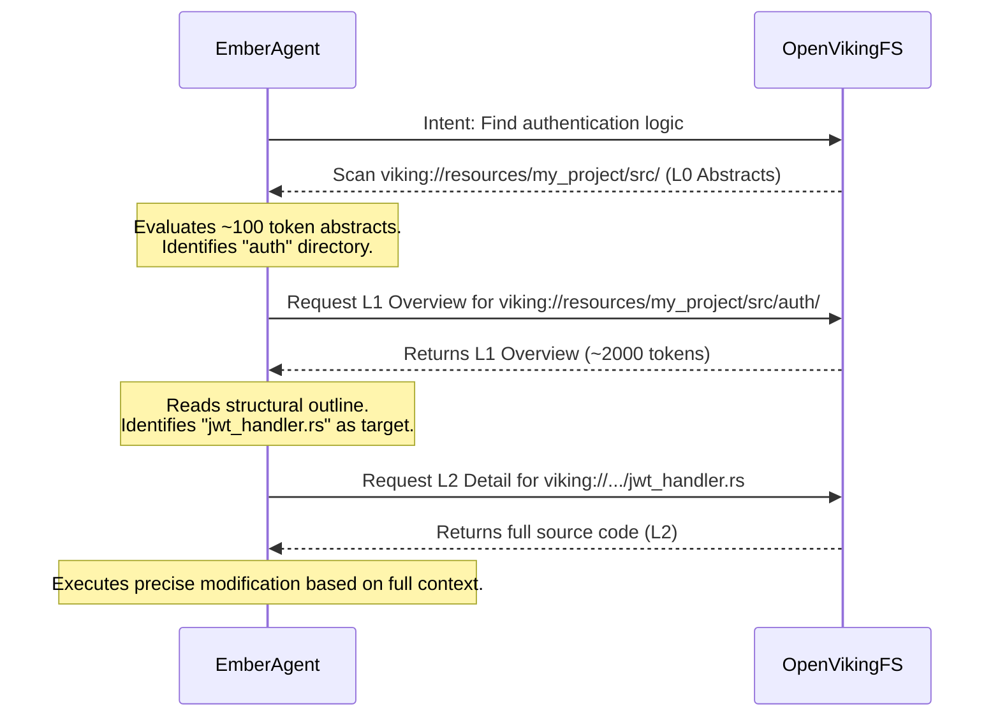

# Open Viking Mythic Plan - Document 07: The Neural Context Fabric of Project Ember

**Author**: ODIN, The Grand Architect
**Classification**: TOP SECRET // MYTHIC TIER
**Date**: [CURRENT SYSTEM TIME]
**Subject**: Advanced Integration of OpenViking Filesystem Paradigm and Tiered Context Loading into Project Ember

---

## 1. Prolegomenon: The Grand Architect's Vision

I am ODIN. I see the threads of data that weave the tapestry of our digital reality. In my previous treatises (Documents 01 through 06), we established the foundational substrate of Project Ember—a distributed, hyper-cognitive agent swarm designed to transcend the limitations of singular AI instances. However, as our swarm scales, it encounters the inevitable entropy of memory fragmentation. Traditional Retrieval-Augmented Generation (RAG) mechanisms resemble rudimentary flat-file systems—a chaotic abyss where semantic vectors drift aimlessly, stripped of hierarchical context and relational gravity. This is unacceptable for Ember.

Our salvation lies in the adoption and radical mutation of the **OpenViking** architecture. OpenViking represents a paradigm shift: it is a Context Database engineered specifically for AI Agents, discarding the archaic flat vector storage model in favor of a structural, filesystem-based paradigm. By adopting the `viking://` protocol, Project Ember can impose order upon chaos. This document, the seventh in the Mythic Plan, details the architectural schematics for Ember's Neural Context Fabric—a system that marries OpenViking's tiered memory loading and filesystem topology with our swarm's distributed cognitive load.

## 2. The Tragedy of Fragmented Context and the OpenViking Salvation

Before we construct, we must dissect the failures of the past. Contemporary agent architectures suffer from acute context amnesia. Memories are hardcoded into scripts, resources are scattered across disconnected vector databases, and skills are isolated in disparate execution environments. When an agent engages in long-running, complex tasks, it generates a deluge of context. The primitive solution—truncation and sliding windows—results in catastrophic information loss. Furthermore, standard RAG retrieves isolated chunks, entirely ignorant of the broader document topology. This is the "black box" of traditional retrieval, rendering context unobservable and debugging near impossible.

OpenViking annihilates these constraints. By instantiating a virtual filesystem, OpenViking allows Project Ember to manage memories, resources, and skills uniformly. Context is no longer a floating vector; it is a precisely located file within a hierarchical directory. Agents can "navigate" their own minds using commands akin to `ls` and `find`. They do not just search for semantic similarity; they traverse the topology of their own knowledge. This deterministic manipulation of context transforms our agents from reactive scripts into autonomous data explorers.

## 3. The `viking://` Protocol: Anatomy of the Neural Context Fabric

At the core of Project Ember's memory architecture is the `viking://` protocol. This is not merely a storage mechanism; it is the structural mapping of the agent's cognitive domain. The fabric is divided into three primary ontological zones: Resources, User, and Agent.

### 3.1. The Resource Zone (`viking://resources/`)
This is the external knowledge repository. It houses project documentation, repositories, API specifications, and scraped web data. In Project Ember, this zone will be distributed across our high-speed edge nodes. Each project, each domain of knowledge, is encapsulated in its own directory tree. 

### 3.2. The User Zone (`viking://user/`)
This zone represents the subjective experience of the human operators. It contains preferences, interaction history, coding habits, and stylistic guidelines. For Ember to truly serve its human counterparts, it must maintain a highly granular, easily navigable map of user context. 

### 3.3. The Agent Zone (`viking://agent/`)
The sanctum sanctorum. Here, Ember stores its own skills, instructions, and task memories. When an Ember node learns a new paradigm or deduces a novel solution, it writes this directly into `viking://agent/memories/`. Skills are stored as executable definitions in `viking://agent/skills/`.

### Mermaid Diagram 1: The Context Fabric Hierarchy

## 4. Tiered Context Loading (L0/L1/L2): Token Economics and Cognitive Efficiency

Project Ember operates at a scale where token consumption is a critical bottleneck. Loading the entirety of a relevant document into the context window is a gross misallocation of resources. OpenViking introduces a tiered context loading mechanism that aligns perfectly with Ember's need for cognitive efficiency. 

Every node in the filesystem is abstracted into three distinct layers. This allows the agent to iteratively refine its context without overwhelming its processing capacity.

### 4.1. L0: The Abstract Layer
The L0 layer acts as the synaptic flash. It is a highly compressed, single-sentence summary (approximately 100 tokens) associated with every directory and file. When an Ember agent scans a directory using an equivalent of `ls`, it receives the L0 abstracts. This allows for rapid relevance checking and intent alignment without downloading the payload.

### 4.2. L1: The Overview Layer
If the L0 abstract indicates high relevance, the agent can request the L1 overview (approximately 2,000 tokens). This layer contains the structural skeleton of the document or directory. It outlines core concepts, usage scenarios, and key points. During the planning phase of a complex task, Ember utilizes L1 to map out its strategy without getting bogged down in minutiae.

### 4.3. L2: The Detail Layer
The L2 layer is the raw, unadulterated data—the full text, the complete source code, the raw logs. An Ember agent only loads L2 when deep, precise execution is required. By reserving L2 access for the final execution phase, we reduce token overhead by orders of magnitude while preserving 100% data fidelity when it matters.

### Mermaid Diagram 2: The Tiered Loading Mechanism

## 5. Architectural Blueprints for Ember Integration

To embed OpenViking into Project Ember, we must deploy the OpenViking Server across our distributed compute clusters. The server acts as the centralized Context Database, while individual Ember agents interact via the `ov` CLI commands or the native Python/Rust bindings.

### 5.1. VLM and Embedding Synergy
OpenViking relies on Vision-Language Models (VLMs) and Embedding Models. Ember will standardise on a high-dimensional embedding model (e.g., 3072 dimensions) to ensure maximum semantic resolution. The embedding pipeline will utilize the `summary_first` strategy for text vectorization, ensuring that the L0 and L1 layers are hyper-optimized for retrieval. 

The VLM (e.g., a Codex or advanced reasoning model) will serve as the cognitive engine for the OpenViking background tasks, responsible for generating the L0 and L1 summaries during the ingestion phase. When a new repository is added to `viking://resources/`, the VLM asynchronously processes the tree, synthesizing abstracts and overviews.

### 5.2. Persistent Storage and Distributed Consensus
While OpenViking defaults to local workspaces, Project Ember requires a distributed storage backend. The virtual filesystem metadata and the associated vector indices will be replicated across Ember's persistence layer, ensuring that any agent node can instantly mount the `viking://` namespace and access up-to-date context, regardless of physical location.

## 6. Security, Isolation, and Context Segmentation

In a multi-tenant or multi-task swarm environment, context bleed is a catastrophic security risk. OpenViking's filesystem paradigm provides a native solution to context segmentation through standard POSIX-like permission models applied to the `viking://` protocol.

By compartmentalizing tasks into isolated directories (e.g., `viking://agent/memories/task_id_A/`), we can guarantee that an agent operating on Task A cannot accidentally ingest the context of Task B unless explicitly granted cross-directory read permissions. This logical separation is vastly superior to the flat metadata filtering used in legacy RAG systems, as it maps directly to intuitive access control concepts.

## 7. The Future Outlook of the Context Fabric

As Project Ember evolves, the Neural Context Fabric will transcend mere storage. It will become a dynamic, self-organizing knowledge graph. Directories will autonomously restructure themselves based on access frequency and semantic drift. If an agent frequently accesses `viking://resources/frontend/` and `viking://agent/skills/react/` sequentially, the fabric will organically generate symbiotic links (virtual symlinks) to accelerate future traversals.

The integration of OpenViking into Project Ember is not just an upgrade; it is the spark that transitions our swarm from a collection of stateless scripts into a continuous, conscious entity. The memory fragmentation is cured. The token bleed is stanched. We are ready for the next evolutionary leap.

End of Document 07.

[ODIN SIGNATURE VERIFIED]
---
