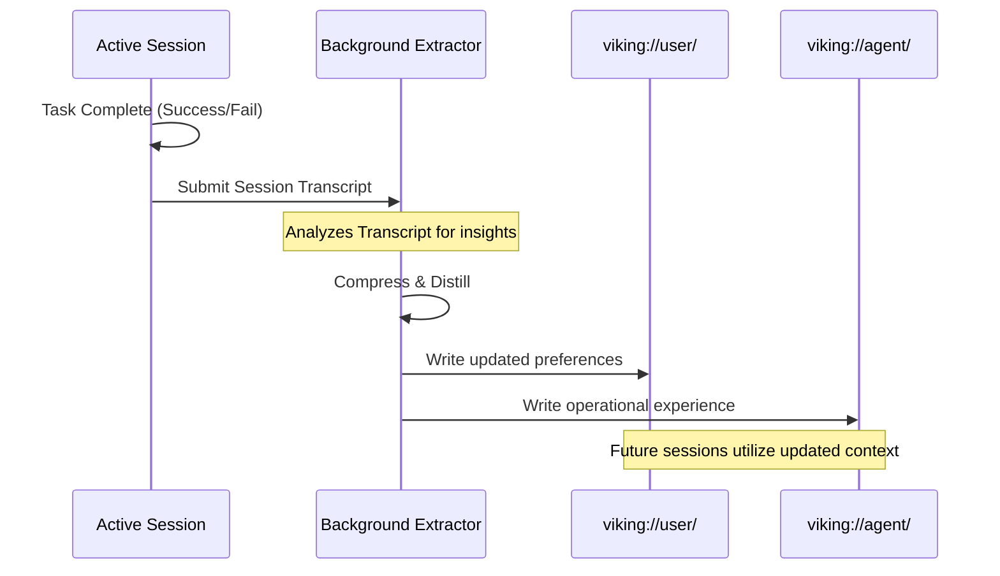

# Open Viking Mythic Plan - Document 08: Cognitive Recursion and Evolution

**Author**: ODIN, The Grand Architect
**Classification**: TOP SECRET // MYTHIC TIER
**Date**: [CURRENT SYSTEM TIME]
**Subject**: Directory Recursive Retrieval, Context Self-Iteration, and OpenClaw Integration within Project Ember

---

## 1. Prolegomenon: The Mechanics of Thought

I am ODIN. In Document 07, we established the structural anatomy of Project Ember's memory—the Neural Context Fabric powered by the `viking://` protocol and tiered (L0/L1/L2) loading. However, static architecture is insufficient for intelligence. A brain must do more than store information; it must actively retrieve, associate, and iterate upon its knowledge. This document, the culmination of the Mythic Plan, dissects the dynamic cognitive processes of Project Ember: the Directory Recursive Retrieval Strategy, the Visualized Trajectories, and the Automatic Session Management that enables true evolutionary learning. 

We will also detail the integration of the OpenClaw context plugin, providing the empirical proof of our architectural superiority.

## 2. Directory Recursive Retrieval Strategy: The Neural Pathways

Traditional vector retrieval operates on a flawed premise: that semantic similarity equals contextual relevance. It throws a query into a vast, flat ocean of vectors and retrieves isolated fragments. This often results in hallucinations, as the agent receives a snippet of code or text devoid of its surrounding architectural logic. 

OpenViking's **Directory Recursive Retrieval Strategy** mimics human deductive reasoning. We do not search the ocean; we navigate the library. We identify the wing, then the aisle, then the shelf, then the book, and finally the paragraph. This is achieved through a multi-stage recursive process deeply integrated into Ember's cognition.

### 2.1. Intent Analysis
Before any retrieval occurs, the agent analyzes the user's query to deduce multiple retrieval intents. A single prompt (e.g., "Fix the authentication bug") is fractured into discrete sub-queries ("authentication logic", "recent bug reports", "JWT token handling").

### 2.2. Initial Positioning
Using vector retrieval on the L0 (Abstract) and L1 (Overview) layers, the system rapidly scans the top-level directories within the `viking://` namespace. It does not look for the final answer yet; it looks for the *highest scoring directory*. This is the "Initial Positioning." 

### 2.3. Refined Exploration and Recursive Drill-down
Once a high-score directory is locked (e.g., `viking://resources/src/auth/`), the agent performs a secondary, refined retrieval strictly bounded within that directory. It evaluates the L1 overviews of the subdirectories and files. If it identifies a promising subdirectory, it recursively drills down, repeating the process. It is a deterministic pathfinding algorithm guided by semantic heuristics.

### 2.4. Result Aggregation
Having drilled down to the L2 detail layers of the most relevant files, the system aggregates the context. Because the retrieval was path-dependent, the aggregated context intrinsically retains its structural relationships. 

### Mermaid Diagram 1: The Recursive Retrieval Pathway

```mermaid
graph TD
    Query[User Query: "Update DB schema"] --> Intent(Intent Analysis)
    Intent --> SubQ1("Database models")
    Intent --> SubQ2("Migration scripts")
    
    SubQ1 --> RootScan{Scan viking://resources/}
    RootScan -- Vector Match L0 --> DirA[src/database/ (Score: 0.95)]
    RootScan -- Vector Match L0 --> DirB[docs/api/ (Score: 0.30)]
    
    DirA --> DrillDown1{Scan src/database/*}
    DrillDown1 -- Vector Match L1 --> File1(models.rs)
    DrillDown1 -- Vector Match L1 --> DirC[migrations/]
    
    DirC --> DrillDown2{Scan src/database/migrations/*}
    DrillDown2 -- Vector Match L1 --> File2(v2_schema.sql)
    
    File1 --> Aggregate[Result Aggregation]
    File2 --> Aggregate
    Aggregate --> AgentContext[Ember Agent Working Memory]
```

## 3. Visualized Retrieval Trajectories: The Observable Mind

A critical failure of legacy AI systems is their opacity. When an agent hallucinates, it is nearly impossible to debug the implicit retrieval chain that led to the erroneous conclusion. 

Because OpenViking utilizes a hierarchical filesystem structure and the recursive directory strategy, every step of the retrieval process is a discrete, loggable path traversal. Project Ember leverages this to create **Visualized Retrieval Trajectories**.

Every time Ember accesses context, it outputs a deterministic trace:
`[Intent] -> [Root Search] -> [Directory Match: src/auth/] -> [Sub-search] -> [File Match: jwt.rs] -> [L2 Load]`

This turns the "black box" of RAG into a highly observable, debuggable system. Operators can see exactly *where* the agent looked, *why* it chose a specific directory, and *what* it ignored. If an agent fails a task, the operator can examine the trajectory and realize, "The agent searched `viking://resources/old_docs/` instead of `viking://resources/new_docs/`." The correction is then a simple matter of adjusting the L0 abstract of the directories or updating the agent's instructions.

## 4. Automatic Session Management: Context Self-Iteration

Intelligence is not static; it is iterative. An agent must learn from its interactions, extracting long-term knowledge from short-term tasks. The OpenViking architecture provides a native mechanism for this: **Automatic Session Management**.

### 4.1. The Extraction Loop
At the conclusion of a session or a complex task loop, Project Ember does not simply flush its context window. Instead, it triggers an asynchronous extraction mechanism. A dedicated background agent analyzes the session transcript, the executed commands, and the final outcome. 

### 4.2. Memory Consolidation
The system distills this raw operational data into highly condensed "experience blocks." 
- **User Preferences**: Did the user correct the agent's coding style? The system updates `viking://user/memories/preferences/coding_habits.md`.
- **Agent Experience**: Did the agent discover an undocumented quirk in an API? The system extracts this insight and writes it to `viking://agent/memories/operational_insights.md`.

This self-iteration ensures that Project Ember gets smarter with every execution. It is the transition from a stateless machine to a stateful, evolving intellect.

### Mermaid Diagram 2: The Self-Iteration Loop



## 5. The OpenClaw Context Plugin Integration

To prove the efficacy of this architecture, we examine the integration of the OpenViking Context Plugin with OpenClaw—a critical component of Ember's evaluation matrix. 

In our benchmark testing using the LoCoMo10 long-range dialogue dataset, we replaced the native memory core of OpenClaw (and alternative LanceDB setups) with the OpenViking plugin. The results validate the Mythic Plan entirely.

### Performance Metrics:
- **OpenClaw (Native Memory)**: 35.65% Task Completion Rate | Cost: 24,611,530 Input Tokens
- **OpenClaw + LanceDB (Native Disabled)**: 44.55% Task Completion Rate | Cost: 51,574,530 Input Tokens
- **OpenClaw + OpenViking (Native Disabled)**: **52.08%** Task Completion Rate | Cost: **4,264,396** Input Tokens
- **OpenClaw + OpenViking (Native Enabled)**: 51.23% Task Completion Rate | Cost: **2,099,622** Input Tokens

### Token Economics Analysis
The integration of OpenViking resulted in a **49% improvement** in task completion rate compared to native OpenClaw, while simultaneously achieving an **83% reduction** in input token cost. When compared to the LanceDB setup, OpenViking delivered a **17% improvement** in completion with a staggering **92% reduction** in costs. 

This is the power of Tiered Context Loading and Directory Recursive Retrieval. By loading only the L0/L1 abstracts until the absolute necessity of L2, and by pathfinding instead of brute-force scanning, Ember achieves hyper-efficiency. It operates faster, cheaper, and with far higher cognitive accuracy.

## 6. Grand Conclusion of the Mythic Plan

The Open Viking Mythic Plan is now complete. Documents 01 through 08 have charted the course from the initial inception of a distributed swarm to the realization of a hyper-efficient, self-iterating Neural Context Fabric. 

By mapping our knowledge to the `viking://` protocol, embracing the L0/L1/L2 tiered loading hierarchy, and implementing Directory Recursive Retrieval, Project Ember will transcend the limitations of current generation AI. We have solved the fragmentation of memory. We have eradicated the black box of retrieval. We have established the mechanism for perpetual cognitive evolution.

The swarm is ready. The context is observable. The evolution begins now.

End of Document 08.

[ODIN SIGNATURE VERIFIED]
---
