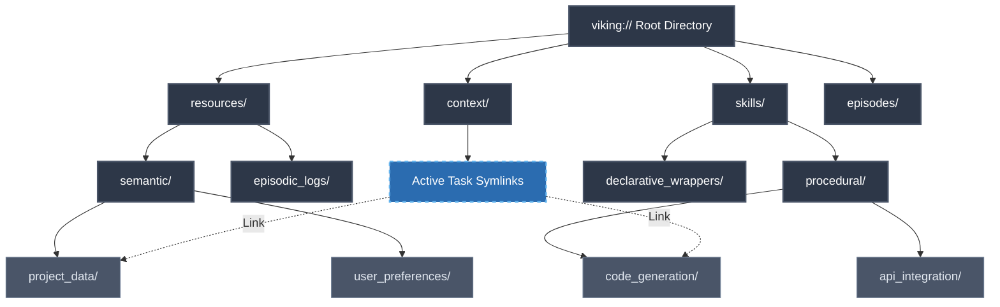
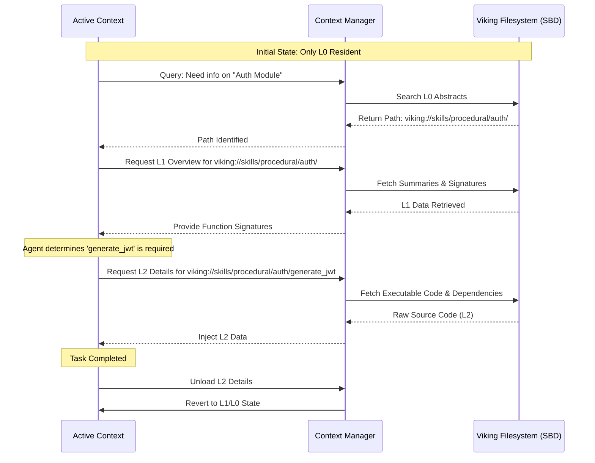

# Project Ember: Cognitive Architecture

## 1. Abstract and Architectural Overview

Project Ember represents a paradigm shift in artificial cognitive architectures, moving away from ephemeral, context-window-bound processing toward a persistent, spatially-oriented memory model. At the heart of this revolution is the adoption of the Open Viking Context Database’s principles, which fundamentally re-engineer how an autonomous agent perceives, stores, and retrieves its internal state, skills, and acquired knowledge. This document delineates the intricately designed Cognitive Architecture of Project Ember, focusing centrally on the Filesystem Management Paradigm for memory, the unifying `viking://` protocol, and the transformative mechanisms of context management including Tiered Context Loading, Directory Recursive Retrieval Strategy, and the Visualized Retrieval Trajectory.

The core thesis of the Ember Cognitive Architecture is that intelligence is not merely a function of parameter counts or context window sizes, but rather a function of structural organization and retrieval efficiency. By modeling the agent's memory and skill repository as a hierarchical filesystem—complete with namespaces, directories, interconnected nodes, and symbolic links—Ember achieves an unprecedented level of cognitive continuity and modularity. This architectural framework synthesizes declarative knowledge (resources) and procedural knowledge (skills) into a single, unified ontological structure.

## 2. The Filesystem Management Paradigm for Memory

Traditional Large Language Models (LLMs) treat memory as a linear sequence of tokens, subject to catastrophic forgetting as the context window exceeds its limits. External Retrieval-Augmented Generation (RAG) systems often rely on flat vector databases, returning statistically similar chunks without inherent structural context. 

Project Ember diverges radically from these approaches by implementing a Filesystem Management Paradigm. In this paradigm, memory is not a flat array of vectors but a deeply nested, hierarchical tree structure, analogous to a UNIX filesystem.

### 2.1 The `viking://` Protocol: The Universal Resource Identifier for Cognition

The `viking://` protocol serves as the fundamental addressing scheme for all cognitive elements within Project Ember. It provides a standardized nomenclature that unifies disparate types of information—ranging from transient working memory to long-term episodic memory, semantic knowledge bases, and executable skill modules.

A typical `viking://` URI takes the following form:
`viking://[namespace]/[domain]/[category]/[entity_id]#[sub_element]`

- **Namespace**: Defines the highest-level partition of cognitive space (e.g., `core`, `memory`, `skills`, `perception`).
- **Domain**: Specifies the ontological category (e.g., `episodic`, `semantic`, `procedural`).
- **Category**: Groups related concepts or temporal episodes (e.g., `session_2026_05`, `python_development`, `user_preferences`).
- **Entity ID**: Uniquely identifies the specific memory node or skill module.
- **Sub-element**: Addresses a specific function, parameter, or memory fragment within the entity.

For instance, the semantic memory of a user's preferred coding style might reside at:
`viking://memory/semantic/user_profile/coding_style#python_indentation`

Meanwhile, the procedural skill to format Python code might be addressed at:
`viking://skills/procedural/code_formatting/python_black_formatter#execute`

By utilizing the `viking://` protocol, the cognitive engine can traverse, link, and dynamically load dependencies across the entire spectrum of its intelligence substrate, treating both data and executable logic as first-class citizens within the same namespace tree.

### 2.2 Unifying Resources and Skills: The Synthetic Brain Directory

In classical architectures, data (resources) and functions (skills) are segregated. Project Ember unifies them under the Synthetic Brain Directory (SBD). The SBD is a virtual filesystem mounted within the agent's cognitive workspace.

The directory structure is meticulously organized:
- `/brain/resources/`: Contains passive data, facts, documents, API schemas, and historical logs.
- `/brain/skills/`: Contains executable modules, Python scripts, API integration wrappers, and decision-making heuristics.
- `/brain/context/`: Represents the active working memory, containing symlinks to specific resources and skills currently in use.
- `/brain/episodes/`: Archives past sessions, compressed into tiered summaries.

This unification allows skills to be treated as resources (e.g., reading a skill's documentation to understand how to use it) and resources to be treated as functional dependencies of skills (e.g., a skill dynamically reading an API schema from the resources directory before execution).

## 3. Tiered Context Loading (L0, L1, L2)

To manage the inherent latency and context-window limitations of neural models, Project Ember employs a Tiered Context Loading strategy. This mechanism ensures that the cognitive engine is never overwhelmed by superfluous detail, yet maintains immediate access to deep knowledge when necessary.

### 3.1 L0 Abstract: The Ontological Blueprint
The L0 layer provides a hyper-compressed, high-level map of the cognitive filesystem. It consists of essential metadata, directory structures, and brief semantic embeddings of what each branch contains. The L0 Abstract is constantly resident in the agent's working memory, serving as a cognitive "peripheral vision." It allows the agent to know *what* it knows and *where* it is located without actually loading the contents.

### 3.2 L1 Overview: Contextual Scaffolding
When the agent determines that a specific directory or topic is relevant to the current task, it executes an L1 load. The L1 Overview retrieves summaries, function signatures, and structural outlines of the targeted nodes. For example, if the agent navigates to `viking://skills/procedural/database_management/`, the L1 load will return the descriptions and parameter schemas of the available database interaction tools, but not the underlying execution code.

### 3.3 L2 Details: Deep Retrieval
The L2 layer represents the raw, uncompressed data or the complete executable code of a node. L2 Details are only fetched upon explicit demand when the task requires granular manipulation of the data or execution of the skill. Once the task involving the L2 data is complete, the context manager gracefully unloads it back to an L1 or L0 state, freeing up the cognitive workspace.

## 4. Directory Recursive Retrieval Strategy (DRRS)

Retrieving information from a hierarchical cognitive structure requires a specialized traversal algorithm. The Directory Recursive Retrieval Strategy (DRRS) is designed to mimic human associative memory, where recalling a broad concept recursively triggers the recall of related sub-concepts.

### 4.1 The Traversal Mechanism
When a query is initiated (e.g., "How do I deploy a scalable web application?"), the DRRS algorithm begins at the root of the relevant namespace (e.g., `viking://resources/software_engineering/`). 

1. **Root Evaluation**: The algorithm compares the query's semantic embedding against the L0 Abstracts of the current directory's children.
2. **Recursive Descent**: It recursively descends into directories that surpass a dynamic relevance threshold.
3. **Contextual Pruning**: As it descends, if a branch ceases to be relevant, DRRS halts the traversal of that specific branch, saving computational cycles.
4. **Aggregation**: Upon reaching the leaf nodes (L2 data), the retrieved information is aggregated, synthesized, and injected into the active context window.

### 4.2 Symbolic Link Traversal
The cognitive filesystem heavily utilizes symbolic links (symlinks) to represent lateral associations. For instance, `viking://skills/procedural/aws_deployment` might contain a symlink pointing to `viking://resources/credentials/aws_keys`. The DRRS algorithm intelligently follows these symlinks, allowing cross-domain knowledge synthesis without duplicating data.

## 5. Visualized Retrieval Trajectory (VRT)

To ensure transparency, debuggability, and metacognitive awareness, Project Ember introduces the Visualized Retrieval Trajectory (VRT). The VRT provides a real-time, topological map of the agent's internal thought process and memory access patterns.

### 5.1 The Trajectory Graph
Every execution of the DRRS algorithm generates a directed acyclic graph (DAG). The nodes represent the `viking://` endpoints accessed, and the edges represent the recursive descent or symlink traversals. The edge weights denote the semantic relevance score that justified the traversal.

### 5.2 Metacognitive Auditing
The agent itself uses the VRT as a metacognitive feedback loop. By analyzing its own retrieval trajectories, the agent can identify inefficiencies (e.g., "I searched down the wrong directory branch for 3 steps before realizing it was irrelevant"). This analysis triggers background processes that adjust the L0 Abstracts and semantic embeddings, optimizing future retrievals.

## 6. Architectural Diagrams

The following Mermaid diagrams illustrate the intricate systems described above.

### 6.1 The Filesystem Management Paradigm



### 6.2 Tiered Context Loading Strategy



### 6.3 Directory Recursive Retrieval Strategy (DRRS) & VRT

```mermaid
graph LR
    Query[User Query: "Setup Database"] --> Entry[viking:// Root]
    Entry --> |Rel: 0.85| Skl[skills/]
    Entry --> |Rel: 0.12| Epi[episodes/]
    
    %% Branch Pruned
    Epi -.->|Pruned: Low Rel| EpiData[...]
    
    Skl --> |Rel: 0.92| Proc[procedural/]
    Proc --> |Rel: 0.95| DB[database_management/]
    DB --> |Rel: 0.88| Postgres[postgres_setup/]
    DB --> |Rel: 0.10| Mongo[mongo_setup/]

    %% Branch Pruned
    Mongo -.->|Pruned| MongoScripts[...]

    Postgres -->|Symlink Traversal| Config[viking://resources/config/db_credentials]

    classDef query fill:#c53030,stroke:#fc8181,color:#fff;
    classDef node fill:#2d3748,stroke:#4a5568,color:#fff;
    classDef pruned fill:#1a202c,stroke:#2d3748,stroke-dasharray: 5, 5,color:#718096;
    classDef symlink fill:#2b6cb0,stroke:#63b3ed,color:#fff;

    class Query query;
    class Entry,Skl,Epi,Proc,DB,Postgres,Mongo node;
    class EpiData,MongoScripts pruned;
    class Config symlink;
```

## 7. Deep Implementation Mechanics

The underlying substrate of the Filesystem Management Paradigm relies on highly optimized data structures designed specifically for neural processing and continuous indexing. 

### 7.1 Multi-Dimensional B-Trees for Embedding Retrieval
While the structure is logically a filesystem, physically, the indices are managed via multi-dimensional B-Trees integrated with Vector Quantization (VQ) algorithms. When DRRS navigates a directory, it isn't performing string-matching; it is calculating Cosine Similarity across high-dimensional tensors representing the directory's semantic space.

### 7.2 Synaptic Weight Adjustments via Context Usage
Every time a file or directory is accessed via DRRS, its "synaptic weight" or access frequency score is updated. Over time, frequently accessed combinations of skills and resources naturally cluster closer together in the embedding space. If `viking://skills/A` is constantly loaded alongside `viking://resources/B`, the system establishes a highly weighted virtual symlink between them. This allows the L0 Abstract to pre-cache the association, reducing retrieval latency for future operations.

### 7.3 Ephemeral vs. Persistent Mounts
Project Ember distinguishes between Ephemeral and Persistent mounts. The `viking://context/` directory is primarily an ephemeral mount, existing entirely within high-speed, volatile neural cache. It is instantiated at the beginning of a session and dissolved at the end. Conversely, `viking://skills/` and `viking://resources/` are persistent, residing in long-term non-volatile storage, mapped via the SBD kernel module.

## 8. Conclusion

The Cognitive Architecture of Project Ember, driven by the Open Viking Context Database methodologies, fundamentally solves the context-window bottleneck. By organizing intelligence into a navigatable, tiered filesystem accessible via the `viking://` protocol, the agent transcends passive text generation. It becomes a spatial reasoner, capable of traversing its own mind, retrieving exactly what is needed, at the exact required level of detail, and synthesizing knowledge with unprecedented computational elegance. This is not merely a data storage solution; it is the ontological scaffolding for true artificial autonomy.
