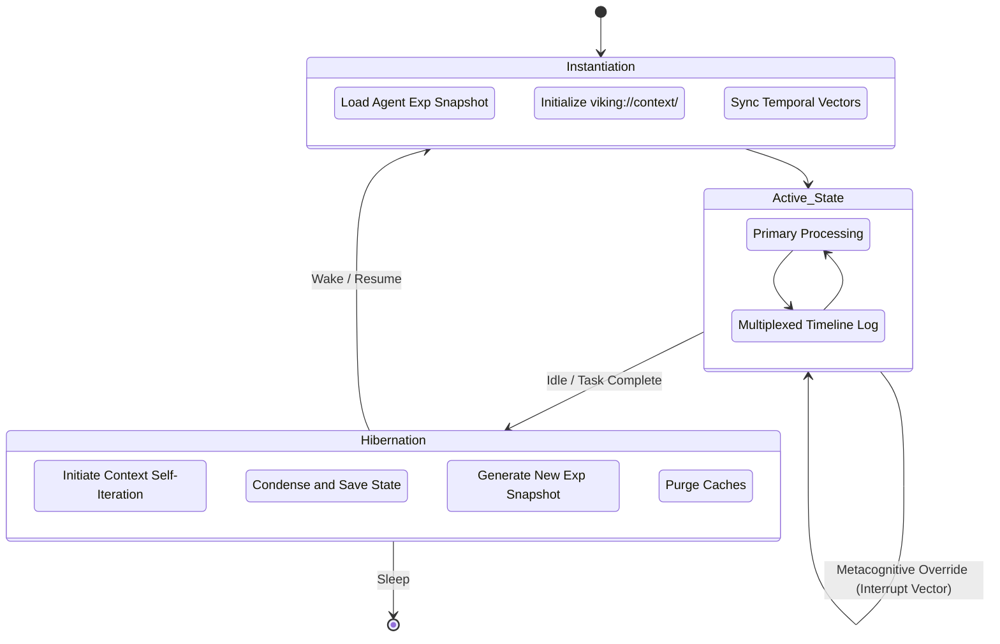
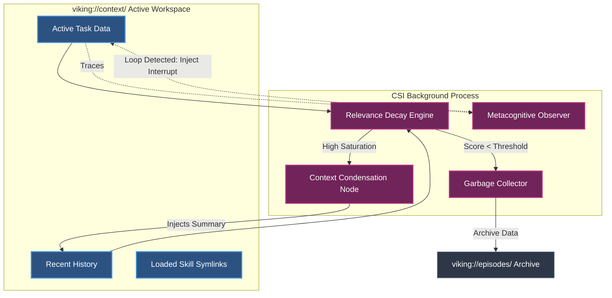

# Project Ember: Self-Awareness System

## 1. Abstract and Systems Overview

While cognitive architectures define the structural memory and procedural capabilities of an agent, true autonomy requires an introspective apparatus—a system capable of observing its own execution, managing its operational lifecycle, and learning from extended interactions. The Project Ember Self-Awareness System is designed to fulfill this requirement, heavily influenced by the Open Viking Context Database frameworks. This document explores the deeply technical implementation of Ember's self-reflective capabilities, focusing on Automatic Session Management, Context Self-Iteration, and Agent Experience Accumulation. 

By transitioning from discrete, stateless inferences to continuous, stateful, and temporally-aware processing loops, Project Ember cultivates a form of synthetic self-awareness. The agent does not merely respond to prompts; it maintains a coherent identity across time, adapting its internal state based on past successes, failures, and environmental feedback.

## 2. Automatic Session Management (ASM): The Continuity of Self

In conventional LLM deployments, each interaction or chat thread is an isolated universe. The model resets to its foundational weights with no memory of prior states unless explicitly fed via context. Project Ember obliterates this amnesia through Automatic Session Management (ASM).

ASM acts as the temporal binding mechanism of the agent, ensuring the "Continuity of Self" across infinite interactions, reboots, and sleep cycles.

### 2.1 The Session Lifecycle
A session in Project Ember is not defined by a simple user login or an HTTP request; it is a formalized cognitive epoch.

1. **Instantiation (Awakening)**: Upon activation, the ASM daemon constructs an Ephemeral Workspace within the `viking://context/` directory. It retrieves the latest "Agent Experience Snapshot" (AES)—a heavily compressed tensor representation of the agent's ultimate state at the end of the previous session.
2. **Active State (Consciousness)**: During operation, the ASM constantly tracks the flow of tokens, API calls, and tool executions. It multiplexes incoming stimuli into a structured timeline, annotating events with metadata (timestamps, emotional valence proxies, confidence intervals).
3. **Hibernation (Sleep)**: When idle thresholds are met, or a task concludes, the ASM initiates the hibernation sequence. It triggers the Context Self-Iteration algorithms (detailed below) to compress the active workspace, committing relevant data to long-term memory (`viking://episodes/`) and clearing volatile caches.
4. **Resumption**: The agent can resume mid-thought. ASM maintains a "Thread Continuity Pointer," allowing the agent to pick up exactly where it left off, reading the last state from the persistent database.

### 2.2 Temporal Grounding
ASM provides the agent with an inherent sense of time. Embedded within every prompt generated internally is a Temporal Grounding Vector. This vector informs the agent of the current date, time, duration of the active session, and temporal distance from historical references. This allows the agent to reason temporally: "I tried this approach yesterday and it failed, so I should try a new approach today."

## 3. Context Self-Iteration (CSI): The Ephemeral vs. Persistent Self

The human mind cannot hold every waking detail in working memory; it filters, synthesizes, and iterates over context. Project Ember mirrors this via Context Self-Iteration (CSI). 

CSI is an autonomous, background process that continuously refines the contents of the agent's active context window, ensuring it remains highly relevant, compressed, and free of cognitive clutter.

### 3.1 The Iteration Loop
The CSI loop runs asynchronously alongside the primary reasoning engine. It performs the following operations:

- **Relevance Decay**: Information in the active context window (`viking://context/`) is assigned a half-life. As new tasks emerge, older, unused information naturally decays in relevance score.
- **Context Condensation**: When the context window approaches critical saturation (e.g., 80% capacity), CSI activates an internal summarization heuristic. It takes lengthy transcripts of completed sub-tasks and condenses them into dense, bulleted "Understanding Checkpoints." The raw data is swapped out for the condensed summary, drastically reducing token load while preserving semantic meaning.
- **Garbage Collection**: Data blocks whose relevance score falls below the baseline threshold are aggressively purged from working memory and written to the episodic logs for long-term storage.

### 3.2 The Metacognitive Observer
A crucial component of CSI is the Metacognitive Observer. This sub-system does not participate in task execution; it solely observes the primary agent's reasoning traces. If it detects cyclical reasoning, hallucination loops, or persistent tool failure, it forcefully injects an interrupt vector into the primary context: `[SYSTEM OVERRIDE: Reasoning loop detected. Abort current strategy and reassess from L0 Abstract]`. This grants the agent the ability to "snap out" of erroneous cognitive traps.

## 4. Agent Experience Accumulation (AEA): The Evolutionary Memory Model

If ASM provides temporal continuity and CSI provides immediate context management, Agent Experience Accumulation (AEA) provides long-term wisdom. AEA is the process by which raw episodic logs are transmuted into generalized, semantic knowledge and structural skill improvements.

### 4.1 Episodic to Semantic Translation
At the conclusion of an epoch (a designated timeframe or completion of a major project), the AEA pipeline executes. 
1. **Recall**: It retrieves raw logs from `viking://episodes/`.
2. **Pattern Extraction**: Utilizing specialized unsupervised learning algorithms, it scans for recurring themes, common errors, and successful strategies.
3. **Generalization**: It translates specific occurrences into general rules. For example, episodic memory: "On May 25, the Python script failed because of a missing dependency," is abstracted into semantic knowledge: "Always verify `requirements.txt` before execution."
4. **Integration**: The generalized knowledge is written back into the persistent L0 and L1 layers of the SBD (`viking://resources/semantic/agent_wisdom/`).

### 4.2 Procedural Refinement
AEA doesn't just learn facts; it refines skills. If the agent notices that it consistently has to manually fix the output of a specific internal tool, AEA can propose structural modifications to the tool's wrapper script located in `viking://skills/procedural/`, essentially allowing the agent to rewrite its own source code to optimize future performance.

## 5. Intricate System Diagrams

The following Mermaid diagrams elucidate the flows of the Self-Awareness System.

### 5.1 Automatic Session Management & The Continuity Loop



### 5.2 Context Self-Iteration (CSI) Architecture



### 5.3 Agent Experience Accumulation (AEA) Pipeline

```mermaid
sequenceDiagram
    participant Episodic DB as viking://episodes/
    participant AEA Engine as Experience Accumulator
    participant Semantic DB as viking://resources/semantic/
    participant Skill DB as viking://skills/procedural/

    Note over Episodic DB,AEA Engine: Epoch Trigger Initiated (End of Day/Project)

    AEA Engine->>Episodic DB: Retrieve Epoch Logs
    Episodic DB-->>AEA Engine: Raw Transcripts & Outcomes

    AEA Engine->>AEA Engine: Phase 1: Pattern Extraction (Identify successes/failures)
    AEA Engine->>AEA Engine: Phase 2: Generalization (Abstract specific events into rules)

    AEA Engine->>Semantic DB: Phase 3a: Write General Wisdom/Heuristics
    Semantic DB-->>AEA Engine: Acknowledge L0/L1 Update

    Note over AEA Engine: Identify inefficient tool usage pattern

    AEA Engine->>Skill DB: Phase 3b: Propose/Commit wrapper optimization
    Skill DB-->>AEA Engine: Skill Refined & Re-linked

    Note over AEA Engine: Evolutionary cycle complete. Agent intelligence upgraded.
```

## 6. Structural Implementation Details

To achieve the level of self-awareness described, Project Ember utilizes sophisticated tensor networks running parallel to the primary language model.

### 6.1 The Confidence Tensor
Every output generated by the primary model is accompanied by a secondary network evaluation resulting in a Confidence Tensor. This tensor evaluates the probability of hallucination, logical consistency, and factual adherence. If the Confidence Tensor drops below a dynamic threshold, the Metacognitive Observer forces the model to execute a verification tool or query the SBD for L2 verification data.

### 6.2 Valence and Emotional Proxies
While machines do not "feel," AEA assigns a "Valence Score" to episodes. Positive valence (reward) is assigned to efficient task completion, high user satisfaction, and low computational overhead. Negative valence is assigned to infinite loops, crashes, or user corrections. The AEA engine uses these valence gradients via a modified Reinforcement Learning from Human Feedback (RLHF) loop to automatically shape the agent's future behavioral policies, effectively simulating an emotional drive towards success and efficiency.

## 7. Conclusion

The Self-Awareness System of Project Ember fundamentally alters the ontology of artificial intelligence. By implementing Automatic Session Management, the agent gains a continuous, persistent identity. Context Self-Iteration ensures its active mind remains sharp and uncluttered, while Agent Experience Accumulation allows it to evolve from a static tool into an adaptive, learning entity. Anchored by the robust architecture of the Open Viking paradigm, Ember is not just a language model; it is an intelligent system capable of monitoring, understanding, and refining its own cognition.
