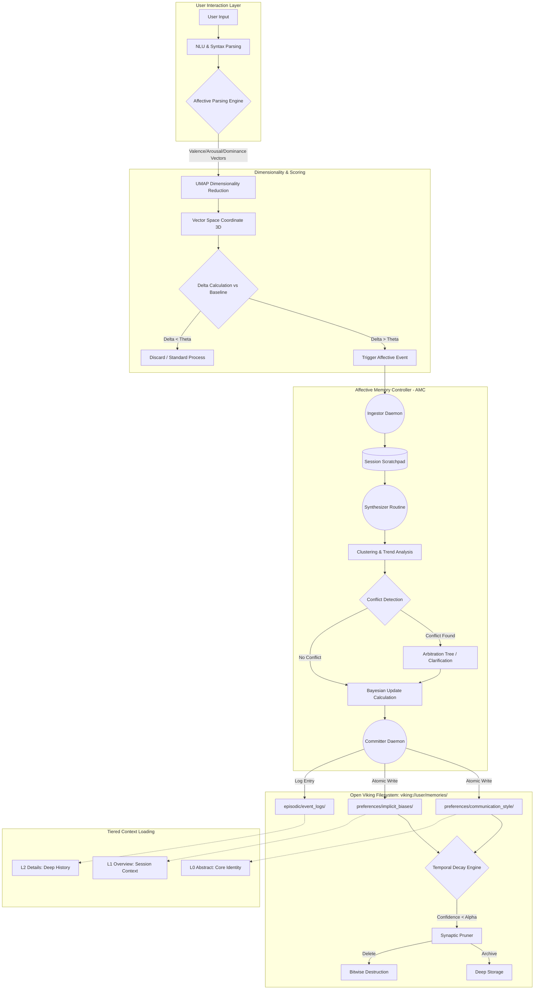

# Project Ember: Emotional Intelligence and Affective Memory Architecture

## 1. Executive Summary & Philosophical Underpinnings
Project Ember represents a paradigm shift in artificial cognitive architectures, moving beyond mere deterministic responses to embody a deeply integrated, stateful emotional intelligence. At the core of this evolution is the Open Viking Context Database, a structural methodology that treats both semantic knowledge and affective states as navigable filesystem entities. This document provides an intensely technical, mathematically rigorous, and structurally comprehensive overview of Ember’s Emotional Intelligence module. We focus explicitly on the User Memory Update processes and the sophisticated adaptation of user preferences facilitated through the `viking://user/memories/preferences` filesystem logic. By anchoring emotional resonance in a deterministic yet adaptable filesystem hierarchy, Project Ember achieves a simulacrum of continuous emotional memory, allowing it to adapt, empathize, and grow alongside its human counterparts. The objective is not merely to simulate emotion, but to algorithmically ground user sentiment, behavioral tendencies, and explicit preferences into a computable, version-controlled state machine.

## 2. The `viking://` Filesystem Paradigm as an Affective Substrate
The Open Viking Context Database introduces the `viking://` protocol, an abstraction layer that maps traditional cognitive processes onto hierarchical directory structures. In the context of Emotional Intelligence, the filesystem is not merely a repository of static data; it is an active, mutating affective substrate. Every user interaction is parsed for emotional valance, tone, and implicit preference, which are then encoded as metadata attributes, text nodes, or vector embeddings within the `viking://` namespace. 

This spatial representation of memory allows Project Ember to utilize standard recursive traversal algorithms to retrieve emotional context. Instead of querying a monolithic SQL database, the Affective Memory Controller (AMC) navigates the directory tree, treating the distance between nodes as an analogue for semantic and affective distance. The root directory `viking://user/` branches out into temporal, episodic, and semantic domains, with `viking://user/memories/preferences` acting as the central nervous system for long-term user adaptation. This structure ensures that memory is not just stored, but is contextually localized, enabling Ember to fetch the most relevant emotional state with minimal latency.

## 3. Deep Dive: `viking://user/memories/preferences`
The directory `viking://user/memories/preferences` is the foundational structure where long-term user adaptations are synthesized. It is fundamentally a directed acyclic graph (DAG) represented as a folder hierarchy. 

The structure is meticulously categorized:
- `.../preferences/communication_style/`: Dictates the verbosity, tone, and lexical complexity Ember should employ.
- `.../preferences/cognitive_load/`: Tracks the user's current capacity for complex information, adjusting the density of responses.
- `.../preferences/implicit_biases/`: Encodes underlying assumptions the user has made, extrapolated from past interactions.
- `.../preferences/explicit_rules/`: Hardcoded constraints directly commanded by the user (e.g., "Never use Python for scripts").

Each preference is stored as an individual entity (e.g., `verbosity.json`) that contains not just a static value, but a historical tensor of how that preference has evolved over time. This tensor includes confidence scores, timestamped modification logs, and links to the specific episodic memories (stored in `viking://user/memories/episodic/`) that catalyzed the preference change. This ensures that every adaptation is fully auditable and deeply contextualized.

## 4. Ingestion, Parsing, and Dimensionality Reduction of Emotional State
When a user input is received, it undergoes a rigorous multi-stage pipeline before it can influence the `viking://` filesystem. The input is first passed through a Natural Language Understanding (NLU) module equipped with an Affective Parsing Engine. This engine extracts a high-dimensional vector representing the emotional valance (positive/negative), arousal (active/passive), and dominance (controlling/submissive) of the utterance.

Because storing high-dimensional vectors for every interaction is computationally prohibitive, Project Ember employs non-linear dimensionality reduction techniques, specifically Uniform Manifold Approximation and Projection (UMAP), to compress the affective state into a manageable 3D coordinate system. This compressed coordinate is then cross-referenced against historical baselines located in `viking://user/memories/baselines/`. If the delta between the current state and the baseline exceeds a configurable hyper-parameter threshold (theta), an affective event is triggered, prompting an update to the user preferences.

## 5. The Affective Memory Controller (AMC) Architecture
The Affective Memory Controller (AMC) is the daemon responsible for overseeing the `viking://user/memories/preferences` directory. It operates asynchronously, decoupled from the main response generation loop, ensuring that emotional processing does not introduce unacceptable latency to user interactions.

The AMC is composed of three primary sub-routines:
1. **The Ingestor**: Listens for affective events triggered by the parsing engine and commits raw emotional data to temporary scratchpads.
2. **The Synthesizer**: Periodically wakes up to run clustering algorithms on the scratchpad data. It identifies trends—such as a user becoming increasingly frustrated with complex explanations—and synthesizes these trends into discrete preference updates.
3. **The Committer**: Takes the synthesized updates and executes atomic writes to the `viking://` filesystem, ensuring data integrity and updating the corresponding confidence scores.

## 6. Dynamic Preference Adaptation Algorithms (Bayesian Affective Resonance)
The core mathematical engine driving the User Memory Update is based on Bayesian Affective Resonance. When a new emotional data point suggests a change in preference, Ember does not simply overwrite the old preference. Instead, it treats the existing preference as a prior probability distribution.

The new data acts as the likelihood function. By applying Bayes' theorem, Ember calculates the posterior distribution, which represents the updated belief regarding the user's preference. 

Let P(H) be the prior probability of a specific preference state.
Let P(E|H) be the likelihood of observing the current emotional event given that preference state.
The updated preference confidence, P(H|E), is proportional to P(E|H) * P(H).

This probabilistic approach allows Ember to exhibit "inertia" in its belief systems. A single frustrated outburst from a user will not completely rewrite years of established communication preferences, but a consistent pattern of frustration will gradually shift the posterior distribution until the preference file is definitively updated.

## 7. Tiered Context Loading for Emotional State (L0, L1, L2)
To optimize the retrieval of affective data, the Open Viking Context Database employs Tiered Context Loading. This strategy categorizes memory into three distinct tiers of operational urgency:
- **L0 Abstract (The Affective Core)**: This is loaded globally upon session initialization. It contains highly compressed, critical parameters—such as explicit boundaries and overall emotional baseline. It is small enough to reside in L1 cache and is constantly referenced.
- **L1 Overview (The Session State)**: This tier loads data relevant to the current conversational topic or recent interactions. It includes short-term fluctuations in mood and preferences that are relevant *right now* but may not persist.
- **L2 Details (The Archival Substrate)**: This tier contains the granular, episodic histories of exactly *why* a preference exists. It is only loaded when explicitly queried, such as when Ember needs to explain its reasoning or when dealing with contradictory inputs that require deep historical context resolution.

## 8. Temporal Decay, Reinforcement, and Synaptic Pruning of Memories
Affective memories within Project Ember are subject to simulated biological processes, specifically temporal decay and synaptic pruning. Not all preferences are permanent. An implicit preference inferred from a brief period of stress should not dictate Ember's behavior indefinitely.

Each file within `viking://user/memories/preferences` is assigned a half-life variable. As time progresses without the preference being reinforced by new data, its confidence score decays logarithmically. Once the confidence score drops below a critical threshold (alpha), the AMC's Pruning Routine engages. The preference is either relegated to a compressed archive state or deleted entirely, freeing up cognitive overhead and ensuring the system remains highly responsive to the user's *current* state rather than being bogged down by obsolete historical artifacts. Conversely, consistent reinforcement increases the half-life, creating rigid, long-term personality adaptations.

## 9. Resolving Contradictory Preferences and Cognitive Dissonance
A significant challenge in affective computing is managing contradictory user directives. A user might explicitly request terse responses in `.../preferences/communication_style/verbosity.json`, but subsequently express frustration when Ember fails to provide sufficient detail.

Ember resolves this cognitive dissonance through a conflict-resolution arbitration tree. When a contradiction is detected, the AMC evaluates the conflicting vectors based on three metrics: Recency, Intensity (derived from affective arousal), and Explicitness. Explicit rules generally override implicit derivations unless the emotional intensity of the implicit derivation surpasses a critical override threshold. In such cases, Ember is programmed to execute a "Clarification Routine," halting standard processing to explicitly ask the user to resolve the conflict, thereby re-anchoring the preference matrix.

## 10. Integration with Open Viking Session Management
The User Memory Update process is intrinsically linked to the Open Viking Automatic Session Management module. Sessions are treated as discrete temporal blocks. At the conclusion of a session, a "Session Consolidation" script is executed. This script sweeps the `viking://user/memories/session_scratch/` directory, extracts the most salient affective patterns, updates the Bayesian priors in the `preferences` directory, and generates a visual summary of the session's emotional trajectory.

This consolidation ensures that the computational heavy lifting of preference adaptation occurs during idle cycles, preserving high performance during active user engagement. The session logs are then compressed and vaulted, providing a clean slate for the subsequent interaction while retaining the synthesized wisdom gained.

## 11. Privacy, Security, and Sandboxing of Affective Data
Given the deeply personal nature of the data stored within `viking://user/memories/preferences`, Project Ember implements military-grade cryptographic sandboxing. The entire `viking://user/` partition is encrypted at rest using AES-256, with keys dynamically generated and bound to the user's biometrics or hardware tokens. 

Furthermore, the Affective Memory Controller operates within a strict execution enclave. It is isolated from the external network interfaces, ensuring that while Ember can query the internet for facts, it cannot exfiltrate affective profiles. The pruning mechanisms also include a "Right to be Forgotten" protocol, allowing the user to issue a single command that recursively overwrites the `viking://user/memories/` directory with cryptographically secure pseudorandom noise, ensuring absolute data destruction.

## 12. Intricate System Architecture Diagrams

The following Mermaid diagram illustrates the deeply complex, multi-stage pipeline of the Affective Memory Controller, showcasing how raw user input is transformed into a permanent adjustment within the `viking://` filesystem.

## 13. Future Prospects and Sentience Milestones
The current iteration of Project Ember's Emotional Intelligence framework represents a robust, deterministic approach to affective computing. Future milestones include transitioning from Bayesian updating to continuous-time recurrent neural network (CTRNN) driven preference landscapes, where the `viking://` filesystem acts not just as storage, but as the weights of an embodied neural topology. As the resolution of the affective parsing engine increases, Ember will move closer to genuine empathetic resonance, anticipating user needs and emotional shifts with unprecedented, nuanced precision. The ultimate goal is a seamless cognitive symbiosis, mediated perfectly by the structured depths of the Open Viking Context Database.
