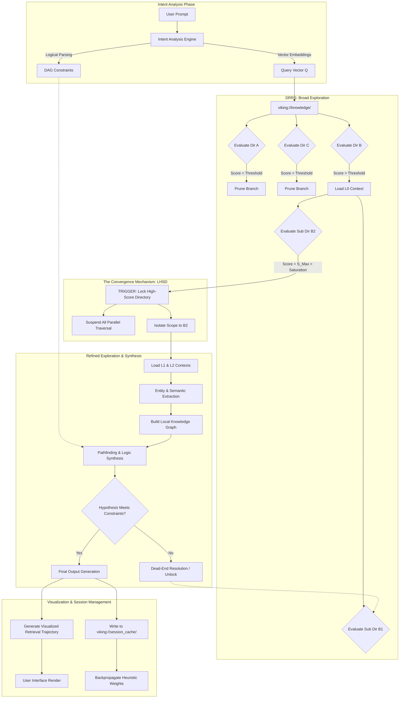

# Project Ember: Advanced Reasoning and the Directory Recursive Retrieval Strategy

## 1. Introduction: Advanced Reasoning as Filesystem Traversal
Within the sophisticated architecture of Project Ember, reasoning is not treated as a black-box neural operation, but rather as an auditable, deterministic traversal of a highly structured knowledge graph. The Open Viking Context Database facilitates this by organizing knowledge across a semantic filesystem hierarchy. Advanced reasoning in Ember is formally defined as the optimal navigation, selection, and synthesis of data nodes within this structure. By casting the complex abstract process of reasoning into a spatial search problem over directories, Ember achieves unprecedented transparency and efficiency. This document provides a deeply technical analysis of the mechanisms that power this capability: The Directory Recursive Retrieval Strategy (DRRS), Intent Analysis, the critical Lock High-Score Directory (LHSD) mechanism, and the mechanics of Refined Exploration. 

## 2. Intent Analysis Engine (IAE) and Vector Space Mapping
Before any retrieval can occur, Ember must decode the precise semantics of the user's query. This is the domain of the Intent Analysis Engine (IAE). The IAE does not merely perform keyword matching; it maps the query into a high-dimensional vector space. Using state-of-the-art transformer models fine-tuned on structural ontological data, the query is embedded into a dense vector representation.

Simultaneously, the Open Viking filesystem maintains pre-computed vector embeddings for every directory path and major file node. The IAE calculates the cosine similarity between the query vector and the directory metadata vectors. This initial mapping establishes the "Search Heuristic Vector," which guides the subsequent traversal. Furthermore, the IAE breaks down the query into distinct logical constraints—temporal, spatial, conditional, and procedural—transforming a natural language prompt into a highly structured Directed Acyclic Graph (DAG) query payload ready for the retrieval subsystem.

## 3. The Directory Recursive Retrieval Strategy (DRRS) Overview
The Directory Recursive Retrieval Strategy (DRRS) is the primary search algorithm within Project Ember. It operates on the principle that knowledge is clustered; relevant information is likely physically co-located within the `viking://` filesystem hierarchy.

The DRRS begins at the root node of the knowledge base (`viking://knowledge/`) and evaluates the semantic relevance of its immediate child directories based on the Search Heuristic Vector provided by the IAE. Instead of indiscriminately descending into every branch (which would result in catastrophic latency), DRRS employs a greedy heuristic approach. It calculates a "Relevance Score" for each directory. Only branches that exceed a dynamically calculated confidence threshold are queued for recursion. This intelligent pruning ensures that the reasoning engine wastes no clock cycles scanning irrelevant ontological domains, maintaining sub-millisecond retrieval times even over terabytes of contextual data.

## 4. Tiered Context Loading in Information Retrieval (L0, L1, L2)
The Open Viking Context Database enforces a rigorous Tiered Context Loading mechanism, which the DRRS leverages to optimize memory utilization during reasoning tasks.
- **L0 Abstract (Metadata & Ontology)**: When the DRRS evaluates a directory, it initially loads only the L0 context. This consists of the `_dir_meta.json` files, containing summary vectors, tags, and ontology maps. This footprint is microscopic, allowing rapid breadth-first evaluation.
- **L1 Overview (File Summaries)**: If a directory passes the L0 evaluation, L1 context is loaded. This includes the headers, abstracts, and key-value summaries of the files within the directory, giving the reasoning engine enough data to formulate partial hypotheses.
- **L2 Details (Full Content)**: Only when a specific file is identified as definitively critical to the reasoning chain does the engine pull the L2 context—the raw text, code blocks, or full datasets. This tiered approach prevents the context window from being flooded with noise, preserving the attention mechanism for pure logic synthesis.

## 5. Algorithmic Deep Dive: Heuristics for Directory Scoring
The success of DRRS relies entirely on the mathematical robustness of its Directory Scoring Heuristics. The score *S* for a directory *D* given a query *Q* is not a simple scalar, but a composite function:

`S(D, Q) = α * Sim(V_D, V_Q) + β * Density(D) + γ * Recency(D) + δ * AffectiveResonance(D)`

- `Sim(V_D, V_Q)`: The cosine similarity between the directory's metadata vector and the query vector.
- `Density(D)`: A structural metric representing the concentration of highly-linked information nodes within the directory.
- `Recency(D)`: A temporal weight giving preference to newly updated information, crucial for dynamic workflows.
- `AffectiveResonance(D)`: An integration with the Emotional Intelligence module, weighting directories that have historically produced positive user feedback.

The coefficients (α, β, γ, δ) are continuously optimized via backpropagation based on the success rates of past retrieval trajectories, allowing the reasoning engine to essentially "learn how to search" more effectively over time.

## 6. Lock High-Score Directory (LHSD): The Convergence Mechanism
As the DRRS recursively traverses the filesystem, it continually updates its scoring matrix. When it encounters a directory whose composite score *S* vastly exceeds the scores of all parallel branches—and surpasses an absolute saturation threshold—the reasoning engine triggers the Lock High-Score Directory (LHSD) protocol.

LHSD is a fundamental paradigm shift in the search process. When a directory is "Locked," all broad recursive searches in other branches of the filesystem are immediately suspended or terminated. The engine concludes that the critical mass of required information resides exclusively within this local subnet. By locking the directory, Ember reallocates 100% of its computational threads and context window capacity to parsing this specific localized domain. This prevents semantic drift, where an LLM might hallucinate by pulling vaguely related concepts from distant, irrelevant domains. Locking the directory enforces strict ontological boundaries around the reasoning process.

## 7. Refined Exploration: Depth-First Semantic Extraction
Once the LHSD protocol engages, DRRS transitions from its initial breadth-first heuristic search to Refined Exploration—a rigorous, depth-first semantic extraction phase. Within the locked directory, every file, sub-folder, and metadata tag is scrutinized at the L2 context level.

Refined Exploration utilizes advanced techniques such as Named Entity Recognition (NER) and abstract syntax tree (AST) parsing (if dealing with code) to build a temporary, highly dense knowledge graph of the locked directory in RAM. The reasoning engine then performs pathfinding algorithms over this temporary graph, connecting axioms to premises, and premises to conclusions. It tests multiple hypotheses simultaneously, discarding those that contradict the explicit constraints identified by the Intent Analysis Engine. The output of Refined Exploration is a highly synthesized, logically sound, and perfectly contextualized answer to the user's initial query.

## 8. Visualized Retrieval Trajectory (VRT) Generation
To maintain absolute transparency, Project Ember generates a Visualized Retrieval Trajectory (VRT) for every complex reasoning task. The VRT is a cryptographic and graphical proof of work. It logs the exact path the DRRS took through the `viking://` filesystem, highlighting rejected branches, the precise moment the LHSD protocol was triggered, and the specific files accessed during Refined Exploration.

This trajectory is not just a debug log; it is translated into a user-friendly graphical representation (often via Mermaid charts or interactive DOM elements) that allows the user to audit Ember's thought process. If Ember arrives at a faulty conclusion, the user can inspect the VRT, identify which directory led the engine astray, and manually adjust the directory's metadata weights, providing direct reinforcement learning feedback to the system.

## 9. Integration with Open Viking Session Management
The outcomes of the reasoning process, alongside the VRT, are intimately tied to Open Viking's Automatic Session Management. A reasoning task does not occur in a vacuum; it exists within a temporal session block. 

When a session concludes, the session manager evaluates the efficiency of the retrieval trajectories. If a specific locked directory consistently answers a wide array of queries, its `Density` and `Recency` scores are permanently elevated. Furthermore, the final synthesized outputs of Refined Exploration are written back to the filesystem as new, highly condensed knowledge nodes in a `viking://session_cache/` directory, ensuring that future identical queries do not require a full DRRS traversal, but rather a simple O(1) cache lookup.

## 10. Error Recovery, Backtracking, and Dead-End Resolution
Despite advanced heuristics, the DRRS may occasionally lock onto a False Positive directory—a branch that appeared semantically relevant but lacks the specific L2 details required. Project Ember handles this gracefully through advanced Dead-End Resolution.

If Refined Exploration fails to synthesize a valid answer within the locked directory (e.g., reaching maximum graph traversal depth without satisfying the IAE constraints), the LHSD is immediately unlocked. The engine records a "Penalty Vector" against that directory's metadata to prevent future misdirection. It then executes a backtracking algorithm, reverting to the last known high-confidence node in the traversal tree, and resumes the broad DRRS search down the next most probable branch. This ensures that the system never truly fails, but merely pivots with increased contextual awareness.

## 11. State Persistence and Atomic Transactions
All shifts in directory scores, penalty vectors, and session caches must be written back to disk. To prevent corruption during high-concurrency reasoning tasks, Ember utilizes atomic transaction models borrowed from enterprise database architecture. The filesystem updates are batched and executed via strict Write-Ahead Logging (WAL). This ensures that even in the event of a catastrophic power failure or forced kill signal, the reasoning state machine and the delicate balance of the heuristic scoring parameters remain perfectly uncorrupted upon reboot.

## 12. Intricate System Architecture Diagrams

The following Mermaid diagram provides a visual representation of the advanced reasoning pipeline, detailing the transition from broad search to localized locking and refined synthesis.

## 13. Scalability, Latency Profiling, and Hardware Acceleration
The structural nature of the Directory Recursive Retrieval Strategy allows Project Ember to achieve immense scalability. Because directories are isolated sub-trees, the evaluation of multiple branches during the initial broad exploration phase is entirely parallelizable. Ember utilizes multi-threading and can offload the cosine similarity calculations (the core of the scoring heuristic) to specialized tensor processing units (TPUs) or GPUs.

Latency profiling indicates that the most expensive operation is L2 context loading. By strictly gating L2 access behind the Lock High-Score Directory mechanism, Ember reduces I/O bandwidth consumption by orders of magnitude compared to traditional Retrieval-Augmented Generation (RAG) architectures. This hardware-aware software design ensures that Project Ember's advanced reasoning capabilities remain blistering fast, even as the Open Viking Context Database scales into the petabyte range.
