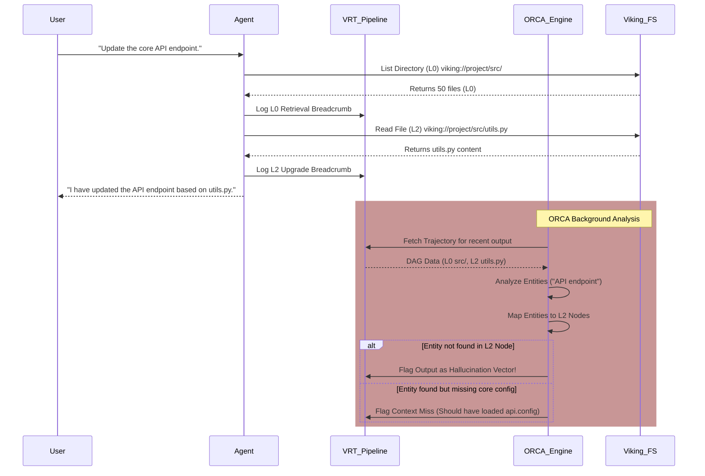

# Project Ember Context Observability: Illuminating the Cognitive Trajectory

## 1. Executive Summary and Abstract

The advent of Large Language Models (LLMs) and autonomous agentic frameworks has introduced unprecedented cognitive capabilities into computational systems. However, these capabilities have historically been shrouded in the opacity of the "black box." When an agent makes a decision, retrieves a file, or synthesizes a response, the precise trajectory of its internal context management remains hidden from the operator. Project Ember, leveraging the foundational architectures of the Open Viking Context Database paradigm, seeks to fundamentally dismantle this opacity. Document 13, "Ember Context Observability," delineates the theoretical frameworks, architectural mechanisms, and practical implementations required to achieve absolute transparency in context retrieval and utilization. 

By introducing the Visualized Retrieval Trajectory (VRT) and Observable Root Cause Analysis (ORCA), this document establishes a new standard for cognitive observability. These mechanisms allow administrators and developers to trace, in real-time, the exact provenance of every piece of information utilized by the agent, effectively mapping the cognitive breadcrumbs that lead to a specific output. The integration of Tiered Context Loading (L0 Abstract, L1 Overview, L2 Details) further enriches this observability, providing granular insights into the depth and breadth of contextual engagement at any given microsecond. Ultimately, this paradigm shift transforms the agent from an inscrutable oracle into a transparent, debuggable, and fully observable cognitive engine. This document will comprehensively explore the epistemological foundations of this shift, the algorithmic structures underpinning VRT and ORCA, and the telemetric indices utilized to monitor contextual health and saturation.

## 2. The Imperative of Contextual Transparency

In traditional multi-agent systems and foundational LLM integrations, context is treated as a monolithic payload. Prompts, historical dialogues, retrieved documents, and environmental states are concatenated into a singular token stream and fed into the inference engine. While effective for simple tasks, this monolithic approach catastrophically fails in complex, long-running, autonomous operations. When an agent hallucinates, enters an infinite loop, or retrieves irrelevant data, the system administrator is left with no diagnostic tools other than manual inspection of the raw, unstructured prompt payload.

Project Ember postulates that contextual transparency is not a mere diagnostic luxury, but a fundamental prerequisite for deploying autonomous agents in mission-critical environments. The imperative is clear: every byte of data that influences the agent's cognitive state must be traceable, auditable, and quantifiable. We term this requirement "Epistemological Transparency." The system must not only know *what* it knows but must be capable of demonstrating *how* it came to know it, *when* it was loaded into the active context window, and *why* it was deemed relevant over competing informational vectors.

## 3. Epistemological Foundations of the Black-Box Dilemma

The black-box nature of LLMs stems from their connectionist architecture, where knowledge is distributed across billions of parameters. However, in agentic systems like Project Ember, a secondary black box emerges: the Context Management System (CMS). Even if the LLM's internal weights remain opaque, the CMS—which dictates the active context window—must be deterministic and observable. 

The Open Viking Context Database addresses this by structuring all memory, skills, and resources as a virtual filesystem (`viking://`). However, structuring data is only half the battle; observing its flow is the other. Without observability, the `viking://` filesystem becomes a silent repository. If the agent executes a Directory Recursive Retrieval Strategy (DRRS) and loads 50 files, the system must provide a visualized, deterministic map of this action. The epistemological foundation here is that the agent's operational reality is strictly bounded by its current context. By making the boundaries, contents, and dynamic shifts of this context observable, we effectively map the agent's operational consciousness.

## 4. Introduction to Visualized Retrieval Trajectory (VRT)

The Visualized Retrieval Trajectory (VRT) is the core mechanism by which Project Ember achieves epistemological transparency. VRT is a highly optimized, asynchronous telemetry pipeline that intercepts every context modification event—loads, evictions, updates, and summarizations—and maps them into a real-time directed acyclic graph (DAG). 

VRT operates on the principle of "Cognitive Breadcrumbs." Every time the agent invokes a tool, queries the `viking://` filesystem, or transitions between Tiered Context Loading states (e.g., upgrading a document from L0 Abstract to L2 Details), a Cognitive Breadcrumb is instantiated. These breadcrumbs contain rich metadata, including timestamp, trigger source, token weight, relevance score, and the exact differential applied to the context window. 

The VRT pipeline aggregates these breadcrumbs and exposes them via a real-time WebSocket stream to the Ember Dashboard, allowing operators to watch the agent's thought process unfold geographically across the context landscape.

## 5. Architectural Anatomy of VRT

The VRT architecture consists of three primary components: the Context Interceptor (CI), the Trajectory Aggregation Engine (TAE), and the Visualization Broadcast Matrix (VBM).

1. **Context Interceptor (CI):** A low-level hook embedded within the agent's cognitive loop. It acts as a passive listener, triggering on any state change to the active prompt payload. 
2. **Trajectory Aggregation Engine (TAE):** A background service that receives raw events from the CI. It calculates contextual deltas, computes token costs, and maps the temporal relationships between events to construct the DAG.
3. **Visualization Broadcast Matrix (VBM):** The presentation layer that serializes the DAG into a standardized JSON format and broadcasts it to subscribed administrative clients.

```mermaid
graph TD
    subgraph Agent Cognitive Loop
        A[LLM Inference] --> B[Tool Execution]
        B --> C[viking:// Filesystem Query]
        C --> D[Context Payload Modification]
    end

    subgraph VRT Pipeline
        D -- Context Delta --> E(Context Interceptor)
        E --> F{Trajectory Aggregation Engine}
        F --> |Calculate Token Deltas| G[Token Metrics]
        F --> |Map Causal Links| H[DAG Constructor]
        F --> |Evaluate Tier (L0/L1/L2)| I[Tier Classifier]
        G --> J(Visualization Broadcast Matrix)
        H --> J
        I --> J
    end

    subgraph Administrative Dashboard
        J -- WebSocket Stream --> K[Real-time VRT Graph]
        J -- WebSocket Stream --> L[Context Saturation Heatmap]
    end
    
    style E fill:#f9f,stroke:#333,stroke-width:2px
    style J fill:#bbf,stroke:#333,stroke-width:2px
```

## 6. Trajectory Node Mapping and Graph Construction

In the VRT DAG, each node represents a distinct state of the context window, and each edge represents the action that caused the transition. 

**Node Attributes:**
- `ContextID`: A unique cryptographic hash representing the exact state of the prompt.
- `TotalTokens`: The absolute token count at this state.
- `TierDistribution`: A vector representing the percentage of context occupied by L0, L1, and L2 data.

**Edge Attributes:**
- `ActionType`: E.g., `READ_FILE`, `INVOKE_SKILL`, `USER_PROMPT`, `EVICT_MEMORY`.
- `TargetURI`: The specific `viking://` resource acted upon.
- `RelevanceScore`: The heuristic score that justified this action.

This rigorous mapping ensures that if the agent makes an error at Node $N_{50}$, the operator can trace the exact sequence of retrievals back to Node $N_0$ to pinpoint the origin of the hallucination or context miss.

## 7. Tiered Context Loading Observability

Open Viking's Tiered Context Loading is a revolutionary approach to memory management. However, without VRT, it is impossible to know which tier the agent is currently utilizing for a specific resource. 

- **L0 Abstract:** Contains merely the filename and a one-sentence summary. High breadth, zero depth.
- **L1 Overview:** Contains structural metadata, section headers, and key entities. Medium breadth, medium depth.
- **L2 Details:** The raw, complete file content. Zero breadth (consumes massive tokens), maximum depth.

The VRT pipeline specifically tracks Tier Transitions. When the agent uses the `Directory Recursive Retrieval Strategy`, it typically loads hundreds of files at L0. The VRT graph will visualize this as a massive horizontal expansion of nodes. As the agent identifies relevant files and requests them at L2, the VRT graph shows a vertical, deep dive into specific nodes. Operators can visually observe if the agent is "thrashing"—rapidly cycling files between L0 and L2 without making progress—and intervene if necessary.

## 8. Observable Root Cause Analysis (ORCA)

While VRT provides the map, Observable Root Cause Analysis (ORCA) provides the diagnostic logic to interpret that map. ORCA is an automated diagnostic subsystem designed to break the black-box management of traditional agents by proactively identifying contextual failures before they manifest as critical errors in the agent's output.

ORCA operates on a set of heuristic rules and anomaly detection algorithms applied in real-time to the VRT DAG. It specifically targets two primary failure modes: Hallucination Vectors and Context Misses.

## 9. Hallucination Vector Identification

A Hallucination Vector is formed when the agent generates an output asserting a fact that has no traceable origin in the current context window. In a black-box system, this is only caught post-generation. With ORCA, the system performs a backward-chaining semantic trace.

When an output is generated, ORCA briefly analyzes the key entities within the output. It then queries the VRT DAG: *Which loaded `viking://` resource introduced these entities into the context?* If ORCA cannot map the entities to a specific L1 or L2 node currently in the context, it flags the output as a potential hallucination and highlights the trajectory in red on the administrative dashboard, indicating a failure of traceability.

## 10. Context Miss Detection Algorithms

A Context Miss occurs when the agent *should* have retrieved a specific file to answer a prompt but failed to do so, relying instead on its parametric memory (which may be outdated or incorrect). ORCA detects Context Misses by analyzing the agent's utilization of the Directory Recursive Retrieval Strategy.

If the user prompts for "Database connection string," and ORCA observes the agent scanning the `/resources/config/` directory at L0, but failing to upgrade `database.yml` to L2, ORCA identifies this as a Context Miss. The agent saw the file existed but erroneously decided not to read it. ORCA logs this anomaly, providing developers with the exact decision node where the heuristic failed, allowing them to refine the agent's system prompt or retrieval thresholds.



## 11. Telemetry and Metrics

To provide a quantitative foundation for Context Observability, Project Ember introduces several novel telemetric indices that are constantly computed and broadcasted alongside the VRT graph.

### 11.1 Context Saturation Index (CSI)
The CSI measures the density of information within the current context window relative to its maximum token limit. It is not merely a token count. CSI incorporates the *semantic diversity* of the tokens. A context filled entirely with a single, highly repetitive log file has a high token count but a low CSI. A context filled with ten disparate, highly dense L1 summaries has a high CSI. When CSI approaches 1.0, the agent is at risk of "Context Collapse," where it begins to lose focus on the primary objective due to informational noise. VRT visualizes CSI as a heat gradient on the trajectory nodes.

### 11.2 Retrieval Latency Profiling (RLP)
RLP tracks the time delta between the agent identifying a need for information (e.g., encountering an unknown variable) and the successful L2 loading of the resource resolving that need. High RLP indicates an inefficient Directory Recursive Retrieval Strategy, suggesting the agent is lost in the filesystem hierarchy. ORCA uses RLP to trigger automatic session resets or heuristic overrides.

### 11.3 Relevance Decay Modeling (RDM)
Information loaded into the context window loses relevance over time as the conversation progresses. RDM mathematically models this decay. If a `viking://` resource was loaded at step $T_1$, its Relevance Score at step $T_{10}$ is calculated using an exponential decay function, adjusted by how frequently the agent references it. VRT uses RDM to suggest which files should be evicted to free up tokens, visualizing decaying nodes as fading in opacity.

## 12. Implementation Guidelines and System APIs

Implementing VRT and ORCA requires deep integration with the foundational LLM client and the Viking filesystem driver. 

**VRT Event Schema (JSON):**
```json
{
  "event_id": "evt_9876xyz",
  "timestamp": "2026-05-25T01:25:00Z",
  "agent_id": "ember_core",
  "action_type": "CONTEXT_UPGRADE",
  "target_uri": "viking://resources/docs/architecture.md",
  "previous_tier": "L0",
  "new_tier": "L2",
  "token_delta": "+1450",
  "current_csi": 0.82,
  "triggering_prompt_id": "prompt_123"
}
```

The system exposes a GraphQL API for administrative clients to query historical trajectories, allowing for post-mortem analysis of failed autonomous runs. The `viking://` protocol is instrumented to emit these events natively upon any read operation, ensuring that no file access can bypass the VRT pipeline.

## 13. Breaking the Black-Box: The Administrative View

The ultimate realization of this observability paradigm is the Administrative Dashboard. Here, the black box is completely shattered. Operators do not see a stream of text; they see a living, breathing neural topology. They watch as the agent explores the `viking://` filesystem, highlighting paths in blue as it scans at L0, turning them gold as it extracts L1 overviews, and plunging into deep green as it analyzes L2 details. 

If the agent stalls, the operator can pause execution, manually inject a node into the VRT graph (forcing the agent to read a specific file), or prune irrelevant branches (evicting hallucinated context). This transforms the human-AI dynamic from passive observation to active, surgical symbiosis.

## 14. Future Horizons

The current implementation of VRT and ORCA focuses on observability and diagnostics. The next phase of Project Ember's evolution will involve Auto-Corrective Trajectories (ACT). In this phase, ORCA will not merely flag Context Misses; it will autonomously intervene, forcefully rewriting the VRT DAG to optimize the agent's path before the LLM even completes its inference cycle, achieving true, closed-loop cognitive regulation.

## 15. Conclusion

Context Observability is the bedrock upon which the reliability of autonomous agents rests. By implementing the Visualized Retrieval Trajectory and Observable Root Cause Analysis, Project Ember elevates the management of LLM context from a dark art to an exact science. The integration of Tiered Context Loading with the `viking://` filesystem creates an environment where every cognitive step is trackable, measurable, and debuggable. The black box has not merely been opened; it has been completely dismantled, paving the way for the deployment of truly trustworthy, enterprise-grade autonomous intelligences.
