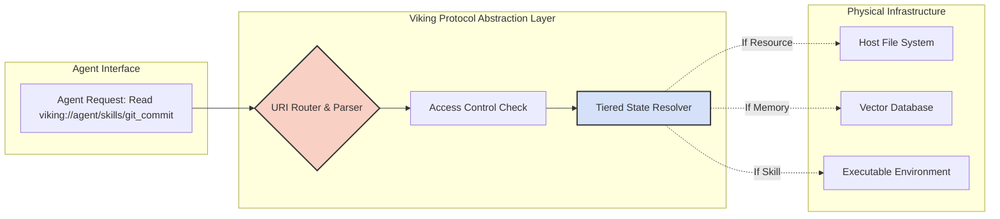
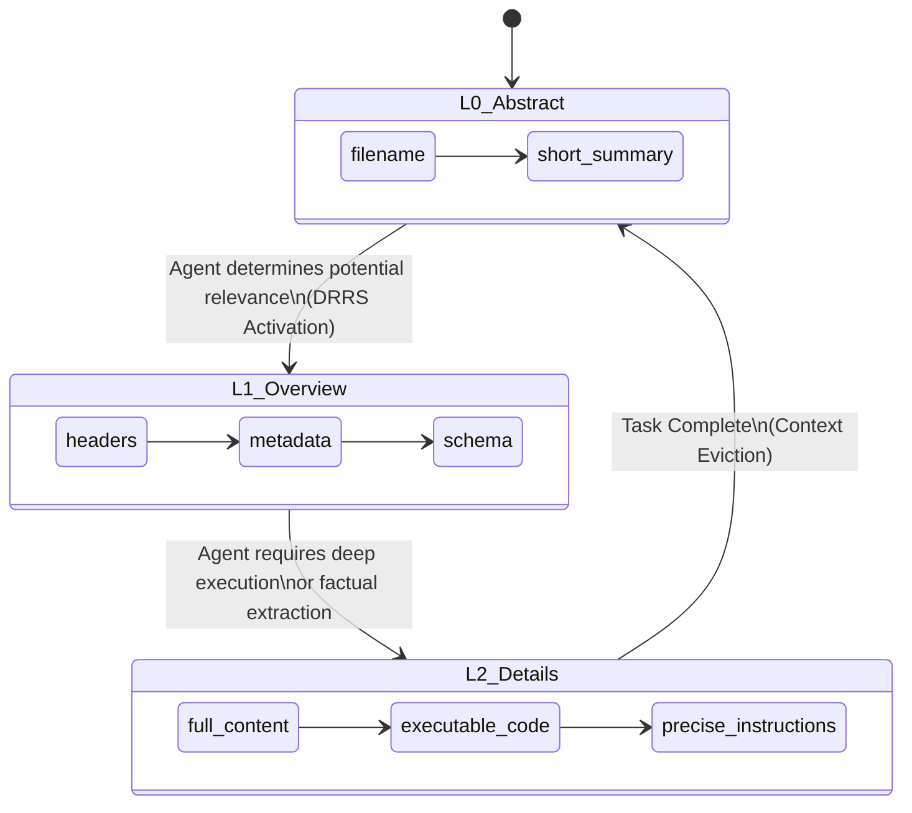

# Project Ember Skill and Resource Management: The Viking Unified Paradigm

## 1. Executive Summary and Abstract

The orchestration of autonomous agents requires a paradigm that transcends traditional script execution and static prompt engineering. As agents become increasingly capable, the management of their distinct capabilities (Skills) and their informational environments (Resources) becomes the critical bottleneck to scalability. Project Ember addresses this through the implementation of the Open Viking Context Database, centered around the revolutionary `viking://` filesystem paradigm. Document 14, "Ember Skill and Resource Management," provides a deeply technical exposition on how Project Ember unifies capabilities and knowledge into a single, addressable, deterministic namespace. 

This document explores the architectural anatomy of the `agent/skills/` directory, detailing how cognitive capabilities are modularized, dynamically loaded, and orchestrated via intricate dependency graphs. Concurrently, it dissects the `resources/` directory, illustrating the bifurcation of immutable knowledge bases and mutable episodic memories. By applying the principles of Tiered Context Loading (L0 Abstract, L1 Overview, L2 Details) directly to the filesystem architecture, Project Ember achieves a Unified Context Assembly that resolves semantic collisions, optimizes memory paging, and enforces rigorous sandboxing. Through this unified paradigm, the agent ceases to be a disparate collection of scripts and prompts, coalescing instead into a cohesive, highly structured, and infinitely extensible cognitive operating system. This document will serve as the definitive blueprint for architecting, managing, and securing the capabilities of advanced Ember agents.

## 2. Introduction to Unified Context Management

Historically, AI agent frameworks have maintained a rigid dichotomy between "tools" (executable code) and "memory" (textual data). Tools are registered via API schemas, while memory is injected via vector databases or prompt concatenation. This dichotomy creates immense friction. When an agent needs to use a tool, it must switch cognitive contexts away from its memory retrieval state into an execution state, often losing the nuanced environmental data required to use the tool effectively.

Project Ember obliterates this dichotomy. Under the Open Viking framework, everything—whether it is a Python script for database access, a Markdown file containing organizational policy, or the transcript of a previous conversation—is treated as a uniform entity within a virtual filesystem. This is the essence of Unified Context Management. By unifying skills and resources under a single addressing scheme, the agent can navigate, retrieve, and execute using a singular, unified cognitive strategy: the Directory Recursive Retrieval Strategy (DRRS).

## 3. The Viking Filesystem Paradigm (`viking://`)

The `viking://` protocol is an abstraction layer that maps physical host OS files, remote APIs, and ephemeral memory states into a standardized, deterministic namespace. To the Ember agent, the world is a filesystem. 

**Core Properties of `viking://`:**
- **Deterministic Resolution:** A URI always resolves to the exact same state (or error) regardless of the underlying infrastructure. `viking://resources/global/policy.md` might map to a local file, a Google Cloud Storage bucket, or a dynamically generated string, but the agent perceives only the URI.
- **MIME-Type Agnostic Streaming:** The protocol natively handles text, binaries, and execution streams, parsing them into the active context window based on their inherent type and the requested Tier (L0, L1, L2).
- **Inherent Sandboxing:** The protocol strictly enforces path traversal limitations. An agent confined to `viking://session_123/` cannot `../` its way into `viking://system_core/`.



## 4. The `agent/skills/` Directory: Modular Cognitive Capabilities

Within the Viking filesystem, the `viking://agent/skills/` directory serves as the repository for all executable capabilities. A Skill in Project Ember is not merely a python function; it is a holistic cognitive module comprising instructions, constraints, schemas, and executables.

### 4.1 Anatomy of a Skill
Every directory under `viking://agent/skills/` represents a unique capability (e.g., `viking://agent/skills/github_manager/`). A standard Skill directory contains:
- `SKILL.md`: The mandatory cognitive manifesto of the skill. Contains YAML frontmatter defining the tool schema (Action, Parameters, Required Fields) and detailed markdown instructions on *when* and *how* the agent should use this skill.
- `manifest.json`: System-level metadata, execution environment requirements, and dependency links.
- `exec/`: A subdirectory containing the actual executable scripts (Python, Node, Bash).
- `examples/`: Best-practice usage traces that the agent can read at L2 to learn complex workflows.

### 4.2 Dynamic Skill Loading (DSL)
Ember agents do not load all skills into their context window at startup. This would cause catastrophic token saturation and prompt confusion. Instead, they utilize Dynamic Skill Loading. The agent queries `viking://agent/skills/` at L0 (Abstract Tier). It sees a list of available skills and their one-sentence descriptions. 

When a task requires specific functionality, the agent applies the Directory Recursive Retrieval Strategy. It upgrades the necessary skill to L1 (reading the parameter schema) or L2 (reading the full `SKILL.md` instructions). The act of upgrading a skill to L1/L2 dynamically injects the executable tool into the agent's active action space. Once the task is complete, the skill is evicted back to L0, freeing up the context window.

### 4.3 Skill Dependency Graph
Skills often rely on other skills. `github_manager` might require `ssh_key_generator`. The `manifest.json` defines these directed acyclic graphs. When DSL loads a skill, the Viking protocol automatically traverses the dependency graph, loading requisite skills at L1 to ensure the agent has a complete operational toolkit.

## 5. The `resources/` Directory: Immutable and Mutable Memory States

While `skills/` defines what the agent can *do*, `resources/` defines what the agent *knows*. The `viking://resources/` directory is bifurcated into strictly managed namespaces to differentiate between permanent knowledge and ephemeral session data.

### 5.1 Immutable State: The Core Knowledge Base
Located at `viking://resources/core/`, this directory contains system prompts, unalterable policy documents, standard operating procedures, and global ontologies. The agent possesses `READ_ONLY` access to this partition. This ensures foundational directives cannot be corrupted by malicious prompts or agentic hallucination.

### 5.2 Mutable State: Episodic Memory and Scratchpads
Located at `viking://resources/sessions/{session_id}/`, this directory represents the agent's short-term and medium-term memory. It contains:
- `scratch/`: Ephemeral text files where the agent can write intermediate thoughts, JSON payloads, or data formatting attempts before finalizing an output.
- `artifacts/`: High-value, finalized documents generated during the session.
- `transcripts/`: The raw `transcript.jsonl` containing the chronological history of the current interaction.

The agent has full `READ_WRITE` privileges here. By interacting with its own session directory, the agent essentially performs externalized cognition, offloading complex state management from its limited context window into the `viking://` filesystem.



## 6. Application of Tiered Context (L0, L1, L2) to Resources

The true power of the `viking://` paradigm emerges when Tiered Context Loading is applied to resources. 
If an agent is asked to "Find the security policy on password rotation," a black-box system might try to dump the entire `/docs/` folder into context. 

An Ember agent executes the Directory Recursive Retrieval Strategy:
1. **L0 Scan:** `list_dir(viking://resources/docs/)`. The agent receives filenames and byte sizes. It spots `security_policies.md`.
2. **L1 Upgrade:** `view_file(viking://resources/docs/security_policies.md, L1)`. The agent receives only the Markdown headers (`# Network Security`, `# Access Control`, `# Password Rotation`).
3. **L2 Deep Dive:** `view_file(viking://resources/docs/security_policies.md, L2_Section="Password Rotation")`. The agent loads only the relevant paragraphs into its active context, answering the query while consuming merely 150 tokens instead of 15,000.

## 7. Unified Context Assembly

The process of constructing the prompt payload sent to the LLM is managed by the Unified Context Assembly engine. Because skills and resources share the same filesystem ontology, the assembly engine treats them uniformly.

**Assembly Algorithm:**
1. **Anchor State Loading:** The system loads `viking://resources/core/system_prompt.md` at L2. This is immutable.
2. **Session State Loading:** The system loads `viking://resources/sessions/current/state.json` at L1.
3. **Dynamic Interleaving:** Based on the agent's current VRT DAG (Visualized Retrieval Trajectory, see Document 13), the assembly engine interleaves the requested skills (from `agent/skills/`) and resources (from `resources/`).
4. **Collision Resolution:** If a skill (`viking://agent/skills/db_query`) and a resource (`viking://resources/docs/db_schema.md`) have semantic overlap, the assembly engine uses structural markers to explicitly differentiate executable syntax from factual data, preventing prompt confusion.

### 7.1 Memory Paging and Optimization
When the total token count of the requested L2 resources exceeds the Context Window Optimization Threshold (CWOT), the assembly engine initiates Memory Paging. It forces the least-recently-used L2 resource back down to L0. The agent is notified of this paging event via an injected system message: `[SYSTEM: viking://resources/docs/old_log.txt has been paged to L0. Read again if required.]` This maintains stability without causing catastrophic forgetting.

## 8. Advanced Capability Orchestration

The unified paradigm allows for highly advanced orchestration strategies that are impossible in segregated systems.

### 8.1 Skill Composition and Recursive Invocation
Because skills are just files in `viking://agent/skills/`, an agent can theoretically write a new script into its `scratch/` directory, package it with a dynamically generated `SKILL.md`, and mount it into the `skills/` directory on the fly. This enables recursive self-improvement and on-the-fly capability generation. The agent can compose a meta-skill that chains together three standard skills, saving the configuration as a new resource.

### 8.2 Sandboxing, ACLs, and Security
Security is intrinsically tied to the filesystem. Access Control Lists (ACLs) are applied to the `viking://` URI level. 
- A standard user prompt runs in a sandbox where `viking://resources/core/` is Read-Only.
- If the agent is invoked as a Subagent with restricted privileges, the URI Router simply masks `viking://agent/skills/dangerous_tools/`, making them invisible at the L0 scan level. The subagent literally does not know those capabilities exist, representing the ultimate zero-trust cognitive architecture.

## 9. Architectural Realization and System APIs

The implementation of this system requires intercepting standard I/O operations and routing them through the Viking Protocol.

**Viking Resolution Matrix (Pseudocode):**
```python
def resolve_viking_uri(uri: str, requested_tier: Tier, agent_identity: Identity) -> ContextPayload:
    if not check_acl(uri, agent_identity):
        return AccessDeniedPayload()
        
    namespace, path = parse_uri(uri)
    
    if namespace == "agent/skills":
        return load_skill_module(path, requested_tier)
    elif namespace == "resources/core":
        return load_immutable_resource(path, requested_tier)
    elif namespace == "resources/sessions":
        return load_mutable_memory(path, requested_tier)
    else:
        raise VikingProtocolError("Invalid Namespace")
```

## 10. Conclusion

Project Ember's unified approach to Skill and Resource Management revolutionizes the architecture of autonomous agents. By treating executables and memory as citizens of the same `viking://` virtual filesystem, we eliminate cognitive friction and enable highly optimized, tiered retrieval strategies. The Directory Recursive Retrieval Strategy, combined with rigorous ACLs and Dynamic Skill Loading, allows the agent to navigate massive troves of data and capabilities without succumbing to token saturation or prompt confusion. This architecture provides the deterministic, scalable, and secure foundation required to build intelligence that is not merely conversational, but truly operational and autonomous.
