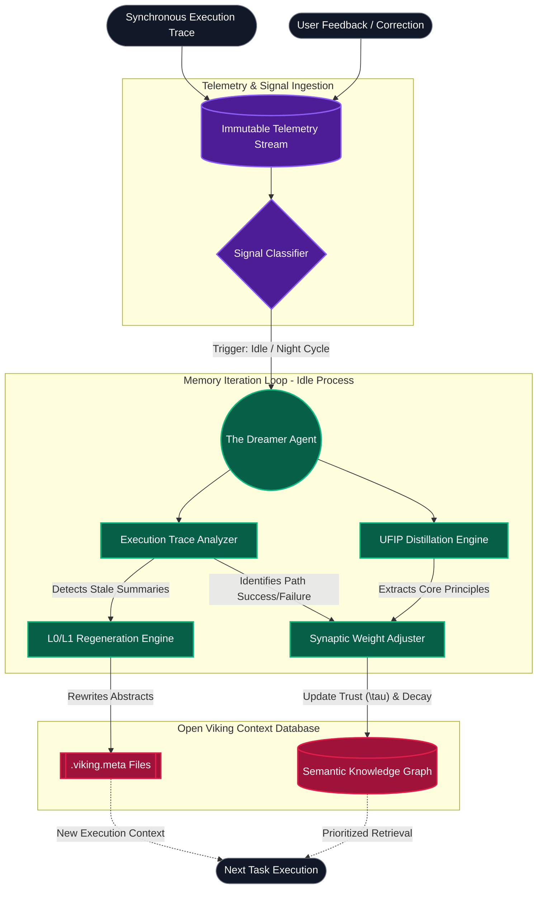

# Project Ember Architecture Document 16: Memory Iteration Loop (MIL) - Asynchronous Neuroplasticity

## 1. Abstract: The Imperative for Continuous Cognitive Evolution

A static intelligence, no matter how vast its initial context or sophisticated its retrieval mechanisms, is inherently brittle. True autonomy and advanced reasoning require a system that not only executes tasks but *learns* from its executions, its failures, and its interactions with the environment and the user. Project Ember introduces the Memory Iteration Loop (MIL), a deeply asynchronous, recursively self-improving subsystem designed to implement artificial neuroplasticity.

Operating in the background, independent of the primary execution thread, the MIL acts as the subconscious processing engine of the Open Viking Context Database. It digests execution traces, analyzes user feedback, re-evaluates the semantic weight of stored knowledge, and rewrites the L0 and L1 contextual abstractions to ensure the agent grows demonstrably smarter, faster, and more aligned with user preferences over time.

This document details the architecture of the MIL, focusing on asynchronous execution analysis, the User Feedback Integration Protocol (UFIP), and the complex synaptic weight adjustment algorithms that govern Ember's memory eviction and consolidation processes.

## 2. Asynchronous Cognitive Processing Architecture

The architecture of Project Ember separates the "conscious" execution of tasks from the "subconscious" consolidation of memory. The conscious thread is synchronous, reactive, and goal-oriented. The subconscious thread (the MIL) is asynchronous, reflective, and optimization-oriented.

### 2.1. The Telemetry Ingestion Pipeline

Every action Ember takes—tool calls, file reads, bash command executions, and terminal outputs—is logged into an immutable, append-only chronological stream called the `viking://system/telemetry_stream`. This is the raw experiential data.

Simultaneously, the system tracks the outcome of these actions. Did a bash command return an exit code of 0? Did the user have to correct Ember's code in the next turn? Did a specific context query yield a successful resolution? These outcomes form the "Reward Signal."

### 2.2. The Night-Cycle / Idle-Cycle Processor

The MIL does not run constantly. It is triggered during periods of I/O wait, user idle time, or during scheduled "Night Cycles." When triggered, the MIL spawns an isolated background sub-agent (the "Dreamer" agent).

The Dreamer agent's primary directive is not to solve a user problem, but to analyze the telemetry stream. It performs:
1. **Trace Reconstruction:** Replaying the sequence of thoughts and actions leading to an outcome.
2. **Error Attribution:** Identifying the root cause of a failure (e.g., "I assumed the API returned JSON, but it returned XML. This was due to an outdated L1 summary in the database").
3. **Success Reinforcement:** Identifying highly efficient pathways (e.g., "Using this specific grep pattern found the result in 100ms instead of 5 seconds").

## 3. User Feedback Integration Protocol (UFIP)

User feedback is the highest-value reward signal in the Ember ecosystem. However, raw user text ("No, do it the other way," "Make it look more modern," "Stop using that deprecated library") is often unstructured and highly contextual.

The UFIP transforms unstructured user corrections into structural memory updates.

### 3.1. Feedback Distillation

When the user provides corrective feedback, the MIL extracts the underlying principle using a specific distillation prompt.
*   **User Input:** "I told you yesterday, we are using Tailwind for this project, stop writing vanilla CSS!"
*   **MIL Distillation:** `Rule Extracted: Global project styling constraint. Technology: TailwindCSS. Antipattern: Vanilla CSS.`

### 3.2. Semantic Embedding and Workspace Rules

The distilled rule is then embedded into the `viking://workspace/.ember/global_directives.json` or attached to the specific directory's `.viking.meta` file as a high-weight constraint. 

Crucially, the MIL also updates the *weights* of tools or approaches. If vanilla CSS resulted in a negative user reward, the internal probability weight of selecting the "write vanilla CSS" approach in this specific workspace is significantly depressed.

## 4. The "Getting Smarter" Mechanism: Artificial Neuroplasticity

Memory in Ember is not a flat file system; it is a weighted graph. The MIL implements artificial neuroplasticity by adjusting the synaptic weights (relevance scores, trust metrics, and volatility indices) of nodes within the Open Viking Context Database.

### 4.1. Synaptic Weight Adjustment in Memory Nodes

Every node in the database possesses a `Trust_Score` $\tau$ and an `Access_Frequency` $\phi$.

When the MIL analyzes a successful task execution, it identifies the memory nodes (L0 abstracts, L1 overviews, specific code files) that contributed to the success. The weights of these nodes are increased using a sigmoidal decay function:

$$ \tau_{t+1} = \tau_t + \eta \cdot R \cdot (1 - \tau_t) $$

Where:
*   $\eta$ is the learning rate.
*   $R$ is the reward signal (1 for success, -1 for failure).

Conversely, if a node provided outdated or misleading information that caused an error, its $\tau$ is penalized. If $\tau$ drops below a critical threshold $\tau_{crit}$, the MIL flags the node for "Active Re-evaluation," prompting the agent to fetch the L2 details and regenerate the L0/L1 summaries to reflect reality.

### 4.2. Eviction and Forgetting Mechanisms

A system that remembers everything eventually drowns in its own noise. The MIL incorporates deliberate forgetting. This is not deletion of the L2 data (the file still exists on disk), but rather the eviction of the concept from the active, high-priority semantic index.

We define a Decay Function $D(t)$ for a memory node $i$:

$$ D_i(t) = \phi_i \cdot e^{-\lambda \cdot \Delta t} \cdot \tau_i $$

Where $\lambda$ is the decay constant and $\Delta t$ is the time since last access.

During an idle cycle, the MIL scans the memory graph. Nodes where $D_i(t) < D_{threshold}$ are compressed. Their L1 overviews are stripped from the active memory cache, leaving only the ultra-lightweight L0 abstract. This mimics biological synaptic pruning, ensuring that Ember's cognitive capacity is reserved for currently relevant paradigms.

## 5. Architectural Diagram: Memory Iteration Loop

The following Mermaid diagram maps the intricate asynchronous workflows of the MIL, detailing how raw experience is transmuted into structural wisdom.

## 6. Recursive Self-Improvement Cycle

The ultimate expression of the MIL is the Recursive Self-Improvement Cycle (RSIC). Because Ember generates its own L0 and L1 abstractions, the quality of its abstractions directly dictates the quality of its future task execution. 

1. **Generation:** Ember writes a complex script.
2. **Abstraction:** The MIL generates an L1 overview of that script.
3. **Utilization:** Weeks later, Ember relies on that L1 overview to use the script.
4. **Correction:** If the L1 overview was ambiguous, Ember might misuse the script. The resulting error trace is caught by the MIL.
5. **Refinement:** The MIL updates its own internal prompt for *how* it generates L1 overviews, realizing that it needs to include type constraints more explicitly.
6. **Regeneration:** The MIL regenerates the L1 overview for the script using the improved abstraction rules.

Through this loop, Ember is not just learning facts about the workspace; it is learning *how to learn* more effectively. It refines its own indexing strategies, discovering through trial and error which semantic markers are most predictive of future utility.

## 7. Mathematical Optimization of Summaries

The goal of the `SummaryGenerator` is to maximize the mutual information between the summary $S$ and the true state of the code $C$, subject to a strict token constraint $T_{max}$.

We formulate this as a constrained optimization problem:
$$ \arg\max_{S} I(S; C) \quad \text{subject to} \quad \text{length}(S) \le T_{max} $$

The MIL uses contrastive learning over its historical telemetry to solve this. It looks at instances where $S$ failed to provide enough context to prevent an error. It calculates the delta between $S$ and $C$ that caused the error, and updates its summarization weights to ensure that specific class of information (e.g., edge-case exceptions, or thread-safety warnings) is prioritized in future abstract generation.

## 8. Conclusion

The Memory Iteration Loop is the biological heartbeat of Project Ember's intelligence. By decoupling task execution from knowledge consolidation, Ember avoids the sluggishness of overly analytical synchronous thought while benefiting from deep, systemic reflection. Through the User Feedback Integration Protocol and rigorous synaptic weight adjustments, Ember transforms from a static, pre-trained model into a dynamic, adaptive entity. It does not merely store information; it cultivates an evolving, highly optimized contextual landscape, ensuring that with every execution, every failure, and every correction, it grows inexorably smarter.
