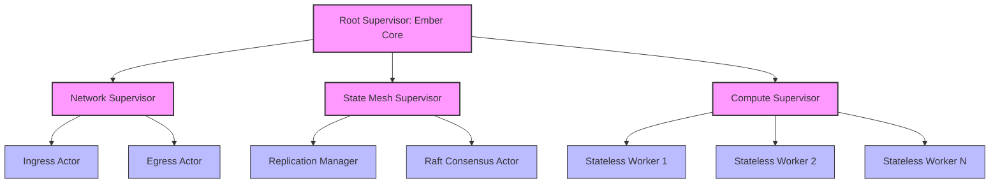
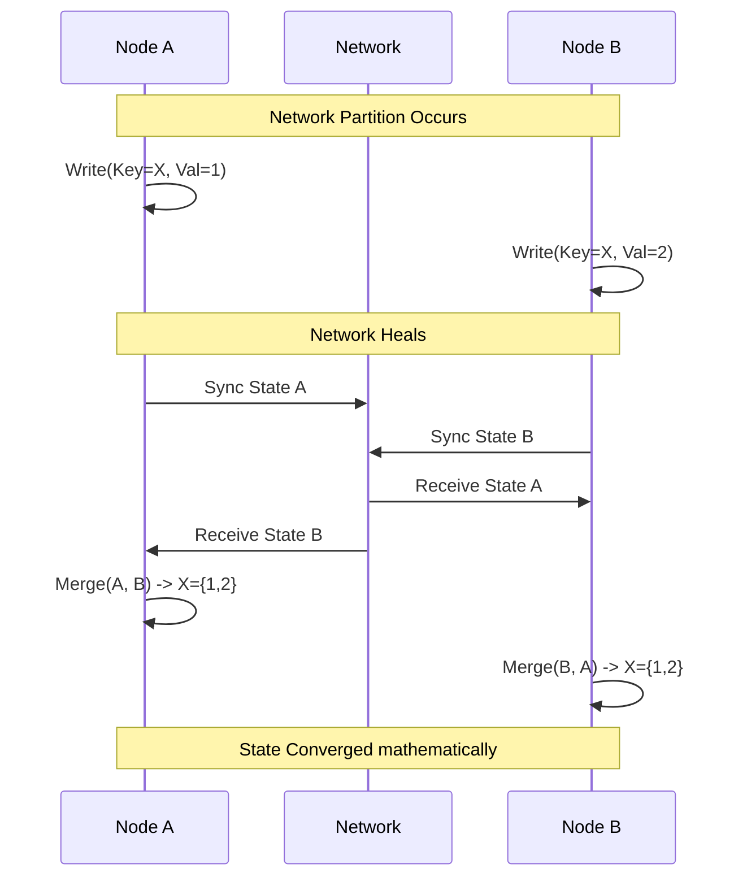

# Open Viking Mythic Plan: Document 17 - Ember Architectural Resilience Core

## 1. Introduction: The Paradigm of Absolute Uptime
Project Ember is not merely designed to achieve high availability; it is architected for eternal uptime—a state of absolute resilience where system termination is mathematically impossible under bounded fault assumptions. Drawing directly from the Open Viking framework, this architectural blueprint redefines how we think about state, compute, and failures. 

Traditional systems treat failure as an exception. In the Ember Architectural Resilience Core (EARC), failure is the baseline assumption. Every component, every actor, and every network boundary is hostile. By employing crash-only software principles and recursive micro-reboot capabilities, Ember ensures that the difference between a cold start and a warm recovery is zero. 

### 1.1 The Crash-Only Philosophy
In Open Viking, graceful shutdown is a forbidden concept. If a system can shut down gracefully, it implies it possesses state that is not safely persisted until the shutdown signal is caught. Ember mandates a strict crash-only architecture: any node or process must be capable of being `kill -9` terminated at any arbitrary millisecond without data corruption or inconsistent states. State is externalized immediately via the Event Mesh, meaning compute nodes are completely stateless and amnesiac.

### 1.2 The Recursive Supervisor Tree
Inspired by Erlang/OTP but elevated through Open Viking’s Rust-based memory-safe actors, Ember utilizes a recursive supervisor tree. Supervisors do not perform business logic; their sole mandate is monitoring the lifecycle of child actors and executing remediation strategies (Restart, Escalate, Terminate) when health checks fail or panic traces are caught.

## 2. Component Isolation and Failure Domains
A fault in Ember cannot propagate. This is the First Law of Ember Resilience. 
Open Viking achieves this via strict logical and physical isolation domains. 

### 2.1 Logical Memory Isolation
Using WebAssembly (Wasm) sandboxing within Rust host environments, every individual request in Ember spawns its own Wasm instance. If the request logic hits a fatal error, out-of-bounds memory access, or infinite loop, the Wasm sandbox is terminated. The blast radius of a bug is strictly limited to the individual request. The host process remains entirely untouched.

### 2.2 Physical Execution Domains
Compute units are distributed across distinct execution domains (cloud availability zones, on-premise racks, edge nodes). The Ember scheduler ensures that replicated state and redundant compute are never co-located within the same failure domain.

## 3. The Omnipresent State Mesh
The concept of a "database" is obsolete in Ember. Instead, Ember relies on an Omnipresent State Mesh—a distributed, causally consistent, CRDT-backed memory fabric.

### 3.1 Conflict-Free Replicated Data Types (CRDTs)
To survive network partitions without sacrificing availability (AP in the CAP theorem), Ember uses state-based and operation-based CRDTs for all mutable state. When a partition occurs, local nodes continue to accept writes. When the partition heals, the CRDTs mathematically guarantee convergence to a single, identical state across the cluster without human intervention or conflict resolution algorithms.

### 3.2 Ephemeral vs. Eternal State
Ember classifies state into two tiers:
1. **Ephemeral State:** Session data, cache, intermediate compute results. Stored in memory, highly replicated, but allowed to vanish on complete cluster failure.
2. **Eternal State:** Financial ledgers, user identities, core configurations. Appended to an immutable distributed log (derived from Open Viking’s append-only fabric) which is continuously flushed to cold storage (e.g., S3/Glacier) and verifiable via cryptographic Merkle proofs.

## 4. Autonomous Remediation Pathways
When an anomaly is detected, human intervention is inherently too slow. Ember operates on a microsecond remediation loop.

1. **Detection:** Telemetry actors sample metrics (latency, error rate, memory pressure) at 1000Hz.
2. **Analysis:** A local AI-driven heuristic agent evaluates the anomaly against known failure signatures.
3. **Execution:** The agent triggers a remediation strategy:
   - *Load Shedding:* Drop lowest-priority traffic instantly.
   - *Circuit Breaking:* Halt outgoing calls to a degraded downstream dependency.
   - *Micro-Reboot:* Terminate and restart the specific failing actor subsystem within 5 milliseconds.

## 5. Security as a Prerequisite to Resilience
Resilience is impossible if the system can be compromised. Ember's security model assumes breach. All internal actor communication is mutually authenticated via mTLS, and every message is cryptographically signed. If an actor goes rogue or is compromised, the surrounding actors will reject its unsigned or maliciously altered messages, effectively quarantining the compromised entity from the rest of the mesh.

## 6. Conclusion of the Core Architecture
The Ember Architectural Resilience Core is the bedrock upon which eternal uptime is built. By assuming failure, enforcing crash-only semantics, utilizing WebAssembly for strict memory isolation, and leveraging CRDTs for partition-tolerant state convergence, Ember ceases to be a traditional application. It becomes a living, breathing distributed organism capable of surviving any digital catastrophe.
