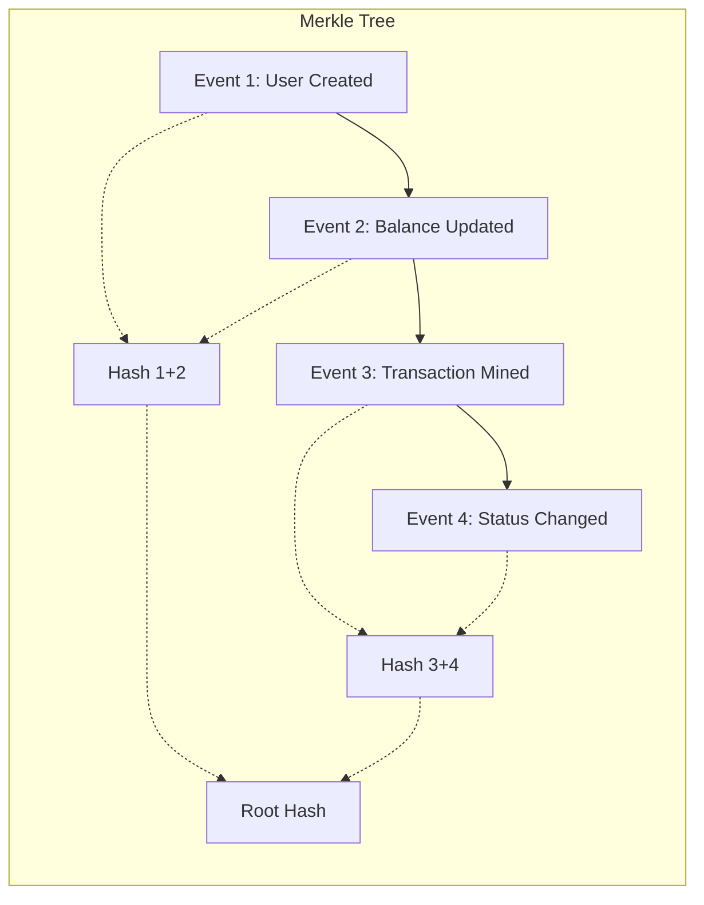
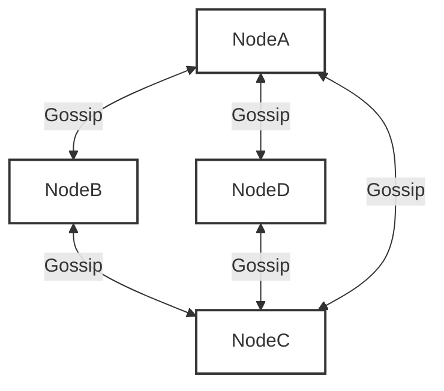

# Open Viking Mythic Plan: Document 18 - Fault Tolerance and State Replication

## 1. The Anatomy of Unbreakable State
In Project Ember, the persistence and replication of state are not delegated to external databases; they are intrinsic properties of the compute fabric itself. Open Viking dictates that compute and state must be co-located for ultra-low latency, yet decoupled for infinite fault tolerance. This paradox is resolved through the Ember State Replication Matrix (ESRM).

### 1.1 The Ledger of Truth
All mutations in Ember are modeled as immutable events appended to a distributed ledger. This append-only log ensures that the system's history is an unbroken, cryptographically verifiable chain.

Any node can instantly verify the integrity of the state by recomputing the Merkle root. If a node suffers bit rot or memory corruption, the mismatch in the hash tree will instantly trigger a localized panic and self-termination, preventing corrupted state from propagating.

## 2. Multi-Tiered Consensus Mechanisms
Not all data requires the same level of consistency. Ember employs a dynamic consensus model that adjusts based on the criticality of the data, maximizing throughput without compromising safety.

### 2.1 The Raft Sub-Clusters
For absolute linearizability (e.g., distributed locks, financial transactions), Ember groups nodes into micro-clusters (typically 3 or 5 nodes) running an optimized variant of the Raft consensus algorithm. 

Unlike traditional Raft, which stalls during leader election, Ember uses a *pipelined leader election* mechanism. When a leader's heartbeat degrades (before a full timeout), the leader preemptively transfers leadership to a highly responsive follower, resulting in zero-downtime leadership transitions.

### 2.2 Quorum-less Eventual Consistency
For high-velocity, non-critical data (e.g., telemetry, presence indicators), Ember bypasses Raft entirely and utilizes Gossip protocols combined with CRDTs. Nodes exchange state vectors probabilistically.

This ensures that even if 90% of the network is partitioned, the remaining 10% can continue to read and write ephemeral data without blocking.

## 3. The Fault Tolerance Heuristics
Fault tolerance is the system's ability to maintain its contract despite internal failures.

### 3.1 Proactive Replica Degradation
Traditional systems wait for a node to fail before replicating its data elsewhere. Ember operates predictively. If a node experiences a 5% increase in CPU thermal throttling, or a slight degradation in disk I/O latency, the ESRM assumes the node is dying. 

It immediately begins shadowing the node's state to healthy peers in the background. When the node eventually hard-fails, the replica is already 99.9% up-to-date, making the failover virtually instantaneous.

### 3.2 Anti-Entropy Sweeps
To combat subtle state divergence caused by dropped network packets that bypassed immediate detection, Ember runs continuous, low-priority Anti-Entropy sweeps. These background processes exchange Merkle tree signatures between nodes. When a divergence is found, only the specific divergent block is transmitted and resolved, minimizing network overhead while guaranteeing eventual absolute consistency.

## 4. Catastrophic Recovery Protocols
What happens if an entire datacenter is vaporized? Ember’s catastrophic recovery protocol is defined by the "Viking Ship" maneuver.

1. **Continuous Geo-Spooling:** Every immutable event log is continuously spooled asynchronously to multi-region cold storage (e.g., S3).
2. **Stateless Ignition:** In a new region, Ember compute nodes boot completely statelessly in milliseconds.
3. **Log Hydration:** The nodes immediately begin streaming the spooled event log from cold storage, replaying the events in memory to rebuild the state CRDTs and Raft logs.
4. **Active-Active Resume:** As soon as the hydration reaches the current timestamp, the new region joins the global mesh and begins accepting traffic.

## 5. Summary
Fault tolerance in Ember is not a bolt-on feature; it is the fundamental physics of the system. By leveraging immutable event logs, dynamic consensus mechanisms, predictive replication, and continuous anti-entropy, Ember achieves a state where data loss requires the simultaneous physical destruction of all participating geographic regions and their cold-storage backups.
