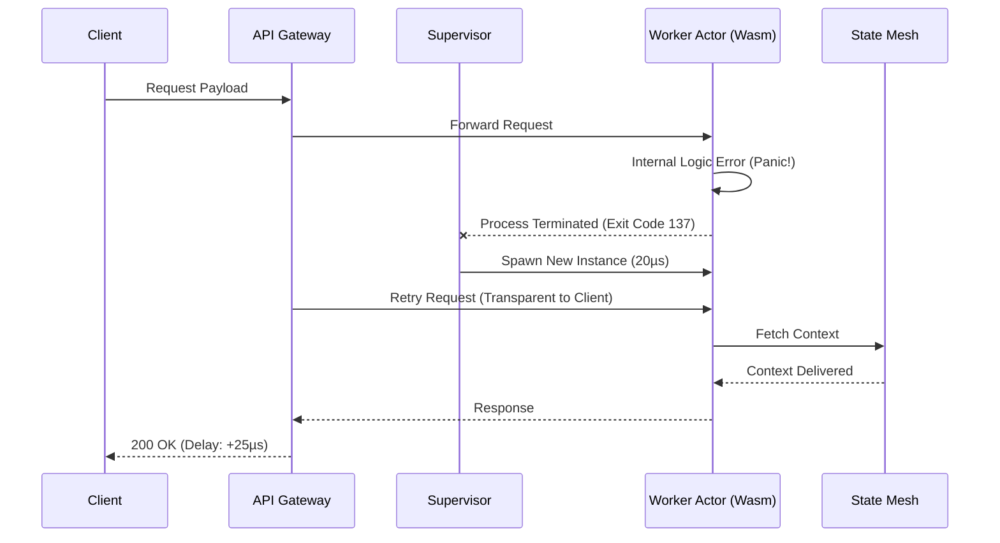

# Open Viking Mythic Plan: Document 19 - Self-Healing Mechanisms in Ember

## 1. Introduction: The Biology of the System
In the paradigm of Project Ember, derived from the core tenets of the Open Viking architecture, a distributed system is viewed not as a mechanical engine, but as a biological organism. Mechanical engines degrade; biological organisms heal. The Self-Healing Mechanisms in Ember (SHME) define a framework wherein the system detects anomalies, diagnoses root causes, and implements remediations without human intervention, maintaining absolute uptime.

Self-healing is the highest tier of system resilience. It requires an architectural commitment to observability, autonomous control loops, and, most importantly, the ability to mutate the system’s topology in real-time. This document explores the deep internals of Ember’s self-healing capabilities, ranging from microscopic actor-level restarts to macroscopic, cross-regional traffic shifts.

## 2. The Micro-Reboot Architecture
The foundational primitive of Ember’s self-healing is the Micro-Reboot. In legacy systems, a memory leak or a deadlock often requires a hard restart of a monolithic process, resulting in dropped connections, cold caches, and significant downtime. In Ember, state and compute are strictly segregated, and logic is encapsulated within lightweight WebAssembly (Wasm) or Rust-based actors.

### 2.1 Crash-Only Semantics and Fast Recovery
When an actor in Ember encounters a corrupted state, a nil pointer deference, or an unhandled exception, it does not attempt to catch the error and limp along. It crashes immediately. This is the `crash-only` philosophy.

Because actors are stateless (their state is held in the Omnipresent State Mesh), the overhead of starting a new actor is measured in microseconds. The Supervisor tree detects the crash and instantly spawns a replacement actor. 



As illustrated, the client is completely unaware that the worker actor handling their request suffered a catastrophic failure. The micro-reboot happens faster than a typical network jitter.

## 3. Autonomous Anomaly Detection
Before a system can heal, it must know it is sick. Ember employs a multi-dimensional observability matrix that goes beyond simple threshold alerts (e.g., "CPU > 90%").

### 3.1 High-Dimensional Telemetry Streams
Every component in Ember emits high-definition, structured telemetry data. This includes:
- **L1 Metrics:** CPU, Memory, Network I/O, Disk I/O.
- **L2 Metrics:** Garbage collection pause times, thread contention, lock acquisition delays, CRDT merge conflict rates.
- **L3 Metrics:** Business logic anomalies, user journey drop-offs, application-specific latency percentiles (p99, p99.9).

### 3.2 The Heuristic Evaluation Engine
These telemetry streams are ingested by localized Heuristic Evaluation Engines (HEE) running as sidecars on every node. The HEE utilizes advanced statistical models (such as Exponential Weighted Moving Averages and localized anomaly detection algorithms) to identify deviations from the baseline.

If the p99 latency of a specific database query slowly creeps up from 10ms to 40ms over a 2-hour window, traditional alarms might not fire because it hasn't crossed a static 50ms threshold. The HEE, however, recognizes the derivative of the latency curve (the rate of change) and flags it as an impending failure.

## 4. The Remediation Control Loop
Once an anomaly is detected and verified, Ember initiates a Remediation Control Loop (RCL). The RCL is an OODA loop (Observe, Orient, Decide, Act) executed at machine speed.

### 4.1 Step 1: Containment
The immediate priority is to stop the bleeding. If a specific service or dependency is identified as the root cause, the RCL deploys dynamic bulkheads.
- **Circuit Breaking:** If an external API is timing out, the circuit breaker trips, instantly returning cached data or fallback responses to prevent cascading thread exhaustion.
- **Load Shedding:** If the node is suffering from severe resource starvation, it begins aggressively dropping low-priority requests (e.g., background syncs, non-critical analytics) to preserve capacity for high-priority transactional traffic.

### 4.2 Step 2: Diagnosis
While containment measures are active, the RCL attempts to diagnose the issue. It correlates logs, traces, and metrics to identify if the issue is hardware-related (e.g., a failing SSD sector causing IO stalls), software-related (a bad code deployment), or network-related (a degraded top-of-rack switch).

### 4.3 Step 3: Execution of Healing Strategies
Based on the diagnosis, the RCL executes a specific healing payload:

#### 4.3.1 Software Degradation: The Rollback
If the anomaly is correlated with a recent deployment, the RCL can autonomously trigger a localized rollback. Ember utilizes Blue/Green deployment at the micro-actor level. If the new "Green" actor exhibits a 2% higher error rate, the traffic router instantly shifts 100% of traffic back to the "Blue" actor and flags the deployment as failed.

#### 4.3.2 Hardware Degradation: The Evacuation
If the node itself is deemed physically compromised (e.g., kernel panics, ECC memory errors), the RCL initiates a Node Evacuation. 
1. The node is marked as `UNSCHEDULABLE`.
2. Existing persistent connections are gracefully drained over a 30-second window.
3. State CRDTs and Raft replicas are migrated to healthy nodes.
4. Once drained, the node is power-cycled via IPMI/BMC interfaces. If it fails health checks upon reboot, it is permanently cordoned for human hardware replacement.

## 5. Advanced Healing: The Antifragile Network
Ember’s network mesh is built on top of a dynamic SD-WAN (Software-Defined Wide Area Network) layer. Network partitions and routing blackholes are inevitable in global deployments.

### 5.1 Route Around Failure
When a link between Datacenter A and Datacenter B degrades, the Ember network fabric does not wait for BGP convergence (which can take minutes). Utilizing aggressive UDP pinging and localized route maps, Ember can dynamically reroute traffic through an intermediary, Datacenter C, in milliseconds. 

```mermaid
graph TD
    DC_A[Datacenter A (US-East)]
    DC_B[Datacenter B (EU-West)]
    DC_C[Datacenter C (US-Central)]
    
    DC_A --x|Fibers Cut / High Packet Loss| DC_B
    DC_A -->|Dynamic Reroute (10ms)| DC_C
    DC_C -->|Forward Traffic| DC_B
    
    style DC_A fill:#2ecc71,stroke:#27ae60,stroke-width:2px;
    style DC_B fill:#2ecc71,stroke:#27ae60,stroke-width:2px;
    style DC_C fill:#f39c12,stroke:#d35400,stroke-width:2px;
```
This multi-hop overlay network ensures that as long as there is a physical path between two nodes, Ember will find it and exploit it, masking massive ISP outages from the end-user.

## 6. The Limits of Self-Healing
It is critical to acknowledge that self-healing has theoretical limits. An AI cannot magically rewrite a logically flawed algorithm that corrupts data. Ember addresses this by enforcing strict immutability. If data corruption is detected, the self-healing mechanism does not try to "fix" the data; it discards the corrupted state and replays the immutable event log from the last known good snapshot.

## 7. Conclusion
Ember’s Self-Healing Mechanisms transform the operational paradigm. Instead of pager duty waking up engineers at 3 AM to restart a service, the system detects the anomaly at 3:00:01 AM, isolates the fault, spawns a replacement, drains the failing node, and sends a low-priority Slack message at 9 AM detailing what the system fixed while the team slept. This is the realization of the Open Viking promise: a system that heals itself faster than humans can even perceive the damage.
