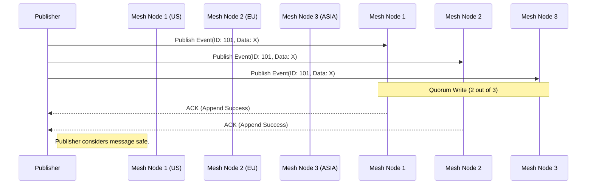

# Open Viking Mythic Plan: Document 20 - Crash-Proofing the Event Mesh

## 1. Introduction: The Central Nervous System
If the compute actors are the muscle and the CRDT state store is the memory, the Event Mesh is the central nervous system of Project Ember. Every piece of data, every state transition, and every inter-service communication flows through this asynchronous fabric. 

Derived from Open Viking's advanced message-passing architectures, the Ember Event Mesh is designed to be physically incapable of losing a message, even if 90% of the nodes hosting the mesh are abruptly destroyed. This document details the architectural decisions, cryptographic proofs, and distributed systems theories that make the Event Mesh completely crash-proof.

## 2. The Fallacy of Traditional Message Brokers
Traditional message brokers (like RabbitMQ or basic Kafka setups) rely on a primary-replica model. If the primary node crashes, a replica must be promoted. During this promotion window (which can take seconds), writes are either blocked (causing upstream backpressure and potential cascading failures) or accepted asynchronously (risking data loss if the primary cannot recover).

Furthermore, traditional brokers struggle with "split-brain" scenarios where network partitions cause multiple nodes to believe they are the leader, leading to divergent message logs.

## 3. Ember's Log-Structured Immutable Fabric
Ember discards the primary-replica model in favor of a decentralized, log-structured immutable fabric. The Event Mesh is composed of thousands of micro-partitions distributed globally.

### 3.1 The Append-Only Immutable Log
Every message sent to the mesh is treated as a sacrosanct, immutable fact. Messages are never updated or deleted; they are only appended.



When a publisher emits an event, it broadcasts the event to a mathematically defined quorum of nodes. The publisher only considers the message successfully transmitted once it receives cryptographic ACKs from a majority of the quorum. If a node crashes during the write, the publisher simply attempts a write to a different node in the mesh, ensuring zero blocking.

### 3.2 Eradicating Split-Brain with Vector Clocks
To guarantee exact once-and-only-once processing semantics and prevent split-brain inconsistencies, Ember utilizes Hybrid Logical Clocks (HLCs) and Vector Clocks embedded within every event payload.

If a network partition occurs and two sides of the mesh continue accepting events, the Vector Clocks strictly define the causal relationship between all events. When the partition heals, the Event Mesh mathematically merges the logs. Because events are immutable, there are no merge conflicts—the system simply interleaves the events based on their causal history, resulting in a single, universally agreed-upon sequence of facts.

## 4. Crash-Proofing Storage: The Zero-Trust Disk Model
Hardware fails. SSDs suffer from bit flips, silent data corruption, and sudden death. Ember’s Event Mesh assumes the underlying disk is actively hostile and attempting to corrupt data.

### 4.1 Cryptographic Chain of Custody
When a message is written to disk by a Mesh Node, it is hashed (using blake3). The hash is cryptographically signed and appended to a Merkle tree that represents the entire state of that partition. 

During read operations, the Mesh Node re-hashes the data and validates it against the Merkle root. If the disk has corrupted the data, the validation fails instantly. The node will refuse to serve the corrupted data and will instead transparently fetch a healthy copy from a peer node over the network, heal its own disk by overwriting the corrupted sector, and then serve the request. 

### 4.2 Ephemeral Disk Architectures
In extreme deployments, Ember nodes can operate entirely entirely without persistent disks (diskless booting). The Event Mesh operates purely in RAM, utilizing NVMe-over-Fabrics (NVMe-oF) to continuously stream the immutable log to centralized, highly durable, geographically separated cold storage arrays. 

If power is cut to a datacenter, the in-memory mesh is lost, but the events were already streamed to cold storage. Upon reboot, the nodes PXE boot, hydrate their memory from cold storage, and resume operations in seconds.

## 5. Backpressure and Catastrophic Load Handling
A system must be resilient not just to hardware failure, but to extreme, sudden spikes in load (e.g., a massive DDOS attack or a viral user event). If the Event Mesh cannot handle the throughput, it must degrade gracefully, not crash.

### 5.1 Algorithmic Load Shedding
Ember utilizes sophisticated, token-bucket based rate limiting at the network edge. But deeper within the mesh, it uses Algorithmic Load Shedding. 

Messages are tagged with priority levels (e.g., P0 for financial transactions, P3 for telemetry). If a Mesh Node detects its internal queue depth exceeding 80% capacity, it automatically begins dropping P3 messages. If the load continues to rise, it drops P2, and so on. The publisher receives a specific `429 Too Many Requests (Shedded)` response, instructing it to back off and retry later, or drop the payload entirely if it's ephemeral.

```mermaid
graph TD
    Ingress[Ingress Traffic: 100k Req/s] --> NodeQueue[Mesh Node Queue]
    
    NodeQueue -->|Capacity < 50%| ProcessAll[Process All Messages (P0, P1, P2, P3)]
    NodeQueue -->|Capacity > 80%| ShedP3[Drop P3 (Telemetry)]
    NodeQueue -->|Capacity > 95%| ShedP2[Drop P2 (Analytics)]
    NodeQueue -->|Capacity = 100%| ShedP1[Drop P1, Process ONLY P0 (Transactions)]
    
    ShedP3 --> Alert[Trigger Auto-Scaling]
    ShedP2 --> Alert
    ShedP1 --> Alert
    
    classDef critical fill:#e74c3c,stroke:#c0392b,stroke-width:2px,color:#fff;
    class ShedP1 critical;
```

This ensures that the core business logic (P0) continues to flow smoothly even when the system is under an apocalyptic load that would cause traditional message brokers to exhaust their memory and crash.

## 6. Continuous Mesh Verification
To ensure the Event Mesh is genuinely crash-proof, it must be continuously tested. Ember runs an internal daemon known as the "Chaos Monkey's Vicious Cousin." This daemon continuously and randomly terminates Mesh Nodes, introduces network latency, corrupts disk sectors, and alters packet payloads in production. 

Because the Event Mesh is mathematically proven to handle these faults, this continuous adversarial testing causes zero downtime. It merely serves as a constant verification that the self-healing and fault-tolerant mechanisms are functioning correctly. If a vulnerability exists, the internal daemon will find it and trigger an automated rollback or isolation protocol before an external adversary or natural disaster can exploit it.

## 7. Conclusion
The Ember Event Mesh is the realization of absolute durability. By combining decentralized quorum writes, immutable log structures, continuous cryptographic verification, and aggressive algorithmic load shedding, the mesh transcends traditional concepts of reliability. It is a communication fabric that is fundamentally crash-proof, capable of guaranteeing message delivery and exact-order processing in the face of near-total systemic destruction.
