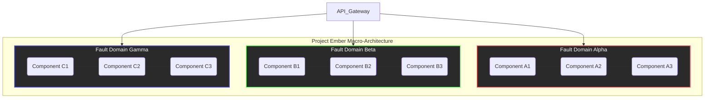
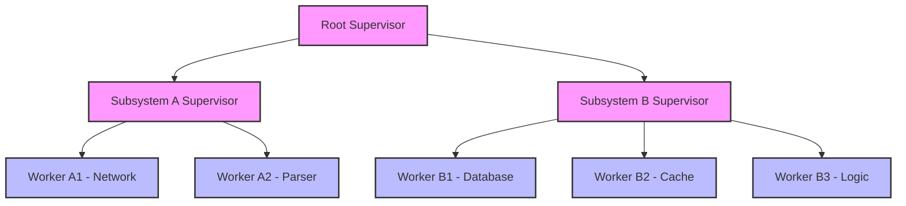

# Open Viking Mythic Plan: Document 21 - Crash-Proof Architecture

## 1. Introduction: The Imperative of Crash-Proofing Project Ember

In the relentless pursuit of systemic perfection, Project Ember must transcend traditional paradigms of software reliability. The Open Viking Mythic Plan demands an architecture that does not merely attempt to avoid failure, but structurally pre-empts the catastrophic cascade of systemic collapse. A "crash-proof" system is not one where errors never occur—such an expectation violates the fundamental entropy of complex distributed environments—but rather one where errors are isolated, contained, and neutralized before they can impact the broader operational matrix. 

Project Ember must be fortified with an impenetrable architectural foundation, engineered to withstand the most severe localized failures without yielding its global operational integrity. This document, the twenty-first in the Open Viking Mythic Plan, meticulously delineates the strategies, theoretical frameworks, and structural implementations required to forge a truly crash-proof architecture for Project Ember. We will explore advanced compartmentalization, supervisor hierarchies, state preservation, and the philosophical shift from brittle perfection to anti-fragile resilience.

## 2. Core Tenets of Stability and Resilience

To achieve a crash-proof state, Project Ember must adhere to several non-negotiable architectural tenets:

*   **Assumption of Failure:** The system must be designed with the explicit assumption that every component, at some point, will fail. Hardware will degrade, networks will partition, and edge-case logic will be triggered.
*   **Isolation by Default:** Components must be hermetically sealed from one another. A fault in one module must be mathematically proven to be incapable of corrupting the memory, state, or execution thread of another module.
*   **Asynchronous Decoupling:** Synchronous, blocking calls are the enemy of resilience. Systems must communicate via asynchronous messaging queues to prevent localized latency or failure from back-pressuring the entire system.
*   **Immutability of State:** Mutable shared state is the primary vector for unpredictable crashes. By enforcing immutability and relying on event sourcing, the system can always reconstruct its state and avoid concurrent modification anomalies.
*   **Let It Crash (Gracefully):** Drawing inspiration from telecommunications architectures, we must embrace the philosophy of rapid localized termination. When an unrecoverable error occurs, the component should immediately crash and be restarted by a supervisor from a clean, known-good state, rather than lingering in a corrupted, unpredictable state.

## 3. The Isolation Principle: Advanced Compartmentalization

Compartmentalization is the primary defense mechanism against catastrophic cascading failures. In Project Ember, this principle must be applied at every tier of the architecture, from macroscopic service boundaries down to microscopic thread-level execution contexts.

### Micro-Isolation Environments

Instead of running monolithic processes, Project Ember must employ micro-isolation environments. Each discrete unit of work should execute within its own isolated sandbox. This can be achieved through ultra-lightweight containers, WebAssembly (Wasm) modules, or actor-model paradigms. If a specific task encounters a fatal exception—such as a segmentation fault, out-of-memory error, or unhandled panic—the sandbox is instantly obliterated. Because the sandbox shares no memory or execution context with the host or other sandboxes, the crash is entirely contained.

### Bulkheads and Fault Domains

Inspired by naval engineering, "bulkheads" must be integrated into the system's communication and resource allocation layers. If a ship's hull is breached, bulkheads prevent the water from flooding the entire vessel. Similarly, in Project Ember, resource pools (such as connection limits, memory allocations, and CPU shares) must be rigidly partitioned. 

If a specific service or tenant begins consuming excessive resources due to an infinite loop or external attack, it will only exhaust its allocated bulkhead. Other services, operating within their own bulkheads, will remain unaffected. This requires strict enforcement of quotas and limits at the orchestration layer.

## 4. Supervisor Trees: The Erlang Paradigm

To manage the lifecycle of isolated components and handle their inevitable crashes, Project Ember must implement robust Supervisor Trees. This architectural pattern, famously utilized in Erlang and Elixir for building highly concurrent and fault-tolerant telecommunications switches, provides a structural approach to process management.

### The Hierarchical Command Structure

In a Supervisor Tree, processes are organized hierarchically. "Worker" processes perform the actual computational labor, while "Supervisor" processes exist solely to monitor the workers. A supervisor does not perform business logic; its only responsibility is to watch its children. 

If a worker process crashes, the supervisor detects the termination and immediately consults its predefined restart strategy. It can restart the worker, restart a group of related workers, or, if the error rate exceeds a specific threshold, escalate the failure by crashing itself. This escalation bubbles up the tree until a supervisor capable of handling the macro-level failure (perhaps by resetting an entire subsystem) is reached.

### Restart Strategies

Project Ember's supervisors must be configured with specific restart strategies based on the nature of the workers they oversee:

1.  **One-For-One:** If a worker crashes, only that specific worker is restarted. This is ideal for isolated tasks that do not share state with their siblings.
2.  **One-For-All:** If one worker crashes, the supervisor terminates all its sibling workers and restarts them all simultaneously. This is necessary when workers are tightly coupled and depend on each other's state to function correctly.
3.  **Rest-For-One:** If a worker crashes, the supervisor terminates only the workers that were started *after* the crashed worker, and then restarts them in order. This handles initialization dependencies.

## 5. State Management, Immutability, and Rehydration

A crash is only devastating if it results in data loss or state corruption. Project Ember must decouple its computational state from its persistent state to ensure that any crashed component can be instantly rehydrated and resume operations.

### Event Sourcing and the Immutable Ledger

Project Ember should leverage Event Sourcing as its primary state management paradigm. Instead of storing the *current* state of an entity in a database (which can be corrupted mid-write during a crash), the system records a sequence of immutable events representing changes to the entity over time.

The current state is derived by replaying these events from the beginning. If a component crashes while processing an event, the event remains unprocessed in the log. When the component is restarted, it simply reads the immutable log, reconstructs its state up to the point of failure, and processes the next event. This guarantees absolute transactional integrity and eliminates the possibility of partial state updates.

### State Rehydration Protocols

When a worker process is restarted by a supervisor, it undergoes a rapid rehydration protocol. It fetches its initial state snapshot from an ultra-fast, highly available in-memory data grid (such as Redis or Memcached clusters configured for high availability) and then replays any localized event logs. This process must be highly optimized, utilizing parallelized state retrieval to ensure the component returns to a ready state in milliseconds, minimizing the impact of the crash on overall system latency.

## 6. Dead-Letter Queues and Poison Pill Handling

In an asynchronous messaging architecture, a "poison pill" is a specific message or payload that deterministically causes the receiving component to crash. If a worker process crashes upon receiving a poison pill, is restarted by the supervisor, and immediately pulls the same poison pill from the queue, an infinite crash-loop occurs, monopolizing system resources.

### Automated Isolation of Toxic Payloads

Project Ember must implement rigorous message lifecycle management. Every message traversing the system must carry metadata regarding its processing attempts. If a message causes a worker to crash repeatedly (e.g., exceeding a threshold of 3 retries), the message must be automatically intercepted by the queueing infrastructure and routed to a specialized Dead-Letter Queue (DLQ).

The DLQ serves as a quarantine zone for toxic data. Once isolated, the poison pill can no longer harm the active workers. Human operators or specialized diagnostic AI agents can then analyze the payloads in the DLQ to identify the root cause of the crash (e.g., a malformed JSON payload, an unexpected null byte, or an edge-case data combination) without the system suffering ongoing degradation.

## 7. Continuous Chaos Engineering

A crash-proof architecture cannot be theoretical; it must be continuously validated in the crucible of production-like environments. Project Ember must integrate Chaos Engineering as a fundamental operational practice.

### The Chaos Engine

A dedicated automated system, known as the Chaos Engine, must be deployed to intentionally inject failures into the environment. This engine will pseudorandomly terminate worker processes, sever network connections between bulkheads, exhaust memory limits, and introduce extreme latency into asynchronous queues.

### Validating the Supervisors

The primary goal of the Chaos Engine is to validate the effectiveness of the Supervisor Trees and the isolation mechanisms. When the Chaos Engine kills a critical component, the system's telemetry must confirm that:
1.  The failure was isolated to the intended bulkhead.
2.  The supervisor detected the crash instantly.
3.  The appropriate restart strategy was executed.
4.  The component rehydrated its state successfully.
5.  Global system metrics (error rates, p99 latency) remained within acceptable Service Level Objectives (SLOs) during the recovery period.

By constantly breaking the system in controlled ways, Project Ember ensures that its crash-proof mechanisms are never allowed to atrophy, and that unseen architectural vulnerabilities are exposed and rectified before they can cause genuine outages.

## 8. Conclusion: The Paradigm of Anti-Fragility

The ultimate objective of the Open Viking Mythic Plan's architectural directives is to move Project Ember beyond mere robustness into the realm of anti-fragility. A robust system withstands a shock and remains unchanged; an anti-fragile system experiences a shock and improves.

By implementing micro-isolation, Supervisor Trees, Event Sourcing, and continuous Chaos Engineering, Project Ember transforms crashes from catastrophic events into routine, expected, and seamlessly handled occurrences. The system learns from its failures, isolates its weaknesses, and perpetually self-optimizes, ensuring unparalleled resilience and unwavering stability in the face of absolute chaos. This is the essence of the Vanguard's vision.
