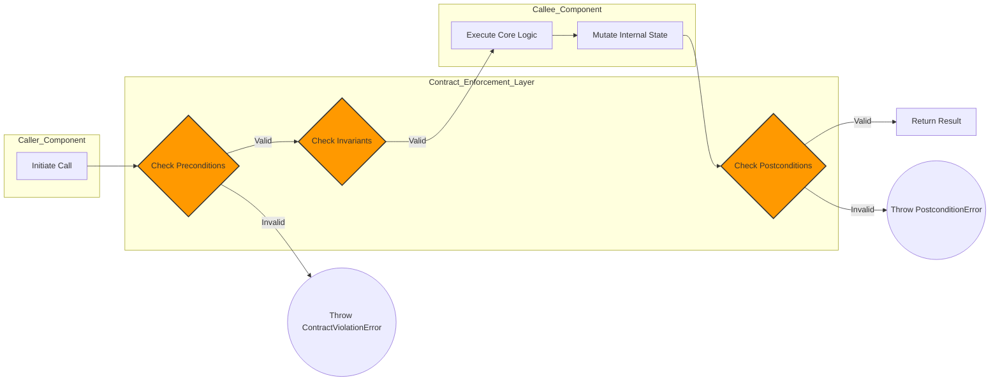
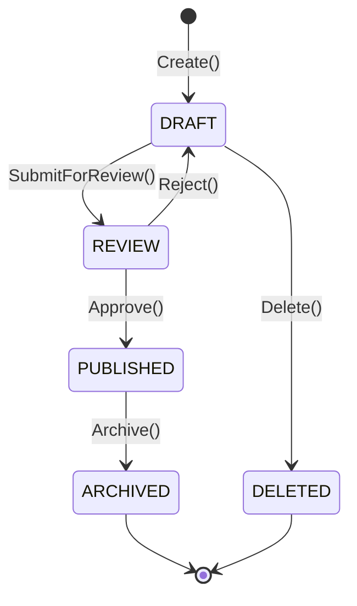

# Open Viking Mythic Plan: Document 22 - Bug-Resistant Design Patterns

## 1. Introduction: Eradicating the Vector of Human Error

While Document 21 established the macro-architectural defenses against systemic collapse, this document, the twenty-second of the Open Viking Mythic Plan, focuses on the microscopic and logic-level defenses. A truly resilient system must not only survive crashes but must proactively prevent logical errors, data corruption, and unintended behaviors from entering the codebase in the first place. Project Ember requires a paradigm shift from reactive debugging to proactive bug-resistance.

Bug resistance is the discipline of structuring code, enforcing boundaries, and utilizing advanced type theories to make it mathematically or structurally impossible for entire classes of errors to exist. This document details the implementation of defensive programming, formal verification principles, immutability, state machines, and rigorous boundary enforcement to forge a codebase that inherently repels defects.

## 2. Defensive Programming and Design by Contract

Project Ember must discard the assumption of benevolent inputs and flawless internal interactions. Defensive programming dictates that every function, module, and service must treat all incoming data and external state as fundamentally hostile and untrustworthy.

### Design by Contract (DbC)

To institutionalize defensive programming, Project Ember must adopt Design by Contract. Under DbC, the interactions between software components are defined by strictly enforced, formal agreements. These contracts consist of:

*   **Preconditions:** What must be demonstrably true *before* a function is executed. (e.g., "The input integer must be greater than zero," "The user must be authenticated," "The database connection must be active"). If a precondition is violated, the function refuses to execute, preventing the propagation of invalid state.
*   **Postconditions:** What the function guarantees to be true *after* it executes successfully. (e.g., "The returned array will be sorted," "The record will be committed to the ledger"). This allows calling components to trust the output implicitly.
*   **Invariants:** Conditions that must remain true throughout the lifetime of an object or systemic state. (e.g., "The account balance cannot be negative").

By codifying these contracts into the runtime—either through specialized assertions, contract-aware compilers, or middleware—Project Ember ensures that logic errors trigger immediate, highly localized exceptions rather than silent data corruption.

## 3. Immutability and Pure Functions

The vast majority of elusive, difficult-to-reproduce bugs (such as race conditions, concurrent modification exceptions, and temporal coupling) stem from shared mutable state. Project Ember must eliminate mutable state wherever possible in favor of functional programming paradigms.

### The Power of Pure Functions

A pure function possesses two defining characteristics:
1.  **Deterministic:** Given the same input, it will always return the exact same output. It relies on no hidden global state or external variables.
2.  **No Side Effects:** It does not modify any state outside its own scope. It does not write to databases, modify global variables, or alter the input arguments.

By constructing the core business logic of Project Ember almost entirely out of pure functions, we create highly testable, predictable, and thread-safe modules. Bugs become isolated to specific, easily traceable logical transformations, rather than emerging from the chaotic interaction of parallel threads mutating a shared memory space.

### Immutable Data Structures

When data must be updated, it is not modified in place. Instead, a new, modified copy of the data structure is created, leaving the original intact. Advanced immutable data structures (like persistent tries) share memory for the unchanged portions, making this process highly efficient. Immutability ensures that data cannot be corrupted by asynchronous operations, significantly reducing the cognitive load on developers and the probability of state-related bugs.

## 4. Advanced Type Systems and Domain Modeling

Relying on basic primitive types (strings, integers, booleans) is a vulnerability. "Primitive Obsession" allows invalid data to flow through the system undetected until it causes a failure deep within the logic.

### Making Illegal States Unrepresentable

Project Ember must leverage advanced static typing features (such as Algebraic Data Types, Refinement Types, or strict object wrappers) to make invalid domain states computationally unrepresentable. 

For example, an email address should never be passed around as a simple `String`. It must be parsed and wrapped in an `EmailAddress` type at the system boundary. Once instantiated, the type system itself guarantees that the value is a valid email. Functions that require an email address demand the `EmailAddress` type, not a string. This eliminates the need for redundant validation logic throughout the codebase and prevents "stringly-typed" errors.

Similarly, state transitions should be encoded in the type system. If a document must be "Drafted" before it can be "Published," the type system should ensure that the `publish()` function only accepts a `DraftDocument` type and returns a `PublishedDocument` type, making it impossible to accidentally publish an un-drafted entity.

## 5. State Machine Driven Logic

Complex workflows with multiple states and transitions are notorious breeding grounds for bugs. Ad-hoc boolean flags (e.g., `is_active`, `is_pending`, `has_error`) quickly lead to contradictory states (e.g., `is_active = true` AND `has_error = true`).

### Finite State Machines (FSM)

To combat this, Project Ember must strictly model all complex entities using Finite State Machines. An FSM defines:
1.  A finite number of allowed **States**.
2.  The defined **Events** that can occur.
3.  The strict **Transitions** between states triggered by specific events.

By centralizing the state logic within an FSM, the system structurally prevents invalid transitions. If an entity is in the `PENDING` state, and it receives an event that is only valid for the `ACTIVE` state, the FSM formally rejects the event, preventing the entity from entering a corrupted, undefined condition.

## 6. Idempotency by Default

In a distributed system, network unreliability means that messages will occasionally be retried. If an operation is not idempotent, a retry can cause massive data corruption (e.g., charging a customer's credit card twice).

### Designing Idempotent APIs

Every state-mutating operation within Project Ember must be designed to be idempotent. An operation is idempotent if executing it multiple times yields the same systemic state as executing it exactly once.

This is typically achieved through:
*   **Idempotency Keys:** Every incoming request must contain a unique cryptographic identifier generated by the client. The server tracks these keys. If it receives a duplicate key, it knows it is a retry and simply returns the cached result of the original successful operation, avoiding re-execution.
*   **Absolute State Updates:** Instead of relative updates (e.g., "Add $10 to the balance"), APIs should use absolute updates (e.g., "Set the balance to $110") or rely on the Event Sourcing architecture described in Document 21, where the event ID serves as the idempotency marker.

## 7. Rigorous Testing Paradigms: Beyond Unit Tests

While unit tests are necessary, they are insufficient for achieving true bug-resistance. Unit tests only verify the scenarios the developer anticipated. Project Ember must employ advanced testing methodologies to uncover the unknown unknowns.

### Property-Based Testing

Instead of testing specific inputs and expected outputs (e.g., `assert(add(2, 2) == 4)`), Property-Based Testing defines the universal properties that a function must hold true, and generates thousands of random, adversarial inputs to attempt to falsify those properties.

For a sorting algorithm, the properties might be:
1.  The output array contains the same elements as the input array.
2.  For any index `i`, `array[i] <= array[i+1]`.

The framework will generate massive arrays, empty arrays, arrays with negative numbers, nulls, and bizarre unicode strings. If any generated input violates the properties, the framework automatically minimizes the input to find the smallest possible failing test case, exposing edge-case bugs that human testers would never conceive.

### Mutation Testing

To verify the quality of the test suite itself, Project Ember must use Mutation Testing. This involves a tool intentionally injecting bugs (mutations) into the source code (e.g., changing a `<` to a `<=`, or deleting a line of logic). If the test suite passes despite the injected bug, it indicates that the tests are weak or missing assertions. The goal is to "kill" every mutant, ensuring the test suite is an impenetrable barrier against regressions.

## 8. Conclusion: The Impregnable Codebase

Bug-resistance in Project Ember is not achieved through hoping developers write perfect code. It is achieved through structural engineering: utilizing Design by Contract, enforcing immutability, leveraging advanced type systems, modeling via State Machines, and mandating idempotency.

By restricting the possible avenues for error through rigorous architectural constraints and validating those constraints with Property-Based and Mutation testing, the Open Viking Mythic Plan ensures that Project Ember’s codebase becomes an impregnable fortress, structurally incapable of manifesting the debilitating logical defects that plague lesser systems.
