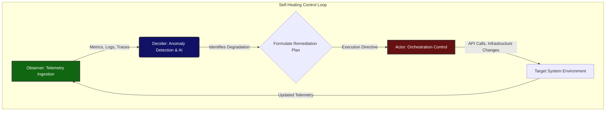
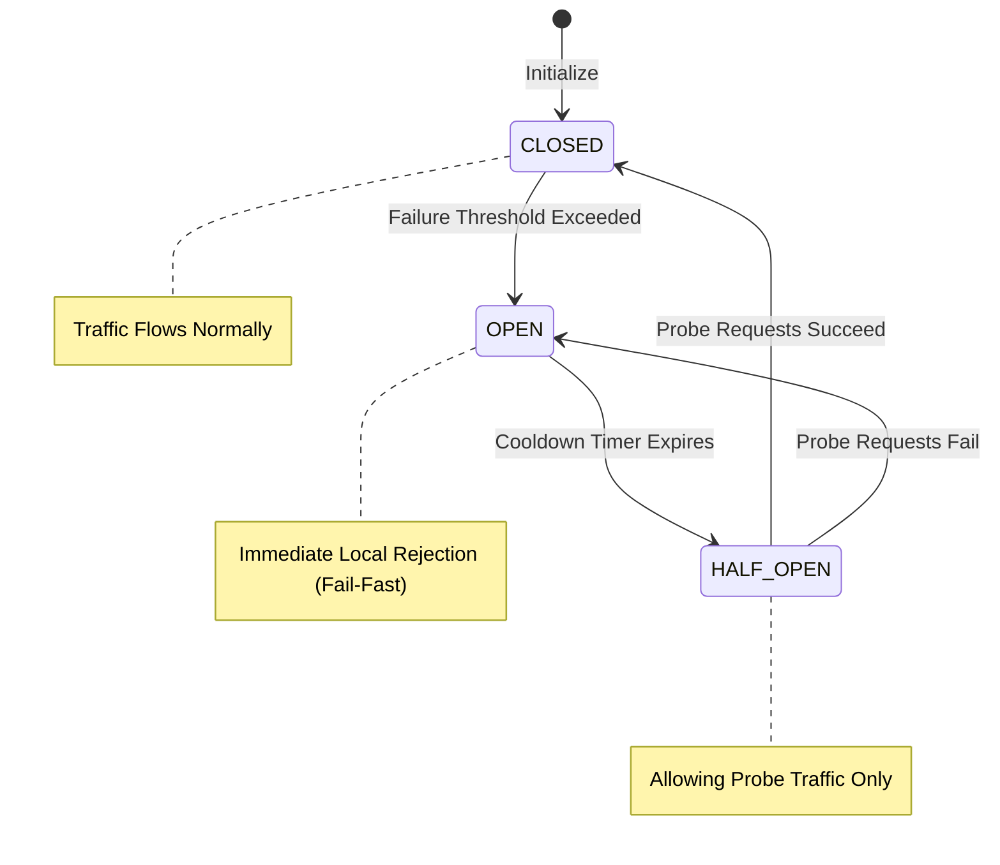

# Open Viking Mythic Plan: Document 23 - Self-Healing Mechanisms and Autonomous Recovery

## 1. Introduction: The Biological Imperative of Digital Systems

The preceding documents detailed architectures designed to survive crashes (Document 21) and repel logical defects (Document 22). However, a truly Mythic system must possess an active, dynamic response to degradation. Project Ember must not merely endure damage; it must actively detect, diagnose, and repair its own anomalies without human intervention. This is the domain of Autonomic Computing and Self-Healing.

Document 23 of the Open Viking Mythic Plan mandates the creation of autonomous recovery protocols. We must imbue Project Ember with a digital immune system—a continuous, closed-loop mechanism that monitors the health of the application, detects pathological states, isolates the "infection," and regenerates the affected components. This document explores the Observer-Decider-Actor loop, automated rollbacks, advanced circuit breakers, and predictive anomaly resolution.

## 2. The ODA Loop: Observer-Decider-Actor

The foundational architecture of self-healing in Project Ember is the continuous control loop, modeled on the Observer-Decider-Actor (ODA) paradigm (also related to the military OODA loop).

*   **Observer (Sensory Layer):** This tier is responsible for ubiquitous, high-fidelity telemetry. It ingests metrics, distributed traces, log streams, and hardware statistics. The Observer does not analyze; it merely aggregates and standardizes the massive stream of operational data in real-time.
*   **Decider (Cognitive Layer):** This is the brain of the self-healing system. It utilizes deterministic algorithms, statistical baselines, and Machine Learning models to analyze the Observer's data. The Decider identifies anomalies (e.g., "Latency in Service X has deviated 3 standard deviations from the historical norm") and formulates a remediation strategy based on a predefined playbook.
*   **Actor (Execution Layer):** Once a remediation strategy is formulated, the Actor executes it. This might involve restarting a pod, scaling up database read replicas, flipping a feature flag, or diverting traffic to a secondary geographic region.

The ODA loop must operate continuously, with a reaction latency measured in milliseconds to seconds, ensuring that degradation is addressed before it escalates into a catastrophic outage.

## 3. Circuit Breakers: Preventing Cascading Exhaustion

When a downstream dependency (such as a database, a third-party API, or an internal microservice) begins to fail or experience severe latency, synchronous upstream services will quickly exhaust their connection pools waiting for timeouts. This leads to a cascading failure across the entire system.

Project Ember must deploy advanced Circuit Breaker patterns at every integration point to autonomously prevent this exhaustion.

### The Tri-State Breaker Mechanism

A Circuit Breaker operates in three distinct states:

1.  **CLOSED (Normal Operation):** Requests flow freely to the downstream dependency. The breaker monitors the failure rate (e.g., HTTP 500s or timeouts).
2.  **OPEN (Fail-Fast):** If the failure rate exceeds a critical threshold (e.g., 20% failure over 10 seconds), the circuit "opens." All subsequent requests are immediately rejected locally with a fast error or fallback response. This provides immediate relief to the struggling downstream dependency, allowing it time to recover, and prevents the upstream service from exhausting its threads.
3.  **HALF-OPEN (Probe State):** After a predetermined cooldown period, the breaker transitions to Half-Open. It allows a minimal amount of "probe" traffic through to test the downstream dependency. If the probes succeed, the circuit resets to CLOSED. If they fail, it immediately reverts to OPEN and resets the cooldown timer.

By implementing this autonomous mechanism, Project Ember dynamically severs pathological connections, containing the damage and allowing local self-healing to take place.

## 4. Automated Rollbacks and Progressive Delivery

A significant percentage of system outages are caused by the deployment of flawed code or configuration changes. Self-healing must therefore encompass the deployment pipeline itself.

### The Canary in the Coal Mine

Project Ember must completely abandon immediate global deployments. Instead, updates must utilize Progressive Delivery (Canary Releases). A new version of a service is deployed alongside the old version, and initially receives only a minuscule fraction of live traffic (e.g., 1%).

### Autonomous Reversion Protocols

The Decider component of the ODA loop intensely monitors the telemetry of the new Canary deployment, comparing its error rates, latency, and resource consumption against the stable baseline of the old version. 

If the Decider detects a statistically significant degradation in the Canary's performance, the self-healing protocol initiates an **Automated Rollback**. The Actor instantly reroutes the 1% of traffic back to the stable version and terminates the flawed Canary deployment. This entire process happens autonomously, in seconds, before human operators are even aware a problem occurred, guaranteeing that bad deployments heal themselves instantly.

## 5. Adaptive Rate Limiting and Load Shedding

When Project Ember faces a sudden, massive influx of traffic (a "thundering herd" or a DDoS attack), traditional static resource scaling may be too slow to prevent the system from being overwhelmed. Self-healing requires the ability to autonomously shed load to preserve core functionality.

### Priority-Based Load Shedding

Not all traffic is equal. A checkout transaction is more critical than a background telemetry ping. Project Ember must implement priority tagging on all incoming requests.

When the system detects resource saturation (e.g., CPU > 90%, Queue Depth > 10,000), it autonomously activates Load Shedding. The system begins systematically rejecting lower-priority requests (returning 429 Too Many Requests or 503 Service Unavailable) to ensure that sufficient resources remain to process high-priority, critical transactions. 

As the load subsides, the system autonomously relaxes the limits, restoring full functionality. This ensures the system bends under pressure but never breaks.

## 6. Process Resurrection and Memory Leak Neutralization

Despite rigorous bug-resistance (Document 22), slow memory leaks or subtle thread deadlocks can occasionally manifest over extended uptimes.

### Automated Garbage Collection Forcing and Resurrection

The Observer layer continuously monitors the memory heap and garbage collection (GC) cycles of all processes. If a process exhibits a distinct "sawtooth" memory pattern indicating a slow leak, or if its GC pauses exceed acceptable latency thresholds, the Decider acts preemptively.

Instead of waiting for the inevitable Out-Of-Memory (OOM) crash, the self-healing system utilizes the Supervisor Trees (from Document 21) to perform a **Preemptive Resurrection**. During a low-traffic trough, the Actor gracefully drains traffic from the degrading pod, terminates it, and spawns a fresh, uncorrupted instance. The system heals the memory leak by obliterating the degraded instance before it impacts users.

## 7. Log Analysis for Predictive Healing

The pinnacle of autonomous recovery is not merely reacting to degradation, but predicting and preventing it. Project Ember must employ Machine Learning models trained on historical log data to achieve predictive healing.

### The Predictive Sentinel

By analyzing millions of log entries, AI models can identify complex, multi-variable patterns that precede failures. For example, a specific sequence of minor warnings in the database logs, combined with a slight uptick in network latency, might statistically predict a catastrophic database lockup 15 minutes later.

When the Predictive Sentinel detects this specific signature, it triggers preventative self-healing actions. It might autonomously execute a database vacuum, flush the cache, or preemptively failover to a replica, neutralizing the threat before any actual degradation in service is observed by the end user.

## 8. Conclusion: The Living System

The self-healing protocols defined in the Open Viking Mythic Plan elevate Project Ember from a static piece of software to a dynamic, biological entity. Through the continuous vigilance of the ODA loop, the protective severing of Circuit Breakers, the safety of Automated Rollbacks, and the foresight of Predictive AI, the system possesses an indomitable digital immune system.

It is no longer a system that requires constant human intervention to maintain stability; it is a self-regulating organism that autonomously cures its own afflictions, ensuring absolute, uninterrupted performance in the face of inevitable entropy.
