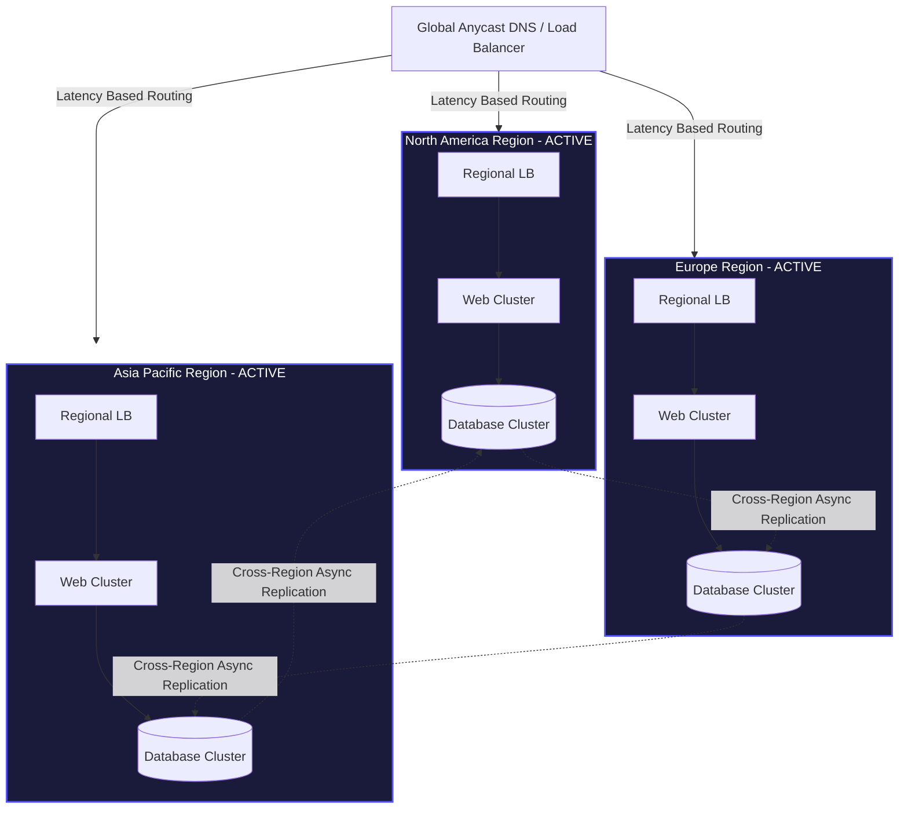
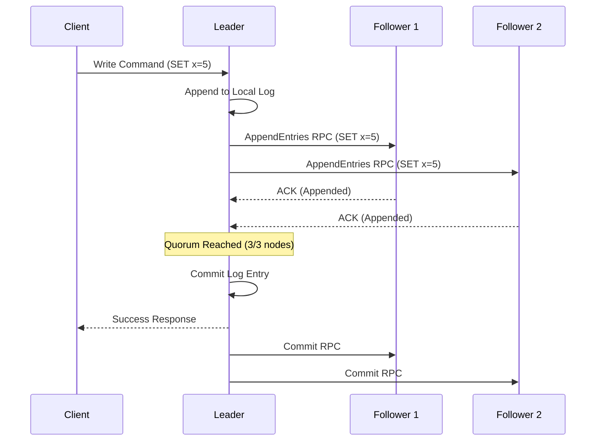

# Open Viking Mythic Plan: Document 24 - Fault-Tolerant Infrastructure and Distributed Resilience

## 1. Introduction: Defying the Laws of Physics and Hardware

The ultimate echelon of the Open Viking Mythic Plan requires engineering a system that transcends the physical limitations and inevitable failures of its underlying hardware. Document 24 outlines the blueprint for Fault-Tolerant Infrastructure and Distributed Resilience. Even if Project Ember possesses perfect crash-proof software (Doc 21), flawless logic (Doc 22), and rapid self-healing (Doc 23), it remains vulnerable to the harsh realities of physical infrastructure: data centers burn, fiber optic cables are severed, and power grids fail.

Fault tolerance is the absolute guarantee of uninterrupted service and zero data loss despite catastrophic hardware, network, or geographical failures. This document mandates the implementation of extreme redundancy, distributed consensus protocols, topological routing, and unyielding disaster recovery architectures to ensure Project Ember remains eternally available.

## 2. Redundancy and Geographic Distribution

The foundation of fault tolerance is the elimination of all Single Points of Failure (SPOF). This extends far beyond deploying multiple servers; it requires massive, structurally disparate replication.

### Multi-Region Active-Active Architecture

Project Ember must abandon traditional active-passive (primary/disaster recovery) setups, which rely on slow, often manual failovers that invariably result in downtime. Instead, the infrastructure must be strictly Active-Active across multiple geographical regions (e.g., North America, Europe, Asia-Pacific).

In an Active-Active topology, all regions are live and concurrently serving user traffic. Global load balancers, utilizing Anycast IP routing, direct users to their closest geographical region to minimize latency. 

If an entire physical region is obliterated due to a natural disaster or massive ISP failure, the global load balancer instantly detects the loss of health checks and autonomously reroutes all traffic to the surviving regions. The system absorbs the massive loss of infrastructure without a single second of global downtime.

## 3. Distributed Consensus and Data Integrity

The core challenge of distributed, multi-region architectures is maintaining consistent state. When data is physically separated by thousands of miles, the speed of light dictates that synchronization cannot be instantaneous. 

### The Raft Consensus Protocol

To ensure absolute data integrity and prevent "split-brain" scenarios during network partitions, the core control planes and critical state repositories of Project Ember must utilize distributed consensus algorithms, specifically the Raft protocol.

Raft ensures that a cluster of nodes agrees upon a single source of truth, even if some nodes fail or become disconnected. It operates through:
1.  **Leader Election:** The cluster elects a single Leader node to handle all write requests.
2.  **Log Replication:** The Leader receives a write, appends it to its local log, and then broadcasts it to all Follower nodes.
3.  **Quorum Commit:** The write is only considered successful (committed) when a majority (quorum) of the nodes acknowledge receiving it. 

If a network partition occurs, separating the Leader from the majority, a new Leader is automatically elected by the surviving quorum. This mathematically guarantees that data is never corrupted or lost, as operations only proceed when consensus is achieved.

## 4. Embracing the CAP Theorem

The CAP Theorem dictates that a distributed data store can only simultaneously provide two of the following three guarantees: Consistency (C), Availability (A), and Partition tolerance (P). Because network partitions (P) are physically inevitable, Project Ember must make strategic choices between Consistency and Availability.

### Tiered Consistency Models

A Mythic architecture does not apply a blanket solution; it utilizes tiered data storage based on business requirements:

*   **AP (Available and Partition-Tolerant):** For non-critical data (e.g., social feeds, recommendation engines, analytics), the system should utilize highly available NoSQL databases (like Cassandra or DynamoDB). During a partition, these systems remain available for reads and writes, prioritizing uptime over absolute, instantaneous global consistency (embracing Eventual Consistency).
*   **CP (Consistent and Partition-Tolerant):** For mission-critical transactional data (e.g., financial ledgers, inventory counts, access control), the system must utilize strongly consistent, distributed SQL databases (like Spanner or CockroachDB). During a severe partition, these systems will refuse writes (sacrificing Availability) rather than risk corrupting the global state, ensuring absolute accuracy.

By topologically routing data to the appropriate storage paradigm, Project Ember maximizes both performance and resilience.

## 5. Stateless Edge Compute and Immutability

To minimize the blast radius of any infrastructure failure, the compute layer (the application servers) must be radically stateless.

### The Disposable Infrastructure Paradigm

No application server in Project Ember should store any local state, session data, or persistent files. All state must be outsourced to dedicated, fault-tolerant datastores (Redis, PostgreSQL, S3). 

This renders the application servers entirely disposable. If a server rack catches fire, the orchestration engine (Kubernetes) instantly spins up replacement containers on healthy hardware. Because the containers are stateless, the new instances instantly begin processing traffic with zero data loss or context disruption. 

### Infrastructure as Code (IaC)

Furthermore, the entire infrastructure must be defined declaratively via Infrastructure as Code (Terraform, Pulumi). Manual server configuration is strictly forbidden. This ensures that an entire regional deployment can be reconstructed from scratch, in an identical configuration, in mere minutes, automating disaster recovery and ensuring perfect environmental consistency.

## 6. Distributed Tracing and Deep Observability

In a highly distributed, fault-tolerant system, identifying the root cause of a degradation is exponentially more difficult than in a monolith. A single user request may traverse dozens of microservices across multiple regions.

### The Observability Mesh

Project Ember must mandate the injection of distributed tracing (e.g., OpenTelemetry) into every network call. A unique Trace ID is generated at the edge and propagated through every internal service, database query, and message queue. 

This creates a comprehensive, visualizing mesh of the system's execution. When a fault occurs, operators do not need to hunt through disparate logs; the distributed trace instantly visualizes the exact path the request took, highlighting the specific node, database, or network hop that introduced the latency or error. This extreme observability is critical for rapid fault diagnosis and maintaining MTTR (Mean Time To Recovery) near zero.

## 7. Conclusion: The Unyielding Citadel

The architectural directives of Document 24 complete the defensive posture of the Open Viking Mythic Plan. By forging a multi-region Active-Active topology, relying on Raft consensus for immutable truth, strategically applying the CAP theorem, and mandating disposable stateless compute, Project Ember is rendered impervious to the chaos of physical reality.

This infrastructure does not merely tolerate faults; it expects them, absorbs them, and routes around them with mechanical precision. The system becomes an unyielding citadel, ensuring that the light of Project Ember remains eternally ignited, regardless of the destruction wrought upon its underlying foundations.
