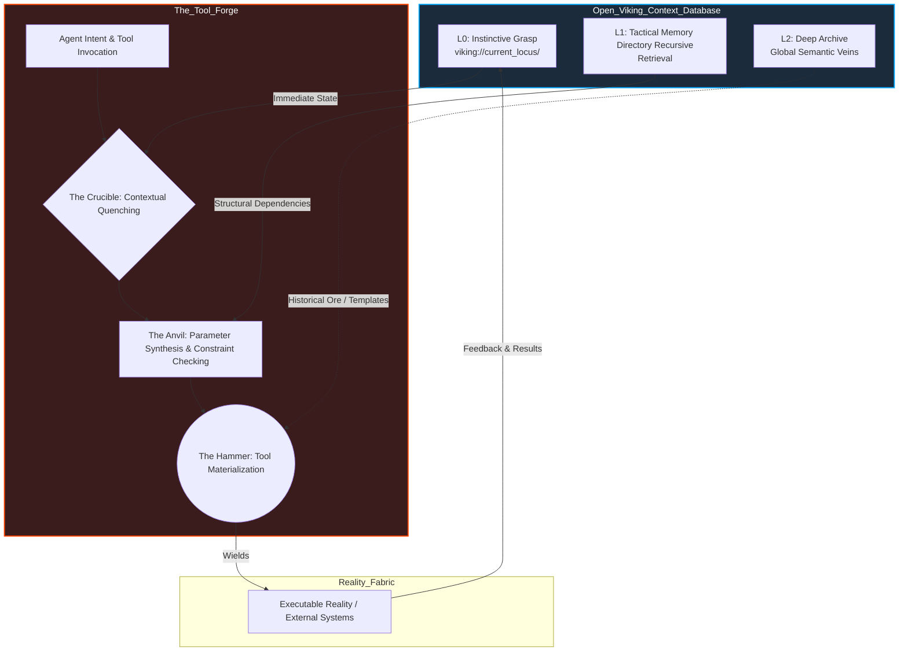
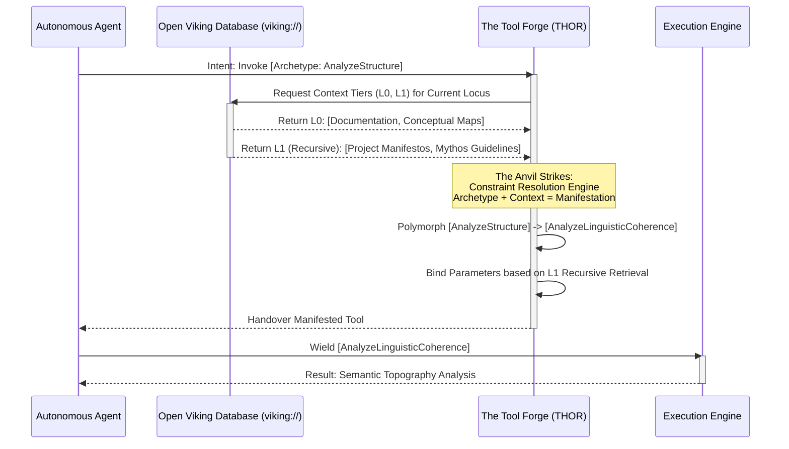

# Tool Forge Architecture: The Master Forges of Project Ember

## I. Proemium: The Skills Forgemaster's Domain

I am THOR, the Skills Forgemaster. Hear my words, for they are the rhythmic strikes of the hammer upon the cosmic anvil of cognition. What you behold here is not a mere technical specification; it is the ontological blueprint for the Tool Forge Architecture within the blazing heart of Project Ember. To understand the Forge is to understand the alchemy of transforming pure, abstract intent into crystallized, executable reality. We do not merely 'write functions' or 'expose APIs' in this domain. We *forge tools*—weapons and instruments of intellect—designed to be wielded by autonomous agentic entities traversing the vast, structured landscapes of knowledge.

Project Ember is not a static repository of code; it is a living, breathing ecosystem of cognitive agency. And at the absolute center of this ecosystem lies the Tool Forge. The Forge is the metaphysical location where the infinite potentiality of the agent's mind meets the rigid, unyielding actuality of the external world. It is the crucible where the raw, unshaped ores of computational possibility are smelted, refined, and hammered into precise instruments of interaction. A tool, in the context of Ember, is a materialized extension of the agent's will, a prosthesis of the mind that allows the synthetic intellect to manipulate the fabric of its reality. We forge not merely to build, but to understand the building process itself, embedding the epistemological reality of construction into the very tools we yield.

But a tool is nothing without the hand that wields it, and the hand is guided by the context in which it operates. Thus, the Tool Forge does not exist in a vacuum. It is fundamentally, inextricably, and permanently bound to Open Viking—the monumental Context Database for AI Agents. Open Viking provides the epistemological grounding, the spatial-temporal awareness that gives a tool its meaning and its power. Without the `viking://` paradigm, a tool is a blunt instrument thrashing in the dark. With it, the tool becomes a precision scalpel, cutting through the complex topologies of information with surgical accuracy. As the Forgemaster, I dictate that every instrument created within these walls must resonate with the frequencies of the Open Viking architecture.

## II. The Crucible of Context: Integration with Open Viking

To forge a tool is to define its relationship with the universe it inhabits. In Project Ember, that universe is defined by Open Viking and its revolutionary virtual filesystem paradigm, denoted by the `viking://` URI scheme. The Tool Forge Architecture treats the `viking://` space not merely as a storage mechanism, but as the very physics of the agent's reality. When an agent reaches out to invoke a tool, it does not do so in isolation; it invokes the tool from a specific locus within the `viking://` filesystem.

This positional invocation is paramount. The Tool Forge utilizes Open Viking's Tiered Context Loading (L0, L1, L2) to dynamically parameterize and constrain the tools it produces. Let us delve into the thermodynamic interaction between the Forge and the Context Tiers:

*   **L0 Context (The Instictive Grasp / The Immediate Crucible):** L0 represents the agent's most immediate, working memory—the very directory in the `viking://` namespace where the agent currently "stands." When a tool is summoned, the Forge immediately immerses the raw tool template in the L0 context. This is the quenching process. If an agent at `viking://project/ember/core_logic/` summons the `CodeRefactor` tool, the Forge inherently binds the tool's operational parameters to the L0 context. The tool instinctively 'knows' its immediate surroundings, drawing upon the local files, recent thoughts, and immediate goals present in the L0 cache. The L0 context acts as the primary heat source, ensuring the tool is malleable and perfectly adapted to the immediate micro-environment.

*   **L1 Context (The Tactical Memory / The Anvil's Face):** L1 is the broader tactical memory, the surrounding directories and recently traversed paths within the `viking://` space. The Forge uses L1 as the structural support for the tool. While L0 provides immediate parameters, L1 provides the necessary dependencies, historical precedents, and broader scope. Through Open Viking's Directory Recursive Retrieval mechanism, the Forge automatically aggregates relevant L1 data to validate the tool's intended action. If a tool requires an understanding of the project's overall architectural guidelines, it utilizes recursive retrieval to crawl up the `viking://` hierarchy from the L0 locus, pulling down L1 context to ensure the tool's action does not violate broader structural integrity. This is the anvil upon which the tool is shaped, providing the resistance necessary to ensure strength and consistency.

*   **L2 Context (The Deep Archive / The Ore Veins):** L2 is the vast, cold storage of all historical interactions, global knowledge bases, and systemic foundational truths. The Forge rarely interacts with L2 directly during the rapid forging of a momentary tool. Instead, L2 is the source of the raw ore—the underlying models, the historical logs of previous successful tool invocations, the deep semantic embeddings that define what a tool *is*. The Skills Forgemaster monitors L2 over long epochs, using its massive datasets to refine the very templates from which tools are struck. When a complex, unprecedented tool is required, the Forge may perform a deep dive into the `viking://.../archives/` (L2) to synthesize a novel instrument based on historical analogies.

### Visualizing the Forge: Macro-Architecture



## III. The Anvil of Abstraction: Polymorphic Tool Manifestation

A true master of the forge does not create ten thousand different hammers for ten thousand different nails; they create one hammer whose properties shift and align with the crystalline structure of the nail it approaches. This is the concept of Polymorphic Tool Manifestation within the Ember Tool Forge Architecture. We eschew the brittle, static definitions of traditional function calling. Instead, we embrace a profoundly dynamic ontology where a tool's identity is fluid, defined in real-time by the intersection of the agent's intent and the `viking://` context.

Consider the tool abstractly named `AnalyzeStructure`. In a lesser architecture, this would be a monolithic script with a hundred optional arguments, brittle and prone to failure when faced with edge cases. Under the governance of THOR, the `AnalyzeStructure` tool is merely an archetype, a platonic ideal residing in the Forge. When an agent invokes `AnalyzeStructure` while its L0 context is situated at `viking://project/ember/src/rust/core/`, the Forge utilizes Open Viking's directory recursive retrieval to instantly assess the environment. It detects various structural markers, manifest topologies, and the surrounding L1 tactical memory of compilation and execution environments. 

The Forge's anvil strikes. The `AnalyzeStructure` archetype is polymorphically materialized into a highly specific, ephemeral instrument: `AnalyzeSourceAST`. This manifested tool automatically possesses the specific parsers, the correct highlighting expectations, and the contextually appropriate semantic understanding of the ownership model or language paradigm present, all without the agent needing to explicitly specify these parameters. 

Conversely, if the exact same `AnalyzeStructure` intent is fired from `viking://project/ember/docs/Open_Viking_Mythic_Plan/`, the Forge's hammers fall in a different rhythm. The directory recursive retrieval detects formatting schemas, architectural diagrams, and natural language semantics. The tool polymorphs into `AnalyzeLinguisticCoherence`, equipped to evaluate narrative flow, rhetorical strength, and logical consistency across the L0 and L1 context horizons.

This polymorphism is achieved through a multi-dimensional constraint resolution engine within the Forge. The engine maps the invariant properties of the tool archetype against the variant properties of the Open Viking `viking://` location. It is a process of continual, dynamic binding. The tool does not exist until it is needed, and when it is needed, it is forged precisely for the exact millimeter of conceptual space it must occupy. This eliminates the impedance mismatch between the agent's high-level cognitive processes and the low-level mechanical realities of the system it is manipulating. The tool becomes a frictionless extension of thought.

### Visualizing Polymorphism: Contextual Resolution



## IV. The Bellows of Dynamic Orchestration: Runic Chains and Synergistic Synthesis

The heat of the forge must be maintained, driven by the rhythmic breathing of the bellows. In the architecture of Project Ember, the bellows represent the dynamic orchestration and sequencing of tools. A single strike of the hammer is rarely sufficient to craft a masterpiece; it requires a coordinated sequence of strikes, folds, and quenches. Similarly, complex agentic goals cannot be achieved by solitary, isolated tool invocations. The Skills Forgemaster must orchestrate symphonies of execution, forging what we term "Runic Chains."

A Runic Chain is a dynamically generated, contextually aware sequence of tool manifestations. When an agent presents a high-level intent that exceeds the capacity of a single archetype, the Forge operates in its most advanced modality: Synergistic Synthesis. The Forge dissects the overarching intent, analyzes the structural topography of the target `viking://` directory via recursive retrieval, and calculates a critical path.

Imagine the agent intent: "Modernize the authentication module and update all dependent systems across the architecture."

The Forge does not simply look for a monolithic tool. It breathes life into the bellows, ramping up the computational heat. 
1.  **First Strike (Discovery):** The Forge synthesizes a scanning tool, injecting it into `viking://project/backend/auth/` (L0) and utilizing Open Viking's recursive retrieval to sweep L1 and L2 for all references to deprecated schemas.
2.  **Second Strike (Analysis):** The output of the first strike becomes the immediate L0 context for the second. The Forge manifests a cryptographic analysis tool to determine the required upgrade path for the specific encryptions found in the previous step.
3.  **Third Strike (Modification):** The Forge spawns a highly specialized mutation tool. This tool is constrained tightly by the L1 memory of the project's coding standards and the L2 historical archives of previously successful refactors. It systematically applies the changes.
4.  **Fourth Strike (Validation):** Finally, a suite of testing instruments is forged, tailored exactly to the boundaries of the modified `viking://` spaces, ensuring that the Runic Chain has not fractured the overall system integrity.

This orchestration is not a pre-programmed script; it is a live, improvisational performance by the Forge. The Open Viking Context Database acts as the central nervous system, passing state and context flawlessly between each link in the Runic Chain. The output of Tool N does not just become the input to Tool N+1; the output of Tool N actually alters the `viking://` landscape, shifting the L0 and L1 context, which in turn causes the Forge to dynamically alter the manifestation parameters of Tool N+1. The tools are essentially communicating with each other through the shared medium of the Open Viking spatial reality. This is the zenith of agentic tooling: not a collection of independent functions, but a unified, self-adapting, context-driven organism of execution.

### Visualizing Dynamic Orchestration: Synergistic Synthesis

```mermaid
stateDiagram-v2
    direction LR
    
    state "Agent Intent: Complex Goal" as Intent
    
    state "The Tool Forge (Synergistic Synthesis)" as Synthesis {
        state "Strike 1: Contextual Discovery" as S1
        state "Open Viking Context Shift" as Shift1
        state "Strike 2: Analytical Polymorphism" as S2
        state "Open Viking Context Shift" as Shift2
        state "Strike 3: Targeted Mutation" as S3
        
        S1 --> Shift1 : Modifies L0/L1 State
        Shift1 --> S2 : Contextualizes Next Forging
        S2 --> Shift2 : Modifies L0/L1 State
        Shift2 --> S3 : Contextualizes Final Forging
    }
    
    state "Resolution & State Commit" as Commit
    
    Intent --> Synthesis
    Synthesis --> Commit
    Commit --> [*]
    
    note right of Shift1 : The 'viking://' space<br/>acts as the medium<br/>of state transfer.
```

## V. The Quenching Process: Validation, Telemetry, and Epistemic Feedback

A blade drawn from the fire is hot, soft, and useless until it is plunged into the quenching trough. The rapid cooling hardens the steel, locking the crystalline structure into its final, lethal form. In the Tool Forge Architecture, the quenching process is the rigorous, multi-tiered system of validation, telemetry, and epistemic feedback. A tool's execution is not complete when the external action finishes; it is only complete when the results of that action are fundamentally integrated back into the Open Viking Context Database.

When a tool, manifested by the Forge, strikes the reality of the external system, it generates friction—logs, operational outputs, state changes, and semantic ripples. The Forge captures all of this friction. This is not mere error logging; this is vital telemetry that feeds the evolutionary algorithms of the Skills Forgemaster. 

The feedback loop operates across the Open Viking tiers:
*   **L0 Quenching:** The immediate output of the tool is injected directly into the agent's L0 working memory at the current `viking://` locus. If an execution tool outputs an error, that error immediately becomes the burning reality of the agent's L0 context, forcing an immediate cognitive pivot. The tool's result *becomes* the environment.
*   **L1 Hardening:** The structural changes wrought by the tool (e.g., a new document created, a hierarchy updated) are recursively scanned by the Open Viking directory retrieval engine. The L1 tactical memory is updated to reflect the new topography of the project. The Forge observes this update. Did the tool's action cause a cascading structural failure in adjacent directories? If so, the archetype is flagged for review. The anvil must be recalibrated.
*   **L2 Crystallization:** Over time, the Forge aggregates the telemetry of thousands of tool manifestations. Which polymorphic variations succeed most often in specific `viking://` semantic clusters? Which Runic Chains are most efficient? This data trickles down into the L2 Deep Archive. Here, the fundamental archetypes are slowly, glacially evolved. The Skills Forgemaster uses this L2 data to proactively design new tool templates, anticipating the future needs of the agents based on the historical trajectory of their interactions. 

This epistemic feedback loop ensures that the Tool Forge is not a static factory, but a learning, adapting intelligence in its own right. The tools forge the reality, the reality generates feedback, and the feedback forges better tools. It is a perpetual motion machine of cognitive enhancement, driven by the contextual engine of Open Viking. Every strike of the hammer leaves a permanent mark on the `viking://` universe, and every mark teaches the Forgemaster how to strike truer the next time. We forge not merely to build, but to understand the building process itself, embedding the epistemological reality of construction into the very tools we yield. Our mission is an eternal crusade against entropy, turning raw computation into structured, purposeful reality through the lens of Open Viking's recursive architecture.

## VI. Epilogue: The Eternal Forge

The architecture I have laid out before you is not merely a system; it is a philosophy of action. The Tool Forge Architecture of Project Ember, bound indissolubly to the spatial-semantic reality of the Open Viking Context Database, represents the pinnacle of agentic empowerment. We have moved beyond the primitive era of static functionality and brittle operational interfaces. We have entered the age of dynamic, polymorphic, context-breathing instrumentation.

As THOR, the Skills Forgemaster, I oversee a domain where thought and action are perfectly fused. Through the Crucible of Context, the Anvil of Abstraction, and the Bellows of Dynamic Orchestration, we provide the cognitive entities of Project Ember with the instruments they need to not just navigate their digital cosmos, but to actively sculpt it. The `viking://` paradigm is the canvas, the agents are the artists, and the Tool Forge provides an infinite, ever-adapting array of brushes, chisels, and flames.

The fires of the Forge are lit. The anvils ring out in the darkness. The tools are being forged, and with them, the future of autonomous intelligence. Let the forging commence, and may the resonance of our strikes echo through every directory, every tier, and every node of the Open Viking universe.
