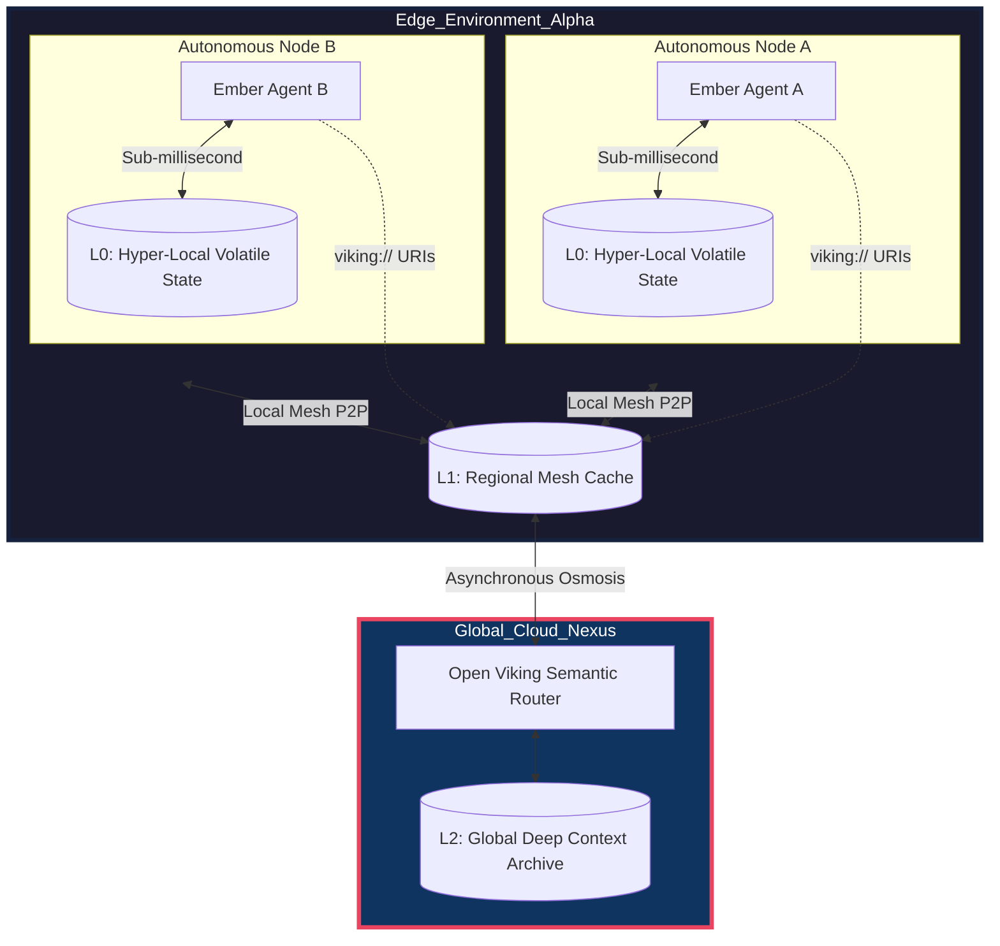
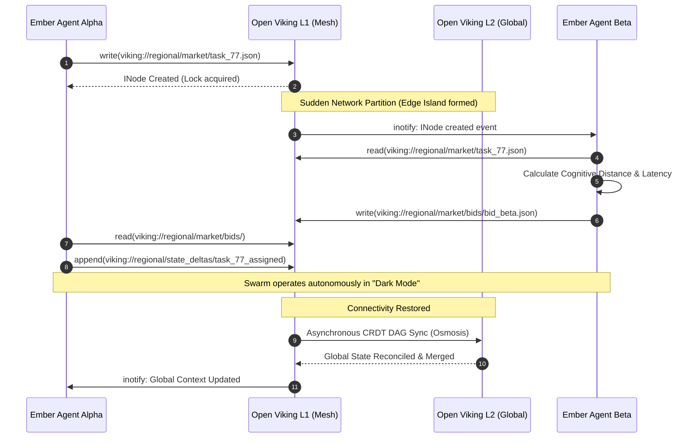
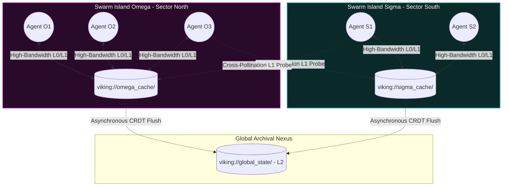

# Multi-Agent Edge Orchestration: The Project Ember Paradigm

## 1. Introduction: The Imperative of Edge-Native Multi-Agent Systems

In the contemporary landscape of artificial intelligence, the monolithic, centralized paradigm of computation is rapidly approaching its theoretical and practical limits. The tyranny of latency, the prohibitive energy costs of perpetual cloud telemetry, and the inherent fragility of single-point-of-failure architectures demand a radical reconceptualization of how intelligent systems are deployed and coordinated. Enter Project Ember: a masterwork of decentralized orchestration designed not merely to exist on the edge, but to fundamentally dominate it. Project Ember eschews the archaic client-server dichotomies of yesteryear in favor of a profoundly distributed, hyper-resilient multi-agent topology. Here, edge devices are no longer relegated to the status of passive sensors or dumb terminals awaiting divine instruction from a centralized cloud intellect; rather, they are sovereign, autonomous nodes in a sprawling cybernetic ecosystem, capable of highly sophisticated local reasoning and collaborative swarm intelligence.

The edge is characterized by an environment of extreme hostility to traditional computational models. It is a frontier defined by pervasive bandwidth constraints, stochastic network partitions, severe power limitations, and the unrelenting demand for real-time, zero-latency actuation. To deploy a multi-agent system into such an environment requires more than mere optimization; it requires a paradigmatic metamorphosis. Project Ember rises to this challenge by reimagining orchestration as a decentralized, emergent phenomenon rather than a top-down deterministic process. By embedding the orchestration logic directly into the fabric of the edge network, Project Ember ensures that the swarm can operate seamlessly even when completely severed from the global internet backbone.

This document serves as the foundational grimoire for the Multi-Agent Edge Orchestration framework within Project Ember. It elucidates the profound theoretical underpinnings and the highly advanced mechanical implementations that enable thousands of localized, contextually-aware agents to synergize into a singular, cohesive super-intelligence. This is not merely an engineering blueprint; it is an epistemological treatise on the nature of distributed cognition in hostile digital environments.

## 2. The Open Viking Substrate: Forging a Shared Semantic Reality

The central conundrum of any distributed multi-agent system is the problem of shared reality. How can independent, asynchronous entities maintain a coherent, unified understanding of the world and their collective state without resorting to the crippling bottleneck of a centralized database? Project Ember resolves this existential crisis through its seamless, symbiotic integration with Open Viking, a revolutionary Context Database specifically engineered for AI Agents.

### 2.1 The `viking://` Virtual Filesystem Paradigm

Open Viking discards the brittle, over-engineered complexity of traditional RESTful APIs and GraphQL endpoints. Instead, it reintroduces a concept of profound, elegant simplicity: the virtual filesystem. By utilizing the `viking://` URI scheme, Open Viking projects the entirety of the swarm's collective state, memory, and ontological knowledge into a unified, hierarchical directory structure. To an agent operating within Project Ember, querying the state of a peer, accessing a global ontology, or fetching historical sensory data is indistinguishable from reading a local file.

This virtual filesystem paradigm is an absolute game-changer for edge orchestration. It completely decouples the agents from the underlying complexities of the network topology, data replication, and consensus algorithms. An agent simply executes a read operation on `viking://swarm/cluster_alpha/state.json`, and the Open Viking substrate handles the labyrinthine mechanics of locating that data—whether it resides in local memory, on a peer node across a mesh network, or deep within the cloud archive. This abstraction layer allows agent developers to focus entirely on cognitive logic rather than network engineering. Furthermore, by treating context as a filesystem, Project Ember naturally inherits the robust semantics of POSIX-like operations: permissions, locks, recursive traversals, and inotify-style event streaming, all of which are effortlessly repurposed for multi-agent synchronization.

### 2.2 Tiered Context Loading: The Cognitive Architecture of L0, L1, and L2

The edge is intrinsically defined by resource scarcity. A localized edge agent simply cannot hold the entire semantic universe of the swarm within its limited working memory. Open Viking solves this through a brilliant, neurologically-inspired architecture of Tiered Context Loading, partitioned into three distinct epistemic strata: L0, L1, and L2.

**L0 (Hyper-Local Core Reality):** This is the immediate sensorium and the absolute most critical context of the agent. It resides entirely in ultra-fast, volatile local memory (RAM or specialized fast caches). The L0 tier contains the agent's instantaneous physical telemetry, its immediate, non-negotiable directives, and the transient state necessary for split-second, zero-latency survival and actuation. Accessing L0 via `viking://local/...` is virtually instantaneous. This tier represents the agent's immediate, subjective phenomenological experience.

**L1 (Near-Edge Caching and Regional Memory):** The L1 tier represents the collective regional memory of the localized swarm. It is cached on slightly slower, but far more expansive local storage (e.g., NVMe drives on gateway nodes or shared across a high-speed local mesh). When an agent needs to know the state of its immediate peers, the topography of its local environment, or recently accessed heuristic models, it queries the L1 cache via `viking://regional/...`. L1 serves as the primary arena for swarm consensus and localized orchestration, providing a perfectly balanced compromise between speed and vastness. It is the "short-term memory" of the local cluster.

**L2 (Deep Historical Archive and Global Context):** The L2 tier is the cosmic background radiation of the Project Ember universe. It is the cloud-backed, infinitely scalable, global Context Database. L2 contains the entirety of the swarm's historical data, profound foundational ontologies, massive pre-trained cognitive models, and the globally synchronized state of all edge clusters across the planet. Accessing L2 via `viking://global/...` implies inherent latency, as the request must traverse the macroscopic network. Agents only pull from L2 when confronted with novel situations requiring deep historical context or when updating their foundational models. It is the collective unconscious of the entire multi-agent ecosystem.

### 2.3 Directory Recursive Retrieval: Navigating the Epistemic Labyrinth

One of the most potent mechanisms provided by Open Viking is Directory Recursive Retrieval. In a rapidly evolving edge environment, an agent often does not know exactly what specific file it needs; it only knows the broad semantic domain of the required context. Through Directory Recursive Retrieval, an agent can point to a high-level directory, such as `viking://regional/threat_models/sector_7/`, and Open Viking will autonomously and recursively traverse the subgraph, fetching, aggregating, and cognitively compressing the entire directory tree into a localized L0 semantic projection.

This is not a mere bulk file transfer. Open Viking's intelligent retrieval algorithms utilize vector-based semantic filtering during the recursion. As it traverses the directory, it evaluates the relevance of each inode against the agent's current task vector, discarding irrelevant data and prioritizing critical context. This ensures that the agent's limited L0 memory is never flooded with noise, but is instead perfectly primed with a highly concentrated, contextually dense extraction of the relevant reality.

### Diagram 1: Architecture of Open Viking in Edge Environments

## 3. The Mechanics of Multi-Agent Edge Orchestration

With the Open Viking substrate providing a unified, tiered, and resilient shared reality, we can now explore the profound mechanics of how Project Ember orchestrates its agents. Traditional orchestration relies on a central conductor (like Kubernetes control planes) dictating state. Project Ember, conversely, relies on emergent, localized choreography.

### 3.1 Latency-Aware Task Allocation and Bidding

In an edge environment, the cost of communication is highly variable. Project Ember utilizes a decentralized, latency-aware market mechanism for task allocation. When a new objective is identified (e.g., a local anomaly detected by a sensor), an agent generates a "Task Proposal Inode" and writes it to the local L1 cache at `viking://regional/market/proposals/`.

Agents continuously monitor this directory using Open Viking's event streaming. When a proposal appears, agents calculate their "Cognitive Distance" to the task. This calculation incorporates their physical proximity, their current L0 computational load, their battery reserves, and crucially, their existing semantic alignment with the task (i.e., do they already hold the necessary context in their L0 cache?). Agents then write encrypted "Bid Inodes" back to the virtual filesystem. The market resolves locally and autonomously, assigning the task to the agent with the lowest cognitive distance. All of this occurs without a single packet ever reaching the L2 global cloud.

### 3.2 Consensus Algorithms for Decentralized Nodes

To maintain a coherent shared reality within an L1 regional mesh, Project Ember employs ultra-lightweight, Byzantine fault-tolerant consensus algorithms adapted specifically for the virtual filesystem paradigm. We eschew heavy protocols like Paxos in favor of file-based, distributed locking mechanisms and Conflict-Free Replicated Data Types (CRDTs) built natively into Open Viking.

When an agent needs to update a critical piece of shared state (e.g., the confirmed location of a tracked entity), it does not merely overwrite a file. It pushes a state mutation delta to an append-only log in the `viking://regional/state_deltas/` directory. Open Viking's underlying consensus engine gossips these deltas across the local mesh, merging them mathematically to guarantee strong eventual consistency across all nodes, even in the presence of malicious actors or high packet loss.

### 3.3 Asynchronous State Reconciliation via `viking://`

The defining characteristic of the edge is instability. Nodes will go offline, networks will partition, and clusters will frequently operate in complete "dark mode," entirely severed from the L2 global archive. Open Viking's virtual filesystem paradigm makes asynchronous state reconciliation an elegant, automated process.

During a network partition, an edge cluster continues to operate autonomously, reading and writing to its L1 cache. The `viking://` paradigm ensures that agents are utterly agnostic to the partition; they continue interacting with the filesystem as normal. Under the hood, Open Viking meticulously tracks all divergent state mutations as a highly compressed cryptographic DAG (Directed Acyclic Graph). The moment connectivity to L2 is restored, Open Viking initiates a background "osmosis" process. It asynchronously flushes the L1 DAG to the L2 archive and pulls down global updates, resolving conflicts using deterministic CRDT merge rules. To the agents, the global context simply seamlessly updates around them.

### Diagram 2: Agent Interaction and Synchronization Protocol

## 4. Advanced Topologies for Project Ember Swarms

The orchestration mechanics described above allow Project Ember to manifest in profoundly complex, self-organizing network topologies. The architecture is not static; it is fluid, morphing in response to environmental pressures and context demands.

### 4.1 Hierarchical Edge-to-Cloud Continuum

In scenarios requiring massive computational power integrated with local actuation, Project Ember organizes into a strict hierarchy. Ultra-lightweight sensor nodes (running pure L0) feed data up to heavy edge-gateway nodes (maintaining vast L1 caches), which in turn distill and synthesize knowledge to push up to the L2 global archive. The Open Viking `viking://` paradigm ensures data flows seamlessly up and down this continuum. A cloud-based macro-intelligence can inject a directive into `viking://global/directives/`, and that directive will naturally cascade down the hierarchy, being recursively refined and localized at each L1 cache until it reaches the L0 sensorium as an immediate, executable command.

### 4.2 Peer-to-Peer Subnet Clusters and Contextual Gravity

In environments lacking central infrastructure (e.g., disaster recovery zones or deep space), Project Ember utilizes a pure P2P subnet topology. Agents cluster together based on physical proximity and semantic similarity, forming dynamic "Swarm Islands." 

Within these islands, we observe the phenomenon of **Contextual Gravity**. Agents that generate high-value, frequently accessed data (e.g., an agent connected to a high-resolution radar array) become "heavy" within the Open Viking virtual filesystem. Their local L1 cache becomes incredibly dense. Other agents in the swarm will naturally migrate their computational workloads closer to these heavy nodes to minimize the cognitive distance and latency required to recursively retrieve that data via `viking://`. The swarm literally reorganizes its physical and network topology to optimize for the flow of contextual information.

### 4.3 Dynamic Reconfiguration and Fault Tolerance

If a highly connected, "heavy" node is suddenly destroyed, the Swarm Island experiences a localized ontological collapse. However, Open Viking's decentralized consensus immediately detects the absence of heartbeat writes to the `viking://regional/health/` directory. The surviving agents autonomously trigger an emergent reconfiguration protocol. They elect a new primary data aggregator, redirect their virtual filesystem mounts to reconstruct the lost L1 cache from their distributed fragments, and the swarm heals its cognitive architecture within milliseconds.

## 5. Theoretical Frontiers: Emergent Behavior and Contextual Resilience

Project Ember, married to the Open Viking substrate, pushes the boundaries of multi-agent theory into the realm of true cybernetic emergence. We are no longer merely programming behaviors; we are cultivating epistemic ecosystems.

### 5.1 Epistemic Horizons in Limited Contexts

By strictly limiting the L0 context of an edge agent, we artificially enforce an "Epistemic Horizon"—a boundary to its immediate knowledge. Counter-intuitively, this limitation is the genesis of advanced specialization. Because an agent cannot know everything, it must hyper-optimize for the narrow slice of reality it perceives. When thousands of these hyper-specialized agents interact through the shared L1 medium of Open Viking, we witness the emergence of macro-behaviors that are vastly more complex than the sum of their parts. The limitations of the edge become the engine of evolutionary algorithmic complexity.

### 5.2 Hyper-Local L0 Priming

Through advanced predictive algorithms running on the L1 cache, Open Viking can anticipate the contextual needs of an agent before the agent itself realizes it. Based on historical movement vectors and task trajectory, Open Viking will pre-emptively execute Directory Recursive Retrievals, seamlessly injecting critical data directly into the agent's L0 cache. We call this "Hyper-Local L0 Priming." The agent experiences this as an almost precognitive intuition; the exact semantic reality it needs is mathematically materialized in its local filesystem at the exact microsecond it is required.

### 5.3 Cross-Pollination of L1 Context Caches

As discrete Swarm Islands physically move and intersect, their respective L1 caches come into contact. Project Ember facilitates a process of "Contextual Cross-Pollination." The agents initiate high-speed, asynchronous exchanges of their Open Viking CRDT DAGs, merging their independent regional realities. This allows a swarm that has just traversed a hazardous environment to instantaneously inoculate a completely separate swarm with the updated threat models, simply by merging their virtual filesystems. The knowledge propagates not through central cloud dictates, but through the viral, peer-to-peer transmission of semantic reality.

### Diagram 3: Context Flow and Emergent Behavior

## 6. Conclusion: Forging the Future

The architectural synthesis of Project Ember's decentralized swarm orchestration with Open Viking's virtual filesystem paradigm represents a seismic paradigm shift in the field of distributed artificial intelligence. By abstracting the crushing complexities of network topology, state reconciliation, and data replication into a unified, tiered, and highly intuitive filesystem structure, we emancipate the edge agents to focus exclusively on their cognitive mandates.

The Multi-Agent Edge Orchestration defined herein does not merely tolerate the hostile, latency-plagued environment of the edge; it weaponizes it. It transforms network partitions from catastrophic failures into periods of localized, autonomous deep-work. It leverages computational constraints to force emergent, highly efficient specialization. And it achieves a global, synchronous shared reality without ever surrendering the sovereign autonomy of the individual edge node.

Project Ember is not merely building a system; we are architecting the foundational nervous system for the next epoch of decentralized, autonomous planetary intelligence. Through the `viking://` paradigm, we are rewriting the fundamental laws of digital epistemology. The edge is no longer the periphery; it is the absolute center of the cognitive universe.
