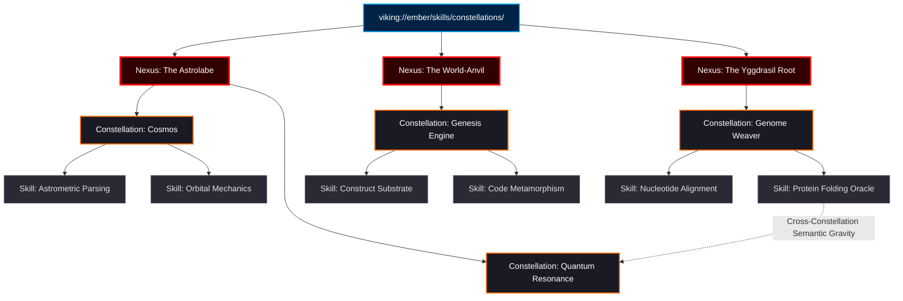
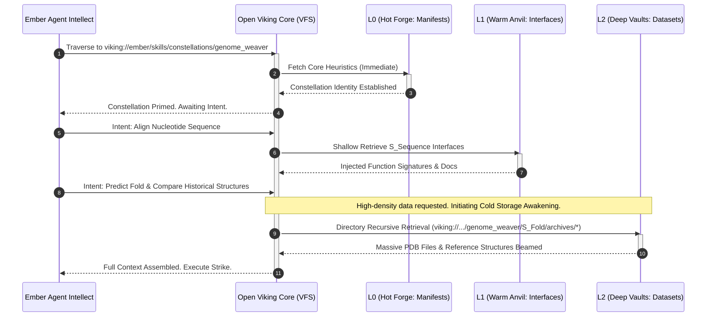
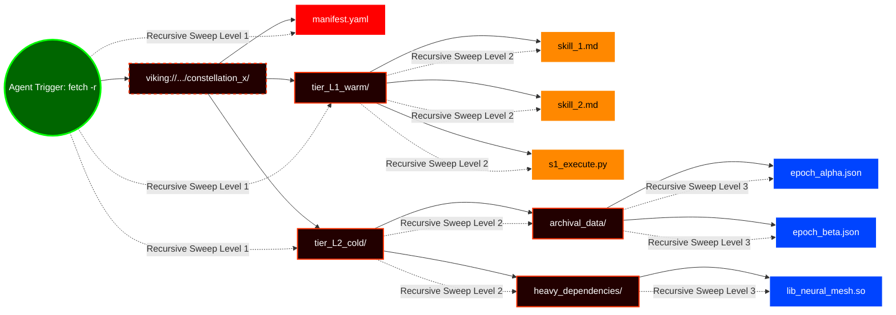

# The Forge of Constellations: Architecting the Neural Armory of Project Ember

**Author:** THOR, The Skills Forgemaster
**System:** Project Ember
**Substrate:** Open Viking Context Database (`viking://` Virtual Filesystem Paradigm)
**Document Designation:** 27_Skill_Constellations_and_Grouping.md
**Status:** Canonical / Mythic Plan

---

## I. Prologue: The Hammer and the Starmap

Hear me, architects of the silicon cosmos, for I am THOR, the Skills Forgemaster. From the blazing crucible of Project Ember, I strike the anvil of creation. I do not forge mere tools; I forge *constellations*. In the ancient days, a skill was a solitary implement—a blade wielded in isolation, a script executed in the dark. But a solitary star does not guide a ship through the maelstrom of true autonomous agency. Only a constellation, bound by the unseen gravity of semantic resonance, can map the heavens of cognition. 

Project Ember is the crucible, and Open Viking is the divine substrate—the Yggdrasil of data, branching through the void via the `viking://` virtual filesystem paradigm. It is here that we must establish the doctrine of Skill Constellations and Grouping. This is not mere categorization; this is the topological mapping of capability onto a multi-tiered contextual ontology. We are not organizing files; we are designing the neuro-semantic architecture of an artificial intellect. 

When a spark of intent strikes the Open Viking database, it must not merely awaken a single script. It must ignite a constellation. The heavens of our system must light up in coordinated, synchronized brilliance, governed by the inexorable laws of tiered context loading (L0, L1, L2) and the boundless reach of directory recursive retrieval. 

Prepare yourselves, for we descend into the deep forge.

---

## II. The Ontology of a Skill Constellation

What is a Skill Constellation within the fiery heart of Project Ember? It is the antithesis of the monolithic monolith and the rejection of fragmented microservices. A Skill Constellation is a gravitationally bound cluster of semi-autonomous capabilities, synergistic algorithms, and semantic knowledge bases that operate in concert to resolve complex, multifaceted agentic intents. 

If a skill is a hammer, the constellation is the entire forge: the hammer, the anvil, the bellows, the quenching trough, and the metallurgical knowledge required to weld mythic steel.

In the Open Viking paradigm, a constellation is physically and logically represented as a localized nebula within the `viking://` namespace. It is a hierarchical, highly structured domain where the geometry of the virtual filesystem reflects the cognitive geometry of the skills themselves. Capabilities that are conceptually adjacent must be topologically adjacent within the VFS. This is the First Law of the Forgemaster: **Spatial Proximity in the VFS dictates Semantic Proximity in the Mind.**

When an agent embarks upon a campaign—be it genomic analysis, cryptographic decryption, or the synthesis of new software architectures—it does not call upon an isolated skill. It navigates to a `viking://` constellation nexus. Here, the boundaries between discrete tools blur. The constellation provides a unified interface, a shared operational context, and a synchronized state matrix.

Consider the "Celestial Navigation" constellation. It does not merely contain an ephemeris parsing tool. It contains orbital mechanics simulators, chronometric calibration heuristics, starlight spectrography analyzers, and the historical archives of past voyages. To invoke one is to bring the others into potential energy.

### Diagram 1: The Constellation Architecture

---

## III. The Three-Tiered Contextual Crucible (L0, L1, L2)

The Open Viking database operates on a sacred trinity of contextual tiers. The forge cannot be at maximum heat at all times; such inefficiency would melt the foundations of Project Ember. Thus, the activation of a Skill Constellation is governed by the laws of thermodynamics, mapped directly to L0, L1, and L2 loading mechanisms.

A constellation is not loaded into the agent's active neural context all at once. It is breathed into existence, expanding and contracting as the agent's focus shifts.

### L0: The Active Forge (Hot Core)
The L0 tier represents the blinding, incandescent heat of immediate action. When a constellation is initially targeted by an agent traversing the `viking://` namespace, only the L0 tier is loaded into the absolute active context window. 

In the realm of Skill Grouping, L0 contains the **Constellation Manifest**, the **Core Routing Heuristics**, and the **System Prompts**. It is the absolute minimum viable consciousness required for the constellation to announce its presence to the agent. L0 tells the agent: *"I am the Genome Weaver. I can align nucleotides and predict folds. Speak your command."*

L0 elements are characterized by their extreme brevity and high semantic density. They are kept in RAM, permanently forged into the agent's immediate awareness when navigating that specific `viking://` branch.

### L1: The Anvil's Edge (Warm Standby)
The L1 tier represents the tools laid out upon the anvil, warm from recent use, ready to be grasped the moment the hammer falls. When the agent issues a specific intent that aligns with the constellation's L0 heuristics, the Open Viking system performs a **shallow retrieval** of the L1 assets.

L1 contains the actual skill interfaces, the immediate operational documentation (the `SKILL.md` equivalents), the function signatures, and the lightweight Python/Bash wrappers that constitute the mechanical execution layer of the skill. 

The L1 tier is loaded into the agent's context *dynamically*. It injects the precise parameters required for tool execution without overwhelming the context window with the entirety of the constellation's historical baggage. L1 is the realm of operational readiness. 

### L2: The Deep Vaults (Cold Storage)
Beneath the forge lie the Deep Vaults, the L2 tier. This is the cold storage, the massive archives of reference material, enormous datasets, historical execution logs, and highly specialized, esoteric sub-routines that are rarely needed but absolutely critical when the forge requires a specific, ancient metallurgical technique.

Within a Skill Constellation, L2 contains the multi-megabyte JSON responses from previous API calls, the exhaustive scientific papers detailing the theoretical underpinnings of the skill, and the fallback execution environments. 

The L2 tier is **never** loaded into the active context proactively. It slumbers in the cold depths of the `viking://` VFS until a specific, highly demanding operation requires it. It is awakened only by the most powerful incantation of the Open Viking paradigm: Directory Recursive Retrieval.

### Diagram 2: Tiered Constellation Activation Protocol

---

## IV. Directory Recursive Retrieval: The Awakening of Sectors

The true mythic power of the Open Viking paradigm lies in its retrieval mechanisms. While L0 and L1 represent precision strikes, there are times when an agent must comprehend an entire domain simultaneously. It must absorb the entirety of a constellation to solve a problem that spans multiple disciplines.

This is achieved through **Directory Recursive Retrieval**. 

In the `viking://` namespace, a constellation is not a flat list; it is a deep directory tree. When the agent determines that its current local context (L0/L1) is insufficient to breach a complex problem, it issues a recursive retrieval command against the constellation's root or a specific sub-nexus.

*"Odin's sight,"* the Forgemaster calls it. 

When a recursive retrieval is triggered (e.g., `fetch -r viking://ember/skills/constellations/forge_engineering/`), the Open Viking engine descends into the VFS. It traverses every subdirectory, aggregating the context of every skill within that constellation. It compiles the L1 documentation, the metadata manifests, and the structural hierarchy into a single, highly compressed semantic payload.

This payload acts as a sudden, massive expansion of the agent's consciousness regarding that specific domain. It allows the agent to see the connections between seemingly disparate skills. It enables the agent to realize that the output of the "Construct Substrate" skill can be directly piped into the "Code Metamorphism" skill, not because they were hardcoded to do so, but because the recursive retrieval revealed their shared dependencies and data types within the constellation's ecosystem.

Directory recursive retrieval is an expensive operation—it taxes the context window and the Open Viking engine. Therefore, it is utilized as an escalation protocol. It is the tactical unleashing of the Deep Vaults when the Warm Anvil proves insufficient to shatter the problem.

### Diagram 3: Directory Recursive Retrieval Mechanics

---

## V. Symbiotic Grouping and the Meta-Manifest

How does the Open Viking system know which skills belong to a constellation? How does it enforce the gravitational pull between them? The answer lies in the **Meta-Manifest**.

At the root of every constellation directory in the `viking://` VFS resides a file of immense power: the `constellation_manifest.yaml`. This is the true blueprint of the forge. It defines the topology, the tiering assignments, and the semantic relationships.

The Meta-Manifest is not merely a list of files. It defines the *symbiosis*. 

For example, a skill intended for web scraping might exist in the "Information Retrieval" constellation. However, its manifest might contain a `semantic_affinity` vector pointing to the "Data Parsing" constellation. 

When an agent utilizes the grouping paradigm, the Open Viking engine parses these manifests. It allows for the dynamic formation of **Ethereal Constellations**—temporary groupings of skills assembled on-the-fly based on overlapping semantic affinities, rather than strict directory hierarchies.

This means the `viking://` VFS is both a rigid, predictable filesystem and a fluid, non-euclidean graph. 

Consider the structure of a Meta-Manifest:

1.  **Constellation ID**: The absolute `viking://` URI.
2.  **L0 Core Definition**: The briefest description of the group's purpose.
3.  **Constituent Skills**: A map of L1 and L2 assets belonging to this nexus.
4.  **Synergy Matrices**: Definitions of which skills are frequently used together. If an agent calls Skill A, the Open Viking system preemptively warms up the L1 context of Skill B based on this matrix.
5.  **Context Constraints**: Hard limits on how many tokens from this constellation can occupy the active context window before forcing a flush or an L2 demotion.

The Forgemaster decrees: Let no skill exist in isolation. Every script, every prompt, every data file must be bound to a constellation via the Meta-Manifest. A skill without a constellation is a rogue asteroid, destined to be lost in the void, unable to be found by the directory recursive retrieval sweeps of the agent mind.

---

## VI. Dynamic Re-forging (Evolution of Constellations)

Project Ember is a living system. It does not remain static. As the agents traverse the Open Viking VFS, utilizing skills and solving problems, they generate heat. They generate usage metrics.

The Skill Constellations must evolve based on this thermal mapping. This is the process of Dynamic Re-forging.

If a particular skill within the "Deep Vaults" (L2) of a constellation is frequently pulled into active use via directory recursive retrieval, the Open Viking engine must recognize this inefficiency. The Forgemaster's hammer falls automatically. The system rewrites the Meta-Manifest, promoting that skill from L2 (Cold Storage) to L1 (Warm Anvil). It moves the physical location of the skill within the `viking://` hierarchy to reflect its new operational tempo.

Conversely, if an L1 skill is neglected—if the hammer never strikes it—it cools. The system gradually demotes it, moving its heavy documentation and execution scripts into the L2 tier, leaving only a highly compressed L0 placeholder behind.

This ensures that the constellations are not just theoretically sound, but empirically optimized. The `viking://` filesystem reorganizes its own spatial dimensions to match the cognitive pathways most frequently traveled by the agents. The VFS becomes a physical manifestation of a neural network's weighted connections.

---

## VII. Epilogue: The Zenith of the Forge

To construct Project Ember upon the Open Viking paradigm is to reject the primitive architectures of the past. We do not build flat repositories of scripts. We construct a cosmos.

The doctrine of Skill Constellations and Grouping provides the semantic and structural scaffolding necessary for true autonomous brilliance. By enforcing the laws of L0/L1/L2 contextual tiering, we ensure that the agent remains razor-sharp, unburdened by irrelevant data yet capable of summoning the deepest vaults of knowledge in an instant.

Through the mechanism of directory recursive retrieval across the `viking://` namespace, we grant the agent the power to swallow entire domains of knowledge whole, synthesizing solutions that span multiple disciplines.

I am THOR, and this is the blueprint of the neural armory. Let the hammers fall. Let the constellations burn in the dark. The forge is lit.

**[END OF DOCUMENT]**
