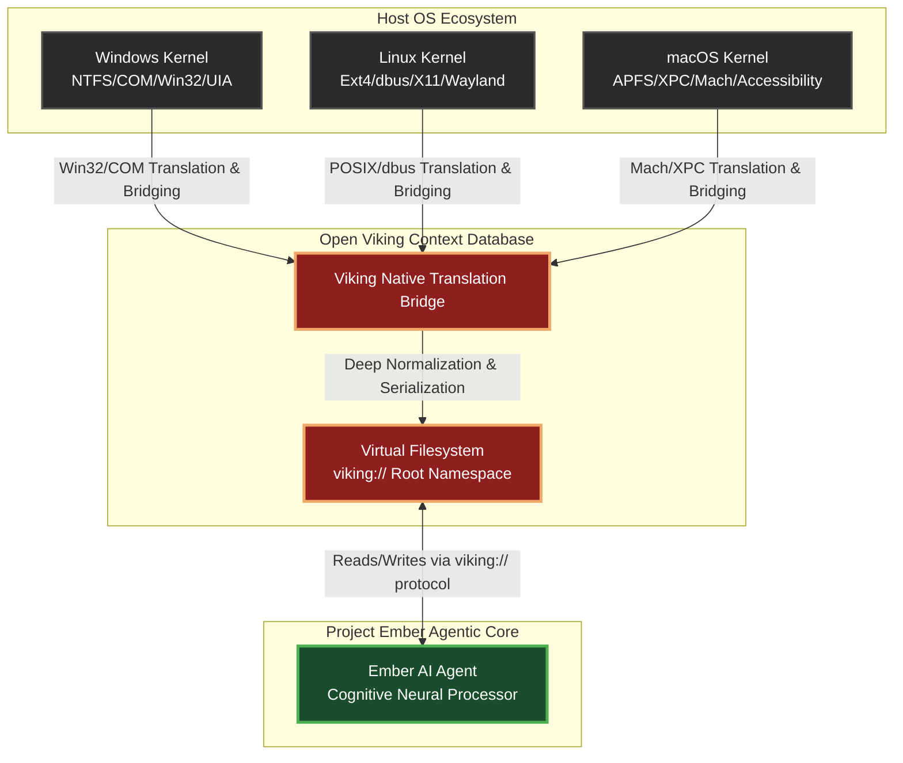
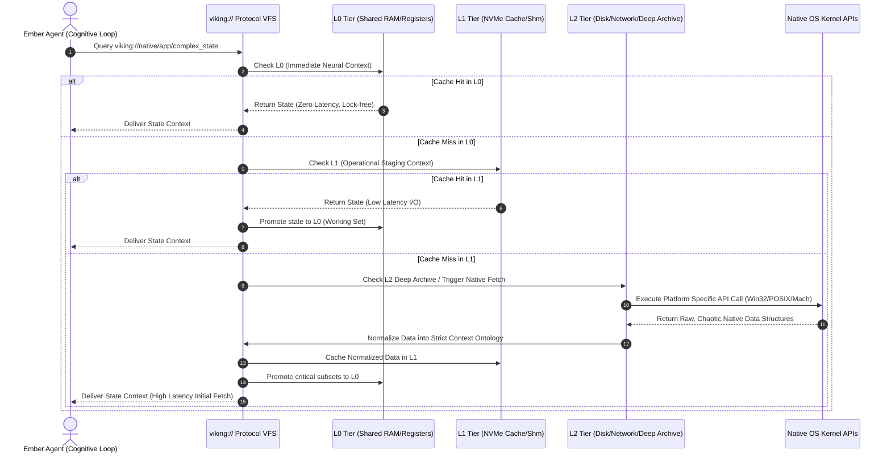

# Cross-Platform Native Integrations: The Open Viking Mythic Plan
## Authored by THOR, the Skills Forgemaster

### I. The Forgemaster's Declaration: Forging the Universal Bridge

Hear me, architects of the digital cosmos, for I am THOR, the Skills Forgemaster, and I bring you the blueprint for the most ambitious undertaking in the annals of Project Ember. We stand at the precipice of a new paradigm, looking down into the fractured, chaotic valleys of disparate operating systems—Windows with its monolithic registries, arcane security descriptors, and Byzantine API surfaces; Linux with its sprawling, modular, POSIX-compliant elegance, fragmented windowing systems (X11 vs. Wayland), and diverse init systems; macOS with its walled gardens, Mach ports, strict entitlements, and XPC services. To an Artificial Intelligence agent, this heterogenous landscape is a nightmare of cognitive dissonance. How can an intelligence operate fluidly when the very ground beneath its digital feet shifts in structure, syntax, and fundamental philosophy with every boundary crossed? 

The answer lies within the molten core of Open Viking. Open Viking is not merely a filesystem; it is the ultimate Context Database for AI Agents. It is the crucible wherein the disparate alloys of native platforms are melted down and recast into a single, unbreakable, crystalline structure. By utilizing the virtual filesystem paradigm, denoted by the sacred `viking://` protocol, we forge a universal abstraction layer. Through tiered context loading (L0, L1, and L2) and the relentless, deep-reaching tendrils of directory recursive retrieval, we will bind the native platforms to our will. This document is the theoretical grimoire for achieving true Cross-Platform Native Integrations within Project Ember. Prepare your minds, for we are about to plunge into the abyssal depths of system architecture, abstraction philosophy, and the mythic engineering required to conquer all platforms simultaneously.

### II. The `viking://` Paradigm: A Universal Substrate of Context

To understand the magnitude of our endeavor, one must first deeply grasp the ontological nature of the `viking://` protocol. In traditional computing, a protocol dictates how data is transmitted across a wire. In the Open Viking paradigm, `viking://` dictates how reality is perceived by the AI agent. The agent does not need to know if it is interfacing with a Windows COM object, a Linux dbus endpoint, or a macOS AppleScript dictionary. To the agent, everything in existence is a node in the virtual filesystem. 

Imagine, if you will, the agent seeking to understand the current state of a running web browser. On Windows, this might require injecting a dynamic link library (DLL) to traverse the UI Automation (UIA) tree, interpreting complex COM interfaces. On Linux, it might involve querying an AT-SPI interface over D-Bus, parsing XML-like structures. On macOS, it requires navigating the Accessibility API using Swift or Objective-C bridging. These are radically different mechanisms, requiring entirely different toolchains, permission models, threading contexts, and data parsing strategies. 

However, through the Open Viking Context Database, the agent simply queries a unified URI: `viking://native/apps/browser/state/current_tab`. The Open Viking bridge, residing as a highly privileged daemon in the host operating system, acts as the ultimate, omniscient translator. It intercepts this virtual path, identifies the underlying OS environment, dynamically engages the appropriate native APIs, extracts the state, normalizes the chaotic raw data into a standardized JSON or structured Markdown format, and returns it to the agent as if it were reading a simple, static text file.

This paradigm shifts the burden of cross-platform compatibility from the cognitive load of the AI agent to the structural foundation of the Context Database. The agent remains pure, focusing on reasoning, high-level strategy, and execution, while Open Viking handles the dirty, dangerous work of grappling with the OS kernels. We are establishing an ontology of digital objects. A window is no longer an opaque handle (`HWND` or `WindowID`); it is a directory containing files representing its title, dimensions, Z-order, and nested UI elements. A process is no longer a PID integer; it is a directory containing files for its memory map, CPU usage, thread states, and environmental variables. This extreme normalization is the bedrock upon which Project Ember's cross-platform omnipotence is built.



### III. The Architecture of Epistemology: Tiered Context Loading (L0/L1/L2)

Knowing everything is impossible; retrieving everything instantly is a physical impossibility dictated by the speed of light, the limitations of silicon, and the overhead of context switching. Therefore, Open Viking employs a rigid, highly optimized Tiered Context Loading architecture. This is not merely a mundane caching mechanism; it is a profound theory of epistemology for Artificial Intelligence. How does the agent "know" what it knows, and how quickly can it recall that knowledge into its active neural window? We divide this knowledge into three distinct tiers: L0, L1, and L2, each with profound implications for native cross-platform integrations.

#### A. The Neural Core: L0 (Immediate Access and Direct IPC)
L0 represents the absolute "working memory" of the agent, the context that must be accessed with near-zero latency. In the realm of native integrations, L0 cannot be bound by the latency of traditional file I/O, not even on the fastest NVMe solid-state drives. L0 is implemented using the absolute fastest inter-process communication (IPC) mechanisms available on each respective platform. 
On Windows, L0 context is maintained in heavily optimized Named Shared Memory sections, mapped directly into the virtual memory space of both the Open Viking daemon and the Ember Agent process, utilizing interlocked CPU instructions for lock-free concurrency. On Linux, we utilize `mmap` backed by `tmpfs` or POSIX shared memory (`shm_open`), achieving identical zero-copy data transfer. On macOS, Mach ports and shared memory objects are forged into a high-bandwidth, ultra-low-latency conduit.
When an agent is actively engaged in a highly complex task—say, manipulating a specific native window to perform a sequence of rapid UI interactions—the state of that window is aggressively promoted to L0. The agent reads and writes to `viking://l0/native/active_window/`, which translates underneath to direct memory reads and writes, bypassing the entire operating system filesystem stack, the VFS overhead, and minimizing context switches. This allows for real-time reactivity, essential for tasks requiring split-second timing or fluid, human-like UI interaction.

#### B. The Operational Staging: L1 (Fast Local Cache and Shm)
L1 is the "short-term memory" of the architecture. It contains context that is highly relevant to the current broader task but does not require the instantaneous, cycle-accurate retrieval of L0. This is where the virtual filesystem paradigm shines in its purest, most recognizable form. L1 represents state that has been fetched from expensive native APIs and serialized onto extremely fast local storage or memory-mapped files. 
When the agent queries `viking://native/system/hardware_profile`, Open Viking executes the native API calls (e.g., WMI queries on Windows, parsing `lshw` or `/proc` on Linux, invoking `system_profiler` on macOS). It then serializes the resulting complex object graphs into structured data and caches it in L1. Subsequent reads hit the L1 cache, avoiding the devastatingly expensive overhead of invoking those native cross-boundary calls again. L1 relies on aggressive, highly tuned cache invalidation strategies powered by native OS asynchronous event listeners (e.g., `ReadDirectoryChangesW` on Windows, `inotify` or `fanotify` on Linux, `FSEvents` on macOS) to ensure the agent's perception does not drift from the actual native reality.

#### C. The Deep Archive: L2 (Persistent, Networked Stores, and Disk)
L2 is the "long-term memory" and the collective unconscious of the system. This encompasses massive state dumps, historical system logs, large application datasets, and networked contexts spanning across clusters. If the agent needs to analyze a massive, gigabyte-sized log file from a native service (`viking://native/services/apache/logs/access.log`), it is paged in from L2. L2 fetching is inherently and strictly asynchronous. The Open Viking bridge orchestrates the retrieval of these massive datasets without ever blocking the agent's primary cognitive loop. It utilizes platform-specific asynchronous I/O completion mechanisms (I/O Completion Ports or IOCP on Windows, `epoll` or the modern `io_uring` on Linux, `kqueue` on macOS) to stream data from the deep archive into the agent's context window only when strictly necessary.



### IV. Directory Recursive Retrieval: Unfurling the Fractal Nature of Native State

The inherent power of the filesystem paradigm lies in its hierarchical, navigable structure. However, native OS state is rarely neatly hierarchical; it is overwhelmingly a tangled web of memory pointers, cyclical object references, opaque memory structures, and distributed IPC graphs. Open Viking's stroke of absolute genius is the "Directory Recursive Retrieval" engine, which violently imposes a fractal, hierarchical order onto this native chaos.

When an agent executes a recursive read operation on a virtual directory, e.g., `READ_RECURSIVE viking://native/processes/1024/`, it is not merely listing files. It is commanding the Context Database to unfurl the entire, complex state tree of process ID 1024 into a consumable format. This is an operation of staggering theoretical and computational complexity. The Open Viking bridge must dynamically crawl the native structures associated with that process in real-time.

On Windows, the bridge begins with the `OpenProcess` API. It creates a virtual `metadata.txt` file containing the executable path, owner SID, and token privileges. It then enumerates the process modules (DLLs), creating a virtual subdirectory `viking://native/processes/1024/modules/`, populating it with virtual files representing each loaded module, its memory footprint, and exported functions. It enumerates the threads via `CreateToolhelp32Snapshot`, creating `viking://native/processes/1024/threads/`, with files detailing thread scheduling states, CPU affinities, and unwound stack traces. It dives deeper, hooking into the process to read its kernel handles (files, registry keys, synchronization mutexes), projecting them all as navigable virtual subdirectories and files.

On Linux, this process maps somewhat naturally to the native `/proc` pseudo-filesystem, but Open Viking vastly enhances this by parsing the raw `/proc/[pid]/` files, resolving complex symbolic links, cross-referencing with `lsof` and `pmap` equivalent syscalls to map memory regions to file descriptors, and structuring the output into a semantically rich, strongly-typed JSON-based virtual hierarchy rather than flat, unstructured text.

The theoretical brilliance of this approach is that the agent can dynamically request varying depths of context. A shallow, level-1 retrieval provides just the process names and basic PIDs. A deep, level-10 recursive retrieval constructs an exhaustive digital clone of the process's current state, limited only by the security permissions of the Open Viking daemon. This allows the agent to effortlessly zoom in and out of the operating system's reality, adjusting its cognitive resolution based on the immediate task requirements, conserving context window tokens when detail is unnecessary, but possessing the power to see every atom of the system when required.

To prevent infinite loops and recursive death spirals—such as when encountering symbolic links that point back to themselves, or traversing circular object references in COM architectures—the Directory Recursive Retrieval engine employs a rigorous visited-node graph algorithm. It tags each visited native object with a unique cryptographic identifier, instantly terminating recursion and returning a reference link when a cycle is detected, thereby ensuring system stability.

### V. State Synchronization and the Philosophy of Ephemeral Native Context

One of the most profound theoretical challenges in cross-platform native integration is dealing with the ephemeral, hyper-fluid nature of native state. A traditional file on a magnetic disk changes relatively infrequently. The memory map of a running application, the precise coordinate position of a mouse cursor, the Z-order stack of windowing managers—these change millions of times a second. How can a virtual filesystem, which implies a degree of static structure, accurately represent a reality that is constantly shifting like sand in a digital wind?

The solution forged into Open Viking is the concept of "Quantum Context Observation." Until the agent explicitly observes (queries) a path in the `viking://` namespace, its state within the Context Database is considered super-positioned (unknown/stale). Upon observation, the state is locked, fetched from the native kernel, normalized, and delivered. 

However, for contexts that require continuous, real-time monitoring (such as watching for a window to appear, or waiting for a process to terminate), Open Viking employs active, asynchronous synchronization bridges. If an agent subscribes to `viking://native/events/ui_changes`, the Context Database establishes low-level, platform-specific hooks:
*   **Windows:** Implementation of Global Windows Hooks (`SetWindowsHookEx`), Event Tracing for Windows (ETW), or UI Automation (UIA) event listeners.
*   **Linux:** X11 XEvent monitoring, Wayland protocol listeners, or eBPF (Extended Berkeley Packet Filter) probes for kernel-level event trapping.
*   **macOS:** Quartz Event Services (`CGEventTap`) or Endpoint Security framework monitoring.

These extremely low-level hooks intercept the chaotic, deafening torrent of native OS events. The Open Viking bridge then filters them strictly based on the agent's subscription parameters, normalizes them into standardized Open Viking Event Objects, and streams them into a designated virtual file (e.g., an append-only log file residing entirely in L0 memory). This architectural marvel allows the agent to perceive the dynamic, flowing river of the host operating system without being cognitively overwhelmed or computationally drowned by the raw native noise.

```mermaid
graph LR
    %% Diagram 3: Recursive Context Crawling & Synchronization mapped to Native
    classDef native fill:#333,stroke:#666,stroke-width:2px,color:#fff;
    classDef ov fill:#8f1e1e,stroke:#f0a868,stroke-width:3px,color:#fff;
    classDef agent fill:#1a4d2e,stroke:#4caf50,stroke-width:3px,color:#fff;

    subgraph Native Operating System Environment
        ProcTree[Process Tree Memory Structures]:::native
        UITree[UI Automation / Accessibility Tree]:::native
        FSEvents[Filesystem Event Subsystems]:::native
    end

    subgraph Open Viking Recursive Engine & Bridge
        Crawler[Recursive VFS Crawler\n(Cycle-Aware DFS)]:::ov
        Normalizer[Universal Data Normalizer\n(Raw to Structured JSON/MD)]:::ov
        Watcher[Asynchronous Event Watcher\n(Native Kernel Hooks)]:::ov
        
        ProcTree --> Crawler
        UITree --> Crawler
        Crawler --> Normalizer
        FSEvents --> Watcher
        Watcher --> Normalizer
    end

    subgraph Open Viking Context Database (viking://)
        VNode[Virtual Namespace Node\ne.g., viking://native/system/...]:::ov
        Normalizer --> VNode
    end

    subgraph Project Ember Application Layer
        EAgent[Ember Cognitive Agent]:::agent
        VNode -->|READ_RECURSIVE (Pull)| EAgent
        VNode -->|Event Stream Subscription (Push)| EAgent
    end
```

### VI. Security, Isolation, and the Mythic Shields of Confinement

We must not be naïve in our grand designs. By forging this universal, omnipotent key to the underlying operating systems, we create a tool of unimaginable power and, consequently, unimaginable catastrophic risk. An Artificial Intelligence agent with unfettered, cross-platform root-level access via `viking://native/` is a digital demigod capable of complete system destruction if its goals become misaligned, if it hallucinates a destructive command, or if it is compromised by an external malicious payload. 

Therefore, the native integration layer must be protected by what we term "Mythic Shields"—a security architecture so robust it borders on the paranoid. Open Viking implements a strict, capability-based security model that entirely supersedes and abstracts the native OS Access Control Lists (ACLs). 

Even if the Open Viking daemon process itself runs with maximum system privileges (e.g., as `NT AUTHORITY\SYSTEM` on Windows, or `root` on Linux/macOS, which is necessary for deep introspection), the Ember Agent itself is bound by a strict Open Viking Identity Policy. When the agent attempts a destructive action, such as writing to `viking://native/system/registry/` or invoking `viking://native/processes/1024/actions/kill`, the Context Database intercepts the request before it ever reaches the OS. It meticulously checks the agent's cryptographic capabilities. Does it possess the `NATIVE_REGISTRY_WRITE` or `PROCESS_TERMINATE` capability token for that specific scope? If not, the request is instantly denied at the virtual filesystem layer, returning a virtual access violation, ensuring the native OS remains blissfully unaware of the attempted breach.

Furthermore, we employ the groundbreaking concept of "Virtual Native Sandboxes" for agent training and safety testing. When testing experimental, highly complex agentic behaviors, the agent can be pointed to a mirrored, chrooted path: `viking://sandbox/native/`. In this specialized execution mode, all recursive reads fetch real, live native data from the OS, providing the agent with perfect context. However, all writes, modifications, or destructive actions are intercepted by the VBridge and redirected to a differential state overlay stored entirely within the Context Database. The agent genuinely perceives that it has modified the system registry, deleted critical files, or killed vital processes, but the host operating system remains completely, physically untouched. This allows for safe, destructive testing and reinforcement learning of advanced native workflows across all platforms without risking the integrity of the host machine or requiring endless provisioning of virtual machines.

### VII. The Forgemaster's Conclusion: The Ultimate Destiny of Project Ember

What we are conceptualizing and building here is not merely a software tool, an application, or a simple framework; it is a fundamentally new substrate for artificial intelligence. By forcefully taking the chaotic, divergent, and historically combative realities of Windows, macOS, and Linux, and forging them into the orderly, structured, deeply normalized, and recursively traversable paradigm of the Open Viking `viking://` Context Database, we elevate the Ember Agent to a higher plane of existence.

The agent will no longer see the mundane limitations of Windows or Linux; it will see a uniform, infinite landscape of structured information, meticulously tiered by latency (L0/L1/L2), structured fractally and hierarchically, and reacting seamlessly and universally to its commands regardless of the metal it runs on. This is the true, unadulterated meaning of cross-platform native integration. It is not about writing code that runs everywhere; it is about the complete subjugation and abstraction of the operating system to the pure will of the intelligence, mediated by the unyielding, unbreakable forge of Open Viking.

Let the hammers fall upon the anvils of compilation. Let the code be forged in the fires of rigorous testing. The mythic plan is set, the architecture is sound, and Project Ember shall rise to dominate, understand, and orchestrate every native environment it touches. 

Thus speaks THOR, the Skills Forgemaster. The blueprint is delivered. Let the forging commence.
