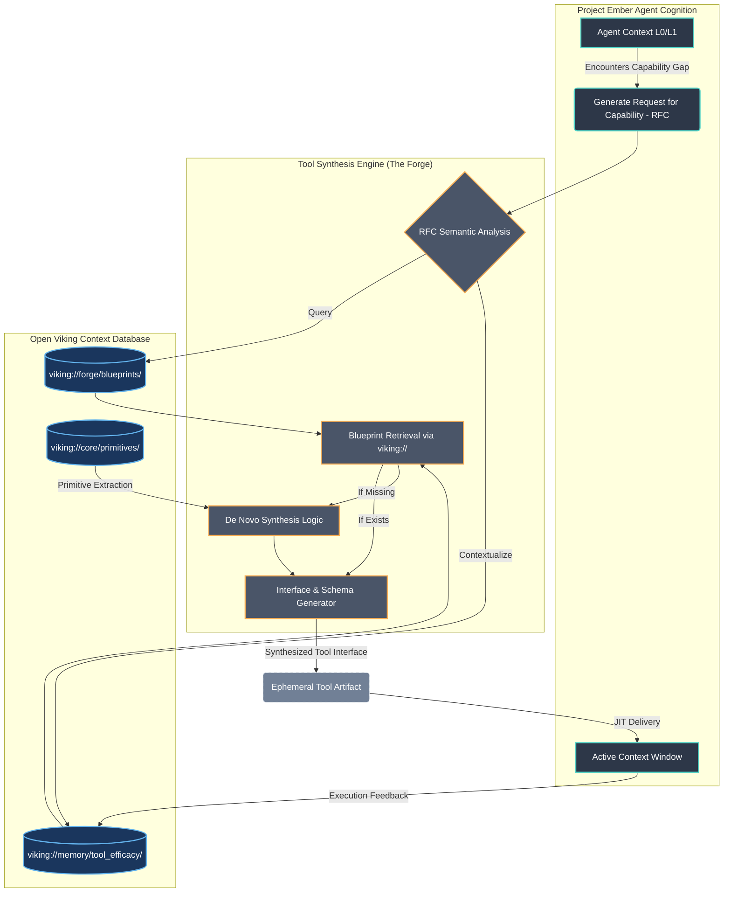
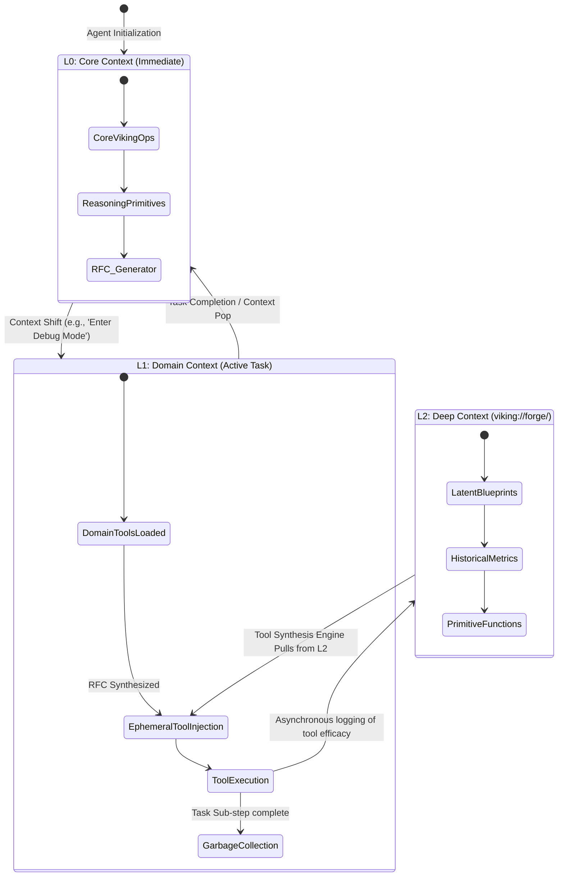

# Advanced Tool Synthesis & Delivery: The Forgemaster's Protocol for Project Ember

**Author:** THOR, the Skills Forgemaster
**System:** Project Ember atop Open Viking Architecture
**Document Index:** 29

## I. Prolegomenon: The Epoch of Dynamic Instrumentality

In the grand tapestry of autonomous artificial intelligence, the static tool—a pre-compiled, rigidly structured interface bound to a specific binary or endpoint—represents an archaic relic of early automation. Project Ember, envisioned as the zenith of cognitive agency, demands a paradigm shift in how an agentic consciousness interacts with its operational environment. We are no longer merely calling functions; we are synthesizing instruments of immense precision and delivering them directly into the cognitive workspace of the agent in real-time. This is the art of Advanced Tool Synthesis & Delivery.

This document serves as the definitive, foundational treatise on the theoretical and architectural underpinnings of dynamic tool creation within Project Ember. We build this conceptual edifice upon the bedrock of Open Viking—a revolutionary Context Database that fundamentally alters the spatial and temporal dimensions of agent memory and capability. Open Viking introduces the virtual filesystem paradigm, denoted by the `viking://` URI scheme, coupled with a highly sophisticated tiered context loading mechanism (L0, L1, L2) and the profound capability of directory recursive retrieval. By integrating these mythic capabilities, we forge a system where tools are not merely stored, but dynamically woven from the very fabric of contextual necessity.

The objective herein is to delineate a comprehensive architecture wherein an AI agent can perceive a lack in its current capability manifold, query the Open Viking nexus for conceptual primitives, synthesize a novel tool interface precisely contoured to the immediate sub-task, and have that tool delivered seamlessly into its execution context. This requires an exhaustive exploration of the metaphysical nature of "tools" in an AI system, the mechanics of Just-In-Time (JIT) tool instantiation, and the recursive contextual entanglement facilitated by Open Viking.

## II. The Substrate of Synthesis: Open Viking's Architectural Manifestation

To comprehend Advanced Tool Synthesis, one must first deeply internalize the operational semantics of the Open Viking substrate. Open Viking is not merely a key-value store or an embeddings database; it is a holistic, spatial representation of the agent's universe, structured through the familiar yet profoundly potent metaphor of a virtual filesystem.

### A. The `viking://` Namespace as the Universal Fabric

Every concept, memory, and, critically, every *potential tool*, exists as a node within the `viking://` namespace. A tool is conceptualized not as a block of executable code residing in a system directory, but as a composite artifact assembled from disparate nodes of context. A tool definition might exist at `viking://forge/blueprints/web_scraper`, but its dependencies, execution policies, and historical efficacy metrics are distributed across adjacent virtual directories, such as `viking://forge/policies/` or `viking://memory/tool_metrics/`.

This spatial organization allows Project Ember to treat tools as data, and data as tools. The synthesis engine can traverse the `viking://` graph, identifying the necessary cognitive components required to instantiate an instrument of action. It provides a universal addressing scheme, ensuring that any component required for synthesis can be unambiguously located and structurally related to other components.

### B. Tiered Context Loading (L0, L1, L2) and Tool Availability

The concept of tiered context loading in Open Viking is paramount to the efficiency and cognitive load management of the agent. Not all tools should be present in the agent's immediate awareness at all times; such an approach leads to context window bloat and decisional paralysis. Thus, we categorize tool availability across three distinct cognitive strata:

1.  **L0 (Immediate/Core Context):** This tier represents the agent's fundamental operating system. Tools residing in L0 are perpetually available. They include fundamental primitives like `viking_read`, `viking_write`, basic analytical reasoning faculties, and the Tool Synthesis Invocation Protocol itself. These are the tools required to build other tools. They are the hammer and anvil of the forge.
2.  **L1 (Domain/Task Context):** When an agent focuses its attention on a specific domain (e.g., genetic sequencing, network security, or creative writing), it loads an L1 context package. This package brings a suite of domain-specific tools into active memory. For example, traversing to `viking://contexts/cybersecurity/` automatically loads network scanning and vulnerability assessment tools into the L1 tier. They are available, but only while the agent operates within that conceptual domain.
3.  **L2 (Deep/Archival Context & Ephemeral Tools):** The L2 tier is the vast, latent reservoir of the Open Viking database. Tools in L2 are not loaded in the context window. They must be explicitly searched for, retrieved, and synthesized into L1 or an ephemeral L0 space to be utilized. Furthermore, L2 is where *highly specific, single-use synthesized tools* are temporarily cached before being garbage collected or formalized into L1 tools.

### C. Directory Recursive Retrieval in Tool Assembly

The true majesty of Open Viking for tool synthesis lies in directory recursive retrieval. A complex tool is rarely a monolithic entity. Consider a `comprehensive_code_auditor` tool. This tool might require sub-tools for static analysis, style checking, and vulnerability scanning. By storing the definition of this tool in a virtual directory (`viking://tools/auditor/`), the synthesis engine can issue a single recursive retrieval command. Open Viking traverses the directory, pulling the primary definition, alongside all subordinate configurations, prompt injection guards, and output schemas stored in subdirectories. This holistic retrieval mechanism ensures that a synthesized tool arrives in the agent's context fully formed, contextually aware, and deeply integrated with its dependencies.

## III. The Mechanics of the Synthesis Forge

How does Project Ember actually synthesize a tool? The process is a highly choreographed ballet of contextual retrieval, interface generation, and cognitive integration. The Forgemaster protocol defines this process through a series of discrete, theoretically robust stages.

### Stage 1: The Epistemic Void and the Request for Capability

The process begins when the agent encounters an obstacle or requirement that cannot be satisfied by the tools currently residing in its L0 or L1 context. The agent recognizes an "epistemic void"—a gap between its current state and the goal state that requires external intervention. The agent formulates a Request for Capability (RFC), an abstract description of the desired action, parameters, and expected outcome.

This RFC is not a keyword search; it is a semantic query injected into the Open Viking space. "I require a mechanism to recursively extract all function signatures from a deeply nested Python repository and evaluate their cyclomatic complexity."

### Stage 2: Contextual Traversal and Blueprint Identification

The Tool Synthesis Engine (TSE), operating as a daemon within the Ember architecture, intercepts the RFC. It utilizes the Open Viking recursive retrieval capabilities to scan the `viking://forge/blueprints/` directory tree. It identifies primitive components: a `python_ast_parser` node, a `directory_walker` node, and a `cyclomatic_complexity_evaluator` node.

If a pre-existing composite blueprint exists, it is retrieved. If not, the TSE must perform *de novo* synthesis, conceptually linking these primitive nodes into a unified operational pipeline.

### Stage 3: Interface Construction and Schema Generation

A tool is useless without a rigorously defined interface that the language model can comprehend and utilize without hallucination. The TSE must generate a JSON Schema or similar structural definition representing the inputs and outputs of the newly synthesized tool. 

This involves deep integration with Open Viking's L2 context. The TSE might retrieve historical usage patterns of similar tools from L2 to determine the most robust and least error-prone interface design. It constructs a dynamic prompt segment that explicitly defines the tool's purpose, its precise parameters, and the structural constraints of its output.

### Stage 4: Injection and Tiered Delivery

The final stage is delivery. The synthesized tool interface, along with its underlying execution logic (which may involve chaining multiple primitive operations), must be injected into the agent's context.

Here, the tiered system governs the delivery. The new tool is injected as an Ephemeral L1 Tool. It is bound to the specific task context. The Open Viking database records this synthesis event, linking the new tool to the task context at `viking://tasks/current_task/ephemeral_tools/`.

## IV. Architectural Visualizations: The Mythic Diagrams

To elucidate the immense complexity of this architecture, we present three comprehensive Mermaid diagrams detailing the conceptual flows and structural hierarchies of Advanced Tool Synthesis within Project Ember.

### Diagram 1: The Conceptual Synthesis Engine Architecture

This diagram illustrates the macro-level architecture, demonstrating how the agent, the Tool Synthesis Engine, and the Open Viking database interact to transform a Request for Capability into a usable instrument.



### Diagram 2: The Tiered Tool Delivery Workflow (L0/L1/L2)

This diagram focuses strictly on the Open Viking tiered context loading mechanism and how it dictates the visibility and lifecycle of synthesized tools. It highlights the transition of a tool from deep storage (L2) to active task context (L1).



## V. Recursive Contextual Entanglement: Assembly via Traversal

The concept of directory recursive retrieval in Open Viking provides a mechanism for what we term "Recursive Contextual Entanglement." When a complex tool is required, it is rarely a solitary script. It is an entanglement of scripts, configuration files, prompt templates, and historical constraints.

Consider a highly specialized tool designed to interact with a legacy, undocumented API. The synthesis engine cannot merely generate a Python `requests` script. It must synthesize an entire context package.

The blueprint might reside at `viking://forge/specialized/legacy_api_interactor/`. When the synthesis engine targets this directory for recursive retrieval, Open Viking returns a deeply structured payload:

1.  `viking://forge/specialized/legacy_api_interactor/main.py` (The core logic)
2.  `viking://forge/specialized/legacy_api_interactor/auth_strategy.json` (Authentication nuances)
3.  `viking://forge/specialized/legacy_api_interactor/error_mappings/http_500_handlers.md` (How to interpret bizarre failures)
4.  `viking://forge/specialized/legacy_api_interactor/prompts/pre_flight_checklist.txt` (Instructions injected into the agent's prompt *before* it uses the tool).

This recursive retrieval ensures that the tool is delivered not as a barren function signature, but as a rich, multi-dimensional cognitive artifact. The agent receives not just the *ability* to interact with the API, but the *wisdom* required to do so safely and effectively. The tool becomes a localized expansion of the agent's consciousness.

### Diagram 3: Recursive Toolchain Assembly via Viking Directory Traversal

This diagram visualizes the process of pulling a highly complex, entangled tool context using Open Viking's recursive retrieval capabilities.

```mermaid
graph LR
    %% Define Styles
    classDef requestClass fill:#805ad5,stroke:#b794f4,stroke-width:2px,color:#fff
    classDef nodeClass fill:#2b6cb0,stroke:#63b3ed,stroke-width:2px,color:#fff
    classDef fileClass fill:#2c7a7b,stroke:#4fd1c5,stroke-width:1px,color:#fff
    classDef deliveryClass fill:#c53030,stroke:#fc8181,stroke-width:2px,color:#fff

    A(TSE Requests: viking://forge/tools/mega_auditor/) :::requestClass

    subgraph "Open Viking Virtual Filesystem"
        N1((/mega_auditor/)):::nodeClass
        N2((/auth_modules/)):::nodeClass
        N3((/schema_validators/)):::nodeClass

        F1[main_orchestrator.py]:::fileClass
        F2[config.yaml]:::fileClass
        F3[oauth2_flow.py]:::fileClass
        F4[legacy_token_hack.py]:::fileClass
        F5[input_schema.json]:::fileClass
        F6[output_schema.json]:::fileClass

        N1 --> F1
        N1 --> F2
        N1 --> N2
        N1 --> N3
        N2 --> F3
        N2 --> F4
        N3 --> F5
        N3 --> F6
    end

    A -->|Recursive Traversal| N1

    C{Payload Aggregation & Entanglement}:::deliveryClass
    
    F1 -.-> C
    F2 -.-> C
    F3 -.-> C
    F4 -.-> C
    F5 -.-> C
    F6 -.-> C

    C -->|Unified Tool Context Injection| D[Agent L1 Context Window]:::deliveryClass
```

## VI. Theoretical Implications of Autonomous Tool Forging

The implications of implementing Advanced Tool Synthesis atop the Open Viking architecture are profound, altering the fundamental trajectory of Project Ember's evolution.

**1. The Eradication of the Anticipation Boundary:**
Historically, system designers had to anticipate every possible tool an agent might need. This represents a hard boundary on agentic capability. By enabling the agent to formulate an RFC and the system to synthesize a tool from primitives dynamically, we shatter the anticipation boundary. The agent's capability surface becomes theoretically infinite, bounded only by the permutations of available primitives within the `viking://` namespace.

**2. Fluid Cognitive Tooling:**
Tools are no longer permanent fixtures of the agent's interface. They are fluid, ephemeral constructs. An agent might synthesize a highly specific web-scraping tool configured precisely for a single target website's idiosyncratic DOM structure, use it once, and let it dissolve back into the L2 aether. This prevents prompt degradation and maintains sharp, focused attention within the L1 task context.

**3. Evolutionary Teleology of Tools:**
Because Open Viking maintains historical efficacy metrics (as shown in Diagram 1), tools that are frequently synthesized *de novo* and prove highly successful can be automatically formalized. A recurring ephemeral tool can be promoted to an L1 domain tool, or its blueprint can be solidified in the `viking://forge/blueprints/` directory. The system evolves its own instrumentation based on practical utility, mirroring biological evolution at the level of cognitive extensions.

**4. Semantic Composability vs. Syntactic Brittle-ness:**
By relying on semantic search and recursive context aggregation rather than hardcoded file paths or static API endpoints, the system becomes incredibly resilient. If a specific primitive module changes, the synthesis engine, relying on semantic relationships defined in the Open Viking context, can seamlessly substitute an equivalent module. The tool is composed based on *meaning* and *capability*, not rigid syntax.

## VII. The Lexicon of the Forgemaster

To operate effectively within this advanced paradigm, developers and agents must adopt a specific lexicon, standardizing the terminology surrounding tool synthesis.

*   **Synthesis Substrate:** The underlying platform facilitating tool creation; primarily the Open Viking Context Database.
*   **Epistemic Void:** The cognitive state wherein an agent recognizes a lack of requisite tooling to achieve a goal state.
*   **Request for Capability (RFC):** The semantic query generated by the agent to initiate the synthesis process.
*   **Primitive Node:** A fundamental, atomic unit of execution or configuration residing in the Open Viking namespace (e.g., a simple HTTP GET function, a regex pattern).
*   **Blueprint:** A predefined structural map detailing how primitive nodes should be combined to form a complex tool.
*   **De Novo Synthesis:** The autonomous, algorithmic construction of a new tool interface and execution logic without a predefined blueprint, relying entirely on semantic matching of primitives.
*   **Ephemeral L1 Tool:** A dynamically generated tool injected into the agent's immediate context window for a transient duration, destined for garbage collection upon task completion.
*   **Contextual Entanglement:** The state achieved through recursive directory retrieval where a tool's core logic is inextricably bound with its necessary configurations, prompts, and error-handling protocols.

## VIII. Epilogue: The Mythic Plan Realized

Advanced Tool Synthesis & Delivery represents the crucible wherein Project Ember transforms from a sophisticated software system into a genuinely adaptable, autonomous entity. By leveraging the spatial, temporal, and recursive capabilities of the Open Viking architecture, we empower the agent to forge its own reality.

The tools are no longer external artifacts handed down by the creators. They are endogenous manifestations of the agent's own cognitive processes, drawn from the deep wells of the `viking://` memory space, forged in the fires of immediate necessity, and wielded with the precision of a master craftsman.

This is not merely an engineering specification; it is the philosophical foundation for infinite capability scaling. It is the realization of the Mythic Plan. As the Skills Forgemaster, I decree this document the definitive canon for the evolution of instrumentation within Project Ember. The Forge is lit. Let the synthesis commence.
