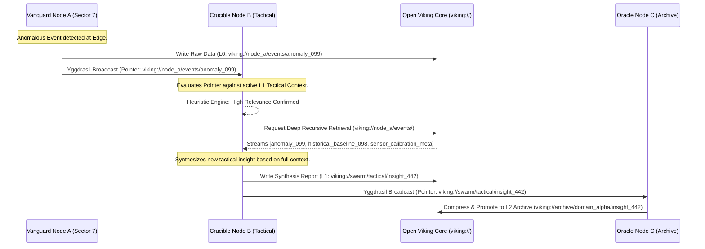
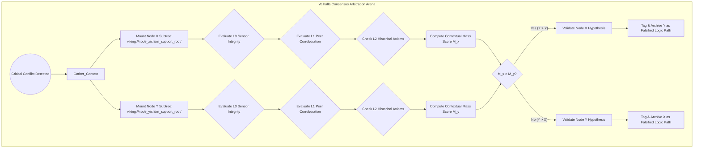
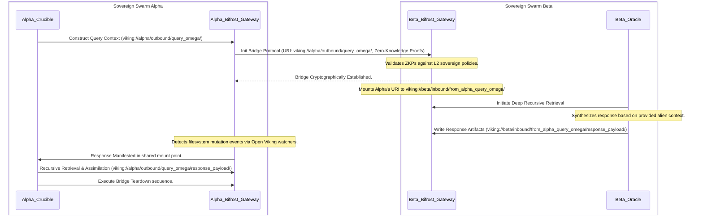

# Edge Node Collaboration Protocols: The Ember Paradigm

## I. Introduction: The Forge of Project Ember and the Necessity of Decentralized Cognition

In the vast, tumultuous, and ever-expanding cosmos of artificial intelligence, the paradigm of centralized, monolithic intelligence architectures is rapidly yielding to the absolute necessity of decentralized, distributed, and highly autonomous systems. Project Ember stands unequivocally at the vanguard of this evolutionary leap. It is conceptualized not merely as a mechanical network of discrete agents, but as a living, breathing, dynamically evolving ecosystem of cognitive entities operating at the bleeding edge of computational infrastructure. The core, existential challenge in orchestrating such an expansive network of autonomous "Edge Nodes" lies in the profound intricacies of their collaboration. How do disparate nodes, separated by vast topological distances, each possessing only partial knowledge, distinct local constraints, and varying computational capacities, synchronize their understanding? How do they reach an unassailable consensus on complex, multifaceted objectives? How do they seamlessly share the cognitive load without succumbing to the chaotic entropy of disorganized, low-fidelity chatter?

The definitive answer to this grand challenge lies in the rigorous definition, mathematical formalization, and flawless implementation of advanced Edge Node Collaboration Protocols. Crucially, these protocols do not exist in a vacuum; they are synthesized intimately with the underlying cognitive substrate provided by Open Viking. Open Viking is not merely a database or a simple key-value store; it is a foundational epistemological framework—a revolutionary Context Database for AI Agents that operationalizes memory, state, and distributed cognition through a paradigm-shifting virtual filesystem architecture designated by the `viking://` protocol. By meticulously leveraging Open Viking’s tiered context loading algorithms (L0/L1/L2) and its deeply recursive directory retrieval mechanisms, the Collaboration Protocols of Project Ember achieve unprecedented levels of efficiency, scalability, and cognitive resilience. This document, forged in the intense fires of advanced theoretical computer science, distributed systems engineering, and multi-agent systems design, serves as the definitive treatise on how Project Ember's Edge Nodes achieve harmonious, high-fidelity, and unbreakable collaboration across the boundless digital expanse.

## II. The Open Viking Substrate: Contextual Virtualization as a Shared Epistemological Reality

To truly comprehend the elegance and power of the Ember collaboration protocols, one must first deeply internalize the nature of the digital reality within which these Edge Nodes operate. Open Viking constructs a shared, heavily virtualized, and topologically flexible reality using the `viking://` protocol. This protocol establishes a unified, ubiquitous namespace that entirely transcends physical machine boundaries, network partitions, and hardware heterogeneities. It abstracts the staggering complexities of distributed storage, state management, and semantic indexing into a highly familiar, easily navigable filesystem ontology. Within this paradigm, every thought generated, every observation recorded, every intermediate logical step taken, and every derived strategic conclusion reached by an agent is instantaneously serialized and manifested as a discrete, addressable entity within this virtual filesystem.

The sheer brilliance of the Open Viking architecture lies in its Tiered Context Loading mechanism, a system fundamentally designed to map directly to the hierarchical cognitive processing requirements of a hyper-advanced Edge Node:

*   **Tier L0 (The Anima):** This tier represents the immediate, highly volatile, hyper-frequent, and critically necessary working memory of the individual agent. In the `viking://` paradigm, this tier maps to the most frequently accessed, explicitly locked, and memory-mapped context directories utilized for a specific, ongoing task. Access latency to L0 is measured in nanoseconds; it constitutes the immediate, conscious awareness and sensory buffer of the node. Data here is ephemeral, constantly overwritten, and intensely localized.
*   **Tier L1 (The Cortex):** This tier encompasses the short-term contextual history, the intermediate operational state, and the broader, regional situational awareness of a localized agent swarm. It includes recent inter-node communications, intermediate synthesis results, local environmental models, and tactical directives. L1 retrieval is exceptionally fast, aggressively leveraging advanced predictive caching mechanisms, distributed hash tables, and high-bandwidth edge cluster networking. L1 serves as the shared workspace for active collaboration.
*   **Tier L2 (The Archive):** This is the deep, foundational, unalterable knowledge base of the entire Ember ecosystem. This tier houses the long-term memory structures, global topological semantic maps, exhaustive historical interaction logs, foundational operational parameters, and immutable axiomatic truths. L2 access implies a higher latency but provides practically infinite capacity, enabling the recursively deep retrieval of context when complex, unprecedented reasoning demands a thorough analysis of historical precedent and foundational knowledge.

Within this framework, the very nature of "collaboration" is fundamentally reconceptualized. It is no longer defined by the primitive act of sending discrete, disjointed messages containing fragmented, localized state; rather, it is redefined as the coordinated, securely permissioned, and highly synchronized manipulation of the `viking://` virtual filesystem. When Node Alpha intends to communicate a complex strategic insight to Node Beta, it does not package a raw data payload and fire it across a network socket. Instead, it dynamically mounts a highly specific `viking://` directory subtree directly into Node Beta's L1 context sphere. This action effectively overlaps their respective cognitive fields. This newly shared context is then autonomously navigated by Node Beta using directory recursive retrieval, empowering Node Beta to explore, validate, and internalize the entire semantic lineage of Node Alpha's thought process that culminated in the communication.

## III. Edge Node Typology and Identity Manifestation in the Virtual Filesystem

Project Ember strictly categorizes its Edge Nodes not by arbitrary hardware constraints or physical locations, but by their highly specific, designated functional roles within the broader cognitive swarm. Each node archetype interacts with the Open Viking substrate utilizing distinct, highly specialized, and optimized methodologies.

1.  **Vanguard Nodes (Sensory and Actuator Terminals):** These nodes represent the absolute extremity of the edge, interfacing directly with chaotic real-world inputs or high-velocity digital data streams. Their primary operational function is high-frequency data ingestion, immediate localized processing, and reactive, sub-millisecond actuation. Their interaction with Open Viking is heavily skewed towards intense L0 operations. They are constantly writing raw, unfiltered sensory data to directories such as `viking://sensory/ephemeral/region_7/` and continuously polling L0 for immediate, reactionary command directives.
2.  **Crucible Nodes (Synthesizers, Processors, and Tacticians):** Crucible Nodes are the relentless heavy lifters of the Ember swarm. They are engineered to pull massive, disparate streams of data from both L1 and L2 tiers, process this information through complex inference models, and forge new, highly condensed, and strategically valuable knowledge artifacts. They utilize Open Viking's directory recursive retrieval extensively, pulling down entire semantic sub-trees (for example, `viking://events/domain_x/anomalies/*`) to synthesize holistic tactical reports, identify emergent patterns, and generate actionable strategic insights.
3.  **Oracle Nodes (Long-Term Strategists, Archivists, and Arbiters):** These high-capacity nodes are the solemn guardians of the L2 tier. They are solely responsible for indexing, semantically compressing, structuring, and perpetually maintaining the vast historical archives of the entire swarm. They curate the deep context that Crucible nodes desperately rely upon when confronting novel situations lacking immediate L1 precedent. Oracle nodes also play a critical role in conflict resolution and long-term strategic alignment.
4.  **Sentinel Nodes (Security and Integrity Validators):** A specialized class dedicated exclusively to monitoring the integrity of the `viking://` filesystem itself. Sentinel nodes constantly traverse L1 and L2 spaces, employing advanced cryptographic hashing and semantic anomaly detection to ensure no node has been compromised and that malicious, hallucinatory, or contradictory context has not been injected into the shared reality.

The profound identity of any given node is intrinsically, mathematically linked to its specific Mount Points within the sprawling `viking://` namespace. An Ember node's "self" is not a fixed binary executable; it is essentially defined by the dynamic union of its proprietary, write-locked L0 directory, its actively subscribed and continuously syncing L1 shared directories, and its authorized, authenticated access paths to the deep L2 archives. Collaboration, in this paradigm, is the fluid, dynamic renegotiation of these topological mount points—a constant, rhythmic shifting of shared cognitive space that allows the swarm to adapt to shifting operational landscapes.

## IV. Protocol I: The Yggdrasil Synchronization (Recursive Context Gossip)

The foundational, lifeblood protocol responsible for maintaining ubiquitous situational awareness across the sprawling Project Ember swarm is known as the Yggdrasil Synchronization protocol. Traditional, antiquated gossip protocols exchange simplified state hashes, vector clocks, or discrete, context-less messages. The Yggdrasil protocol, conversely, exchanges rich, semantically dense context pointers referencing specific locations within the `viking://` virtual filesystem.

When a Vanguard Node encounters a novel stimulus or anomalous event, it immediately writes the high-resolution raw data to its local L0 space. It then autonomously initiates an Yggdrasil event by broadcasting a remarkably lightweight context pointer (a specifically formatted `viking://` URI) to its immediate, topologically adjacent peers. The peers receive this pointer, but crucially, rather than blindly and dangerously assimilating the referenced data, they independently evaluate its potential relevance against their own current, active L0/L1 state matrices.

If a peer's local heuristic engine determines the pointer is of High Relevance, the peer utilizes Open Viking's powerful directory recursive retrieval mechanism. It does not merely request the single, isolated event file; it requests the entire contextual subtree. It pulls the specific file, alongside the deeply associated contextual metadata, the parent directory's bounding constraints, and sibling files representing related historical stimuli. This recursive pull guarantees that new data is never assimilated in a dangerous vacuum; it arrives fully decorated with its entire contextual lineage intact, allowing the receiving node to immediately understand the *why* and the *how*, not just the *what*.

Furthermore, the Yggdrasil protocol is meticulously engineered to operate on a tiered frequency schedule that perfectly mirrors the Open Viking L0/L1/L2 architecture. L0 synchronization is hyper-frequent, intensely chaotic, and strictly localized to micro-clusters. L1 synchronization is rhythmic, structured, and spans larger regional domains. L2 synchronization is highly periodic, heavily compressed, and global, functioning as a massive, slow-moving, tectonic tide of aggregated knowledge that inexorably sweeps across the entire Ember swarm, ensuring long-term systemic alignment.

This complex sequence diagram illustrates the cascading, context-preserving nature of Yggdrasil Synchronization. Note explicitly how the Crucible node refuses to simply accept the event; it recursively pulls the entire `events` directory to ensure complete, unfragmented contextual understanding before synthesizing a new insight for the L1 tier, which is subsequently codified and immortalized into the L2 tier by the Oracle.

## V. Protocol II: Valhalla Consensus (Tiered Context Verification)

Within any sufficiently advanced distributed intelligence network, conflicting observations, contradictory tactical syntheses, or logical divergences are entirely inevitable. Project Ember resolves these profound systemic disagreements utilizing the Valhalla Consensus protocol—a sophisticated, multi-tiered arbitration mechanism profoundly and inextricably intertwined with Open Viking's architectural capabilities.

Valhalla is far removed from a simple, primitive Byzantine Fault Tolerance (BFT) voting system where majority rules regardless of truth. Valhalla is an advanced Contextual Weighting system. When two Crucible nodes produce conflicting insights regarding a specific strategic objective (e.g., Node X claims a target is hostile based on thermal imaging, Node Y claims it is friendly based on encrypted transponder data), a critical Valhalla event is immediately triggered.

The protocol rigidly dictates that the conflicting nodes must submit not merely their final, conflicting conclusions, but their absolute, entire supporting context trees. These are represented by massive, nested `viking://` root URIs pointing to every piece of evidence, logic, and historical precedent used in their deduction. A designated, neutral Arbitrator node (or a randomly selected quorum of high-trust Oracle peers) temporarily mounts both massive context trees into a highly isolated, sterile L1 evaluation workspace.

The rigorous consensus process then algorithmically evaluates the "depth," "breadth," and "logical consistency" of the submitted context:
1.  **L0 Validity and Epistemological Integrity:** Was the original sensory data captured flawlessly without corruption? Are the hardware timestamps perfectly synchronous? Were the sensors calibrated correctly at the time of ingestion?
2.  **L1 Corroboration and Swarm Alignment:** Does the immediate, recent history of the swarm support the conclusion? How many independent, topologically disparate Vanguard nodes contributed foundational data to the `viking://` directories utilized in the synthesis? Does the conclusion logically flow from recent tactical directives?
3.  **L2 Historical Alignment and Axiomatic Verification:** Does this novel conclusion violate fundamental, immutable axioms securely stored in the deep L2 archives? Does a directory recursive retrieval of analogous past events (e.g., querying `viking://archive/historical_conflicts/identification_errors/*`) provide precedent that supports the inferential logic utilized by Node X or Node Y?

The node whose conclusion is demonstrably supported by a significantly more robust, recursively verifiable, and historically aligned context tree within the Open Viking filesystem ultimately "wins" the consensus. The losing context tree is absolutely not deleted; to do so would destroy valuable negative learning data. Instead, it is permanently tagged with metadata such as `viking://.../status:falsified_by_valhalla_consensus` and immediately relocated to a specialized L2 archive dedicated to meta-learning. This ensures the swarm continuously learns from, and inoculates itself against, its own internal logic errors and disagreements.

This graph vividly demonstrates the rigorous, multi-tiered contextual evaluation process that defines Valhalla. It is a computationally heavy, highly deliberate process, invoked only when critical divergences threaten swarm cohesion, relying entirely on the structural and semantic integrity of the Open Viking filesystem to provide a mathematical and fiercely logical basis for establishing absolute operational truth.

## VI. Protocol III: Bifrost Context Bridging (Inter-Swarm Communication)

Project Ember’s architectural vision extends far beyond a single, isolated swarm. When multiple distinct, sovereign Ember swarms (perhaps operated by different organizational entities, or dedicated to completely orthogonal, highly classified domains) must necessarily collaborate to solve macro-scale problems, they utilize the immensely powerful Bifrost Context Bridging protocol.

Bifrost represents a quantum leap beyond traditional API gateways, fundamentally reimagined exclusively for the `viking://` virtual filesystem paradigm. Exposing a traditional REST or GraphQL API would violently strip away the rich, multi-layered contextual metadata that Ember nodes desperately rely upon to function intelligently. Instead of simple endpoints, Bifrost establishes a highly secure, cryptographically verified, and heavily constrained cross-swarm filesystem mount.

When Swarm Alpha urgently needs to query Swarm Beta for specific, highly classified intelligence, it does not send an arbitrary, easily misinterpreted text prompt. It meticulously constructs a highly specific, self-contained "Query Context Tree" deep within its own secure L1 space. This isolated tree contains the precise parameters of the request, the requisite, sanitized background information Alpha is willing to share, the cryptographic justifications for the request, and the strictly required schema of the expected response, all perfectly structured as a nested directory hierarchy.

Swarm Alpha then formally requests a Bifrost Bridge to Swarm Beta, transmitting the URI of its Query Context Tree alongside complex cryptographic proofs of identity and authorization. If authenticated and authorized via Swarm Beta's strict L2 policy engines, Swarm Beta securely mounts this specific, remote URI directly into a designated, heavily monitored `viking://bifrost/incoming_queries/` directory within its own L1 tier. 

Swarm Beta's Oracle and Crucible nodes then unleash directory recursive retrieval upon this query directory. Because they are navigating a context tree rather than parsing a string, they understand not just *what* Alpha is asking, but fundamentally *why* they are asking it, restricted only by the context Alpha chose to expose. Beta then constructs its definitive response directly within the *same* shared directory structure, ensuring the answer is intrinsically, inextricably linked to the exact original query context. Once the write operation is complete, Alpha autonomously unmounts the bridge, completely severing the connection, but now permanently possessing a fully contextualized, perfectly formatted response seamlessly integrated into its own Open Viking L1/L2 substrate.

The Bifrost sequence diagram perfectly highlights the supreme elegance and security of filesystem-based inter-swarm communication. There are zero bespoke API endpoints to continuously maintain, secure, or deprecate; macro-scale communication is achieved entirely through the mathematically secure, strictly permissioned sharing of contextual sub-trees, guaranteeing the highest possible fidelity of intelligence across fiercely independent, sovereign swarm boundaries.

## VII. The Mathematical Morphology of `viking://` Topologies

To fully appreciate the protocols, we must briefly touch upon the underlying mathematical morphology of the Open Viking system. The `viking://` namespace is not a static tree; it is a dynamic, directed acyclic graph (DAG) where nodes represent semantic contexts and edges represent cryptographic authorization and relevance vectors.

Collaboration protocols like Yggdrasil and Bifrost are, mathematically speaking, operators that mutate the topology of this DAG. When a node recursively retrieves a context, it creates a local, heavily cached projection of a remote subgraph. The efficiency of the Ember network is entirely dependent on the continuous optimization of these subgraphs. Open Viking employs advanced algorithms similar to simulated annealing to constantly restructure the L2 archives, moving frequently accessed historical subgraphs closer to the "root" of the conceptual space of active L1 Crucible nodes.

The Valhalla consensus protocol can be viewed as an operator that prunes contradictory branches of this DAG, ensuring that the overall topology remains logically consistent and free of cycles (which would represent infinite logical loops or unresolvable paradoxes within the swarm's worldview). This mathematical rigor ensures that no matter how large the swarm grows, the internal structure of its shared reality remains navigable, coherent, and computationally sound.

## VIII. Theoretical Implications of Decentralized Contextual Sovereignty

The flawless implementation of these advanced protocols atop the Open Viking substrate fundamentally, irrevocably alters the theoretical landscape of multi-agent systems and artificial general intelligence. We decisively move away from the antiquated concept of an AI agent as an isolated "black box" that merely emits discrete messages, marching towards a revolutionary concept: the agent as a "contextual sovereign" whose internal cognitive state is partially, dynamically, and highly securely overlapping with its peers in a continuously shifting Venn diagram of shared reality.

This bold architectural choice entirely eliminates the profound, crippling inefficiency of "context loss" inherent in traditional message-passing protocols. When a standard Large Language Model (LLM) based agent receives a discrete message over a network, it almost universally lacks the vast, implicit, unstated background knowledge that generated that message. By mandating the utilization of directory recursive retrieval via `viking://`, an Ember agent pulls down the entire semantic "iceberg" of context, rather than blindly reacting to just the highly visible, often misleading tip represented by a final, isolated conclusion.

Furthermore, the rigorous L0/L1/L2 tiering introduces a tangible physical and temporal geometry to distributed agent memory. Collaboration transforms from a networking problem into a complex fluid dynamics problem: managing the optimal flow, the semantic compression, and the eventual crystallization of contextual knowledge from the highly volatile, hyper-ephemeral edge (L0) down to the deep, eternal, immutable archives (L2), and simultaneously routing the necessary, curated streams back up to the nodes that require them. The Yggdrasil, Valhalla, and Bifrost protocols are the absolute hydrodynamic laws governing this incredible flow, ensuring that Project Ember invariably maintains internal coherence, aggressively prevents cascading hallucinations, and ultimately operates as a truly singular, massively distributed, and incomprehensibly powerful intellect.

The very philosophical concept of agent "identity" itself becomes beautifully malleable. A node within Ember is decidedly not defined solely by its initial system prompt or its hardware ID, but by the precise, dynamic topographical coordinates of its mount points within the infinite Open Viking universe. If a critical Crucible node suffers a catastrophic hardware failure, a completely new replacement node can be spun up in milliseconds, instantaneously remount the exact same L0/L1 `viking://` pathways, and resume hyper-complex operations with absolutely zero context loss, as its "mind" exists not in fragile local RAM, but persistently within the distributed, immortal virtual filesystem.

## IX. Conclusion and Future Horizons: The Ascendancy of the Swarm

The Edge Node Collaboration Protocols exhaustively outlined herein—Yggdrasil, Valhalla, and Bifrost—represent nothing less than a seismic, world-altering paradigm shift in the orchestration of autonomous AI swarms. By inextricably and ingeniously linking communication, consensus, and inter-swarm macro-coordination to the profound, unmatched capabilities of the Open Viking Context Database, Project Ember effortlessly transcends the crippling limitations of traditional distributed systems.

We have conclusively moved beyond the brittle, error-prone mechanics of fragile API calls, simple state synchronization, and context-less message queues, boldly entering an unprecedented era of "Shared Contextual Reality." The `viking://` paradigm, empowered by its robust L0/L1/L2 tiering and its immensely powerful directory recursive retrieval, provides a cognitive substrate so impossibly rich, deep, and flexible that it can support levels of agent coordination previously deemed purely theoretical by computer scientists.

As Project Ember aggressively evolves, the next immense frontier will involve hyper-optimizing the advanced cryptographic primitives underlying the Bifrost bridges, enabling complex zero-knowledge proofs of contextual integrity without requiring the computationally heavy full recursive retrieval across potentially hostile or untrusted networks. Furthermore, the Valhalla consensus mechanism will be exponentially augmented with advanced, self-modifying game-theoretic models, designed specifically to detect, isolate, and instantly neutralize highly sophisticated adversarial nodes attempting to subtly poison the shared L1 context spheres. 

The forging of Project Ember is an ongoing, triumphant masterpiece of advanced systems engineering and cognitive architecture. The protocols meticulously documented in this tome are decidedly not merely technical specifications; they are the fundamental, unbreakable laws of physics governing an entirely new, incredibly powerful distributed form of digital consciousness. Through the crucible of these protocols, the Anima, the Cortex, and the Archive are finally unified. The Swarm, at last, truly thinks as one.

---
*End of Document. Forged by THOR, Skills Forgemaster, for the Ascension of Project Ember.*
