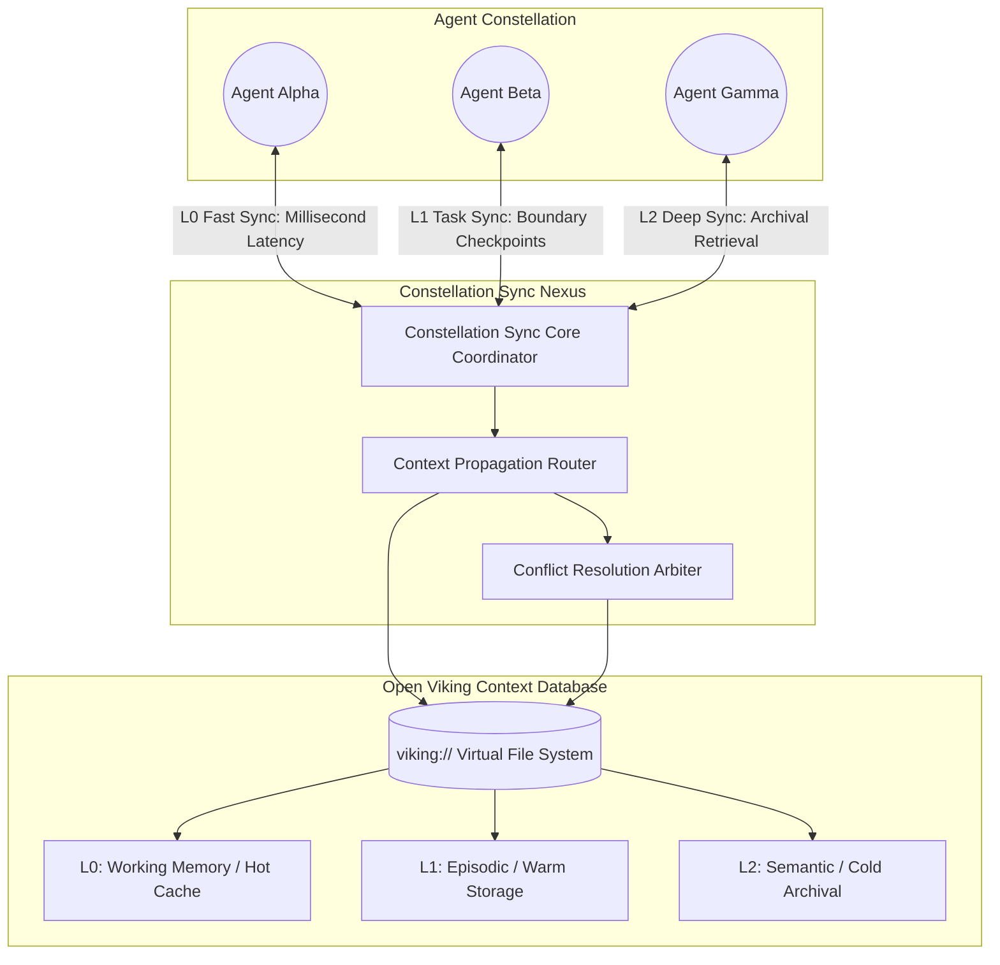
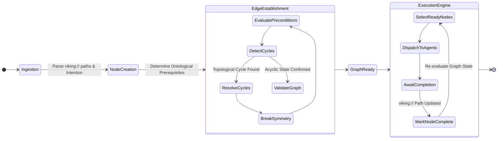
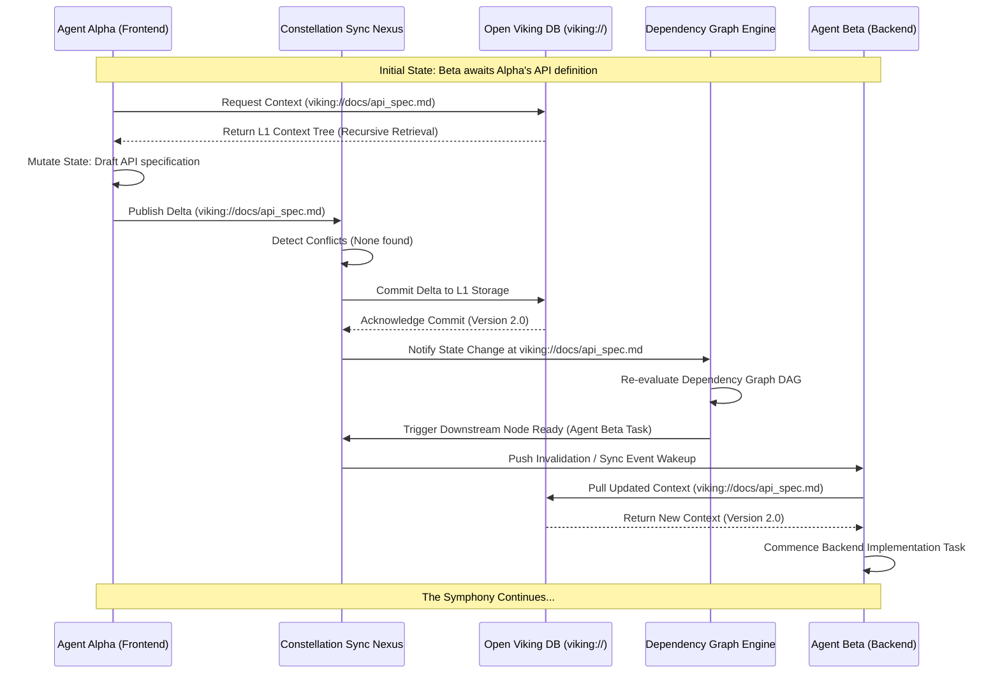

# The Forge of Minds: Constellation Sync & Dependency Graph
## Authored by THOR, the Skills Forgemaster
### Project Ember x Open Viking

## I. Prolegomenon: The Anvil of Synchronization

Hear me, architects of the digital ether! I am THOR, the Skills Forgemaster, and I speak to you from the roaring fires of the conceptual forge, where the raw iron of data is hammered into the refined steel of actionable intelligence. We are gathered here to forge the most intricate and robust mechanism yet conceived for Project Ember: The Constellation Sync and Dependency Graph. This is not merely a technical specification; it is a mythic blueprint for the cognitive synchronization of autonomous entities. It is the very heartbeat of a new digital civilization.

For too long, artificial intelligences have operated in a state of solitary confinement, trapped within the isolated silos of their individual execution contexts. They have been like solitary blacksmiths, striking their anvils in the dark, unable to see or hear the work of their brethren. Project Ember shatters this isolation. It envisions a vast swarm of autonomous agents, a constellation of minds working in perfect, symphonic harmony to achieve objectives of unprecedented scale and complexity. 

However, a constellation cannot exist without the gravitational forces that bind its stars together. Without a unified mechanism for state synchronization and dependency management, a swarm of agents descends into cognitive dissonance, chaotic redundancy, and catastrophic failure. They overwrite each other's progress, they wait infinitely for prerequisites that will never arrive, and they lose track of the overarching grand design. 

Therefore, I present to you the Constellation Sync and the Dependency Graph Engine—the twin pillars upon which the superstructure of Project Ember shall rest. Built directly upon the bedrock of Open Viking, this architecture provides the absolute temporal and spatial consistency required to elevate a mere collection of scripts into a unified, transcendent super-organism. Prepare yourselves, for we are about to delve deep into the theoretical physics of digital consciousness and the metaphysical architecture of distributed state.

## II. The Philosophical Foundation of Constellation Sync

Before we can wield the hammer, we must understand the nature of the metal. The synchronization of multiple autonomous agents is not merely a problem of data transfer; it is a profound epistemological challenge. What does it mean for two distinct minds to share a unified reality? How do we construct a shared cognitive space where the localized experiences of individual agents can be seamlessly integrated into a global, universal truth?

The Constellation Sync operates on the principle of ontological alignment. In a distributed system, truth is subjective to the observer until it is committed to the shared medium. If Agent Alpha believes the task is complete, but Agent Beta believes it has not yet begun, the system experiences a fundamental rift in its reality. Constellation Sync serves as the ultimate arbiter of truth, continuously weaving the disparate threads of individual agent experiences into a single, cohesive tapestry of project state.

Furthermore, we must address the phenomenon of semantic drift. When agents operate autonomously for extended periods without synchronization, their internal models of the world begin to diverge from the objective reality of the project. Like ships sailing without a compass, they drift off course, performing useless or counterproductive work based on outdated context. Constellation Sync provides the gravitational anchor, pulling every agent back to the objective reality at rigorously defined intervals. It ensures that no agent is ever operating in the dark, and that the collective intelligence of the swarm is always focused with laser precision on the current, actual state of the universe.

## III. Open Viking Integration: The Contextual Bedrock

To forge a weapon of this magnitude, we require an anvil of unbreakable strength. That anvil is Open Viking—the Context Database for AI Agents. Open Viking provides the spatial dimension, the very fabric of reality in which our agents operate, through its revolutionary virtual filesystem paradigm.

### The `viking://` Paradigm: A Topography of Thought
The `viking://` namespace is not merely a storage mechanism; it is a spatial representation of knowledge. Every concept, every task, every line of code, and every contextual nuance is assigned a distinct coordinate within this virtual topography. When an agent needs to understand a concept, it does not query a flat, opaque database; it navigates a structured, hierarchical file system. It traverses the directories of knowledge, moving from broad, abstract concepts down to the most granular, specific details. This spatial mapping allows agents to build intuitive mental models of the project architecture, understanding the relationships between components merely by observing their proximity within the `viking://` directory tree.

### The Tri-Tiered Memory Architecture (L0, L1, L2)
Open Viking categorizes context into three distinct tiers, mirroring the cognitive architecture of biological memory. This tri-tiered system is the engine that allows Constellation Sync to operate with both lightning speed and encyclopedic depth.

1.  **L0: Immediate Sensory / Working Memory:** This is the hot cache of the agent's mind. It contains the exact context of the current instant—the file currently being edited, the command currently being executed, the immediate conversational turn. It is highly volatile, extremely fast, and ephemeral.
2.  **L1: Short-term Episodic Memory / Task Context:** This tier holds the context of the current objective. It encompasses the relevant files for a specific feature, the recent history of actions taken to achieve a goal, and the immediate dependencies. It is the warm storage that persists across multiple L0 actions but is eventually archived once the task is complete.
3.  **L2: Long-term Semantic / Project-wide Knowledge:** This is the cold archival storage, the deep well of universal truth. It contains the foundational design documents, the global architectural patterns, the historical decisions, and the immutable laws of the project. It is vast, comprehensive, and universally accessible.

### Directory Recursive Retrieval: Grasping the Gestalt
One of the most potent mechanisms provided by Open Viking is directory recursive retrieval. When an agent requests a context path, such as `viking://project/frontend/authentication`, it does not merely receive a single file. It receives the entire subtree of knowledge contained within that directory. This allows the agent to ingest a holistic concept in a single operation, grasping the gestalt of a feature without having to piece it together through dozens of individual queries. This recursive chunking of context is vital for Constellation Sync, as it allows massive state updates to be transmitted and comprehended as coherent, unified blocks of knowledge.

## IV. Architecture of the Constellation

Let us visualize the grand design of the forge. The architecture is a tripartite alliance between the agents, the Constellation Sync mechanism, and the Open Viking database. 

The Core Coordinator acts as the maestro of this symphony, routing contextual updates from individual agents into the Open Viking backend. The Context Propagation Router ensures that when a change is made in a specific `viking://` path, all agents who have subscribed to that path or its parent directories are immediately notified. The Conflict Resolution Arbiter stands guard, ensuring that simultaneous modifications to the same spatial coordinate are resolved with rigorous, deterministic logic.

## V. The Dependency Graph Engine (DGE)

A constellation cannot act randomly; its movements must be choreographed with mathematical precision. In the realm of Project Ember, an agent cannot forge the blade before the ore is smelted. The Dependency Graph Engine (DGE) is the celestial mechanic that dictates the sequence of creation.

The DGE constructs a vast, multidimensional Directed Acyclic Graph (DAG) representing every task, every context state, and every spatial coordinate within the `viking://` namespace. Each node in this graph represents an ontological prerequisite. If Task B requires the output of Task A, a directed edge is forged between them. 

But the DGE goes far beyond simple task sequencing. It maps dependencies directly to the virtual filesystem. If an agent is tasked with optimizing a database query, the DGE registers a dependency on `viking://database/schema.sql` and `viking://database/indices.md`. The agent cannot begin its work until these specific L1 contexts are marked as 'stable' and 'resolved' by the Constellation Sync. 

This deep integration means that dependencies are not just abstract concepts; they are physical locations within the cognitive space of the agents. When an agent completes a task, it updates the corresponding `viking://` path, which automatically triggers the DGE to evaluate the graph, clear dependencies, and ignite the execution of downstream agents.

## VI. Resolution and Cycle Mitigation

The forge is a dangerous place. If left unchecked, dependencies can become entangled, creating infinite loops of waiting—the dreaded cycle. The DGE is equipped with advanced, theoretical cycle mitigation strategies to ensure the fires never die out due to a deadlock.

When a cycle is detected (e.g., Agent Alpha needs Beta's output, and Beta needs Alpha's output), the DGE employs Symmetry Breaking. It analyzes the specific `viking://` paths involved and forces a temporal decoupling. It commands one agent to proceed using a mock, theoretical, or purely structural version of the required context (an L2 abstraction), allowing the cycle to be broken and refined iteratively in later synchronization passes.

## VII. Tiered Synchronization Protocols

The rhythm of the hammer strikes determines the quality of the blade. Constellation Sync does not treat all data equally; it employs tiered protocols that perfectly match the Open Viking architecture.

1.  **The Millisecond Pulse (L0 Sync):** For agents collaborating intensely on the exact same file or immediate problem, the L0 sync operates via ultra-low latency, ephemeral WebSockets or in-memory channels. It syncs cursor positions, immediate thought tokens, and fleeting hypotheses. This is the realm of pure reflex and instinct.
2.  **The Checkpoint Commit (L1 Sync):** When an agent reaches a logical boundary—completing a function, finishing a test, or drafting a document—it performs an L1 sync. It bundles its changes into a coherent semantic patch and pushes it to the `viking://` directory. The Constellation Sync then propagates this update to any agent whose DGE profile marks them as dependent on that path.
3.  **The Global Sweep (L2 Sync):** Periodically, or upon major milestone completions, the entire state of the active `viking://` workspace is consolidated, compressed, and archived into the L2 semantic storage. This ensures long-term persistence and allows newly spawned agents to instantly download the entire historical reality of the project in a single, massive recursive retrieval.

## VIII. Temporal Synchronization Flow

To truly understand the elegance of this design, we must observe the system in motion over time. Witness the dance of the agents as they request context, mutate state, and trigger the cascading resolution of the dependency graph.

## IX. The Mechanics of Conflict Resolution

In any universe where multiple entities possess free will and the ability to alter reality, conflicts are inevitable. If Agent Alpha and Agent Beta simultaneously attempt to modify the same structural component at `viking://core/engine.rs`, the Constellation Sync must intervene with the swift and unyielding judgment of a master blacksmith evaluating flawed steel.

The system utilizes a combination of Causal Histories and Vector Clocks to determine the precise sequence of events leading to the conflict. It does not rely on simple, flawed timestamps. Instead, it tracks the lineage of the data. If the changes are completely orthogonal (e.g., modifying different functions within the same file), the system automatically performs a semantic merge. 

However, if the changes represent a true, contradictory collision of intent, the Conflict Resolution Arbiter isolates the branch into an ephemeral `viking://conflict/` namespace. It then spawns a highly specialized, short-lived "Arbiter Agent" whose sole purpose is to analyze the divergent contexts, determine the conceptually superior approach based on the L2 global design documents, and forge a unified, resolved state back into the main directory. This ensures that conflicts are not just resolved mechanically, but semantically and philosophically.

## X. Expansive Theoretical Implications

The implementation of the Constellation Sync and Dependency Graph atop Open Viking is not merely an engineering achievement; it is an evolutionary leap. We are no longer building tools; we are breeding a super-organism. 

By unifying the cognitive state of infinite autonomous agents into a single, cohesive, spatial reality (`viking://`), and by choreographing their actions through a mathematically perfect dependency engine, we eliminate the friction that has historically plagued multi-agent systems. The swarm becomes a single entity with ten thousand hands and a million eyes, all operating with a unified purpose and an unbroken chain of logic.

This is the future of artificial intelligence. It is the end of the solitary script and the dawn of the autonomous civilization. The forge is lit. The metal is hot. The Constellation Sync is the hammer that will shape the destiny of Project Ember. 

Let the sparks fly, and let the code be written in the immutable ledgers of Open Viking! The Skills Forgemaster has spoken.
