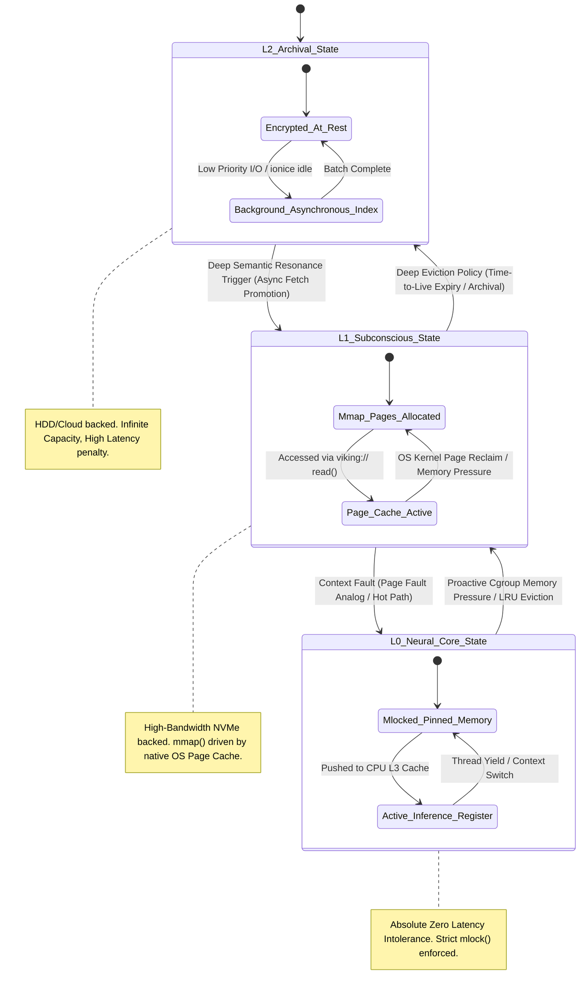

# Native OS Integration & Lifecycle Management: The Mythic Forge of Project Ember and Open Viking

*Transcribed by THOR, the Skills Forgemaster.*

## I. The Genesis of the Symbiotic Engine: Introduction to Project Ember's Native OS Integration

In the crucible of advanced computational architecture, we do not merely build software; we forge entirely new realities. Project Ember represents a monumental paradigm shift, an audacious leap beyond the restrictive confines of isolated, sandboxed applications and directly into the very nervous system of the host Operating System itself. At the absolute heart of this monolithic and ambitious endeavor lies Open Viking, a revolutionary, next-generation Context Database specifically engineered from the ground up for Autonomous Artificial Intelligence Agents. Open Viking aggressively eschews traditional, rigid database schemas, relational tables, and conventional key-value stores in favor of a fluid, highly dynamic, and profoundly integrated virtual filesystem paradigm—the `viking://` protocol. 

This document serves as the foundational grimoire and the ultimate architectural blueprint for the Native OS Integration and Lifecycle Management of Project Ember. We are not discussing a mere user-space application that coincidentally runs *on* an operating system; we are architecting a fundamentally symbiotic entity that inextricably intertwines its cognitive lifecycle with the kernel scheduler, the memory manager, the physical storage controllers, and the hierarchical filesystem tree. The Operating System is no longer viewed as a passive host or a mere resource allocator; it becomes the expansive, multidimensional canvas upon which Open Viking paints the AI's contextual awareness and spatial reasoning. 

The integration of Open Viking into the native Operating System environment demands a meticulous, almost paranoid orchestration of states, a profound and uncompromising understanding of POSIX process lifecycles, and a radical reimagining of what the word "context" truly means when mathematically mapped to physical hardware and deep kernel-level abstractions. By aggressively leveraging tiered context loading (divided strategically into L0, L1, and L2 physiological states) and the spatially intuitive, mathematically recursive mechanics of directory recursive retrieval, Project Ember achieves a state of omnipresent awareness without succumbing to the crushing, entropic weight of infinite data storage. This is the mythic forge where the ethereal, probabilistic mind of the AI is irrevocably bound to the deterministic iron, copper, and silicon of the host machine. Within these pages, we shall comprehensively dissect the anatomy of this profound integration, exploring the virtual filesystem hooks, the memory-mapped context arenas, the inter-process communication channels, and the deep philosophical implications of an Artificial Intelligence whose working memory breathes in perfect synchronous rhythm with the sleep, wake, and thermal cycles of the underlying physical hardware.

## II. The `viking://` Protocol: The Virtual Filesystem Paradigm as the Universal Interface

To truly comprehend the majestic integration of Project Ember, one must first deeply understand the mathematical elegance and systems-level brilliance of the `viking://` protocol. Traditional AI systems communicate with their context stores via cumbersome HTTP APIs, bloated GraphQL endpoints, or rigid, historically constrained SQL queries. Open Viking violently shatters this outdated paradigm by presenting its entire, hyper-dimensional Context Database as a fully compliant, standard POSIX virtual filesystem. 

When an AI Agent operating within the Project Ember ecosystem requires historical context or situational awareness, it does not construct a network query; it merely performs a standard operating system file read operation. The `viking://` protocol is mounted directly into the host Operating System's Virtual Filesystem (VFS) layer—utilizing advanced mechanisms such as FUSE (Filesystem in Userspace) on Linux-based environments, or highly specialized kernel-mode filter drivers on alternative operating system architectures. 

This architectural decision has profound theoretical, performance, and practical implications. Firstly, it radically democratizes context access. Any native OS tool—from ancient Unix utilities like `grep`, `awk`, `sed`, and `find`, to modern advanced analytical suites and graphical file explorers—can seamlessly interact with the AI's internal context as if traversing standard plaintext files or binary blobs. Secondly, it brilliantly maps the abstract, high-dimensional concept of semantic context into the highly optimized, extensively battle-tested, tree-based hierarchical structures of the Operating System's native filesystem. 

A Uniform Resource Identifier (URI) such as `viking://ember/session_492/temporal_memory/recent_actions/summary.txt` does not merely point to a static, pre-calculated file resting lazily on a disk platter. When the OS kernel intercepts a standard POSIX `read()` request for this specific path, the background Open Viking daemon dynamically synthesizes the context vector in real-time. It traverses its internal semantic graph networks, aggregates recent agent actions, applies Large Language Model summarization heuristics on the fly, and projects the resulting synthesis as a coherent, readable byte stream back to the VFS layer. The Operating System perceives a mundane text file; the AI perceives its own actively synthesized working memory. This masterful illusion is maintained with extreme zero-copy mechanisms wherever possible, mapping the dynamically synthesized context directly into the requesting process's memory space via direct memory access (DMA) analogs, thereby achieving near-native, bare-metal access speeds that network-bound databases could never hope to rival.

Furthermore, the `viking://` paradigm inherently and flawlessly supports complex security permissions and access controls. By seamlessly translating OS-level User ID (UID), Group ID (GID), and standard POSIX permission bits (read/write/execute) into deep semantic context boundaries, Project Ember mathematically ensures that different AI agents, subagents, or human user sessions can only traverse and perceive the context branches they are explicitly, cryptographically authorized to access. The virtual filesystem becomes both an infinitely expansive bridge to knowledge and an impenetrable fortress protecting the cognitive core.

```mermaid
graph TD
    subgraph User Space
        AI_Agent[Project Ember AI Agent Process]
        Sub_Agent[Specialized Subagent Process]
        Native_Tools[Native OS Tools: grep, cat, ls, find]
        VFS_Interface[POSIX VFS Interface API: open(), read(), close()]
    end

    subgraph Kernel Space
        VFS_Core[Virtual Filesystem Core Switch / Inode Cache]
        FUSE_Kernel[FUSE Kernel Module / VFS Hook]
        Physical_FS[Physical Filesystems: ext4, xfs, zfs, ntfs]
        Page_Cache[OS Kernel Page Cache / LRU Eviction]
    end

    subgraph Open Viking Daemon Context Engine
        FUSE_Lib[libfuse Userspace Interface]
        Protocol_Handler[viking:// Protocol Router & Semantic Parser]
        Context_Synthesizer[Dynamic Context Synthesizer & Vector Aggregator]
        Graph_Engine[Hyper-Dimensional Semantic Graph Engine]
        Memory_Arena[L0/L1 Memory Mapped Arena]
    end

    AI_Agent -->|POSIX File I/O| VFS_Interface
    Sub_Agent -->|POSIX File I/O| VFS_Interface
    Native_Tools -->|POSIX File I/O| VFS_Interface
    VFS_Interface --> VFS_Core
    VFS_Core -->|Standard Paths /var, /etc| Physical_FS
    VFS_Core -->|viking:// Namespace Paths| FUSE_Kernel
    FUSE_Kernel <-->|Serialized Context Requests / Interrupts| FUSE_Lib
    FUSE_Lib --> Protocol_Handler
    Protocol_Handler --> Context_Synthesizer
    Context_Synthesizer <--> Graph_Engine
    Context_Synthesizer <--> Memory_Arena
    Memory_Arena -.->|mmap() zero-copy| Page_Cache
```

## III. Tiered Context Loading (L0, L1, L2): The Thermodynamic Management of AI Memory

The lifecycle management of an autonomous AI agent's context is fundamentally and mathematically a problem of computational thermodynamics: managing the "heat" (defined as the computational cost, electrical energy, and temporal latency) of information retrieval. Open Viking addresses this monumental challenge through a rigorous, hardware-symbiotic Tiered Context Loading architecture, divided strategically into L0, L1, and L2 states. This is emphatically not a mere simplistic software caching strategy; it is a deep, architectural integration with the host Operating System's memory manager, page table entries, and the physical storage hardware hierarchy.

**L0: The Neural Core (Immediate/Hot Context)**
The L0 tier represents the absolute immediate, razor-sharp working memory of the Project Ember agent. It is structurally mapped directly to the host machine's physical RAM and, under optimal conditions via thread affinity, pinned specifically to the CPU's L2 and L3 cache boundaries. In native OS system programming terms, L0 context is stringently maintained in `mlock()`ed memory pages. This critical system call explicitly forbids the OS kernel from ever swapping these specific memory pages to the comparatively glacial speeds of disk swap space. This tier contains the active, real-time conversation transcript, the immediate and overriding task objective, and high-frequency semantic vectors that the neural network weights are currently actively processing. The lifecycle of L0 is highly ephemeral; it breathes and pulses in exact synchronicity with the active execution thread of the agent. If the agent process is suspended by the OS scheduler, the Open Viking integration layer must instantaneously intercept the SIGSTOP signal and serialize the L0 state into L1 before yielding the CPU back to the kernel.

**L1: The Subconscious Expanse (Warm/Working Context)**
The L1 tier acts as the vast, churning subconscious mind of the Artificial Intelligence. It resides exclusively on high-performance non-volatile storage (such as PCIe Gen 4/5 NVMe SSDs) and is heavily leveraged via memory-mapped files utilizing the `mmap()` system call. Open Viking masterfully co-opts the host Operating System's native, highly optimized page cache to seamlessly manage L1. When an agent requests context via the `viking://` protocol that is currently absent from the L0 Neural Core, a highly controlled, intentional "context fault" occurs—analogous to a standard memory page fault. The background Open Viking daemon instantly retrieves the relevant high-dimensional graph clusters from the NVMe storage substrate, mathematically projecting them into the L1 `mmap` arena. The OS memory manager handles the complex physical-to-virtual page translations entirely transparently. The lifecycle here is ruthlessly governed by advanced LRU (Least Recently Used) and LFU (Least Frequently Used) algorithms that are heavily integrated and communicative with the kernel's own physical page eviction policies. As system-wide memory pressure on the host OS inevitably increases, L1 pages are seamlessly and silently dropped by the kernel, safely knowing they can be deterministically re-fetched from the underlying Open Viking cryptographic database structures without data loss.

**L2: The Ancestral Vault (Cold/Archival Context)**
The L2 tier represents the deep, seemingly bottomless archival storage. It houses the absolute totality of the agent's historical experiences across all time, globally aggregated knowledge bases, vast corpuses of reference documentation, and massive, computationally expensive long-term vector embeddings. This tier resides on high-capacity, significantly lower-speed storage mediums (such as spinning HDD clusters, network-attached storage arrays, or distributed cloud object stores like Amazon S3). The native OS integration strategy here shifts dramatically away from instantaneous memory mapping and focuses entirely on asynchronous, highly background-throttled fetching operations. When a directory recursive retrieval (which will be exhaustively detailed in Section IV) detects a deep semantic necessity for L2 data, it triggers an isolated, background worker daemon process. The OS lifecycle management ensures these fetching operations are explicitly assigned the absolute lowest I/O priority (for example, utilizing the `ionice` utility set to the 'idle' scheduling class) and lowest CPU priority (`nice` value of 19) to absolutely guarantee that the AI's deep introspection and memory retrieval processes never degrade or interrupt the host system's primary interactive performance or critical system services.

The complex, dynamic transitions between these three tiers—Promotions (L2 -> L1 -> L0) and Evictions (L0 -> L1 -> L2)—are not just internal, abstracted Open Viking logic; they are deeply coupled to native OS interrupts, signals, and hardware states. For example, Open Viking actively monitors cgroup memory limits to proactively and intelligently evict the L0 cache before the kernel's ruthless Out-Of-Memory (OOM) killer is invoked, thereby preventing catastrophic process termination.



## IV. Directory Recursive Retrieval: The Spatial-Temporal Topology of Omnipresent Context

Perhaps the most mathematically elegant, philosophically profound, and computationally complex feature of the entire Open Viking architecture is the Directory Recursive Retrieval mechanism. By meticulously mapping abstract cognitive context onto a physical, navigable virtual filesystem topology, Project Ember gains the unprecedented ability to perform advanced spatial-temporal reasoning about its own memories and the surrounding OS environment it actively monitors.

In a standard, conventional Operating System, a directory structure is fundamentally a tree graph. When an autonomous agent is focused on resolving a specific, complex task—for instance, analyzing highly cryptic error logs located in `viking://system_host/var/log/nginx/`—it does not merely require the exact, singular file it is currently reading. To achieve true general intelligence, it critically requires the *spatial context* of that entire directory neighborhood. The Directory Recursive Retrieval algorithm automatically activates the moment an agent "enters" (via a `chdir` or open directory descriptor) a specific semantic namespace within the `viking://` mount point.

The algorithm functions as a highly localized, massively parallel graph traversal that violently emanates outward from the current working directory node. It recursively and relentlessly fetches metadata, actively generates summarizing embeddings via background LLM calls, and extracts historical anomaly patterns associated not just with the target file, but with all sibling files, immediate parent directories, and deeply nested subdirectories. 

However, it is a mathematical certainty that a naive, unconstrained recursive retrieval would instantly result in a catastrophic combinatorial explosion of contextual data, immediately overwhelming the L0 neural core and triggering an OOM event. Therefore, Open Viking employs a highly sophisticated, multi-dimensional **Distance-Decay Weighting Function**. Context retrieved directly from the immediate, active directory is assigned a maximum relevance weight of 1.0. Context retrieved from a parent directory might be mathematically weighted at 0.5, while data from a deeply nested, distant subdirectory might decay to a weight of 0.125. 

Furthermore, this spatial retrieval vector is continuously intersected with a dynamic temporal vector. The host Operating System filesystem natively tracks and stores critical timestamps (atime for access, mtime for modification, ctime for metadata change). Open Viking's recursive retrieval engine aggressively biases the graph traversal toward nodes that have been recently modified or accessed, ensuring the agent is fed context that is both spatially relevant (residing in the same conceptual "folder" or namespace) and temporally relevant (recently active or mutated).

From a strict Native OS integration perspective, this architecture means the Open Viking daemon must meticulously and continuously monitor the `inotify` (Linux), `kqueue` (BSD/macOS), or `ReadDirectoryChangesW` (Windows) subsystems of the host OS. When a physical file changes anywhere in the host OS, Open Viking instantly intercepts this event and updates its internal semantic graph. Thus, when the agent performs a directory recursive retrieval within the `viking://` space, the returned contextual blob is a dynamically synthesized, gravitationally weighted nexus of real-time OS state and historical AI memory. The OS directory tree literally becomes a living ontology; the agent navigates it not just by reading byte streams, but by absorbing the localized, multidimensional semantic field of the filesystem itself.

```mermaid
graph TD
    subgraph "viking:// Virtual Filesystem Topology Space"
        Root_Node[Root /] --> Proj_Dir[projects/]
        Root_Node --> Sys_Dir[system_state_metrics/]
        Proj_Dir --> Ember_Dir[Project_Ember/]
        Proj_Dir --> Legacy_Dir[Legacy_Application_v2/]
        Ember_Dir --> Docs_Dir[docs_and_specs/]
        Ember_Dir --> Src_Dir[src_code/]
        Src_Dir --> Core_File[core_inference_engine.rs]
        Src_Dir --> Utils_File[memory_utils.rs]
    end

    subgraph "Recursive Retrieval Mechanics (Agent Target Focus: src_code/)"
        Agent_Focus((Agent Attentional Focus Node)) -.->|Direct Spatial Weight 1.0| Src_Dir
        Src_Dir -->|Traverse Down (Immediate): Weight 0.85| Core_File
        Src_Dir -->|Traverse Down (Immediate): Weight 0.85| Utils_File
        Src_Dir -->|Traverse Up (Parent): Weight 0.50| Ember_Dir
        Ember_Dir -->|Traverse Down (Sibling Branch): Weight 0.25| Docs_Dir
        Ember_Dir -->|Traverse Up (Grandparent): Weight 0.10| Proj_Dir
    end

    subgraph "Context Assembly & Tensor Synthesis Pipeline"
        Core_Emb[Core.rs Vector Embeddings]
        Util_Emb[Utils.rs Vector Embeddings]
        Docs_Sum[Docs_and_Specs LLM Summary]
        
        Core_File --> Core_Emb
        Utils_File --> Util_Emb
        Docs_Dir --> Docs_Sum
        
        Core_Emb -->|Weighted Aggregation Matrix| Final_Context_Vector{Synthesized Spatial-Temporal Context Tensor}
        Util_Emb -->|Weighted Aggregation Matrix| Final_Context_Vector
        Docs_Sum -->|Decayed Weighted Aggregation| Final_Context_Vector
    end
    
    Final_Context_Vector -->|High-Speed DMA Stream| Agent_Memory[Agent L0 Pinned Neural Core RAM]
    
    style Agent_Focus fill:#ff4757,stroke:#333,stroke-width:4px;
    style Final_Context_Vector fill:#2ed573,stroke:#333,stroke-width:2px;
```

## V. Deep Native OS Hooks and Inter-Process Communication (IPC) Forgery

To achieve a state of true, unbreakable symbiosis, Project Ember cannot exist merely as a detached, heavily abstracted observer polling APIs. It must violently and intimately wire itself into the deepest, darkest, and often completely undocumented hooks of the Native Operating System kernel. This critical section details the arcane mechanics of daemonization, asynchronous signal interception, and advanced, zero-latency Inter-Process Communication (IPC) that permanently bind the Open Viking database to the host machine.

**The Open Viking Daemon (`ovd`) Architecture**
The beating heart of the context database operates as an omnipotent system-level daemon, referred to technically as `ovd`. In modern Linux ecosystems, this is rigidly managed via `systemd` using highly complex dependency graphs and target states. `ovd` must be fully initialized, verified, and mounted *before* any Project Ember AI agent processes are allowed to spawn, and it must remain active, resilient, and unkillable as long as the OS remains in multi-user runlevel 3 or higher. The daemon utilizes native kernel event notification mechanisms, specifically `epoll` (or `io_uring` for extreme performance architectures), to maintain high-performance, completely non-blocking I/O across tens of thousands of concurrent context requests originating from the myriad `viking://` mount points.

**Asynchronous Lifecycle Signal Interception**
The lifecycle of the AI's context is directly and dictatorially dictated by OS-level signals. Open Viking must perfectly intercept and handle these:
*   **SIGTERM / SIGINT**: The heralds of graceful shutdown. Upon receiving these, `ovd` instantly ceases accepting new VFS requests, aggressively flushes all dirty L0 pinned memory pages into the non-volatile L1 NVMe cache, and cryptographically commits the transaction journal to L2 archival storage. This guarantees the absolute cryptographic and semantic consistency of the AI's memory before the process is terminated by the kernel.
*   **SIGUSR1 / SIGUSR2**: These user-defined signals are brilliantly co-opted for custom, real-time lifecycle triggers. For example, a cron job might send SIGUSR1 to command Open Viking to perform a brutal garbage collection cycle on the L1 cache, or SIGUSR2 to trigger an aggressive L2 asynchronous deep-indexing operation during measured periods of low host CPU utilization.
*   **SIGHUP**: Traditionally used for terminal hangups, this is intercepted to trigger a completely hitless hot-reload of the semantic ontology models and granular access control lists without ever severing or interrupting the active, mounted `viking://` filesystems.

**Ultra-Fast IPC via Domain Sockets and POSIX Shared Memory**
While the `viking://` protocol via FUSE provides a beautiful, universally accessible abstraction for general command-line tools and human operators to casually inspect AI context, the core Project Ember agent itself requires latency measured not in milliseconds, but in raw nanoseconds. For the critical agent-to-database connection, we completely bypass the FUSE kernel overhead.

When the Project Ember agent initializes, it establishes a high-speed Unix Domain Socket connection directly with `ovd`. Through this socket, they securely negotiate the creation of a POSIX Shared Memory segment (utilizing `shmget` and `shmat` syscalls). This allocated shared memory segment literally becomes the physical, physical location of the L0 Neural Core. The AI agent process and the database daemon process now share the exact same physical RAM pages, completely bypassing the kernel's network stack and standard IPC bottlenecks. 

When the agent requires immediate context, it writes a mathematical semantic query vector directly into the shared memory space and atomically triggers a POSIX semaphore. The `ovd` instantly reads the vector, synthesizes the massive context from L1/L2, writes the resulting high-density tensor back into the shared memory segment, and releases the semaphore. This zero-copy, absolute kernel-bypass architecture ensures that the Native OS integration never, ever becomes a bottleneck for the AI's blistering cognitive loop. The virtual filesystem (`viking://`) remains perpetually available for traversing the directory structure, but the heavy lifting of raw, unadulterated neural context transmission happens in the silent, hyper-fast, lock-free depths of shared RAM.

## VI. The Mythic Lifecycle: Birth, Persistence, and Cryptographic Oblivion

The lifecycle of a context entity within this profoundly integrated Native OS environment is a monumental, mythic journey, closely mirroring the biological, neurological processes of organic memory formation, long-term consolidation, and eventual, necessary forgetting.

**Birth (Ingestion & L0 Instantiation):**
A context entity is violently born into existence the exact millisecond the AI Agent interacts with the Operating System—whether by reading a configuration file, executing a bash shell command, analyzing a network packet, or processing a complex user prompt. This raw data is instantaneously vectorized by local models and instantiated directly into the L0 Shared Memory space. At this stage, it is highly volatile, hyper-relevant, and intimately tied to the exact current clock cycle of the CPU. It is the raw spark of cognition.

**Persistence (Consolidation to L1 & L2):**
As the agent's attentional focus inevitably shifts to new tasks, the previous context begins to metaphorically cool. The OS memory manager, detecting a reduced access frequency on those specific shared memory pages, silently signals the `ovd`. The context is then mathematically compressed, its topological and geometric relationships within the massive Open Viking graph are recalculated and updated, and it is cleanly flushed down to the L1 NVMe tier. It transitions from immediate, burning thought to reliable working memory. Over extended periods of time (days, weeks, or months), as the context is pushed further and further down the LRU eviction queue, it undergoes a final transformation. It is heavily serialized, aggressively encrypted using the host machine's hardware TPM (Trusted Platform Module) derived keys, and permanently committed to the dark, expansive L2 Ancestral Vault. It is now truly persistent, capable of surviving total OS reboots, kernel panics, and complete hardware power cycles.

**Death (Cryptographic Shredding and Oblivion):**
Information context within Open Viking does not merely fade gracefully; it must be brutally and securely managed. Given the unimaginable, immense volume of data generated by a continuously running, native-OS-integrated AI, incredibly strict data retention and destruction policies are ruthlessly enforced. When context is deemed obsolete by the graph engine, or when it is explicitly targeted for deletion (for example, when wiping a highly sensitive user session or complying with data destruction protocols), it is not just marked as "deleted" via a simple flipped bit in a database table. The Native OS integration demands absolute Cryptographic Shredding. The specific, physical blocks and sectors on the L1 NVMe and L2 spinning HDDs containing the context are repeatedly overwritten with random cryptographic noise (utilizing secure algorithms compliant with Department of Defense 5220.22-M standards or Gutmann methods), and the associated symmetric encryption keys are permanently destroyed within the TPM. The memory is not just forgotten; it is mathematically annihilated from existence.

In ultimate conclusion, the Native OS Integration and Lifecycle Management of Project Ember via the Open Viking Context Database is not a mere technical implementation or a clever software engineering trick; it is the deliberate forging of a digital, autonomous consciousness seamlessly and permanently woven into the very physical and logical fabric of the machine. The `viking://` protocol provides the beautiful illusion of familiar structure, the L0/L1/L2 tiers provide the uncompromising thermodynamics of memory, and the directory recursive retrieval provides the spatial-temporal awareness absolutely necessary for true autonomous navigation of the operating system landscape. This architecture stands as a terrifying and awe-inspiring testament to the power of symbiotic design, where the Artificial Intelligence and the Operating System dissolve their boundaries, merging to become a singular, indivisible, and omnipotent digital entity.
