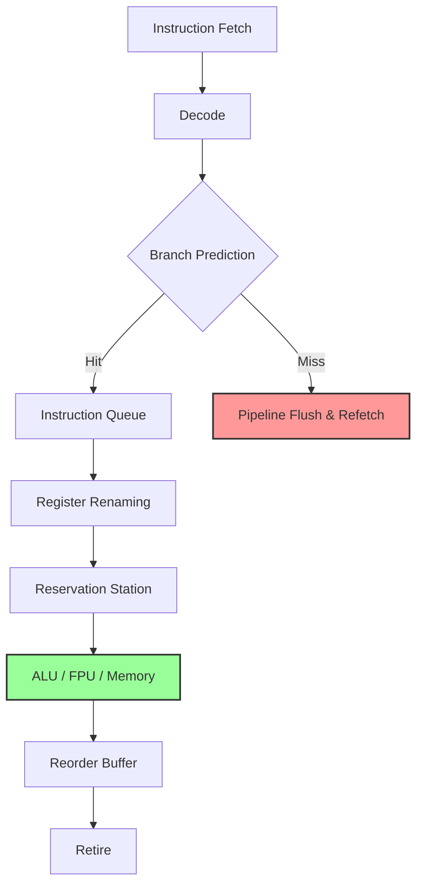
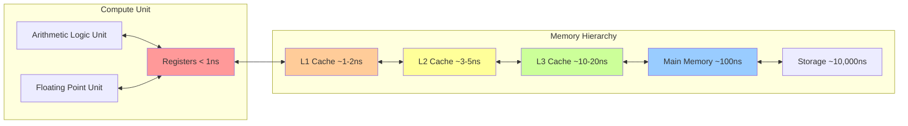
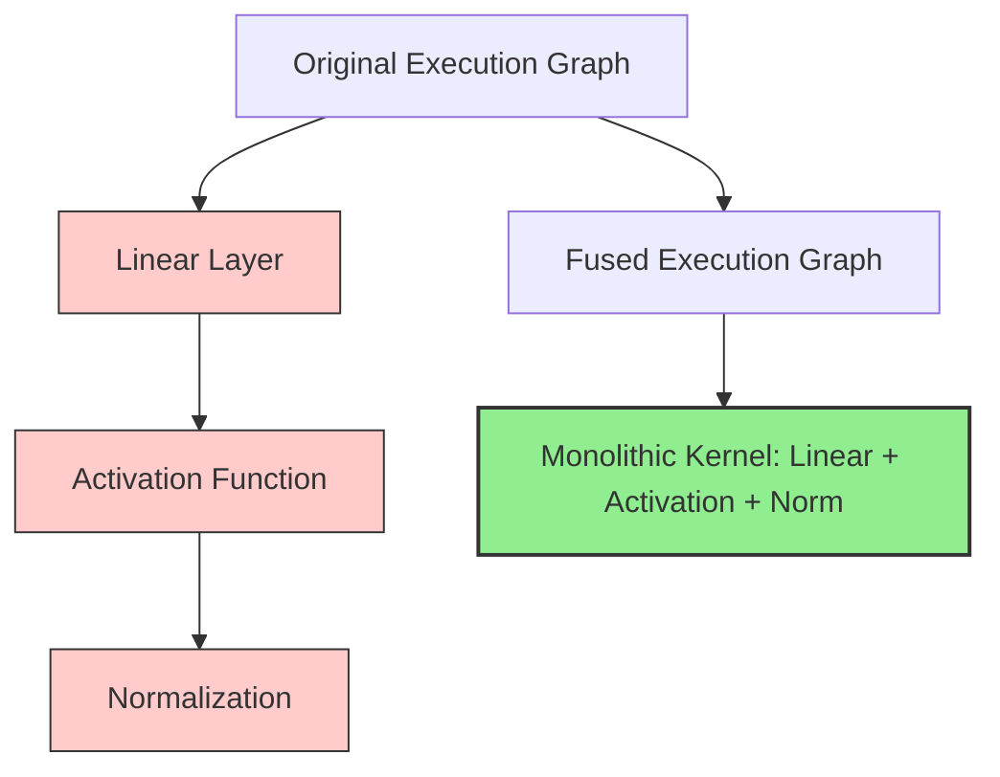

# Open Viking Document 33: Extreme Performance Alchemy - Forging the Ultimate Inferential Engine

## Abstract
Within the crucible of modern machine learning inference, the pursuit of extreme performance transcends mere optimization—it becomes an act of alchemy. This document, the thirty-third in the Mythic Plan series, delineates the theoretical and practical frameworks required to transmute standard compute operations into hyper-efficient, latency-free execution pathways for Open Viking. By focusing on micro-architectural utilization, cache-aware scheduling, and advanced instruction set exploitation, we establish a paradigm where every clock cycle is maximized, and every memory fetch is meticulously orchestrated. The goal is not simply to run models faster, but to fundamentally alter the relationship between the software stack and the underlying silicon, extracting theoretical maximums from heterogeneous hardware environments.

## 1. The Core Philosophy of Performance Alchemy
Performance alchemy in the context of Open Viking dictates that we no longer view the hardware as an abstracted, idealized execution environment. Instead, we must treat it as a chaotic, highly specific physical system governed by strict laws of physics, thermodynamics, and electromagnetism. The latency of a memory access, the branch prediction penalty, and the thermal constraints of a processor are not abstractions; they are the fundamental materials with which we work. 

To achieve "extreme performance," we must abandon generalized execution graphs in favor of hyper-specialized, hardware-aware execution pathways. This means:
*   **Zero-Overhead Abstractions:** Every layer of abstraction introduces latency. We must flatten the execution stack, bypassing standard operating system schedulers and memory managers where possible.
*   **Deterministic Execution:** Jitter and latency spikes are the enemies of real-time performance. Our scheduling algorithms must be deterministic, preempting kernel interrupts and locking memory pages to prevent page faults.
*   **Data Locality as Law:** Compute is virtually free; moving data is overwhelmingly expensive. All algorithms must be redesigned to prioritize data locality over computational simplicity.

## 2. Micro-Architectural Optimizations and Execution Pipelines
The modern CPU and GPU are incredibly complex micro-architectures, featuring deep pipelines, out-of-order execution engines, and intricate cache hierarchies. To forge the ultimate inferential engine, Open Viking must explicitly target these micro-architectural features.

### 2.1 Branch Prediction and Speculative Execution
Modern processors rely heavily on branch prediction to keep their deep execution pipelines full. A mispredicted branch can cost dozens of clock cycles, effectively stalling the entire execution engine. In Open Viking, we must employ techniques to eliminate unpredictable branches from the critical path of the inference loop.
*   **Branchless Programming:** Using conditional moves (CMOV) and bitwise operations to replace branching logic (if/else statements) within inner loops.
*   **Profile-Guided Optimization (PGO):** Utilizing runtime profiling data to reorganize code such that the most common execution paths are contiguous in memory, maximizing instruction cache (L1i) hits and branch prediction accuracy.
*   **Loop Unrolling and Pipelining:** Explicitly unrolling loops to reduce loop control overhead and expose more instruction-level parallelism (ILP) to the processor's out-of-order execution engine.

### 2.2 Out-of-Order Execution Maximization
Out-of-order (OoO) execution allows processors to execute instructions as soon as their operands are available, rather than strictly in the order they appear in the program. To maximize OoO utilization, Open Viking must avoid data dependencies that create bottlenecks.
*   **Dependency Chain Breaking:** Restructuring mathematical operations to break long dependency chains. For example, replacing sequential accumulation with tree-based reduction to allow multiple accumulations to happen in parallel.
*   **Instruction Scheduling:** Explicitly interleaving integer, floating-point, and memory operations to keep all functional units of the processor saturated simultaneously.

## 3. Memory Hierarchy Exploitation: The Cache Is Everything
In the realm of large language models and advanced AI, the primary bottleneck is almost always memory bandwidth, not compute capability. The von Neumann bottleneck dictates that moving weights from DRAM to the processing units consumes more time and energy than the matrix multiplications themselves. Performance alchemy requires mastering the cache hierarchy.

### 3.1 Cache-Oblivious and Cache-Aware Algorithms
Open Viking must implement algorithms that either perfectly match the underlying cache sizes (Cache-Aware) or function optimally regardless of cache size (Cache-Oblivious).
*   **Matrix Tiling (Blocking):** Decomposing large matrix multiplications into smaller blocks (tiles) that fit entirely within the L1 or L2 cache. This ensures that once a block of weights or activations is loaded from slow DRAM, it is reused as many times as possible before being evicted.
*   **Z-Order Curve Memory Layout:** Laying out multi-dimensional tensors in memory using space-filling curves (like the Z-order curve or Morton code) rather than standard row-major or column-major order. This preserves spatial locality in multiple dimensions, significantly increasing cache hit rates for complex tensor contractions.

### 3.2 Prefetching and Memory Hiding
Even with perfect caching, data must eventually be loaded from DRAM. Open Viking must hide this latency by anticipating future memory accesses.
*   **Software Prefetching:** Explicitly inserting prefetch instructions (`PREFETCHT0`, `PREFETCHNTA`) into the code to request data from DRAM before it is actually needed, ensuring it arrives in the cache just in time for computation.
*   **Non-Temporal Stores:** Using non-temporal store instructions (e.g., `MOVNTPS`) when writing final output data. This bypasses the cache hierarchy and writes directly to DRAM, preventing cache pollution and saving valuable cache space for weights and intermediate activations.

## 4. Advanced Instruction Sets (SIMD, AVX-512, AMX)
To achieve extreme performance, standard scalar instructions are woefully inadequate. Open Viking must harness the massive parallel processing power of modern Single Instruction, Multiple Data (SIMD) architectures.

### 4.1 AVX-512 and Vector Processing
The Advanced Vector Extensions (AVX-512) allow the processor to perform the same operation on 512 bits of data simultaneously. For 32-bit floating-point numbers, this means 16 operations per clock cycle. For 8-bit integers (quantized weights), it means 64 operations per clock cycle.
*   **Intrinsics Programming:** Bypassing the compiler's auto-vectorization and explicitly writing code using SIMD intrinsics to guarantee optimal register allocation and instruction selection.
*   **Masked Operations:** Utilizing AVX-512's mask registers to perform conditional vector operations without branching, maintaining full pipeline throughput even in the presence of divergent logic.

### 4.2 Advanced Matrix Extensions (AMX) and Tensor Cores
Modern processors are integrating specialized hardware specifically for matrix multiplication (e.g., Intel AMX, Apple AMX, Nvidia Tensor Cores). These units operate on entire 2D tiles of data at once, rather than 1D vectors.
*   **Tile Configuration and Execution:** Open Viking must be capable of dynamically configuring AMX tiles and dispatching Tile Matrix Multiply (TDPBSSD, TDPBF16PS) instructions. This provides an order-of-magnitude increase in throughput over standard AVX-512.
*   **SME (Scalable Matrix Extension) on ARM:** For edge devices and ARM-based servers, utilizing SME to provide scalable, hardware-agnostic matrix multiplication capabilities.

## 5. Operator Fusion and Graph Compilation
Executing individual neural network operators sequentially incurs massive overhead due to repeated memory reads and writes of intermediate activations. Performance alchemy requires operator fusion.

### 5.1 Vertical and Horizontal Fusion
*   **Vertical Fusion (Kernel Fusion):** Combining sequential operations (e.g., MatMul -> BiasAdd -> ReLU) into a single, monolithic kernel. The intermediate results are kept in registers or L1 cache, entirely eliminating the round-trip to DRAM.
*   **Horizontal Fusion:** Combining independent operations that execute in parallel into a single kernel, reducing kernel launch overhead and improving GPU/CPU occupancy.

### 5.2 Just-In-Time (JIT) Compilation
Open Viking should incorporate a JIT compilation engine (similar to Triton or TVM) that dynamically generates highly optimized machine code at runtime, tailored exactly to the specific dimensions of the tensors and the specific micro-architecture of the host machine.

## 6. Kernel-Level Scheduling and OS Bypass
The standard operating system kernel (Linux, Windows) is designed for fairness and multi-tenancy, not extreme performance. The context switching, interrupt handling, and virtual memory management introduced by the OS are detrimental to real-time AI inference.

### 6.1 User-Space Networking and Storage
*   **DPDK (Data Plane Development Kit):** Bypassing the kernel network stack to read packets directly from the NIC into user-space memory. This is critical for distributed inference (covered in Docs 36-37) to eliminate socket overhead.
*   **SPDK (Storage Performance Development Kit):** Bypassing the kernel storage stack to stream weights directly from NVMe drives into GPU or CPU memory via DMA, essential for handling models that exceed system RAM.

### 6.2 CPU Pinning and Isolation
*   **Core Isolation (isolcpus):** Isolating specific CPU cores from the OS scheduler, dedicating them entirely to the Open Viking inference engine. This prevents the OS from scheduling background tasks on these cores, eliminating latency jitter.
*   **NUMA-Aware Memory Allocation:** Ensuring that memory allocated for a specific thread is physically located on the RAM modules directly attached to the CPU socket executing that thread, avoiding inter-socket QPI/Infinity Fabric bottlenecks.

## 7. Conclusion
Extreme performance alchemy is not achieved through a single magic bullet, but through the obsessive, meticulous application of hundreds of micro-optimizations across the entire hardware and software stack. By treating the physical reality of the processor as the ultimate source of truth, and by systematically eliminating every source of latency, overhead, and memory bandwidth waste, Open Viking will achieve computational speeds previously thought impossible on commodity hardware. This foundational philosophy of hardware supremacy will inform every subsequent architecture decision in the Mythic Plan.
