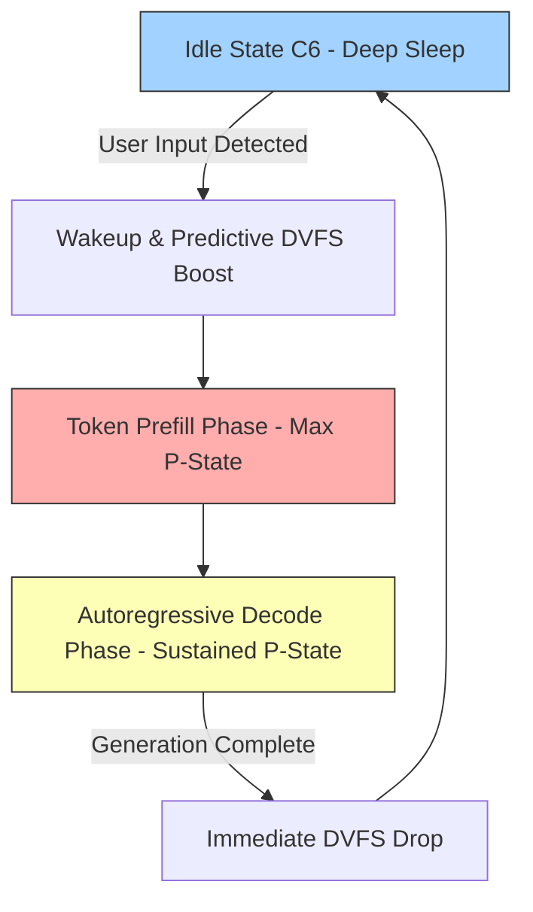
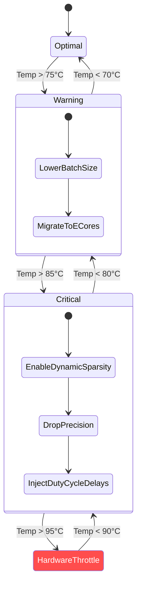

# Open Viking Document 34: Battery and Thermal Management - Mastering the Thermodynamics of Compute

## Abstract
As Open Viking extends its operational domain from highly controlled, liquid-cooled data centers to untethered edge devices and mobile hardware, the physical constraints of power and heat become primary architectural considerations. This document, the thirty-fourth in the Mythic Plan series, establishes the protocols for advanced Battery and Thermal Management. We define mechanisms for Dynamic Voltage and Frequency Scaling (DVFS), aggressive power gating, and graceful thermal throttling. The objective is to design an inference engine that is not merely fast, but "thermodynamically aware"—capable of modulating its own execution to maximize battery life and prevent thermal runaway, while maintaining an acceptable quality of service (QoS) for the user.

## 1. The Thermodynamics of Compute
In semiconductor physics, every state change of a transistor dissipates energy as heat. The power consumption ($P$) of a CMOS processor is governed roughly by the equation $P = C \cdot V^2 \cdot f$, where $C$ is the capacitance, $V$ is the voltage, and $f$ is the switching frequency. Because power scales quadratically with voltage and linearly with frequency, pushing a processor to its maximum clock speed yields diminishing returns in performance while causing an exponential increase in heat generation and battery drain.

Open Viking must recognize that "maximum performance" is often the enemy of "sustained performance." A burst of high-frequency compute that triggers thermal throttling within seconds will ultimately result in lower overall throughput than a steady, lower-frequency execution path.

## 2. Dynamic Voltage and Frequency Scaling (DVFS) Control
Modern processors manage their own voltage and frequency through internal firmware (e.g., Intel Speed Shift, ARM cpufreq). However, the operating system's default governors are generic and reactive, often responding too slowly to the bursty nature of LLM inference. Open Viking requires proactive, application-level DVFS control.

### 2.1 Predictive Frequency Ramping
Standard OS governors ramp up clock speeds *after* detecting high CPU utilization. This introduces a latency penalty during the critical initial phases of inference (the "prefill" phase). Open Viking must interface with the hardware (via sysfs on Linux, or specialized APIs on mobile) to proactively request maximum frequency *immediately prior* to launching a large tensor contraction kernel, and immediately release the request upon completion.

### 2.2 The "Race to Sleep" Paradigm
In battery-constrained environments, the most efficient state is deep sleep. For intermittent workloads (e.g., generating a response, then waiting for the user to read it), Open Viking should employ a "Race to Sleep" strategy: execute the inference at the highest sustainable frequency to complete the task as quickly as possible, and then immediately drop the processor into its lowest power state (C-states). This is often more energy-efficient than executing the task slowly at a lower frequency, because it allows the rest of the system-on-chip (SoC) memory controllers, buses, and uncore components to power down sooner.

## 3. Power Gating and Silicon Darkening
Beyond lowering clock speeds, true efficiency is achieved by physically disconnecting power from unused sections of the silicon—a technique known as power gating.

### 3.1 Heterogeneous Compute Exploitation (big.LITTLE architectures)
Modern SoCs (like Apple Silicon or ARM big.LITTLE) feature distinct clusters of cores: high-performance (P-cores) and high-efficiency (E-cores). Open Viking must be intensely aware of this topology.
*   **Background Tasks:** Tokenization, model loading, and KV-cache management should be aggressively scheduled onto E-cores.
*   **Heavy Compute:** Only the dense matrix multiplications of the attention mechanism and feed-forward networks should be allowed to wake the P-cores.
*   **Asymmetric Execution:** In extreme battery-saver modes, Open Viking must be capable of running the entire inference pipeline exclusively on E-cores, keeping the P-cores entirely power-gated (dark silicon).

### 3.2 Fine-Grained Hardware Utilization
If an inference task relies heavily on integer quantization (e.g., INT4/INT8), the floating-point units (FPUs) and high-precision vector registers (e.g., AVX-512) are unused. An advanced implementation of Open Viking will structure its execution to allow the hardware to put these unused functional units into low-power states, reducing overall die temperature and power draw.

## 4. Graceful Thermal Throttling
When a device reaches its thermal design power (TDP) limit, the hardware will forcibly downclock the processor to prevent physical damage. This sudden drop in performance causes severe latency spikes and stuttering generation. Open Viking must preempt hardware-level throttling through software-level intervention.

### 4.1 Thermal Telemetry and PID Controllers
Open Viking must continuously monitor thermal sensors (CPU package temp, GPU temp, battery temp). Instead of reacting to absolute thresholds, it should use a Proportional-Integral-Derivative (PID) controller algorithm to predict future temperature trends based on the current rate of heating.

### 4.2 Algorithmic Degradation
When the PID controller predicts an imminent thermal event, Open Viking must degrade its algorithmic complexity *before* the hardware throttles the clock speed.
*   **Dynamic Sparsity:** Temporarily skipping calculation of low-magnitude attention heads or utilizing early-exit strategies in the neural network layers.
*   **Precision Dropping:** Dynamically switching from FP16 to INT8 computation if the hardware supports lower-power execution for reduced precision, sacrificing a marginal amount of accuracy for a significant reduction in thermal output.
*   **Batch Size Reduction:** If serving multiple requests, temporarily reducing the maximum batch size to lower the sustained computational density.

## 5. Duty Cycles and Mobile Constraints
On mobile devices, heat dissipation is severely limited by the lack of active cooling (fans) and the physical constraints of the chassis. Sustained 100% utilization is physically impossible for more than a few minutes.

### 5.1 Micro-Bursting and Duty Cycles
To maintain acceptable chassis temperatures over long sessions (e.g., a continuous conversational agent), Open Viking must implement artificial duty cycles. This involves micro-bursting: executing compute intensely for a few milliseconds, followed by an enforced sleep period of a few milliseconds. While this slightly increases perceived latency (e.g., dropping token generation from 40 tokens/sec to 25 tokens/sec), it allows the silicon to dissipate heat continuously, preventing the chassis from becoming uncomfortably hot to the user's touch and preventing catastrophic thermal throttling later in the session.

### 5.2 Battery State of Charge (SoC) Awareness
Execution strategy must be directly linked to the battery's State of Charge.
*   **> 80% SoC:** Favor "Race to Sleep" and maximum performance.
*   **< 20% SoC:** Force all execution to E-cores, strictly enforce duty cycles, and cap maximum frequency. Prioritize completing the task eventually over completing it quickly, as a high-current draw on a nearly depleted battery causes severe voltage sag and can trigger an abrupt device shutdown.

## 6. Energy-Aware Task Scheduling in Distributed Environments
When Open Viking operates in a distributed mode (Docs 36-37) across a swarm of devices, energy constraints must dictate task distribution.

*   **Energy-As-A-Metric:** The scheduler must consider the battery level and thermal headroom of each device in the network. A device plugged into wall power (e.g., a desktop PC) should be assigned the heavy lifting, while battery-powered devices (e.g., smartphones) are assigned lightweight tasks or are bypassed entirely, even if they possess significant raw compute capability.
*   **Thermal Load Balancing:** If two identical devices are on the network, but one is thermally saturated while the other is cool, the network must dynamically shard the tensor computations to relieve the thermal stress on the hot device, effectively using the network as a distributed thermal management system.

## 7. Conclusion
In the Mythic Plan, power and thermals are not secondary concerns; they are the physical boundaries within which the software must operate. By integrating deep hardware awareness, predictive DVFS, heterogeneous compute exploitation, and graceful algorithmic degradation, Open Viking transforms from a simple software application into a cyber-physical system. It becomes an engine that breathes with the hardware, optimizing not just for speed, but for survival, longevity, and sustainability in the most hostile computing environments.
