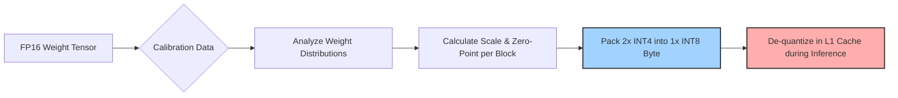
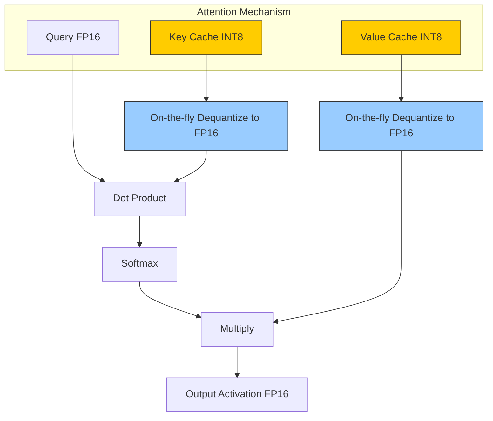

# Open Viking Document 35: Model Quantization - The Alchemy of Information Compression

## Abstract
The sheer scale of foundational language models demands memory capacities and bandwidths that far exceed the physical limitations of edge devices and commodity hardware. This document, the thirty-fifth in the Mythic Plan series, details the critical science of Model Quantization for Open Viking. We explore the transition from high-precision floating-point arithmetic to highly compressed, low-precision formats. By implementing advanced techniques such as AWQ, GPTQ, and aggressive KV cache quantization, Open Viking can reduce model footprints by up to 80% with near-zero degradation in perplexity. This compression is the key that unlocks local inference on constrained hardware, transforming colossal neural networks into agile, deployable assets.

## 1. The Necessity of Information Compression
A standard 70-billion parameter model, stored in 16-bit floating point (FP16), requires roughly 140 gigabytes of VRAM merely to load the weights. This makes execution impossible on consumer GPUs, which typically top out at 24GB. 

Quantization is not a compromise; it is an absolute necessity. It is the process of mapping continuous, high-precision values (weights and activations) to a smaller, discrete set of lower-precision values. The objective of performance alchemy in this context is to minimize the quantization error—the difference between the original high-precision output and the quantized output—while maximizing compression and execution speed.

## 2. Fundamentals of Quantization: PTQ vs. QAT
Quantization strategies are broadly divided into two categories, both of which Open Viking must support:

*   **Post-Training Quantization (PTQ):** The model is trained to convergence in high precision (FP32/FP16), and the weights are subsequently compressed. This is fast, requires no retraining, and is highly desirable for community-driven model deployment.
*   **Quantization-Aware Training (QAT):** The quantization process is simulated during the training or fine-tuning phase itself. The model learns to compensate for the precision loss, typically resulting in higher accuracy at extremely low bit-widths (e.g., 2-bit or 3-bit), but at the cost of significant computational overhead during preparation.

Open Viking's primary runtime focus will be on executing PTQ models with maximum efficiency, while providing utilities for users to perform advanced PTQ techniques locally.

## 3. Integer Quantization Strategies
The backbone of current edge inference relies on mapping floating-point numbers to integers, utilizing hardware-accelerated integer math units (ALUs).

### 3.1 INT8 and Symmetric/Asymmetric Mapping
The most stable form of quantization involves mapping FP16 weights to 8-bit integers (INT8). 
*   **Symmetric Quantization:** Maps the maximum absolute value in the FP16 tensor to the maximum INT8 value (127). The zero-point is fixed at 0. This is faster for computation but wastes precision if the weight distribution is skewed.
*   **Asymmetric Quantization:** Calculates both a scale factor and a zero-point, allowing the INT8 range (-128 to 127) to perfectly map the minimum and maximum FP16 values, regardless of skew.

### 3.2 Sub-Byte Quantization (INT4, INT3, INT2)
To fit models on VRAM-starved GPUs, Open Viking must push beyond INT8 to sub-byte formats, primarily INT4. At 4 bits per weight, a 70B model requires only ~35GB of memory.
However, naive INT4 quantization causes catastrophic degradation in model reasoning. The quantization error becomes too large. Therefore, Open Viking must rely on advanced, data-aware quantization algorithms.

## 4. Advanced Weight-Only Quantization (AWQ, GPTQ)
To maintain intelligence at sub-byte precision, Open Viking must support state-of-the-art quantization algorithms that intelligently decide *how* to compress the weights.

### 4.1 GPTQ (Generative Pre-trained Transformer Quantization)
GPTQ is a one-shot weight quantization method based on approximate second-order information. It processes the weight matrix column by column, quantizing a weight and then immediately updating all remaining unquantized weights in the row to compensate for the error introduced. Open Viking must feature highly optimized CUDA and SIMD kernels specifically designed to unpack and multiply GPTQ-formatted matrices efficiently.

### 4.2 AWQ (Activation-Aware Weight Quantization)
AWQ observes that not all weights are equally important; a small fraction of "salient" weights (typically ~1%) are critical for maintaining accuracy. AWQ identifies these salient weights by observing activation patterns from a small calibration dataset. It then scales up these critical channels in FP16, effectively protecting them from severe quantization error, while quantizing the rest of the matrix to INT4. AWQ is highly favored for edge deployments because the resulting matrices are exceptionally fast to execute on standard hardware.

### 4.3 Group Size and Block-wise Quantization
Instead of using a single scale factor for an entire layer, Open Viking must utilize block-wise quantization. The weights are divided into small groups (e.g., 64 or 128 elements), and each group gets its own FP16 scale factor. This isolates outliers and significantly improves accuracy at the cost of a slight memory overhead for the scale factors.

## 5. The Rise of Floating Point: FP8 and Microscaling
While integer quantization has dominated, the future of inference lies in low-precision floating-point formats, specifically FP8.

### 5.1 E4M3 and E5M2 Formats
FP8 defines two standard formats:
*   **E4M3:** 4 bits for the exponent, 3 bits for the mantissa. Used primarily for weight storage, offering higher precision.
*   **E5M2:** 5 bits for the exponent, 2 bits for the mantissa. Used for gradients or activations requiring higher dynamic range.

Open Viking must natively support FP8 execution on hardware equipped with FP8 Tensor Cores (e.g., Nvidia Hopper, AMD MI300). Because FP8 requires no integer de-quantization step before multiplication, it offers superior throughput compared to INT8 on modern hardware.

### 5.2 Microscaling Formats (MX)
Looking forward, Open Viking should anticipate OCP Microscaling Formats (like MX4 or MX6), which combine block-wise shared exponents with extremely low-bit mantissas, representing the ultimate fusion of compression and floating-point dynamic range.

## 6. KV Cache Quantization and Management
During the autoregressive generation phase, the memory bottleneck shifts from the model weights to the Key-Value (KV) cache—the memory storing the context of previous tokens. For long context windows (e.g., 100k+ tokens), the KV cache can easily consume more memory than the model itself.

### 6.1 KV Cache Compression
Quantizing weights is not enough; Open Viking must aggressively quantize the KV cache to INT8 or even INT4.
*   **Per-Token, Per-Channel Quantization:** Activations often contain massive outliers in specific channels. Effective KV cache quantization requires dynamic, asymmetric scaling calculated on the fly for every token generated.
*   **Page-Aware Quantization:** Integrating KV quantization directly with the PagedAttention mechanism (Doc 38), ensuring that memory blocks are allocated and compressed efficiently without fragmenting the memory pool.

## 7. Conclusion
Model quantization is the prerequisite for ubiquitous AI. By combining block-wise AWQ/GPTQ weight compression with aggressive, dynamic KV cache quantization, Open Viking transforms bloated data center models into lean, hyper-efficient engines capable of running on consumer laptops, mobile devices, and distributed edge networks. This mastery over information density is a core pillar of the extreme performance alchemy required by the Mythic Plan.
