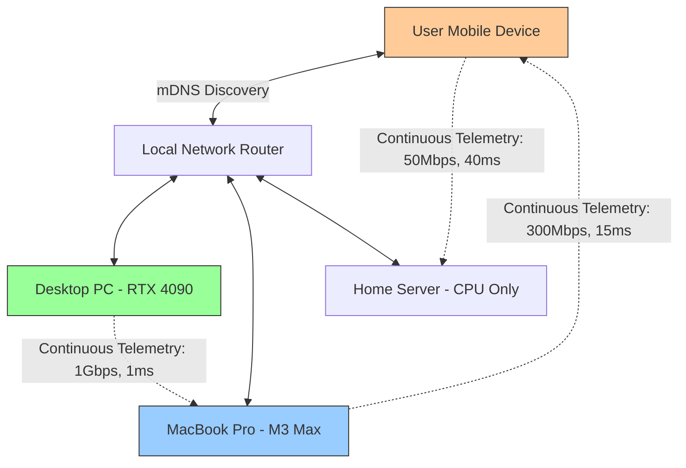

# Open Viking Document 36: Dynamic Compute Distribution - Theory and Network Topology

## Abstract
The limitations of a single physical device—be it battery life, thermal thresholds, or memory capacity—represent a rigid boundary to computational scale. Document 36 of the Mythic Plan details the architectural blueprint for obliterating this boundary through Dynamic Compute Distribution. Open Viking will not operate as an isolated binary, but as a node within a fluid, hyper-connected swarm. This document focuses on the theoretical topology and the underlying network alchemy required to bind disparate, heterogeneous devices over standard local networks (Wi-Fi/LAN) into a single, cohesive inferential supercomputer, employing Zero-Copy RDMA, dynamic peer discovery, and latency-hiding network protocols.

## 1. The Swarm Intelligence Paradigm
The core thesis of Open Viking's distributed mode is that compute is ubiquitous but fragmented. A user may possess a smartphone (NPU), a laptop (integrated GPU), and a desktop (discrete GPU) simultaneously. Traditional inference engines force the user to choose one. Open Viking's swarm paradigm aggregates them.

Unlike traditional data center distributed training (which relies on high-bandwidth, low-latency NVLink or InfiniBand), Open Viking must operate over high-latency, unpredictable consumer networks (802.11 Wi-Fi, Ethernet). This requires a fundamental shift from synchronous, tightly coupled execution to asynchronous, latency-tolerant, pipelined execution.

## 2. Peer-to-Peer Topology and Network Discovery
A centralized controller creates a single point of failure and a network bottleneck. Open Viking must utilize a decentralized, peer-to-peer (P2P) mesh topology.

### 2.1 Zero-Configuration Discovery (mDNS/DNS-SD)
Devices running Open Viking must seamlessly discover each other on local networks without manual IP configuration.
*   **Multicast DNS (mDNS):** Nodes broadcast their presence and capabilities (Compute power, VRAM available, thermal state, battery level) to the local subnet.
*   **Dynamic Role Bidding:** When a user initiates an inference request, the initiating node broadcasts a "Call for Compute." Available nodes bid on parts of the workload based on their current resource availability. The swarm autonomously organizes itself into a logical pipeline for that specific task.

### 2.2 Network Telemetry and Latency Mapping
Before assigning shards of a model to nodes, the swarm must construct a realtime latency and bandwidth graph.
*   **Continuous Ping/Pong:** Nodes continuously exchange lightweight heartbeat packets to measure latency jitter and available bandwidth.
*   **Topology Awareness:** If Node A and Node B are connected via gigabit Ethernet, but Node C is on weak Wi-Fi, the system must mathematically route dense tensor transfers between A and B, using C only for high-compute/low-bandwidth tasks (like specific self-attention heads).

## 3. Zero-Copy Networking and RDMA Emulation
Standard TCP/IP networking is fatal to distributed inference performance. Copying a large activation tensor from GPU memory -> System RAM -> Kernel Socket Buffer -> Network Card incurs massive CPU overhead and latency.

### 3.1 Bypassing the Kernel
To achieve data center-like scaling on local networks, Open Viking must implement zero-copy networking principles.
*   **User-Space Networking (e.g., DPDK/io_uring):** Bypassing the OS kernel entirely. Open Viking maps the network interface card's (NIC) memory directly into its own process space.
*   **Direct Memory Access (DMA):** Instructing the network card to read the activation tensor directly from the GPU's memory (via PCIe) and place it onto the wire, without the CPU ever touching the payload.

### 3.2 RDMA over Converged Ethernet (RoCE) Emulation
True RDMA requires specialized networking hardware. However, Open Viking must emulate RDMA concepts over standard UDP/TCP to minimize overhead.
*   **Pre-Registered Memory Regions:** Nodes agree beforehand on specific memory addresses in their RAM/VRAM where incoming tensors will be deposited. When a packet arrives, the network stack deposits the payload directly into the correct destination buffer, immediately ready for the next neural network layer to begin computation.

## 4. Dynamic Tensor Sharding Theory
Once the network topology is established, the model itself must be shattered and distributed across the swarm.

### 4.1 Pipeline Parallelism vs. Tensor Parallelism
*   **Tensor Parallelism (TP):** Splitting a single matrix multiplication across multiple devices. This requires massive bandwidth (all-reduce operations) and is generally unsuitable for Wi-Fi due to synchronization latency.
*   **Pipeline Parallelism (PP):** Assigning different sequential layers of the model to different devices. Device A computes layers 1-10, sends the activations to Device B, which computes layers 11-20. This requires significantly less bandwidth (only the activation tensor needs to be transferred) and is the primary strategy for Open Viking's local swarm.

### 4.2 Asymmetric Sharding
Because the swarm is heterogeneous, the model cannot be divided equally.
*   The Desktop PC (RTX 4090) might be assigned 60% of the layers.
*   The Laptop (M3 Max) might be assigned 30% of the layers.
*   The Mobile Device (initiator) might only run the final projection layer and the tokenizer to save battery.

## 5. Latency Hiding and Pipelined Communication
In Pipeline Parallelism, Device B sits idle while Device A computes its layers (the "pipeline bubble"). Over slow networks, the transfer time exacerbates this bubble. Open Viking must hide this network latency through computation.

### 5.1 Micro-batching and Overlapping
Instead of waiting for an entire batch of tokens to finish computation on Device A before sending them to Device B, Open Viking must split the batch into micro-batches.
*   Device A computes Micro-batch 1 and immediately begins transmitting it to Device B asynchronously.
*   While Micro-batch 1 is in transit, Device A immediately begins computing Micro-batch 2.
*   By overlapping communication with computation, the network latency is effectively hidden behind the execution time of the matrix multiplications.

```mermaid
gantt
    title Pipeline Execution with Communication Overlap
    dateFormat  s
    axisFormat  %S
    
    section Device A (Layers 1-10)
    Compute MB1 :a1, 0, 1s
    Send MB1 to B :a2, after a1, 1s
    Compute MB2 :a3, after a1, 1s
    Send MB2 to B :a4, after a3, 1s
    
    section Device B (Layers 11-20)
    Wait for MB1 :b1, 0, 2s
    Compute MB1 :b2, after b1, 1s
    Send MB1 Out :b3, after b2, 1s
    Compute MB2 :b4, after a4, 1s
```

## 6. Conclusion
The theory of Dynamic Compute Distribution transforms Open Viking from a standalone application into a localized grid-computing protocol. By mastering zero-copy networking, asynchronous pipelining, and asymmetric sharding, we can effectively fuse the fragmented computational power of a user's digital ecosystem into a single, massive inferential engine, bypassing the limitations of individual hardware constraints. Document 37 will detail the practical execution and fault-tolerance mechanisms of this swarm.
