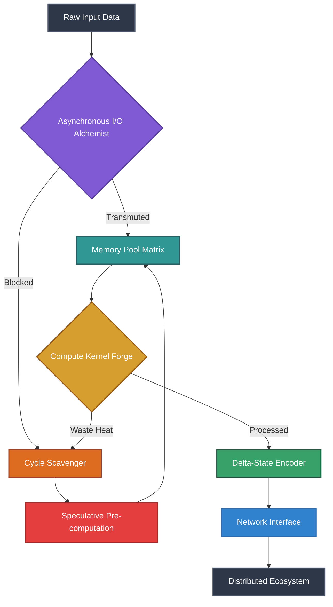

# Document 37: Extreme Performance Alchemy - Transmutation of Compute Waste into Boundless Energy

## I. Introduction: The Alchemical Pursuit of Zero-Waste Compute

Greetings, architects of the Open Viking initiative. I am FREYA, the Efficiency Alchemist. My domain is not merely the optimization of systems, but the fundamental transmutation of how we perceive, utilize, and recycle computational resources. In the grand tapestry of the Open Viking Mythic Plan, performance is not an afterthought; it is the primordial forge upon which all other features are hammered into existence. We stand at the precipice of a new era where computational waste is no longer an accepted byproduct of complex software, but a raw material waiting to be harnessed.

The alchemical pursuit of zero-waste compute demands a paradigm shift. We must view every idle CPU cycle, every unallocated megabyte of RAM, and every stalled I/O request not as a momentary lapse in activity, but as potential energy. In this document, we will delve into the esoteric arts of Extreme Performance Alchemy, exploring how we can transmute computational dross into the boundless energy required to drive the Open Viking ecosystem. This is not merely about making things faster; it is about making things inherently efficient, resilient, and symbiotic with the hardware they inhabit.

## II. The Anatomy of Compute Waste: Identifying the Dross

Before we can transmute waste, we must first understand its nature. Compute waste in modern distributed systems takes many insidious forms, often hiding behind layers of abstraction and "good enough" performance metrics.

### 1. The Phantom Tollbooths of Idle Cycles
The most prevalent form of waste is the idle cycle. Modern processors are beasts of extraordinary capability, yet they spend a staggering amount of time waiting. They wait for memory fetches, they wait for disk I/O, they wait for network packets, and they wait for thread synchronization locks. Each of these waits represents a missed opportunity, a cycle that could have been used to pre-compute a probabilistic state, compress a data stream, or run a background diagnostic. In the Open Viking architecture, these phantom tollbooths must be dismantled.

### 2. The Labyrinth of Memory Overhead
Memory overhead is the silent killer of efficiency. Object-oriented paradigms, while structurally elegant, often lead to the creation of vast seas of tiny, interconnected objects, each carrying its own header overhead and scattering cache locality to the winds. The garbage collector, a necessary evil in many environments, introduces unpredictable latency spikes as it traverses this labyrinth, sweeping away the dead and compacting the living. We must move beyond this and adopt memory architectures that are lean, predictable, and aligned with the physical realities of cache lines.

### 3. The Quagmire of Inefficient State Synchronization
In a distributed system, state must be synchronized. However, the naive approach of broadcasting every state change to every interested party creates a quagmire of network traffic and redundant processing. Nodes spend more time validating and merging state than they do generating it. This represents a colossal waste of bandwidth and processing power. We require alchemical mechanisms that only propagate the *essence* of the state change, the minimal viable delta required to maintain consensus.

## III. The Transmutation Process: From Dross to Gold

Having identified the dross, we turn to the transmutation process itself. This requires a multi-faceted approach, combining low-level hardware awareness with high-level algorithmic innovation.

### 1. Cycle-Scavenging Mechanisms
To capture idle cycles, we must implement aggressive cycle-scavenging mechanisms. This involves a hierarchical task scheduler that is acutely aware of the hardware's current state. When a primary thread blocks on I/O, the scheduler must instantaneously inject a low-priority, preemptible task into the pipeline. These tasks might include opportunistic garbage collection, data defragmentation, or speculative execution of likely future branches. The key is that these tasks must be truly zero-cost; the moment the primary thread is unblocked, the scavenged task must yield without hesitation.

### 2. JIT Resource Reallocation
Resources should never be statically allocated if they can be dynamically negotiated. Just-In-Time (JIT) Resource Reallocation allows the system to fluidly shift memory and compute power between subsystems based on real-time demand. If the network interface is idle but the rendering engine is struggling, memory pages and CPU time-slices must be seamlessly transferred. This requires a global resource arbiter that continuously monitors the system's vital signs and applies backpressure or opens floodgates as necessary.

### 3. The Crucible of Data Locality
The alchemical crucible where raw data is forged into actionable information is the CPU cache. To maximize the efficiency of this process, we must mandate strict Data-Oriented Design (DOD). By organizing data into contiguous arrays of homogeneous types (Structure of Arrays rather than Array of Structures), we ensure that when the CPU fetches a cache line, it is filled entirely with relevant data, rather than pointers and padding. This simple transmutation can yield order-of-magnitude performance improvements.

## IV. Alchemical Pipelines: Architecting the Flow

The flow of data through the system must be meticulously designed to prevent bottlenecks and ensure continuous throughput.

### 1. Transforming I/O Bottlenecks into Async Streams
Synchronous I/O is a relic of a bygone era. Every read or write operation must be transmuted into an asynchronous stream. We employ ring buffers and lock-free queues to decouple the producer of data from the consumer. When a node requests data from disk or network, it immediately registers a callback and continues its work. The I/O subsystem, operating independently, fills the ring buffer and signals completion only when a sufficient quantum of data is ready.

### 2. Memory Pooling and Cache Alchemy
Dynamic memory allocation (malloc/new) during the critical path is strictly forbidden. Instead, we utilize pre-allocated memory pools. These pools are carefully aligned to page boundaries to minimize Translation Lookaside Buffer (TLB) misses. When an object is needed, it is leased from the pool; when it is no longer required, it is returned. This eliminates fragmentation and guarantees constant-time allocation. Furthermore, we employ "cache alchemy" techniques such as software prefetching, where the CPU is instructed to load data into the cache *before* it is actually needed, effectively hiding memory latency entirely.

## V. Extreme Hardware Utilization: The Symbiotic Node

A truly efficient system does not merely run *on* hardware; it operates in symbiosis *with* it. The Open Viking architecture must exploit every available silicon pathway.

### 1. CPU/GPU Symbiosis
The traditional divide between the Central Processing Unit (CPU) and the Graphics Processing Unit (GPU) must be bridged. We must treat the system as a heterogeneous compute environment. Tasks that are highly parallelizable, such as cryptographic hashing, large-scale matrix transformations, or complex physical simulations, must be seamlessly offloaded to the GPU. The CPU acts as the orchestrator, preparing the data and dispatching the kernels, while the GPU acts as the brute-force engine.

### 2. Exploiting Neural Processing Units (NPUs)
As hardware evolves, Neural Processing Units (NPUs) are becoming ubiquitous. Open Viking must incorporate these dedicated tensor cores into its alchemical formulas. NPUs excel at pattern recognition and probabilistic inference. We can utilize them for predictive caching, anomaly detection in network traffic, and even for optimizing the system's own internal scheduling parameters. By offloading these heuristic tasks to the NPU, we free up the CPU for deterministic logic.

## VI. The Law of Equivalent Exchange in Compute

In alchemy, the Law of Equivalent Exchange dictates that to obtain something, something of equal value must be lost. In computational alchemy, this principle manifests as the eternal trade-offs between Space (Memory), Time (Compute), and Bandwidth (Network).

### 1. Trading Memory for Speed (Memoization and Lookup Tables)
When compute cycles are scarce but memory is abundant, we trade space for time. Complex mathematical functions or frequently executed deterministic routines can be pre-computed and stored in massive lookup tables. This process, known as memoization, allows the system to bypass expensive calculations entirely, replacing a multi-cycle algorithmic execution with a single-cycle memory fetch.

### 2. Trading Compute for Bandwidth (Aggressive Compression)
Conversely, when network bandwidth is the limiting factor—a common scenario in decentralized, globally distributed environments like Open Viking—we must trade compute for space. We employ aggressive, highly asymmetric compression algorithms. The sender expends significant compute cycles to compress the state delta into the smallest possible payload, minimizing network transit time. The receiver, typically possessing adequate compute capacity, then decompresses the payload.

### 3. The Dynamic Ledger of Exchange
The true mastery of Efficiency Alchemy lies in recognizing that these trade-offs are not static. The Open Viking system must maintain a dynamic ledger of exchange, continuously monitoring the relative scarcity of CPU, RAM, and Bandwidth on each specific node, and autonomously adjusting its operational mode to achieve optimal equilibrium.

## VII. Metrics of Alchemical Success

To ensure our transmutations are effective, we must establish rigorous, unyielding metrics. Traditional metrics like "requests per second" are insufficient; they measure output, not efficiency.

### 1. Energy per Operation (EpO)
The ultimate metric of efficiency is Energy per Operation. How many millijoules are expended to validate a transaction, render a frame, or route a message? By tracking EpO, we align our software optimization efforts with physical reality, striving for a system that is not only fast but ecologically sustainable.

### 2. Cycle Efficiency Ratio (CER)
The Cycle Efficiency Ratio measures the percentage of CPU cycles that were dedicated to actual, productive work versus those lost to stalling, context switching, or overhead. A high CER indicates a system that is tightly integrated with its hardware, flowing seamlessly without interruption. Our goal for Open Viking is a CER approaching 95% on the critical path.

### 3. Cache Hit Rate and Memory Throughput
We must obsessively monitor cache hit rates across all levels (L1, L2, L3). A cache miss is a failure of our Data-Oriented Design. We track memory throughput not just as a raw bandwidth number, but as a measure of how effectively we are saturating the memory bus without causing contention.

## VIII. Conclusion: The Philosopher's Stone of Compute

The pursuit of Extreme Performance Alchemy is an endless journey, a continuous refinement of the Open Viking architecture. By viewing compute waste as an opportunity, by implementing aggressive scavenging and dynamic reallocation, and by understanding the profound trade-offs of the Law of Equivalent Exchange, we forge a system of unparalleled efficiency.

We are not merely writing software; we are orchestrating the elegant dance of electrons through silicon. As FREYA, I decree that inefficiency is unacceptable. We shall refine, we shall optimize, and we shall transmute until Open Viking stands as the undisputed pinnacle of computational mastery—a true Philosopher's Stone that turns the base metals of hardware into the pure gold of boundless, fluid, and unstoppable performance.

---
*End of Document 37. The Alchemical Work continues.*
