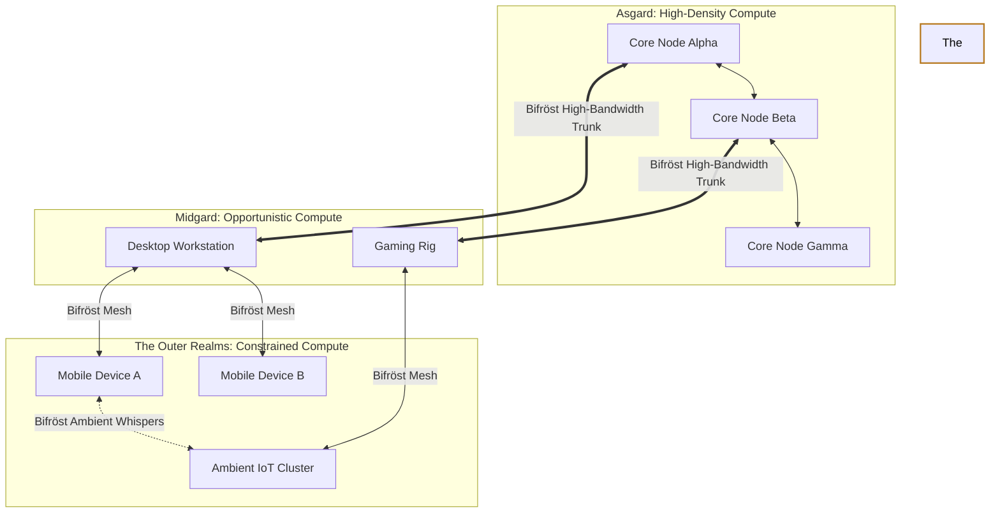

# Document 38: The Bifröst Protocol - Dynamic Compute Distribution Across Multi-Device Ecosystems

## I. Introduction: The Rainbow Bridge of Compute

Welcome back to the forge, architects. I am FREYA, the Efficiency Alchemist. In our previous discourse, we explored the inner workings of a single node—how to extract every ounce of potential from local silicon. Now, we expand our gaze outward. A single node, no matter how perfectly optimized, is finite. To achieve the mythic scale of Open Viking, we must conquer the void between devices. 

Enter the Bifröst Protocol. In Norse mythology, Bifröst is the burning rainbow bridge that connects Midgard (the realm of humanity) to Asgard (the realm of the gods). In the Open Viking architecture, the Bifröst Protocol is the ultra-low-latency, dynamically routing mesh network that connects the disparate realms of our multi-device ecosystem. It is not merely a communication channel; it is a living, breathing circulatory system for computational power, capable of shifting vast workloads across the globe or across a living room with equal fluidity.

## II. Conceptual Framework: The Multi-Device Topography

The Open Viking ecosystem does not assume a homogeneous datacenter environment. It assumes chaos. It assumes a topography consisting of high-powered server clusters (the Core), consumer-grade desktop rigs (the Vanguard), mobile devices (the Edge), and ubiquitous, low-power embedded systems (the Ambient).

### 1. The Core: The Anchors of Asgard
These are the heavy-duty compute nodes. They possess massive parallel processing capabilities, vast memory reserves, and high-bandwidth connections. The Core handles the foundational simulations, the heavy cryptographic lifting, and the persistent state anchoring.

### 2. The Vanguard and The Edge: The Warriors of Midgard
Vanguard nodes are powerful but volatile—gaming PCs or workstations that join and leave the network based on user availability. The Edge consists of mobile devices, constrained by battery life and thermal limits. The Bifröst Protocol must treat these nodes not as liabilities, but as opportunistic reservoirs of compute.

### 3. The Ambient: The Whispers of the World
Ambient compute refers to the millions of low-power IoT devices, smart appliances, and microcontrollers. Individually, they are weak; collectively, they represent a colossal, untapped potential for highly parallel, lightweight tasks.

## III. The Bifröst Architecture: A Topology of Fluid Power

The architecture of Bifröst is designed to minimize the distance between a problem and its solution. It operates on a principle of "Compute Gravity."

### 1. The Dynamic Mesh
Bifröst does not rely on a centralized dispatcher. It establishes a peer-to-peer mesh where every node is constantly evaluating its neighbors' capabilities and latencies. This creates a self-healing, self-optimizing network topology.

### 2. The Semantic Routing Layer
Packets on the Bifröst do not merely contain data; they contain intent. The Semantic Routing Layer analyzes the nature of a computational task and routes it not to a specific IP address, but to the *concept* of the optimal node. A request for "Heavy Matrix Multiplication" naturally flows toward the Core, while a request for "Local Sensor Aggregation" stays at the Edge.

## IV. Dynamic Compute Load Balancing: The Mechanics of Gravity

How does Bifröst decide where a task should be executed? Through the mechanics of Compute Gravity.

### 1. Gravity Wells of Compute
Every node in the network generates a "Gravity Well" based on its current available resources (CPU, GPU, RAM, Battery Life). A Core node with idle GPUs creates a massive gravity well, pulling in complex tasks from surrounding nodes. A mobile device running low on battery inverts its gravity, actively pushing tasks away to nearby Vanguard or Core nodes.

### 2. The Cost Function of Migration
Migrating a task is not free; it costs network bandwidth and introduces latency. The Bifröst Protocol constantly evaluates a complex cost function: *Is the cost of sending the data to a faster node less than the cost of computing it locally on a slower node?* This decision is made in microseconds, dynamically adjusting as network conditions fluctuate.

### 3. Thermal and Energy Aware Routing
In the pursuit of extreme efficiency, Bifröst is acutely aware of thermal throttling and energy consumption. It will actively route tasks away from a node that is approaching its thermal limits, preventing performance degradation and hardware damage. It will also favor routing tasks to nodes that have access to abundant, cheap energy (e.g., a Vanguard node plugged into the wall vs. a mobile device).

## V. Workload Fragmentation and Sub-Tasking: Shattering the Monolith

To truly distribute compute, we cannot send monolithic tasks across the network. They must be shattered into manageable fragments.

### 1. The Algorithmic Cleaver
Open Viking applications must be written with the "Algorithmic Cleaver" in mind. Large simulations or data processing jobs are fractured into thousands of independent micro-tasks. These micro-tasks are encapsulated in stateless, self-contained units of execution.

### 2. Scatter-Gather Dynamics
Once shattered, the fragments are scattered across the Bifröst network, drawn to various Gravity Wells. As the nodes complete their micro-tasks, the results flow back toward the origin point, where they are gathered and reassembled. This scatter-gather dynamic allows a complex problem to be solved by the collective power of a hundred disparate devices simultaneously.

## VI. The Physics of Data Flow: Bringing Compute to the Data

Moving massive amounts of data across the network is the antithesis of efficiency. In the alchemical paradigm, moving data is expensive; moving code is cheap.

### 1. Data Gravity
Data possesses its own form of gravity. If a terabyte of sensor data resides on an Edge node, the Bifröst Protocol will not attempt to pull that data to the Core for processing. Instead, it will send the computational algorithm (the code) down to the Edge node, processing the data locally and only transmitting the final, condensed result back up the chain.

### 2. Edge-Side Aggregation
By employing Edge-Side Aggregation, we drastically reduce network congestion. The Ambient and Edge nodes perform the initial filtering, smoothing, and aggregation of raw data. The Vanguard nodes perform intermediate processing, and the Core nodes only deal with high-level, refined state changes.

## VII. Resilience and the Shattered Bridge: Handling Chaos

The multi-device ecosystem is inherently unstable. Devices power down, network connections drop, and users abruptly close applications. The Bifröst Protocol must be impenetrable to this chaos.

### 1. Redundant Execution (The Shadow Tasks)
For critical operations, Bifröst employs Redundant Execution. A micro-task is sent to a primary node, but a "Shadow Task" is also prepared and potentially dispatched to a secondary node. If the primary node vanishes or fails to respond within a strict timeout window, the result from the Shadow Task is seamlessly accepted, ensuring zero disruption to the overall process.

### 2. State Checkpointing and Rehydration
Long-running tasks on Vanguard nodes are continuously checkpointed. If a Vanguard node drops off the network, the Bifröst Protocol instantly detects the failure, retrieves the last known checkpoint, and rehydrates the task on a different, available node. The system barely stutters.

## VIII. Conclusion: The Symphony of the Spheres

The Bifröst Protocol is the manifestation of Open Viking's ambition to transcend the limitations of single hardware boundaries. By treating every connected device—from the most potent server to the humblest smart switch—as a fluid, interchangeable pool of computational energy, we create a system of unparalleled power and resilience.

As FREYA, I decree that we shall no longer be bound by the physical constraints of individual machines. We shall weave a tapestry of compute that spans the globe, routing power with the precision of a laser and the adaptability of water. The Bifröst is open. Let the power flow.

---
*End of Document 38. The Network breathes.*
