# Document 39: Runes of Resource Efficiency - Algorithmic Pruning and Micro-Optimization Tactics

## I. Introduction: The Engraving of the Runes

Architects of the Open Viking initiative, hear the words of FREYA. We have discussed the grand architecture, the macroscopic transmutations of waste, and the sweeping bridges of the Bifröst network. Now, we must turn our gaze inward, to the atomic level of our code. Grand designs fail if the foundational building blocks are porous and weak. 

In the ancient traditions, Runes were not merely an alphabet; they were symbols of power, carved into stone and wood to invoke specific forces. In the Open Viking codebase, we must carve our own Runes of Resource Efficiency. These are the uncompromising standards, the micro-optimization tactics, and the algorithmic pruning techniques that must be etched into every function, every loop, and every data structure. We do not accept code that merely "works." We demand code that executes with the brutal efficiency of a physical law.

## II. The First Rune: O(1) Absolute (The Rune of Constancy)

In the critical paths of our system—the rendering loops, the network packet routers, the physics integrators—we must declare an absolute war on variable time complexity.

### 1. The Rejection of O(N)
An algorithm that scales linearly with the number of entities (O(N)) is a ticking time bomb in a system designed to scale infinitely. In the hot paths, O(N) is indistinguishable from infinite delay. We must aggressively refactor our data access patterns. If we are searching for an entity, we do not iterate; we index. If we are resolving a collision, we do not check every pair; we utilize spatial partitioning hashes. 

### 2. O(1) or O(log N) as the Law
The First Rune dictates that every operation in a critical loop must execute in Constant Time (O(1)) or, at absolute worst, Logarithmic Time (O(log N)). This requires the extensive use of flat arrays, direct indexing, perfectly balanced trees, and lock-free hash maps. We trade memory during initialization to guarantee absolute determinism during execution.

## III. The Second Rune: Data Structure Ergonomics (The Rune of Locality)

The CPU is a starving beast, and memory latency is the chain that binds it. The Second Rune is the mastery of how data is laid out in physical RAM, ensuring the beast is continuously fed.

### 1. Structure of Arrays (SoA) over Array of Structures (AoS)
The traditional Object-Oriented paradigm teaches the Array of Structures: `[ {x, y, z, color, name}, {x, y, z, color, name} ]`. When the CPU needs to update positions, it loads the entire object into the cache, wasting precious cache lines on `color` and `name`. We must mandate the Structure of Arrays: `[x, x, x], [y, y, y], [z, z, z]`. When updating positions, the CPU loads pure, unadulterated coordinate data, maximizing cache utilization and enabling vectorization.

### 2. Bit-Packing and Alignment
Data must be compressed not just in transit, but in memory. Boolean flags should not consume 8 bits; they must be packed into bitfields. Data structures must be meticulously ordered from largest member to smallest to eliminate compiler padding. Furthermore, structures frequently accessed together must be explicitly aligned to 64-byte cache line boundaries to prevent false sharing across multi-core processors.

```mermaid
graph TD
    subgraph Array of Structures 'AoS' - The Path of Waste
        A1[Pos X] --> A2[Pos Y]
        A2 --> A3[Color]
        A3 --> A4[Name Ptr]
        A4 -.->|Cache Miss| B1[Pos X]
    end

    subgraph Structure of Arrays 'SoA' - The Path of the Rune
        S1[Pos X 0] --> S2[Pos X 1]
        S2 --> S3[Pos X 2]
        S3 --> S4[Pos X 3]
        S4 -->|Vectorized Execute| S5[Pos X 4]
    end
    
    style Array of Structures 'AoS' - The Path of Waste fill:#742a2a,stroke:#e53e3e,stroke-width:2px,color:#fff
    style Structure of Arrays 'SoA' - The Path of the Rune fill:#22543d,stroke:#38a169,stroke-width:2px,color:#fff
```

## IV. The Third Rune: Branchless Programming (The Rune of the Straight Path)

Modern CPUs rely heavily on branch prediction. When the CPU encounters an `if/else` statement, it guesses which path will be taken and speculatively executes it. If it guesses wrong, it flushes the pipeline—a catastrophic penalty of 15-20 cycles. 

### 1. Eliminating Unpredictable Branches
In critical inner loops, unpredictable branches must be annihilated. We must employ Branchless Programming techniques. Instead of branching logic, we use bitwise operations, arithmetic selection, and conditional moves (cmov). 

*Example Concept:* Instead of `if (a > b) max = a; else max = b;`, we utilize bitwise masks or intrinsic min/max instructions that execute deterministically without ever interrogating the branch predictor. The path must be straight, unwavering, and unhesitating.

## V. The Fourth Rune: Compile-Time Alchemy (The Rune of the Forge)

Why calculate at runtime what can be proven at compile time? The Fourth Rune is the dedication to shifting the computational burden to the compiler.

### 1. Metaprogramming and `constexpr`
Every value, every lookup table, and every configuration parameter that is known before the binary is executed must be evaluated by the compiler. We must heavily utilize `constexpr` functions and template metaprogramming to generate highly optimized, unrolled, and statically resolved code. 

### 2. Zero-Cost Abstractions
Abstractions are necessary for human comprehension, but they must incur zero runtime overhead. If an interface, a wrapper class, or a generic type introduces a vtable lookup, a heap allocation, or an extra instruction, it is a failed abstraction. The compiler must be forced to inline and optimize away the human-readable scaffolding, leaving behind only the naked machine instructions.

## VI. The Fifth Rune: Algorithmic Pruning (The Rune of the Scythe)

Often, the fastest way to perform an operation is to prove that it doesn't need to be performed at all.

### 1. Spatial and Temporal Pruning
Before initiating a complex calculation—be it collision detection, rendering, or network state updates—we must perform ultra-cheap heuristic checks. Frustum culling, bounding volume hierarchies (BVH), and temporal coherence caching allow us to prune massive branches of the execution tree. We spend 1 cycle to potentially save 1000.

### 2. Early-Out and Short-Circuiting
Every complex function must be designed with "early-out" pathways. If the initial conditions indicate that the result will be zero, null, or unchanged, the function must immediately return. The Scythe cuts away the unnecessary work before it can consume resources.

## VII. The Micro-Optimization Arsenal: Wielding the Tools

Beyond the Runes, we must master the specific weapons in the micro-optimization arsenal.

### 1. SIMD Intrinsics (Single Instruction, Multiple Data)
Scalar processing—operating on one number at a time—is obsolete for math-heavy workloads. We must explicitly write our critical algorithms using SIMD intrinsics (AVX2, AVX-512, NEON). We load four, eight, or sixteen floating-point numbers into a single wide register and perform the math simultaneously. This is not optional; it is a fundamental requirement for the Open Viking physics and rendering subsystems.

### 2. Loop Unrolling and Pipelining
For small, tightly bound loops, the overhead of the loop counter and the jump instruction can exceed the cost of the work itself. We employ manual or compiler-directed loop unrolling to execute the loop body multiple times per iteration. This allows the CPU to pipeline instructions more effectively, overlapping memory fetches with arithmetic execution.

### 3. Intrusive Data Structures
Standard library containers often allocate nodes dynamically. We must favor Intrusive Data Structures, where the pointers for the linked list or the tree are embedded directly within the object itself. This guarantees that iterating through the structure means traversing memory that is already associated with the object, vastly improving cache locality and eliminating separate allocator overhead.

## VIII. Conclusion: The Forging of the Blade

The Runes of Resource Efficiency are not mere suggestions; they are the uncompromising dogma of the Open Viking architecture. By embracing O(1) determinism, shaping our data for the cache, eliminating branches, and shifting work to the compiler, we forge a codebase that is not just fast, but terrifyingly efficient.

As FREYA, I demand that you scrutinize every line of code. Look for the hidden allocations. Listen for the pipeline stalls. Feel the heat of wasted cycles. Apply the Runes, prune the excess, and let the pure, unadulterated performance of the machine shine through. The blade must be sharp.

---
*End of Document 39. The Runes are cast.*
