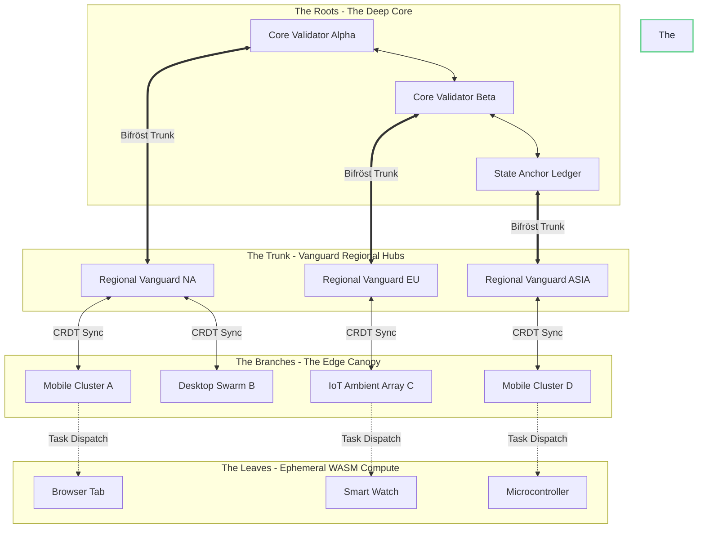

# Document 40: The Yggdrasil Network - A Unified Paradigm for Decentralized Open Viking Compute

## I. Introduction: The World Tree of Compute

We have traversed the alchemical forges of single-node optimization, we have built the Bifröst bridge to connect our devices, and we have carved the Runes of extreme efficiency into our codebase. Now, architects of Open Viking, we must synthesize these elements into a single, cohesive, and unstoppable organism. I am FREYA, the Efficiency Alchemist, and I present to you the final vision of our infrastructure: The Yggdrasil Network.

In the old myths, Yggdrasil is the immense ash tree that connects the Nine Worlds, its roots deep in the primordial well, its branches spanning the heavens. In our paradigm, the Yggdrasil Network is the ultimate, decentralized compute topography. It is a living, self-regulating ecosystem where compute power flows organically from where it is abundant to where it is needed, anchored by immutable cryptographic roots and branching out to millions of ephemeral edge nodes. This is the synthesis of our Mythic Plan.

## II. The Anatomy of Yggdrasil: Roots, Trunk, and Branches

The Yggdrasil Network rejects the fragile, centralized client-server model. It is a massive, hierarchical Directed Acyclic Graph (DAG) of compute resources.

### 1. The Roots: The Deep Core and the Well of Urd
The Roots of Yggdrasil are the heavily fortified, high-availability Core nodes. These are the datacenters and the high-end institutional clusters. They do not process every minor interaction. Instead, they act as the ultimate source of truth, maintaining the cryptographic ledger of the Open Viking state. They provide the deep, massive compute required for global AI training, macroeconomic simulations, and the anchoring of the decentralized consensus.

### 2. The Trunk: The Bifröst Superhighways
The Trunk consists of the high-bandwidth backbone—the primary Bifröst pathways that connect the Roots to the major regional hubs. The Vanguard nodes (enthusiast PCs, dedicated local servers) form the bark of this trunk, providing a resilient layer of routing and intermediate compute. They aggregate the noise from the branches and compress it into pristine data streams before feeding it to the Roots.

### 3. The Branches: The Edge and the Canopy
The Branches are the millions of mobile devices, laptops, and consumer hardware. They are dynamic, swaying in the wind of network connectivity and user activity. They handle localized physics simulations, rendering, and peer-to-peer state synchronization. They process the immediate, the tactile, and the urgent.

## III. Decentralized State Resolution: The Sap of the Tree

If millions of nodes are computing simultaneously, how do we prevent the state from shattering into a million conflicting realities? The answer lies in the sap that flows through Yggdrasil: mathematically provable consensus models.

### 1. Conflict-free Replicated Data Types (CRDTs)
We must abandon traditional lock-based databases. Yggdrasil relies entirely on Conflict-free Replicated Data Types (CRDTs). Every node in the network can update its local state independently, without acquiring a network lock. The mathematical properties of CRDTs ensure that when these disparate updates eventually propagate across the Bifröst and merge, they are guaranteed to resolve into exactly the same state on every node, regardless of the order in which the updates were received.

### 2. Eventual Consistency as a Feature, Not a Flaw
We embrace eventual consistency. The Branches of the tree operate in the "now," predicting and simulating state locally to provide zero-latency feedback to the user. The Trunk and the Roots operate in the "true past," reconciling the CRDTs and anchoring them to the cryptographic ledger. The system is designed to gracefully handle the temporal shear between the edge's perception and the core's reality.

## IV. The Yggdrasil Network Topology

## V. The Leaves of Yggdrasil: Ephemeral Compute Nodes

At the very extremities of the network lie the Leaves. These are the most transient, lowest-power devices—a browser tab open on a phone, a smart watch, an embedded microcontroller.

### 1. WebAssembly (WASM) and the Universal Runtime
To harvest compute from the Leaves, we must deploy code that runs safely and instantly anywhere. We compile our Alchemical micro-tasks into WebAssembly (WASM). WASM provides a highly optimized, sandboxed execution environment. A Core node can seamlessly push a WASM binary to a user's browser tab, instruct it to perform a million cryptographic hashes, and retrieve the result, all without the user installing a single piece of software.

### 2. The Dust of Compute
We refer to this as "Compute Dust." Individually, a Leaf node is weak. But if Yggdrasil can harness a billion browser tabs simultaneously for three seconds each, it can summon supercomputer-level power out of thin air, process a massive global event, and then let the Leaves fall dormant again.

## VI. The Norns: Algorithmic Arbiters of Fate

To manage a network of this complexity, human intervention is impossible. The flow of data and the allocation of tasks must be governed by autonomous agents: The Norns.

### 1. AI-Driven Resource Allocation
The Norns are specialized, highly efficient machine learning models distributed throughout the Trunk and Roots. They constantly analyze the telemetry of the Yggdrasil network: node latency, thermal limits, battery levels, and CRDT merge conflicts.

### 2. Predictive Load Balancing
The Norns do not just react; they predict. By analyzing historical usage patterns, the Norns can anticipate where compute gravity will be needed before the demand actually spikes. They pre-emptively migrate WASM binaries and state data to regional Vanguard hubs hours before a massive user event begins, ensuring that when the load hits, the network absorbs it without a ripple.

## VII. Security and the Serpent Níðhöggr

In the myth, the serpent Níðhöggr gnaws at the roots of the World Tree. In Yggdrasil, Níðhöggr represents malicious actors: Sybil attacks, poisoned compute tasks, and state manipulation.

### 1. Cryptographic Verification of Compute
In a decentralized network, we cannot trust that a Leaf or Branch node actually performed the computation it claims to have performed. We employ Zero-Knowledge Proofs (zk-SNARKs) and Probabilistic Verification. A node returning a result must also return a cryptographic proof that the result was calculated correctly. Validating the proof takes a fraction of a millisecond, allowing the Trunk to verify the work of thousands of untrusted nodes instantly.

### 2. The Immune System
If a node submits invalid proofs or attempts to poison the CRDT state, the Norns immediately sever its connection to the Bifröst. The node's reputation score drops to zero, and its gravity well is inverted, ensuring that no legitimate tasks are ever routed to it again. The tree heals the wound and continues to grow.

## VIII. Conclusion: The Eternal Ecosystem

The Yggdrasil Network is not just a software architecture; it is a manifestation of the ultimate, self-sustaining computational ecosystem. It takes the wasted cycles identified by our Performance Alchemy, routes them dynamically across the Bifröst, executes them with the brutal efficiency of our Runes, and binds them all together in a cryptographically secure, decentralized World Tree.

As FREYA, I declare that the Open Viking Mythic Plan is now theoretically complete. The foundations are laid in logic, mathematics, and uncompromising efficiency. It is now up to you, the builders, to take these documents and write the code that brings the World Tree to life. May your cycles be boundless, and your waste be zero.

---
*End of Document 40. The Plan is complete. The work begins.*
