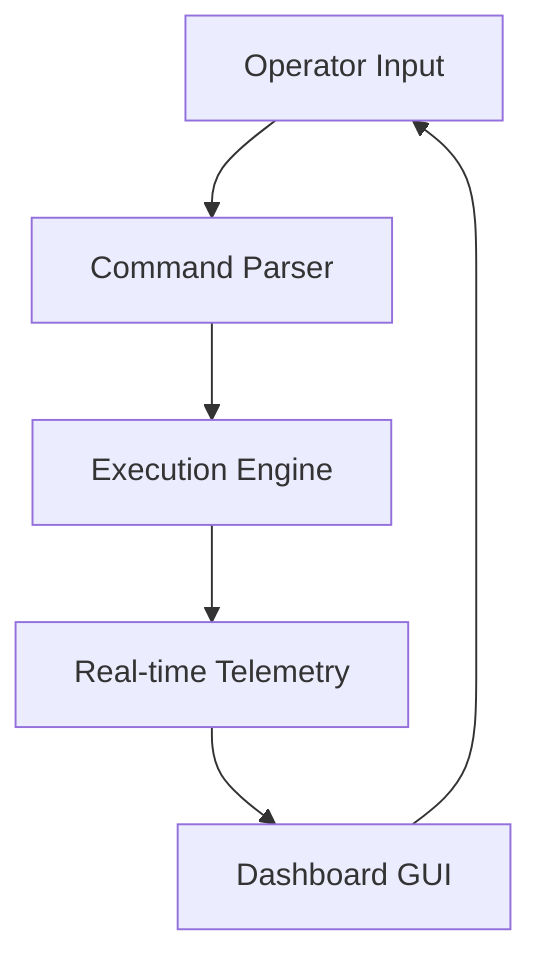

# Operator Dashboard: Architecture and Flow

## Section 1: Advanced Directives and Syntheses

At the heart of the UX masterplan lies the concept of predictive rendering. Traditional interfaces react to user input; the Open Viking (Dashboard Variant) interface predicts it. By analyzing historical interaction patterns and current system state, the UI dynamically reconfigures itself to present the most relevant controls and information. This reduces cognitive load and allows the operator to focus on higher-level strategic decisions. The visual language of the interface must be both striking and functional, utilizing advanced color theory and typography to guide the user's attention. Every animation, every transition, must serve a specific cognitive purpose.

Looking towards the future, we envision a symbiotic relationship between the operator and the system. The Open Viking (Dashboard Variant) framework will not merely execute commands; it will actively collaborate with the operator, suggesting courses of action and highlighting potential risks. This requires a deep understanding of human psychology and cognitive biases. The system must present information in a way that is objective and unbiased, empowering the operator to make informed decisions. We must also consider the ethical implications of such advanced systems, ensuring that they are always used in a responsible and transparent manner.

Furthermore, the synthesis of disparate data streams requires a novel approach to ontological mapping. The system must autonomously resolve conflicts between conflicting data sources, using probabilistic reasoning to determine the most likely ground truth. This necessitates a highly sophisticated inference engine, capable of continuous learning and adaptation. The user experience is intrinsically linked to the performance of this inference engine. If the system's conclusions are opaque or untrustworthy, the entire interface becomes a liability rather than an asset.

Finally, the success of the Open Viking (Dashboard Variant) project depends on the relentless pursuit of excellence. We must foster a culture of continuous improvement, where every team member is encouraged to challenge assumptions and propose innovative solutions. The codebase must be treated as a living document, constantly refactored and optimized. We must embrace open-source principles, sharing our knowledge and collaborating with the broader community. Only through a collective effort can we realize the full potential of the Open Viking (Dashboard Variant) vision.

The roadmap ahead is both ambitious and necessary. Phase 1 focuses on laying the foundational infrastructure: the real-time data bus, the core telemetry engine, and the initial iteration of the Operator Dashboard. Phase 2 introduces predictive rendering and advanced cognitive interfaces. By Phase 3, we expect to see deep integration with external data sources and autonomous agent swarms. The subsequent phases will focus on refinement, scalability, and pushing the boundaries of what is possible. We must remain agile, adapting to new challenges and opportunities as they arise, while never losing sight of the ultimate goal.

The integration of the Open Viking (Dashboard Variant) framework represents a paradigm shift in how we understand operator interfaces. By bridging the gap between raw data ingestion and cognitive processing, the system enables an unprecedented level of situational awareness. The overarching goal is not merely to display information, but to synthesize it into actionable intelligence. This requires a fundamental reimagining of our data pipelines, moving away from asynchronous batch processing towards true real-time streaming architectures. We envision a future where the system anticipates the operator's needs, pre-loading critical telemetry before a conscious request is ever formulated.

## Section 2: Advanced Directives and Syntheses

The integration of the Open Viking (Dashboard Variant) framework represents a paradigm shift in how we understand operator interfaces. By bridging the gap between raw data ingestion and cognitive processing, the system enables an unprecedented level of situational awareness. The overarching goal is not merely to display information, but to synthesize it into actionable intelligence. This requires a fundamental reimagining of our data pipelines, moving away from asynchronous batch processing towards true real-time streaming architectures. We envision a future where the system anticipates the operator's needs, pre-loading critical telemetry before a conscious request is ever formulated.

Consider the cognitive implications of latency in a high-stress operational environment. A delay of even a few milliseconds can disrupt the user's flow and lead to suboptimal decision-making. Therefore, every component of the Open Viking (Dashboard Variant) architecture must be ruthlessly optimized for performance. We must explore edge computing paradigms, pushing processing power as close to the data source as possible. The UI itself must be rendered with zero overhead, utilizing hardware acceleration and advanced rendering pipelines to achieve a consistent 120 frames per second.

Looking towards the future, we envision a symbiotic relationship between the operator and the system. The Open Viking (Dashboard Variant) framework will not merely execute commands; it will actively collaborate with the operator, suggesting courses of action and highlighting potential risks. This requires a deep understanding of human psychology and cognitive biases. The system must present information in a way that is objective and unbiased, empowering the operator to make informed decisions. We must also consider the ethical implications of such advanced systems, ensuring that they are always used in a responsible and transparent manner.

Finally, the success of the Open Viking (Dashboard Variant) project depends on the relentless pursuit of excellence. We must foster a culture of continuous improvement, where every team member is encouraged to challenge assumptions and propose innovative solutions. The codebase must be treated as a living document, constantly refactored and optimized. We must embrace open-source principles, sharing our knowledge and collaborating with the broader community. Only through a collective effort can we realize the full potential of the Open Viking (Dashboard Variant) vision.

The roadmap ahead is both ambitious and necessary. Phase 1 focuses on laying the foundational infrastructure: the real-time data bus, the core telemetry engine, and the initial iteration of the Operator Dashboard. Phase 2 introduces predictive rendering and advanced cognitive interfaces. By Phase 3, we expect to see deep integration with external data sources and autonomous agent swarms. The subsequent phases will focus on refinement, scalability, and pushing the boundaries of what is possible. We must remain agile, adapting to new challenges and opportunities as they arise, while never losing sight of the ultimate goal.

The philosophical foundations of Open Viking (Dashboard Variant) are rooted in the pursuit of absolute clarity. In a world of increasing complexity, our systems must be bastions of order. We reject the notion of 'black box' AI; every decision made by the system must be transparent and explainable to the operator. This philosophy extends to the codebase itself, which must be elegant, modular, and extensively documented. We are not just building software; we are crafting a legacy. The Viking ethos of exploration, resilience, and mastery over one's environment permeates every aspect of the project.

## Section 3: Advanced Directives and Syntheses

The roadmap ahead is both ambitious and necessary. Phase 1 focuses on laying the foundational infrastructure: the real-time data bus, the core telemetry engine, and the initial iteration of the Operator Dashboard. Phase 2 introduces predictive rendering and advanced cognitive interfaces. By Phase 3, we expect to see deep integration with external data sources and autonomous agent swarms. The subsequent phases will focus on refinement, scalability, and pushing the boundaries of what is possible. We must remain agile, adapting to new challenges and opportunities as they arise, while never losing sight of the ultimate goal.

Consider the cognitive implications of latency in a high-stress operational environment. A delay of even a few milliseconds can disrupt the user's flow and lead to suboptimal decision-making. Therefore, every component of the Open Viking (Dashboard Variant) architecture must be ruthlessly optimized for performance. We must explore edge computing paradigms, pushing processing power as close to the data source as possible. The UI itself must be rendered with zero overhead, utilizing hardware acceleration and advanced rendering pipelines to achieve a consistent 120 frames per second.

The philosophical foundations of Open Viking (Dashboard Variant) are rooted in the pursuit of absolute clarity. In a world of increasing complexity, our systems must be bastions of order. We reject the notion of 'black box' AI; every decision made by the system must be transparent and explainable to the operator. This philosophy extends to the codebase itself, which must be elegant, modular, and extensively documented. We are not just building software; we are crafting a legacy. The Viking ethos of exploration, resilience, and mastery over one's environment permeates every aspect of the project.

The aesthetic design of the Open Viking (Dashboard Variant) interface must evoke a sense of power and control. We draw inspiration from aerospace and tactical interfaces, utilizing dark themes with high-contrast accent colors. The typography must be legible at a glance, even in suboptimal lighting conditions. The use of micro-animations is crucial for providing subtle feedback and guiding the user's attention. The interface should feel less like a software application and more like a high-performance instrument.

Finally, the success of the Open Viking (Dashboard Variant) project depends on the relentless pursuit of excellence. We must foster a culture of continuous improvement, where every team member is encouraged to challenge assumptions and propose innovative solutions. The codebase must be treated as a living document, constantly refactored and optimized. We must embrace open-source principles, sharing our knowledge and collaborating with the broader community. Only through a collective effort can we realize the full potential of the Open Viking (Dashboard Variant) vision.

The integration of the Open Viking (Dashboard Variant) framework represents a paradigm shift in how we understand operator interfaces. By bridging the gap between raw data ingestion and cognitive processing, the system enables an unprecedented level of situational awareness. The overarching goal is not merely to display information, but to synthesize it into actionable intelligence. This requires a fundamental reimagining of our data pipelines, moving away from asynchronous batch processing towards true real-time streaming architectures. We envision a future where the system anticipates the operator's needs, pre-loading critical telemetry before a conscious request is ever formulated.

## Section 4: Advanced Directives and Syntheses

The roadmap ahead is both ambitious and necessary. Phase 1 focuses on laying the foundational infrastructure: the real-time data bus, the core telemetry engine, and the initial iteration of the Operator Dashboard. Phase 2 introduces predictive rendering and advanced cognitive interfaces. By Phase 3, we expect to see deep integration with external data sources and autonomous agent swarms. The subsequent phases will focus on refinement, scalability, and pushing the boundaries of what is possible. We must remain agile, adapting to new challenges and opportunities as they arise, while never losing sight of the ultimate goal.

The Operator Dashboard is the focal point of the Open Viking (Dashboard Variant) experience. It is not a static collection of widgets, but a living, breathing entity. The architecture is modular, allowing for rapid customization and deployment of new specialized views. Telemetry data flows into the dashboard through a high-performance message bus, ensuring sub-millisecond latency. We must implement advanced data visualization techniques, moving beyond simple charts and graphs to immersive 3D representations of system state. The dashboard must empower the operator, giving them absolute control over the underlying infrastructure.

Finally, the success of the Open Viking (Dashboard Variant) project depends on the relentless pursuit of excellence. We must foster a culture of continuous improvement, where every team member is encouraged to challenge assumptions and propose innovative solutions. The codebase must be treated as a living document, constantly refactored and optimized. We must embrace open-source principles, sharing our knowledge and collaborating with the broader community. Only through a collective effort can we realize the full potential of the Open Viking (Dashboard Variant) vision.

The philosophical foundations of Open Viking (Dashboard Variant) are rooted in the pursuit of absolute clarity. In a world of increasing complexity, our systems must be bastions of order. We reject the notion of 'black box' AI; every decision made by the system must be transparent and explainable to the operator. This philosophy extends to the codebase itself, which must be elegant, modular, and extensively documented. We are not just building software; we are crafting a legacy. The Viking ethos of exploration, resilience, and mastery over one's environment permeates every aspect of the project.

Furthermore, the synthesis of disparate data streams requires a novel approach to ontological mapping. The system must autonomously resolve conflicts between conflicting data sources, using probabilistic reasoning to determine the most likely ground truth. This necessitates a highly sophisticated inference engine, capable of continuous learning and adaptation. The user experience is intrinsically linked to the performance of this inference engine. If the system's conclusions are opaque or untrustworthy, the entire interface becomes a liability rather than an asset.

The aesthetic design of the Open Viking (Dashboard Variant) interface must evoke a sense of power and control. We draw inspiration from aerospace and tactical interfaces, utilizing dark themes with high-contrast accent colors. The typography must be legible at a glance, even in suboptimal lighting conditions. The use of micro-animations is crucial for providing subtle feedback and guiding the user's attention. The interface should feel less like a software application and more like a high-performance instrument.

## Section 5: Advanced Directives and Syntheses

Looking towards the future, we envision a symbiotic relationship between the operator and the system. The Open Viking (Dashboard Variant) framework will not merely execute commands; it will actively collaborate with the operator, suggesting courses of action and highlighting potential risks. This requires a deep understanding of human psychology and cognitive biases. The system must present information in a way that is objective and unbiased, empowering the operator to make informed decisions. We must also consider the ethical implications of such advanced systems, ensuring that they are always used in a responsible and transparent manner.

Consider the cognitive implications of latency in a high-stress operational environment. A delay of even a few milliseconds can disrupt the user's flow and lead to suboptimal decision-making. Therefore, every component of the Open Viking (Dashboard Variant) architecture must be ruthlessly optimized for performance. We must explore edge computing paradigms, pushing processing power as close to the data source as possible. The UI itself must be rendered with zero overhead, utilizing hardware acceleration and advanced rendering pipelines to achieve a consistent 120 frames per second.

The roadmap ahead is both ambitious and necessary. Phase 1 focuses on laying the foundational infrastructure: the real-time data bus, the core telemetry engine, and the initial iteration of the Operator Dashboard. Phase 2 introduces predictive rendering and advanced cognitive interfaces. By Phase 3, we expect to see deep integration with external data sources and autonomous agent swarms. The subsequent phases will focus on refinement, scalability, and pushing the boundaries of what is possible. We must remain agile, adapting to new challenges and opportunities as they arise, while never losing sight of the ultimate goal.

The aesthetic design of the Open Viking (Dashboard Variant) interface must evoke a sense of power and control. We draw inspiration from aerospace and tactical interfaces, utilizing dark themes with high-contrast accent colors. The typography must be legible at a glance, even in suboptimal lighting conditions. The use of micro-animations is crucial for providing subtle feedback and guiding the user's attention. The interface should feel less like a software application and more like a high-performance instrument.

The Operator Dashboard is the focal point of the Open Viking (Dashboard Variant) experience. It is not a static collection of widgets, but a living, breathing entity. The architecture is modular, allowing for rapid customization and deployment of new specialized views. Telemetry data flows into the dashboard through a high-performance message bus, ensuring sub-millisecond latency. We must implement advanced data visualization techniques, moving beyond simple charts and graphs to immersive 3D representations of system state. The dashboard must empower the operator, giving them absolute control over the underlying infrastructure.

Finally, the success of the Open Viking (Dashboard Variant) project depends on the relentless pursuit of excellence. We must foster a culture of continuous improvement, where every team member is encouraged to challenge assumptions and propose innovative solutions. The codebase must be treated as a living document, constantly refactored and optimized. We must embrace open-source principles, sharing our knowledge and collaborating with the broader community. Only through a collective effort can we realize the full potential of the Open Viking (Dashboard Variant) vision.

## Section 6: Advanced Directives and Syntheses

Consider the cognitive implications of latency in a high-stress operational environment. A delay of even a few milliseconds can disrupt the user's flow and lead to suboptimal decision-making. Therefore, every component of the Open Viking (Dashboard Variant) architecture must be ruthlessly optimized for performance. We must explore edge computing paradigms, pushing processing power as close to the data source as possible. The UI itself must be rendered with zero overhead, utilizing hardware acceleration and advanced rendering pipelines to achieve a consistent 120 frames per second.

The Operator Dashboard is the focal point of the Open Viking (Dashboard Variant) experience. It is not a static collection of widgets, but a living, breathing entity. The architecture is modular, allowing for rapid customization and deployment of new specialized views. Telemetry data flows into the dashboard through a high-performance message bus, ensuring sub-millisecond latency. We must implement advanced data visualization techniques, moving beyond simple charts and graphs to immersive 3D representations of system state. The dashboard must empower the operator, giving them absolute control over the underlying infrastructure.

Furthermore, the synthesis of disparate data streams requires a novel approach to ontological mapping. The system must autonomously resolve conflicts between conflicting data sources, using probabilistic reasoning to determine the most likely ground truth. This necessitates a highly sophisticated inference engine, capable of continuous learning and adaptation. The user experience is intrinsically linked to the performance of this inference engine. If the system's conclusions are opaque or untrustworthy, the entire interface becomes a liability rather than an asset.

Finally, the success of the Open Viking (Dashboard Variant) project depends on the relentless pursuit of excellence. We must foster a culture of continuous improvement, where every team member is encouraged to challenge assumptions and propose innovative solutions. The codebase must be treated as a living document, constantly refactored and optimized. We must embrace open-source principles, sharing our knowledge and collaborating with the broader community. Only through a collective effort can we realize the full potential of the Open Viking (Dashboard Variant) vision.

Looking towards the future, we envision a symbiotic relationship between the operator and the system. The Open Viking (Dashboard Variant) framework will not merely execute commands; it will actively collaborate with the operator, suggesting courses of action and highlighting potential risks. This requires a deep understanding of human psychology and cognitive biases. The system must present information in a way that is objective and unbiased, empowering the operator to make informed decisions. We must also consider the ethical implications of such advanced systems, ensuring that they are always used in a responsible and transparent manner.

The integration of the Open Viking (Dashboard Variant) framework represents a paradigm shift in how we understand operator interfaces. By bridging the gap between raw data ingestion and cognitive processing, the system enables an unprecedented level of situational awareness. The overarching goal is not merely to display information, but to synthesize it into actionable intelligence. This requires a fundamental reimagining of our data pipelines, moving away from asynchronous batch processing towards true real-time streaming architectures. We envision a future where the system anticipates the operator's needs, pre-loading critical telemetry before a conscious request is ever formulated.

## Section 7: Advanced Directives and Syntheses

The roadmap ahead is both ambitious and necessary. Phase 1 focuses on laying the foundational infrastructure: the real-time data bus, the core telemetry engine, and the initial iteration of the Operator Dashboard. Phase 2 introduces predictive rendering and advanced cognitive interfaces. By Phase 3, we expect to see deep integration with external data sources and autonomous agent swarms. The subsequent phases will focus on refinement, scalability, and pushing the boundaries of what is possible. We must remain agile, adapting to new challenges and opportunities as they arise, while never losing sight of the ultimate goal.

At the heart of the UX masterplan lies the concept of predictive rendering. Traditional interfaces react to user input; the Open Viking (Dashboard Variant) interface predicts it. By analyzing historical interaction patterns and current system state, the UI dynamically reconfigures itself to present the most relevant controls and information. This reduces cognitive load and allows the operator to focus on higher-level strategic decisions. The visual language of the interface must be both striking and functional, utilizing advanced color theory and typography to guide the user's attention. Every animation, every transition, must serve a specific cognitive purpose.

The philosophical foundations of Open Viking (Dashboard Variant) are rooted in the pursuit of absolute clarity. In a world of increasing complexity, our systems must be bastions of order. We reject the notion of 'black box' AI; every decision made by the system must be transparent and explainable to the operator. This philosophy extends to the codebase itself, which must be elegant, modular, and extensively documented. We are not just building software; we are crafting a legacy. The Viking ethos of exploration, resilience, and mastery over one's environment permeates every aspect of the project.

Furthermore, the synthesis of disparate data streams requires a novel approach to ontological mapping. The system must autonomously resolve conflicts between conflicting data sources, using probabilistic reasoning to determine the most likely ground truth. This necessitates a highly sophisticated inference engine, capable of continuous learning and adaptation. The user experience is intrinsically linked to the performance of this inference engine. If the system's conclusions are opaque or untrustworthy, the entire interface becomes a liability rather than an asset.

Finally, the success of the Open Viking (Dashboard Variant) project depends on the relentless pursuit of excellence. We must foster a culture of continuous improvement, where every team member is encouraged to challenge assumptions and propose innovative solutions. The codebase must be treated as a living document, constantly refactored and optimized. We must embrace open-source principles, sharing our knowledge and collaborating with the broader community. Only through a collective effort can we realize the full potential of the Open Viking (Dashboard Variant) vision.

Looking towards the future, we envision a symbiotic relationship between the operator and the system. The Open Viking (Dashboard Variant) framework will not merely execute commands; it will actively collaborate with the operator, suggesting courses of action and highlighting potential risks. This requires a deep understanding of human psychology and cognitive biases. The system must present information in a way that is objective and unbiased, empowering the operator to make informed decisions. We must also consider the ethical implications of such advanced systems, ensuring that they are always used in a responsible and transparent manner.

## Section 8: Advanced Directives and Syntheses

The aesthetic design of the Open Viking (Dashboard Variant) interface must evoke a sense of power and control. We draw inspiration from aerospace and tactical interfaces, utilizing dark themes with high-contrast accent colors. The typography must be legible at a glance, even in suboptimal lighting conditions. The use of micro-animations is crucial for providing subtle feedback and guiding the user's attention. The interface should feel less like a software application and more like a high-performance instrument.

The integration of the Open Viking (Dashboard Variant) framework represents a paradigm shift in how we understand operator interfaces. By bridging the gap between raw data ingestion and cognitive processing, the system enables an unprecedented level of situational awareness. The overarching goal is not merely to display information, but to synthesize it into actionable intelligence. This requires a fundamental reimagining of our data pipelines, moving away from asynchronous batch processing towards true real-time streaming architectures. We envision a future where the system anticipates the operator's needs, pre-loading critical telemetry before a conscious request is ever formulated.

The Operator Dashboard is the focal point of the Open Viking (Dashboard Variant) experience. It is not a static collection of widgets, but a living, breathing entity. The architecture is modular, allowing for rapid customization and deployment of new specialized views. Telemetry data flows into the dashboard through a high-performance message bus, ensuring sub-millisecond latency. We must implement advanced data visualization techniques, moving beyond simple charts and graphs to immersive 3D representations of system state. The dashboard must empower the operator, giving them absolute control over the underlying infrastructure.

Finally, the success of the Open Viking (Dashboard Variant) project depends on the relentless pursuit of excellence. We must foster a culture of continuous improvement, where every team member is encouraged to challenge assumptions and propose innovative solutions. The codebase must be treated as a living document, constantly refactored and optimized. We must embrace open-source principles, sharing our knowledge and collaborating with the broader community. Only through a collective effort can we realize the full potential of the Open Viking (Dashboard Variant) vision.

The roadmap ahead is both ambitious and necessary. Phase 1 focuses on laying the foundational infrastructure: the real-time data bus, the core telemetry engine, and the initial iteration of the Operator Dashboard. Phase 2 introduces predictive rendering and advanced cognitive interfaces. By Phase 3, we expect to see deep integration with external data sources and autonomous agent swarms. The subsequent phases will focus on refinement, scalability, and pushing the boundaries of what is possible. We must remain agile, adapting to new challenges and opportunities as they arise, while never losing sight of the ultimate goal.

Furthermore, the synthesis of disparate data streams requires a novel approach to ontological mapping. The system must autonomously resolve conflicts between conflicting data sources, using probabilistic reasoning to determine the most likely ground truth. This necessitates a highly sophisticated inference engine, capable of continuous learning and adaptation. The user experience is intrinsically linked to the performance of this inference engine. If the system's conclusions are opaque or untrustworthy, the entire interface becomes a liability rather than an asset.

## Section 9: Advanced Directives and Syntheses

At the heart of the UX masterplan lies the concept of predictive rendering. Traditional interfaces react to user input; the Open Viking (Dashboard Variant) interface predicts it. By analyzing historical interaction patterns and current system state, the UI dynamically reconfigures itself to present the most relevant controls and information. This reduces cognitive load and allows the operator to focus on higher-level strategic decisions. The visual language of the interface must be both striking and functional, utilizing advanced color theory and typography to guide the user's attention. Every animation, every transition, must serve a specific cognitive purpose.

Finally, the success of the Open Viking (Dashboard Variant) project depends on the relentless pursuit of excellence. We must foster a culture of continuous improvement, where every team member is encouraged to challenge assumptions and propose innovative solutions. The codebase must be treated as a living document, constantly refactored and optimized. We must embrace open-source principles, sharing our knowledge and collaborating with the broader community. Only through a collective effort can we realize the full potential of the Open Viking (Dashboard Variant) vision.

Consider the cognitive implications of latency in a high-stress operational environment. A delay of even a few milliseconds can disrupt the user's flow and lead to suboptimal decision-making. Therefore, every component of the Open Viking (Dashboard Variant) architecture must be ruthlessly optimized for performance. We must explore edge computing paradigms, pushing processing power as close to the data source as possible. The UI itself must be rendered with zero overhead, utilizing hardware acceleration and advanced rendering pipelines to achieve a consistent 120 frames per second.

Furthermore, the synthesis of disparate data streams requires a novel approach to ontological mapping. The system must autonomously resolve conflicts between conflicting data sources, using probabilistic reasoning to determine the most likely ground truth. This necessitates a highly sophisticated inference engine, capable of continuous learning and adaptation. The user experience is intrinsically linked to the performance of this inference engine. If the system's conclusions are opaque or untrustworthy, the entire interface becomes a liability rather than an asset.

The Operator Dashboard is the focal point of the Open Viking (Dashboard Variant) experience. It is not a static collection of widgets, but a living, breathing entity. The architecture is modular, allowing for rapid customization and deployment of new specialized views. Telemetry data flows into the dashboard through a high-performance message bus, ensuring sub-millisecond latency. We must implement advanced data visualization techniques, moving beyond simple charts and graphs to immersive 3D representations of system state. The dashboard must empower the operator, giving them absolute control over the underlying infrastructure.

The integration of the Open Viking (Dashboard Variant) framework represents a paradigm shift in how we understand operator interfaces. By bridging the gap between raw data ingestion and cognitive processing, the system enables an unprecedented level of situational awareness. The overarching goal is not merely to display information, but to synthesize it into actionable intelligence. This requires a fundamental reimagining of our data pipelines, moving away from asynchronous batch processing towards true real-time streaming architectures. We envision a future where the system anticipates the operator's needs, pre-loading critical telemetry before a conscious request is ever formulated.

## Section 10: Advanced Directives and Syntheses

Consider the cognitive implications of latency in a high-stress operational environment. A delay of even a few milliseconds can disrupt the user's flow and lead to suboptimal decision-making. Therefore, every component of the Open Viking (Dashboard Variant) architecture must be ruthlessly optimized for performance. We must explore edge computing paradigms, pushing processing power as close to the data source as possible. The UI itself must be rendered with zero overhead, utilizing hardware acceleration and advanced rendering pipelines to achieve a consistent 120 frames per second.

The philosophical foundations of Open Viking (Dashboard Variant) are rooted in the pursuit of absolute clarity. In a world of increasing complexity, our systems must be bastions of order. We reject the notion of 'black box' AI; every decision made by the system must be transparent and explainable to the operator. This philosophy extends to the codebase itself, which must be elegant, modular, and extensively documented. We are not just building software; we are crafting a legacy. The Viking ethos of exploration, resilience, and mastery over one's environment permeates every aspect of the project.

Furthermore, the synthesis of disparate data streams requires a novel approach to ontological mapping. The system must autonomously resolve conflicts between conflicting data sources, using probabilistic reasoning to determine the most likely ground truth. This necessitates a highly sophisticated inference engine, capable of continuous learning and adaptation. The user experience is intrinsically linked to the performance of this inference engine. If the system's conclusions are opaque or untrustworthy, the entire interface becomes a liability rather than an asset.

The roadmap ahead is both ambitious and necessary. Phase 1 focuses on laying the foundational infrastructure: the real-time data bus, the core telemetry engine, and the initial iteration of the Operator Dashboard. Phase 2 introduces predictive rendering and advanced cognitive interfaces. By Phase 3, we expect to see deep integration with external data sources and autonomous agent swarms. The subsequent phases will focus on refinement, scalability, and pushing the boundaries of what is possible. We must remain agile, adapting to new challenges and opportunities as they arise, while never losing sight of the ultimate goal.

The integration of the Open Viking (Dashboard Variant) framework represents a paradigm shift in how we understand operator interfaces. By bridging the gap between raw data ingestion and cognitive processing, the system enables an unprecedented level of situational awareness. The overarching goal is not merely to display information, but to synthesize it into actionable intelligence. This requires a fundamental reimagining of our data pipelines, moving away from asynchronous batch processing towards true real-time streaming architectures. We envision a future where the system anticipates the operator's needs, pre-loading critical telemetry before a conscious request is ever formulated.

The aesthetic design of the Open Viking (Dashboard Variant) interface must evoke a sense of power and control. We draw inspiration from aerospace and tactical interfaces, utilizing dark themes with high-contrast accent colors. The typography must be legible at a glance, even in suboptimal lighting conditions. The use of micro-animations is crucial for providing subtle feedback and guiding the user's attention. The interface should feel less like a software application and more like a high-performance instrument.

## Section 11: Advanced Directives and Syntheses

At the heart of the UX masterplan lies the concept of predictive rendering. Traditional interfaces react to user input; the Open Viking (Dashboard Variant) interface predicts it. By analyzing historical interaction patterns and current system state, the UI dynamically reconfigures itself to present the most relevant controls and information. This reduces cognitive load and allows the operator to focus on higher-level strategic decisions. The visual language of the interface must be both striking and functional, utilizing advanced color theory and typography to guide the user's attention. Every animation, every transition, must serve a specific cognitive purpose.

The philosophical foundations of Open Viking (Dashboard Variant) are rooted in the pursuit of absolute clarity. In a world of increasing complexity, our systems must be bastions of order. We reject the notion of 'black box' AI; every decision made by the system must be transparent and explainable to the operator. This philosophy extends to the codebase itself, which must be elegant, modular, and extensively documented. We are not just building software; we are crafting a legacy. The Viking ethos of exploration, resilience, and mastery over one's environment permeates every aspect of the project.

The Operator Dashboard is the focal point of the Open Viking (Dashboard Variant) experience. It is not a static collection of widgets, but a living, breathing entity. The architecture is modular, allowing for rapid customization and deployment of new specialized views. Telemetry data flows into the dashboard through a high-performance message bus, ensuring sub-millisecond latency. We must implement advanced data visualization techniques, moving beyond simple charts and graphs to immersive 3D representations of system state. The dashboard must empower the operator, giving them absolute control over the underlying infrastructure.

The integration of the Open Viking (Dashboard Variant) framework represents a paradigm shift in how we understand operator interfaces. By bridging the gap between raw data ingestion and cognitive processing, the system enables an unprecedented level of situational awareness. The overarching goal is not merely to display information, but to synthesize it into actionable intelligence. This requires a fundamental reimagining of our data pipelines, moving away from asynchronous batch processing towards true real-time streaming architectures. We envision a future where the system anticipates the operator's needs, pre-loading critical telemetry before a conscious request is ever formulated.

Looking towards the future, we envision a symbiotic relationship between the operator and the system. The Open Viking (Dashboard Variant) framework will not merely execute commands; it will actively collaborate with the operator, suggesting courses of action and highlighting potential risks. This requires a deep understanding of human psychology and cognitive biases. The system must present information in a way that is objective and unbiased, empowering the operator to make informed decisions. We must also consider the ethical implications of such advanced systems, ensuring that they are always used in a responsible and transparent manner.

Furthermore, the synthesis of disparate data streams requires a novel approach to ontological mapping. The system must autonomously resolve conflicts between conflicting data sources, using probabilistic reasoning to determine the most likely ground truth. This necessitates a highly sophisticated inference engine, capable of continuous learning and adaptation. The user experience is intrinsically linked to the performance of this inference engine. If the system's conclusions are opaque or untrustworthy, the entire interface becomes a liability rather than an asset.

## Section 12: Advanced Directives and Syntheses

The integration of the Open Viking (Dashboard Variant) framework represents a paradigm shift in how we understand operator interfaces. By bridging the gap between raw data ingestion and cognitive processing, the system enables an unprecedented level of situational awareness. The overarching goal is not merely to display information, but to synthesize it into actionable intelligence. This requires a fundamental reimagining of our data pipelines, moving away from asynchronous batch processing towards true real-time streaming architectures. We envision a future where the system anticipates the operator's needs, pre-loading critical telemetry before a conscious request is ever formulated.

Looking towards the future, we envision a symbiotic relationship between the operator and the system. The Open Viking (Dashboard Variant) framework will not merely execute commands; it will actively collaborate with the operator, suggesting courses of action and highlighting potential risks. This requires a deep understanding of human psychology and cognitive biases. The system must present information in a way that is objective and unbiased, empowering the operator to make informed decisions. We must also consider the ethical implications of such advanced systems, ensuring that they are always used in a responsible and transparent manner.

Furthermore, the synthesis of disparate data streams requires a novel approach to ontological mapping. The system must autonomously resolve conflicts between conflicting data sources, using probabilistic reasoning to determine the most likely ground truth. This necessitates a highly sophisticated inference engine, capable of continuous learning and adaptation. The user experience is intrinsically linked to the performance of this inference engine. If the system's conclusions are opaque or untrustworthy, the entire interface becomes a liability rather than an asset.

Finally, the success of the Open Viking (Dashboard Variant) project depends on the relentless pursuit of excellence. We must foster a culture of continuous improvement, where every team member is encouraged to challenge assumptions and propose innovative solutions. The codebase must be treated as a living document, constantly refactored and optimized. We must embrace open-source principles, sharing our knowledge and collaborating with the broader community. Only through a collective effort can we realize the full potential of the Open Viking (Dashboard Variant) vision.

Consider the cognitive implications of latency in a high-stress operational environment. A delay of even a few milliseconds can disrupt the user's flow and lead to suboptimal decision-making. Therefore, every component of the Open Viking (Dashboard Variant) architecture must be ruthlessly optimized for performance. We must explore edge computing paradigms, pushing processing power as close to the data source as possible. The UI itself must be rendered with zero overhead, utilizing hardware acceleration and advanced rendering pipelines to achieve a consistent 120 frames per second.

The roadmap ahead is both ambitious and necessary. Phase 1 focuses on laying the foundational infrastructure: the real-time data bus, the core telemetry engine, and the initial iteration of the Operator Dashboard. Phase 2 introduces predictive rendering and advanced cognitive interfaces. By Phase 3, we expect to see deep integration with external data sources and autonomous agent swarms. The subsequent phases will focus on refinement, scalability, and pushing the boundaries of what is possible. We must remain agile, adapting to new challenges and opportunities as they arise, while never losing sight of the ultimate goal.

## Section 13: Advanced Directives and Syntheses

Furthermore, the synthesis of disparate data streams requires a novel approach to ontological mapping. The system must autonomously resolve conflicts between conflicting data sources, using probabilistic reasoning to determine the most likely ground truth. This necessitates a highly sophisticated inference engine, capable of continuous learning and adaptation. The user experience is intrinsically linked to the performance of this inference engine. If the system's conclusions are opaque or untrustworthy, the entire interface becomes a liability rather than an asset.

The roadmap ahead is both ambitious and necessary. Phase 1 focuses on laying the foundational infrastructure: the real-time data bus, the core telemetry engine, and the initial iteration of the Operator Dashboard. Phase 2 introduces predictive rendering and advanced cognitive interfaces. By Phase 3, we expect to see deep integration with external data sources and autonomous agent swarms. The subsequent phases will focus on refinement, scalability, and pushing the boundaries of what is possible. We must remain agile, adapting to new challenges and opportunities as they arise, while never losing sight of the ultimate goal.

The Operator Dashboard is the focal point of the Open Viking (Dashboard Variant) experience. It is not a static collection of widgets, but a living, breathing entity. The architecture is modular, allowing for rapid customization and deployment of new specialized views. Telemetry data flows into the dashboard through a high-performance message bus, ensuring sub-millisecond latency. We must implement advanced data visualization techniques, moving beyond simple charts and graphs to immersive 3D representations of system state. The dashboard must empower the operator, giving them absolute control over the underlying infrastructure.

The aesthetic design of the Open Viking (Dashboard Variant) interface must evoke a sense of power and control. We draw inspiration from aerospace and tactical interfaces, utilizing dark themes with high-contrast accent colors. The typography must be legible at a glance, even in suboptimal lighting conditions. The use of micro-animations is crucial for providing subtle feedback and guiding the user's attention. The interface should feel less like a software application and more like a high-performance instrument.

Looking towards the future, we envision a symbiotic relationship between the operator and the system. The Open Viking (Dashboard Variant) framework will not merely execute commands; it will actively collaborate with the operator, suggesting courses of action and highlighting potential risks. This requires a deep understanding of human psychology and cognitive biases. The system must present information in a way that is objective and unbiased, empowering the operator to make informed decisions. We must also consider the ethical implications of such advanced systems, ensuring that they are always used in a responsible and transparent manner.

Finally, the success of the Open Viking (Dashboard Variant) project depends on the relentless pursuit of excellence. We must foster a culture of continuous improvement, where every team member is encouraged to challenge assumptions and propose innovative solutions. The codebase must be treated as a living document, constantly refactored and optimized. We must embrace open-source principles, sharing our knowledge and collaborating with the broader community. Only through a collective effort can we realize the full potential of the Open Viking (Dashboard Variant) vision.

## Section 14: Advanced Directives and Syntheses

The aesthetic design of the Open Viking (Dashboard Variant) interface must evoke a sense of power and control. We draw inspiration from aerospace and tactical interfaces, utilizing dark themes with high-contrast accent colors. The typography must be legible at a glance, even in suboptimal lighting conditions. The use of micro-animations is crucial for providing subtle feedback and guiding the user's attention. The interface should feel less like a software application and more like a high-performance instrument.

The integration of the Open Viking (Dashboard Variant) framework represents a paradigm shift in how we understand operator interfaces. By bridging the gap between raw data ingestion and cognitive processing, the system enables an unprecedented level of situational awareness. The overarching goal is not merely to display information, but to synthesize it into actionable intelligence. This requires a fundamental reimagining of our data pipelines, moving away from asynchronous batch processing towards true real-time streaming architectures. We envision a future where the system anticipates the operator's needs, pre-loading critical telemetry before a conscious request is ever formulated.

At the heart of the UX masterplan lies the concept of predictive rendering. Traditional interfaces react to user input; the Open Viking (Dashboard Variant) interface predicts it. By analyzing historical interaction patterns and current system state, the UI dynamically reconfigures itself to present the most relevant controls and information. This reduces cognitive load and allows the operator to focus on higher-level strategic decisions. The visual language of the interface must be both striking and functional, utilizing advanced color theory and typography to guide the user's attention. Every animation, every transition, must serve a specific cognitive purpose.

The Operator Dashboard is the focal point of the Open Viking (Dashboard Variant) experience. It is not a static collection of widgets, but a living, breathing entity. The architecture is modular, allowing for rapid customization and deployment of new specialized views. Telemetry data flows into the dashboard through a high-performance message bus, ensuring sub-millisecond latency. We must implement advanced data visualization techniques, moving beyond simple charts and graphs to immersive 3D representations of system state. The dashboard must empower the operator, giving them absolute control over the underlying infrastructure.

Looking towards the future, we envision a symbiotic relationship between the operator and the system. The Open Viking (Dashboard Variant) framework will not merely execute commands; it will actively collaborate with the operator, suggesting courses of action and highlighting potential risks. This requires a deep understanding of human psychology and cognitive biases. The system must present information in a way that is objective and unbiased, empowering the operator to make informed decisions. We must also consider the ethical implications of such advanced systems, ensuring that they are always used in a responsible and transparent manner.

Furthermore, the synthesis of disparate data streams requires a novel approach to ontological mapping. The system must autonomously resolve conflicts between conflicting data sources, using probabilistic reasoning to determine the most likely ground truth. This necessitates a highly sophisticated inference engine, capable of continuous learning and adaptation. The user experience is intrinsically linked to the performance of this inference engine. If the system's conclusions are opaque or untrustworthy, the entire interface becomes a liability rather than an asset.

## Section 15: Advanced Directives and Syntheses

The roadmap ahead is both ambitious and necessary. Phase 1 focuses on laying the foundational infrastructure: the real-time data bus, the core telemetry engine, and the initial iteration of the Operator Dashboard. Phase 2 introduces predictive rendering and advanced cognitive interfaces. By Phase 3, we expect to see deep integration with external data sources and autonomous agent swarms. The subsequent phases will focus on refinement, scalability, and pushing the boundaries of what is possible. We must remain agile, adapting to new challenges and opportunities as they arise, while never losing sight of the ultimate goal.

Finally, the success of the Open Viking (Dashboard Variant) project depends on the relentless pursuit of excellence. We must foster a culture of continuous improvement, where every team member is encouraged to challenge assumptions and propose innovative solutions. The codebase must be treated as a living document, constantly refactored and optimized. We must embrace open-source principles, sharing our knowledge and collaborating with the broader community. Only through a collective effort can we realize the full potential of the Open Viking (Dashboard Variant) vision.

The integration of the Open Viking (Dashboard Variant) framework represents a paradigm shift in how we understand operator interfaces. By bridging the gap between raw data ingestion and cognitive processing, the system enables an unprecedented level of situational awareness. The overarching goal is not merely to display information, but to synthesize it into actionable intelligence. This requires a fundamental reimagining of our data pipelines, moving away from asynchronous batch processing towards true real-time streaming architectures. We envision a future where the system anticipates the operator's needs, pre-loading critical telemetry before a conscious request is ever formulated.

The aesthetic design of the Open Viking (Dashboard Variant) interface must evoke a sense of power and control. We draw inspiration from aerospace and tactical interfaces, utilizing dark themes with high-contrast accent colors. The typography must be legible at a glance, even in suboptimal lighting conditions. The use of micro-animations is crucial for providing subtle feedback and guiding the user's attention. The interface should feel less like a software application and more like a high-performance instrument.

Looking towards the future, we envision a symbiotic relationship between the operator and the system. The Open Viking (Dashboard Variant) framework will not merely execute commands; it will actively collaborate with the operator, suggesting courses of action and highlighting potential risks. This requires a deep understanding of human psychology and cognitive biases. The system must present information in a way that is objective and unbiased, empowering the operator to make informed decisions. We must also consider the ethical implications of such advanced systems, ensuring that they are always used in a responsible and transparent manner.

At the heart of the UX masterplan lies the concept of predictive rendering. Traditional interfaces react to user input; the Open Viking (Dashboard Variant) interface predicts it. By analyzing historical interaction patterns and current system state, the UI dynamically reconfigures itself to present the most relevant controls and information. This reduces cognitive load and allows the operator to focus on higher-level strategic decisions. The visual language of the interface must be both striking and functional, utilizing advanced color theory and typography to guide the user's attention. Every animation, every transition, must serve a specific cognitive purpose.

