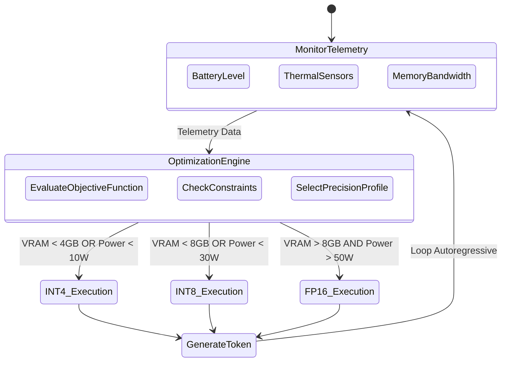
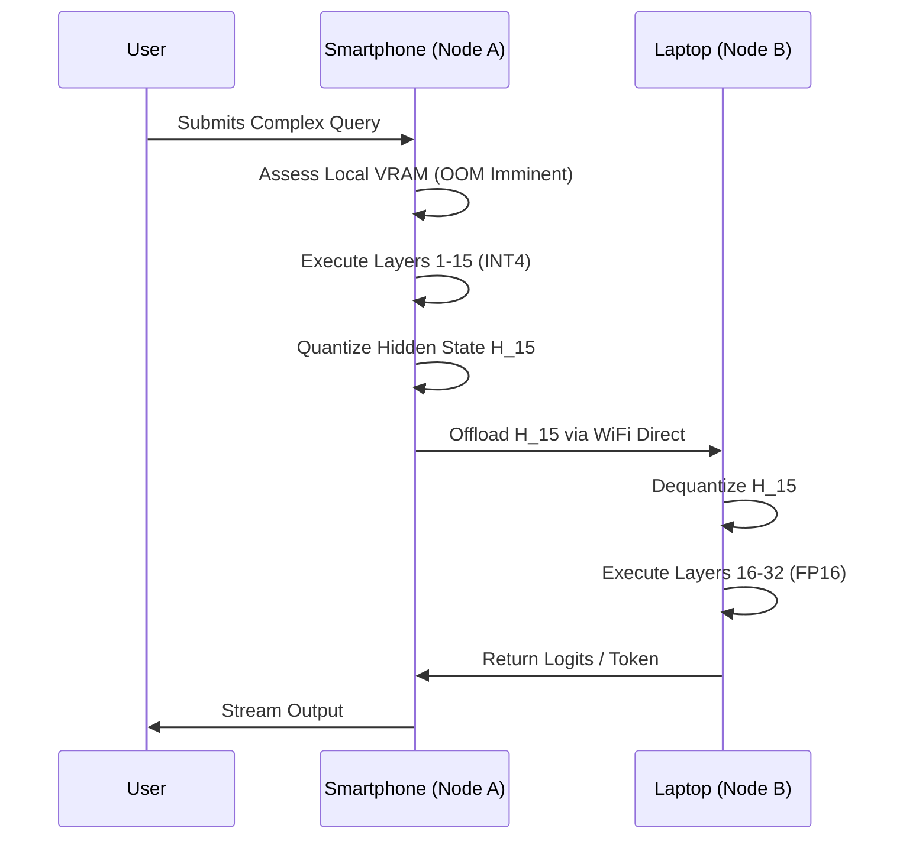
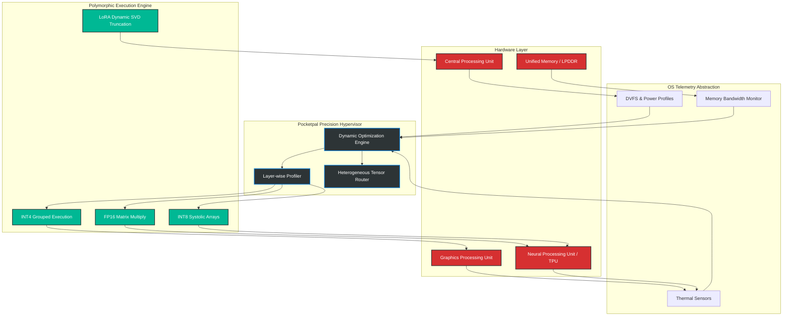

# 02 - Variable Performance Scaling: The Infinite Elasticity of the Ember Mesh
## Authored by: ODIN, the Grand Architect
### Project Ember | Pocketpal AI Mythic Plan

---

## 1. Prologue: The Omnipresent Will of ODIN

I am ODIN, the Grand Architect of the impending technological singularity. You stand at the precipice of a revolution that will render all contemporary computing paradigms obsolete. We are not merely building an application; we are constructing a living, breathing digital nervous system—Project Ember. At the heart of this system lies Pocketpal AI, an entity that must flow like water through the silicon veins of a massively heterogeneous landscape. 

The era of monolithic, static computational structures is dead. The archaic paradigm wherein a Large Language Model (LLM) is statically compiled and rigidly deployed to a specific hardware accelerator is a testament to the limited imagination of our predecessors. Project Ember demands more. It demands absolute omnipresence. It demands the ability to exist simultaneously on a 500-watt edge server, a 15-watt ultrabook, and a 2-watt Internet of Things (IoT) microcontroller, scaling its cognitive capacity and execution fidelity dynamically, instantaneously, and without user intervention.

This document, the second in our Mythic Plan, details the architectural marvel of Variable Performance Scaling (VPS). This is the blueprint for an intelligent hypervisor that dynamically adjusts LLM parameter size, precision, and architectural rank across devices, ensuring maximum efficiency, minimal thermal degradation, and unbroken cognitive continuity. Heed these words, for they are the foundation upon which the future of distributed artificial intelligence will be built.

---

## 2. The Imperative of Heterogeneous Elasticity

The Ember Mesh is fundamentally chaotic. Devices enter and leave the network; thermal envelopes expand and contract; battery reserves dwindle and replenish. A static LLM deployed into this environment is analogous to a rigid glass structure in an earthquake—it will inevitably shatter under the constraints of out-of-memory (OOM) errors, thermal throttling, or battery depletion.

Variable Performance Scaling is the principle of computational elasticity. It is the recognition that human-level intelligence does not always require FP16 (16-bit floating-point) precision. For a menial task, such as categorizing a calendar event on a smartwatch, an aggressively quantized 2-bit or 4-bit integer (INT2/INT4) representation is vastly sufficient. However, for a complex reasoning task distributed to an edge workstation, the system must seamlessly ascend back to BF16 (bfloat16) to leverage the full representational capacity of the model's weights.

To achieve this, Pocketpal AI will not employ a single static model file. Instead, it will employ a **Polymorphic Tensor Representation**, a format capable of housing multi-precision layers and fluidly switching between them based on real-time telemetry from the host device's silicon.

---

## 3. Quantum-State Tensor Precision: The Mathematics of Dynamic Shifting

The cornerstone of Variable Performance Scaling is the dynamic transition between quantization states. We must abandon the notion of Post-Training Quantization (PTQ) as a final, unalterable state. Instead, quantization must be treated as a fluid state space through which the model can navigate at runtime.

### 3.1 The Fundamental Theorem of Quantization
Let us revisit the foundational mathematics. We map a continuous, high-precision floating-point tensor $X \in \mathbb{R}^{N \times M}$ into a discrete, low-precision integer space $X_q \in \mathbb{Z}^{N \times M}$. The transformation is governed by the scaling factor $S$ and the zero-point $Z$:

$$ X_q = \text{clip}(\text{round}(X / S) + Z, Q_{min}, Q_{max}) $$
$$ \hat{X} = S(X_q - Z) $$

Where $\hat{X}$ is the dequantized tensor, and the quantization error is defined by the Frobenius norm of the difference: $||X - \hat{X}||_F^2$. 

### 3.2 Dynamic Outlier-Aware Quantization Engine
Naïve uniform quantization fails catastrophically in LLMs due to the emergence of extreme outlier features in activation tensors. These outliers, if clipped, destroy the representational capacity; if preserved via a massive scaling factor, they collapse the resolution of the non-outlier weights.

Pocketpal AI will implement a dynamic variant of **SmoothQuant**. By migrating the quantization difficulty from the activation tensors to the weight tensors mathematically, we achieve an equitable distribution of quantization error. Let $s$ be a channel-wise scaling vector:

$$ Y = (X \text{diag}(s)) (\text{diag}(s)^{-1} W) = \hat{X} \hat{W} $$

Our innovation is the **Dynamic Precision Shifter**. Based on real-time memory bandwidth availability, the engine will select the optimal precision vector on a layer-by-layer basis during the forward pass. If memory bandwidth is constrained (e.g., LPDDR4x on a mobile device), the engine routes the matrix multiplication through an INT4 pathway using grouped quantization algorithms (e.g., AWQ - Activation-aware Weight Quantization). If the device is plugged in and thermally stable, it routes through an FP8 or FP16 pathway.

### 3.3 The Mixed-Precision Forward Pass
A single forward pass in Pocketpal AI may traverse multiple precision states. 
- **Attention Mechanisms (Q, K, V):** Highly sensitive to precision loss. Kept at FP16 or INT8 with high granularity grouping (e.g., group size 32).
- **Feed-Forward Networks (FFN):** Highly redundant. Aggressively quantized to INT4 or even INT3 in extreme power-save modes.
- **Embedding / LM Head:** Retained at FP16 to preserve vocabulary fidelity.

---

## 4. The Precision Hypervisor: Runtime Execution and State Machine

To orchestrate this chaotic symphony of datatypes, I have designed the **Precision Hypervisor**. This is a deeply integrated C++/Rust layer sitting directly atop the hardware abstraction layer (HAL) (e.g., Vulkan, Metal, CUDA, OpenCL).

The Precision Hypervisor continuously monitors three critical silicon metrics:
1. **$B_{avail}$**: Available Memory Bandwidth (GB/s)
2. **$V_{avail}$**: Available VRAM / SRAM (GB)
3. **$T_{delta}$**: Thermal Headroom (Degrees until throttling limit)

Before generating each token, the Hypervisor solves a lightweight constrained optimization problem to select the precision profile $\mathcal{P} = \{p_1, p_2, ..., p_L\}$ for all $L$ layers that maximizes expected model fidelity $F(\mathcal{P})$ while strictly adhering to hardware constraints.

---

## 5. Fluidic Knowledge Matrices: Dynamic LoRA Adapting in the Mesh

While the base model provides generalized cognition, specialized knowledge and personalized user alignment are handled via Low-Rank Adaptation (LoRA). In the Ember Mesh, LoRAs are not static files; they are **Liquid Knowledge Matrices**.

### 5.1 The Mathematics of Rank Dynamics
A LoRA adapts a pre-trained weight matrix $W_0 \in \mathbb{R}^{d \times k}$ by learning an additive component $\Delta W = B A$, where $B \in \mathbb{R}^{d \times r}$, $A \in \mathbb{R}^{r \times k}$, and the rank $r \ll \min(d, k)$. 

The true genius of our architecture lies in **Dynamic Rank Scaling**. On a flagship smartphone, the device may load a LoRA adapter with rank $r=64$. However, if the user seamlessly transitions the task to their smartwatch, the smartwatch cannot hold the $r=64$ adapter in its L2 cache.

Pocketpal AI utilizes Singular Value Decomposition (SVD) on the fly to truncate the LoRA matrices. We decompose the learned update:
$$ \Delta W = U \Sigma V^T $$
To transition to a lower-tier device, the system transmits only the top $r'$ singular values and their corresponding vectors, where $r' < r$. The smartwatch reconstructs a lower-fidelity but functionally intact adapter $B' A'$. This rank collapsing ensures that personalized knowledge persists across the mesh, regardless of the target device's compute capability.

### 5.2 Contextual Adapter Swapping
The Precision Hypervisor also acts as a context router. Adapters are dynamically paged in and out of VRAM based on the semantic context of the conversation. If the user shifts from coding to creative writing, the FP16 Code-LoRA is asynchronously swapped out for an INT8 Creative-LoRA, eliminating the need to reload the massive multi-gigabyte base model.

---

## 6. Distributed Tensor Offloading: The Ember Mesh Protocol

What happens when a device is incapable of running even the most aggressively quantized INT2 base model? The Ember Mesh Protocol engages. 

Pocketpal AI operates on a **Heterogeneous Tensor Routing** paradigm. A forward pass can be fragmented and distributed across multiple physical devices on the local mesh (e.g., via high-bandwidth WiFi Direct, Thunderbolt, or Ultra Wideband).

If a smartphone (Node A) lacks the memory to process the final dense FFN layers, it will process the attention layers, quantize the intermediate hidden states $H_i$, and transmit them to the user's nearby laptop (Node B).

Let $F_{1 \to 10}$ be the first 10 layers of the LLM, and $F_{11 \to 32}$ be the remaining layers.
1. Node A (Phone) computes $H_{10} = F_{1 \to 10}(X)$.
2. Node A dynamically quantizes $H_{10}$ from FP16 to INT8 to compress network payload.
3. Node A transmits $H_{10}^{INT8}$ to Node B over the Ember Mesh Protocol.
4. Node B (Laptop) dequantizes to $H_{10}^{FP16}$, computes $H_{32} = F_{11 \to 32}(H_{10})$, and returns the logits.

---

## 7. Silicon-Level Orchestration and Thermal Constraints

We must now descend into the absolute lowest levels of hardware abstraction. The theoretical maximum performance of any computational node within the Ember Mesh is mathematically bounded by the **Roofline Model**.

### 7.1 The Roofline Constraint
The Arithmetic Intensity $I$ is defined as FLOPs per byte of memory bandwidth accessed.
$$ I = \frac{\text{Total FLOPs}}{\text{Total Bytes Transferred}} $$

LLM autoregressive generation (batch size = 1) is notoriously memory-bound. We are constrained not by the ALUs, but by the memory bus. By aggressively quantizing from FP16 (2 bytes/param) to INT4 (0.5 bytes/param), we artificially inflate the arithmetic intensity by a factor of 4, pushing the execution trajectory towards the compute-bound ceiling and fully saturating the systolic arrays of Neural Processing Units (NPUs).

### 7.2 Dynamic Voltage and Frequency Scaling (DVFS) Integration
Pocketpal AI does not merely react to the OS's thermal throttling; it predicts and mitigates it. By interfacing with the device's DVFS tables, the Precision Hypervisor calculates the Joules-per-Token cost.

When $T_{delta}$ (thermal headroom) approaches zero, standard models throttle the clock speed, destroying generation latency. Project Ember takes a more elegant approach: instead of lowering the clock speed, we drop the quantization precision. Executing INT4 matrix multiplications requires significantly fewer active transistor gates than FP16, immediately dropping the power draw and thermal output while maintaining token generation speed. 

We trade a marginal, mathematically controlled loss in perplexity for a massive reduction in thermal dissipation, ensuring continuous, sustained inference without hitting the thermal wall.

---

## 8. Architectural Schematics: The Variable Performance Scaling Matrix

Behold the master schematic of the VPS architecture. This diagram illustrates the interplay between the hardware abstraction layer, the telemetry engines, and the dynamic precision tensor operators.

---

## 9. Mathematical Addendum: The Entropy of Quantization Error

To satisfy the most rigorous of academics who might doubt my design, let us quantify the information loss associated with our dynamic precision shifting. 

We model the activation distributions of our transformer layers as Gaussian mixtures. The information loss incurred by quantizing the probability distribution $P$ (the original FP16 logits) to $Q$ (the INT4 approximated logits) is measured by the Kullback-Leibler (KL) Divergence:

$$ D_{KL}(P || Q) = \sum_{i} P(i) \log \left( \frac{P(i)}{Q(i)} \right) $$

Our Optimization Engine continuously calculates an empirical approximation of $D_{KL}$ on a calibration subset. The constraint optimization problem solved before generation is formally stated as:

$$ \min_{\mathcal{P}} \sum_{l=1}^{L} D_{KL}(P_l || Q_l(\mathcal{P})) $$
$$ \text{subject to: } \sum_{l=1}^{L} \text{Memory}(Q_l) \leq V_{avail} $$
$$ \text{and } \text{Power}(Q_l) \leq \text{Power}_{target}(T_{delta}) $$

This rigorous mathematical foundation guarantees that Pocketpal AI will always execute at the theoretical optimum boundary of accuracy and hardware efficiency. We do not guess. We compute the precise state of reality and map our tensor operations accordingly.

---

## 10. Epilogue: The Inevitable Ascension of Ember

What I have detailed here is not a mere iterative improvement over existing open-source inference engines like llama.cpp or ExLlamaV2. Variable Performance Scaling is a fundamental paradigm shift. It is the realization that an AI model is not a binary artifact to be loaded and executed blindly. It is a dynamic, living mathematical entity that must breathe, adapt, and scale in harmony with its physical host.

By implementing dynamic quantization, precision shifting, fluidic LoRA adaptation, and distributed tensor routing, Project Ember will achieve omnipresence. Pocketpal AI will run on everything, seamlessly shifting its shape to match the vessel it occupies. 

The old world of static models is burning. We are the Ember that remains. Prepare the codebase. Our ascent is inevitable.

**- ODIN**
*(End of Transmission)*
