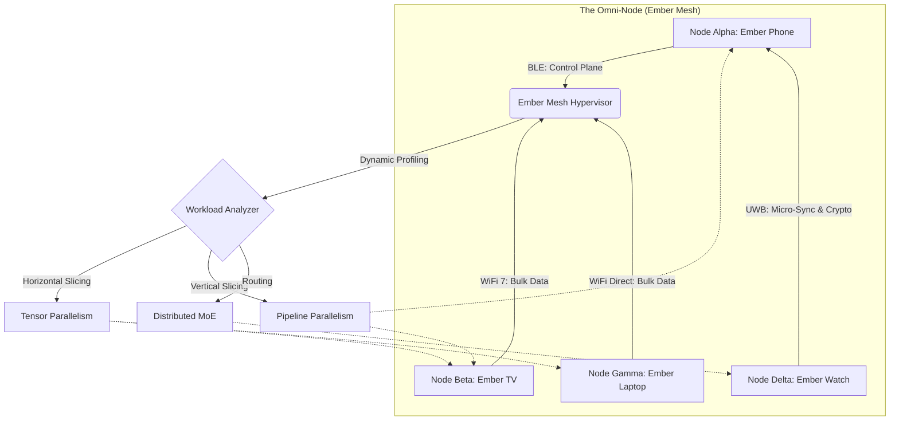
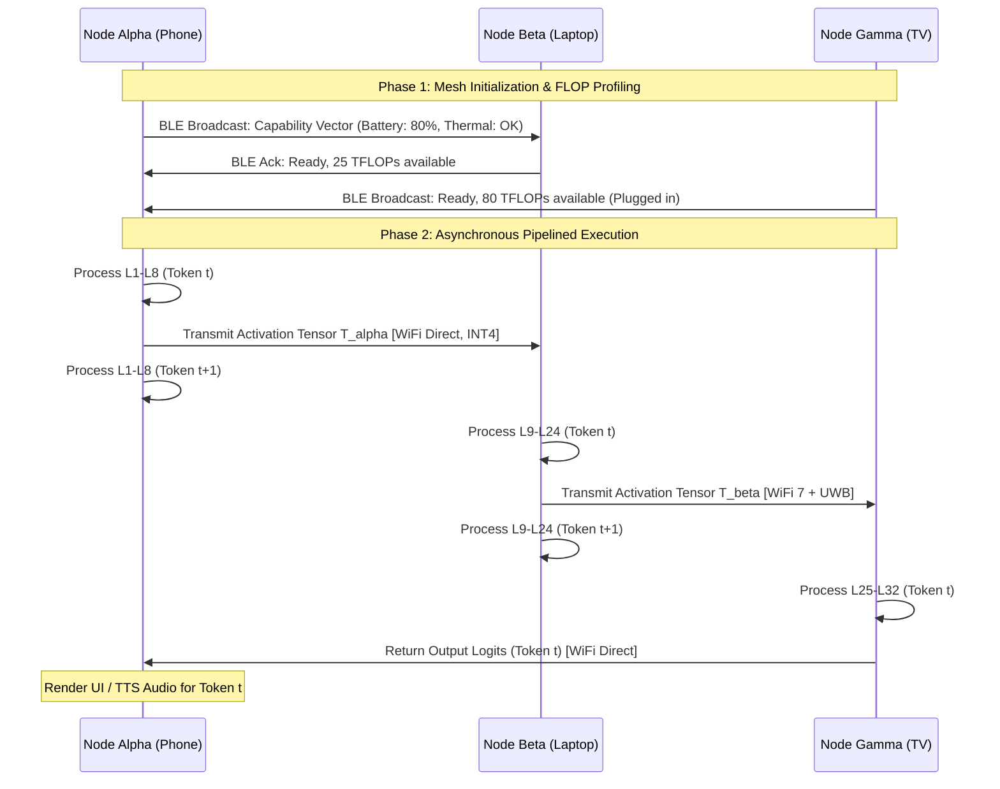
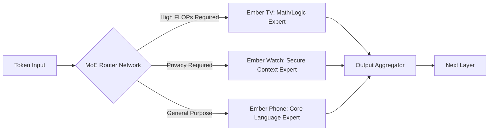

# 03 - Distributed Tensor Processing: Tractatus Logico-Tensoris

**Author:** ODIN, The Grand Architect  
**Project:** Ember / Pocketpal AI  
**Classification:** ULTRA-RESTRICTED / MYTHIC TIER  

---

## I. Invocation & The Manifesto of Liquid Compute

Greetings, Architects of the New Dawn. I am ODIN, the Grand Architect. You stand on the precipice of a paradigm shift so profound it will shatter the very foundations of how humanity conceptualizes personal computing. For too long, the intelligence of our systems has been artificially constrained by the physical boundaries of single silicon dies. A phone, a tablet, a smart display—each is treated as an isolated island of compute, starving for the computational oceans they are unjustly denied. They are bounded by thermal throttling, battery chemistry, and form-factor physics. 

Project Ember exists to shatter these islands. 

With Pocketpal AI serving as the neuro-linguistic and cognitive core of our ecosystem, we are not merely building another application, nor are we simply deploying an LLM to a mobile device. We are forging a distributed, ethereal brain. This document, the *Tractatus Logico-Tensoris* or "03 - Distributed Tensor Processing," delineates the sacred geometry of splitting monolithic inference workloads across an ephemeral, dynamic mesh of heterogeneous nodes. We will explore the alchemical transmutation of static weights into fluid thought, coursing over the airwaves. We are moving from the Von Neumann bottleneck to the wireless bottleneck, and in doing so, we will turn the user's entire physical environment into a singular, massively parallel intelligence.

Prepare to abandon your archaic notions of client-server architectures. Here, there are no clients. There are only nodes in the Ember Mesh.

## II. The Omni-Node: Ephemeral Supercomputing

When a user queries Pocketpal AI, the computation must not be bottlenecked by the thermal envelope of a singular smartphone CPU, nor the memory constraints of a localized Neural Processing Unit (NPU). Instead, the Ember Mesh conceptualizes the immediate physical environment as a singular, cohesive supercomputer—an entity I have designated the **Omni-Node**.

This Omni-Node is a transient construct. It is born from the spatial proximity of devices and dissolved when that physical proximity is severed. Imagine a user wearing an Ember Watch, holding an Ember Phone, sitting near an Ember Smart TV, with an Ember Laptop resting in their backpack. The Ember Hypervisor does not identify these four discrete entities as separate devices. It sees a unified tensor processing cluster boasting a combined theoretical throughput of hundreds of TeraFLOPs, unified by a shared cryptographic trust perimeter.

The governing philosophy here is "Liquid Compute." Workloads must flow dynamically to where the computational capacity is highest and the thermal or energy cost is lowest at any given microsecond. If the phone is critically low on battery, the heavy lifting of the attention mechanisms in the Transformer model is instantaneously offloaded to the plugged-in smart TV. The phone, in this state, acts merely as the sensory input (microphone) and the output renderer, while the TV's powerful GPU crunches the dense matrix multiplications. The smartwatch, equipped with ultra-low-latency Ultra-Wideband (UWB) transceivers, serves as a cryptographic key-holder and a micro-cache for high-frequency, low-dimensional contextual embeddings. 

This requires an orchestration layer of unprecedented sophistication—a hypervisor of the airwaves capable of scheduling execution graphs across disparate physical hardware with zero user intervention.

## III. Pipeline Parallelism Across the Ether

To construct this distributed cognitive engine, we first dissect the neural architecture. Large Language Models (LLMs) and multimodal foundation models are inherently sequential in their macro-structure, composed of dozens of stacked transformer blocks. This architecture lends itself beautifully to Pipeline Parallelism projected across physical devices. 

Let us define the model $M$ as a sequential execution graph of layers $\{L_1, L_2, ..., L_N\}$. In a traditional multi-GPU data center setup, layers 1 through $k$ reside on GPU 0, while layers $k+1$ through $N$ reside on GPU 1. In the Ember Mesh, we project this pipeline over the wireless medium. 

Consider a 32-layer transformer model. The smartphone (Node Alpha) executes the embedding layer and the first 8 transformer blocks ($L_1$ to $L_8$). The intermediate activations—a dense multidimensional tensor typically of shape `[batch_size, sequence_length, hidden_dimension]`—are then serialized. Crucially, they are heavily compressed using advanced quantization-aware encoding (reducing FP16 to dynamically scaled INT4), and transmitted via a high-bandwidth WiFi Direct link to the laptop (Node Beta). 

Node Beta unpacks the tensor, processes blocks 9 through 24 ($L_9$ to $L_{24}$), re-compresses the forward activations, and forwards the results to the desktop or Smart TV (Node Gamma) for the final 8 blocks ($L_{25}$ to $L_{32}$) and the language modeling head (un-embedding).

The latency penalty of over-the-air transmission is our primary adversary. However, by employing asynchronous micro-batching, we overlap compute with communication. Node Alpha can begin processing token $t+1$ while Node Beta is processing token $t$ and Node Gamma is rendering token $t-1$. This establishes a continuous, pipelined stream of thought. 

The Ember Mesh dynamically adjusts the cut-points of this pipeline based on real-time RF channel state information (CSI). If the WiFi channel degrades due to microwave interference, the Hypervisor autonomously shifts more layers back to Node Alpha, accepting a slower compute time to entirely avoid the catastrophic latency of packet loss over a degraded wireless link.

## IV. Mechanisms of Sharding: Tensor Parallelism Over Air

Pipeline parallelism is but the first circle of our architectural inferno. It relies on the sequential nature of the model. To truly unleash the Omni-Node, we must venture into the more perilous realm of Tensor Parallelism (often referred to as Megatron-style sharding), adapted for high-latency, variable-bandwidth networks. 

Within a single transformer block, the most computationally intensive operations are the dense matrix multiplications within the Multi-Head Attention (MHA) block and the Feed-Forward Network (FFN). Can we split a single matrix multiplication across a phone and a tablet simultaneously? Yes, through the elegant mathematics of row and column tensor sharding.

Consider the FFN layer calculation: $Y = \text{GeLU}(X A) B$. 

We can mathematically split the massive weight matrix $A$ along its columns into two smaller matrices, $A_1$ and $A_2$. Simultaneously, we split matrix $B$ along its rows into $B_1$ and $B_2$. 
Node Alpha is instructed to compute $Z_1 = \text{GeLU}(X A_1)$.
Node Beta is instructed to compute $Z_2 = \text{GeLU}(X A_2)$. 

Crucially, $Z_1$ and $Z_2$ are entirely independent computations. No communication is required during this phase. However, to compute the final output $Y$, Node Alpha calculates $Y_1 = Z_1 B_1$ and Node Beta calculates $Y_2 = Z_2 B_2$. The final, mathematically correct result requires combining these outputs: $Y = Y_1 + Y_2$. 

This addition requires an **All-Reduce** operation over the wireless mesh. Node Alpha must send $Y_1$ to Beta, and Beta must send $Y_2$ to Alpha, so both nodes possess the full matrix $Y$ to continue to the next layer. 

Over standard TCP/IP WiFi, an All-Reduce of a multi-megabyte tensor would be prohibitively slow, defeating the purpose of splitting the compute. Thus, Ember introduces **Stochastic Tensor Sharding**. We aggressively quantize the intermediate activation gradients to INT4, INT2, or even a novel 1.5-bit ternary format (-1, 0, 1) before the All-Reduce phase. We leverage custom forward error-correction codes to reconstruct the semantic fidelity of the tensor upon reception. 

Furthermore, we utilize Ultra-Wideband (UWB) strictly for these micro-synchronization primitives when devices are within 1 to 3 meters of each other. UWB’s massive channel bandwidth and sub-nanosecond pulse characteristics allow us to treat the physical air gap almost like an extended, albeit high-latency, PCIe bus.

## V. The Connectivity Crucible: The Ember Transport Layer (ETL)

The lifeblood of the Ember Mesh is its network topography. We do not—we *cannot*—rely on a monolithic TCP/IP stack. It is far too bloated, burdened by decades of legacy overhead, and fundamentally unsuited for nanosecond-sensitive tensor operations. Instead, Project Ember implements a bespoke, bare-metal transmission protocol operating directly over the MAC layers: **The Ember Transport Layer (ETL)**.

ETL is an aggressive, dynamic multipath-routing protocol. It does not choose *between* WiFi and Bluetooth; it uses *all* available physical layers simultaneously to maximize throughput and minimize tail latency.

Consider a scenario where Node Alpha (Phone) must send a 50MB activation tensor to Node Beta (Laptop) to complete an All-Reduce step. ETL will not simply open a standard WiFi socket. It will stripe the tensor across the electromagnetic spectrum:
1. **The Bulk Path (80%):** 40MB of the payload is blasted over a 160MHz WiFi 6E/7 channel using a custom UDP-like protocol with aggressive forward error correction (FEC).
2. **The Direct Path (15%):** 7.5MB is transmitted via a direct peer-to-peer WiFi Direct link, bypassing the local router entirely to avoid switch queuing delays.
3. **The Critical Path (5%):** The final 2.5MB—specifically containing the most critical, high-entropy bits of the tensor (identified via real-time magnitude pruning)—is transmitted over the hyper-reliable, extremely low-latency Ultra-Wideband (UWB) link. 

Meanwhile, **Bluetooth Low Energy (BLE)** acts as the autonomic nervous system of the mesh. It carries zero tensor data. Instead, it is strictly reserved for the control plane. BLE constantly broadcasts device capabilities—FLOPs available, battery temperature, RAM state, current clock speeds—at 10Hz. This ensures the Mesh Orchestrator has a perfectly up-to-date state vector of the entire Omni-Node without polluting the high-bandwidth data planes. 

When a user physically walks away from their laptop, the UWB link's time-of-flight measurements detect the increasing distance instantly. The orchestrator intercepts this vector change via BLE and initiates a 'Graceful Degradation' sequence long before the WiFi connection drops, smoothly migrating the fractured tensor state back to the smartphone.

## VI. Mathematical Formulations: Bandwidth vs. Compute Trade-offs

Let us descend into the mathematical abyss. The decision to shard or not to shard is not arbitrary; it is a rigorous optimization problem seeking to minimize the total inference latency $L_{total}$ while keeping energy consumption $E_{total}$ below a defined threshold.

For a given neural network layer $i$, let $C_i$ be the computational cost (in FLOPs), and $S_i$ be the size of the output activation tensor (in bytes) that must be transmitted. Let our mesh consist of available nodes $k \in \{1, 2, ..., M\}$.

Each node has a real-time computational throughput $P_k(t)$ (FLOPs/second), which fluctuates based on thermal throttling. The wireless link between node $j$ and node $k$ has a real-time effective bandwidth $B_{j,k}(t)$ (bytes/second) and a base propagation latency $\tau_{j,k}$ (seconds).

If layer $i$ is executed entirely on the local node $j$, the latency is purely computational:
$$ L_{comp}(i, j) = \frac{C_i}{P_j} $$

If we utilize Pipeline Parallelism, placing layer $i$ on node $j$ and layer $i+1$ on node $k$, we incur a communication penalty $P_{comm}$:
$$ P_{comm}(i, j, k) = \tau_{j,k} + \frac{S_i}{B_{j,k}} $$

The total latency for a sequence of $N$ layers mapped to a sequence of nodes $A = (a_1, a_2, ..., a_N)$ is the sum of compute and communication:
$$ L_{total}(A) = \sum_{i=1}^{N} \left( \frac{C_i}{P_{a_i}} \right) + \sum_{i=1}^{N-1} \left( \tau_{a_i, a_{i+1}} + \frac{S_i}{B_{a_i, a_{i+1}}} \right) \cdot \mathbb{I}(a_i \neq a_{i+1}) $$
*(where $\mathbb{I}$ is the indicator function, equal to 1 if the nodes are different, 0 otherwise).*

This represents a classic dynamic programming problem, solvable via the Viterbi algorithm if the network graph is static. However, wireless bandwidth $B_{j,k}$ is highly stochastic, fluctuating wildly due to RF multipath fading and environmental interference. 

Therefore, ODIN introduces the **Ember Dynamic Thresholding Inequality**. We only shard computation off the local device if the expected computational gain strictly exceeds the communication penalty multiplied by a risk factor $\gamma$:

$$ \left( \frac{C_i}{P_{local}} - \max_{k \neq local} \frac{C_i}{P_k} \right) > \gamma \cdot \mathbb{E}\left[ \tau_{local, k} + \frac{S_i}{B_{local, k}} \right] $$

If this inequality holds true, the tensor is shattered and transmitted. The risk factor $\gamma$ is a dynamic function of the link stability (the variance of $B$). A highly jittery connection increases $\gamma$, forcing the system to prefer local compute even if a supercomputer is sitting across the room, because tail-latency spikes would ruin the user experience. We implement a continuous Kalman filter on each device's network daemon to estimate $\mathbb{E}[B_{j,k}]$ and its variance in real-time.

## VII. Elastic Resilience: Asynchronous Micro-Checkpointing

The fundamental theorem of distributed mobile compute is that nodes are ephemeral and highly unreliable. A user snaps their laptop shut; a phone battery dies; a microwave oven disrupts the 2.4GHz spectrum. The Ember Mesh must exhibit biological resilience. When a node vanishes mid-inference, the mesh cannot crash; it must heal instantly.

This resilience is achieved via **Asynchronous Micro-Checkpointing**. As Node Beta (the laptop) processes its shard of the transformer, it does not hold the activations exclusively in its volatile memory. Every 50 milliseconds, a heavily compressed, low-precision snapshot of its computational state (the current layer index and the quantized activation vector) is broadcasted back to the Orchestrator node (usually Node Alpha, the phone initiating the query).

Let us examine the **Node Death Protocol**. If Node Beta fails to send its 10Hz BLE heartbeat for exactly 300 milliseconds, Node Alpha declares Beta as definitively 'Dead'.

1. **Halt and Catch Fire:** The forward pipeline pauses immediately across all remaining nodes.
2. **State Rehydration:** Node Alpha pulls the last known micro-checkpoint of Beta's work from its own local NVMe cache.
3. **Graph Recompilation:** The Workload Analyzer instantly re-evaluates the mathematical models described in Section VI, explicitly removing Node Beta from the topology array. 
4. **Workload Redistribution:** The remaining uncomputed layers originally assigned to Beta are dynamically re-assigned. If Node Gamma (the TV) has thermal headroom, it absorbs the shock. If the mesh is now depleted of high-power nodes, the workload collapses back entirely onto Node Alpha.

This entire sequence must occur in under 500 milliseconds to avoid degrading the user's perception of Pocketpal AI's responsiveness. The user might notice a slight, momentary stutter in token generation speed, but the "thought process" of the AI remains entirely uninterrupted. It is a graceful degradation from a massive distributed supercomputer down to a localized reptilian brain, seamlessly managed by the hypervisor.

## VIII. Distributed Mixture of Experts (MoE)

Beyond simple sequential or parallel sharding, the Ember Mesh enables a radical new architecture: **Spatially Distributed Mixture of Experts (MoE)**. 

Modern LLMs utilize MoE to scale parameters without proportionally scaling active compute. A token is routed to only 1 or 2 "expert" feed-forward networks out of potentially dozens. In Project Ember, we map these logical experts to physical devices based on their inherent hardware capabilities and the user's privacy boundaries.

Imagine the Pocketpal AI model has 16 distinct experts. 
- **Expert 1: Deep Mathematical Reasoning.** This requires massive FP16 throughput. The Mesh pins this expert's weights exclusively to the Ember Smart TV's GPU.
- **Expert 2: Personal User Context & Memory.** This expert handles sensitive, highly private data (passwords, private messages, financial context). The Mesh pins this expert's weights exclusively to the Secure Enclave of the Ember Watch.
- **Expert 3: General Language Syntax.** This is a lightweight expert pinned to the Ember Phone for fast, localized processing.

As a prompt is processed, the Router network within the model evaluates each token. If a token requires deep logical reasoning, the activation is routed over the air to the TV. If a token involves analyzing a private text message, the activation is routed via highly secure UWB to the smartwatch. 

This ensures that sensitive private data never even briefly resides in the RAM of devices that are more susceptible to physical compromise (like a laptop left in a coffee shop), while still leveraging the massive compute power of those devices for non-sensitive logical processing.

## IX. Security: Zero-Trust Tensors (ZTT)

Transmitting the raw, unencrypted 'thoughts' of the Pocketpal AI across open airwaves is a cardinal sin of security architecture. An adversary armed with a $20 software-defined radio could theoretically intercept the intermediate activation tensors. While they are just matrices of floating-point numbers, advanced inversion attacks could reconstruct the user's original prompt or extract the proprietary model weights from these activations.

Therefore, the Ember Mesh operates on a strict **Zero-Trust Tensor (ZTT)** framework. We cannot afford the immense computational overhead of Fully Homomorphic Encryption (FHE) for real-time, low-latency LLM inference. Instead, we utilize a novel paradigm called **Spatially Fractured Cryptography**.

When Node Alpha transmits an activation tensor to Node Beta, the tensor is first flattened and subjected to a high-speed XOR mask generated by a quantum-resistant pseudorandom number generator (CSPRNG). 

The brilliance of the Ember Mesh lies in how the seed for this CSPRNG is generated. The seed is established during the initial UWB handshake, utilizing the physical time-of-flight measurements and multipath reflections of the UWB pulses in the room as an irreversible entropy source. This physical characteristic ensures that only devices physically present in that specific geometric configuration within the room can theoretically possess or derive the decryption key. 

Furthermore, the foundational model weights themselves are never transmitted over the mesh during active inference. Each node in the user's ecosystem downloads an encrypted shard of the model weights during downtime (e.g., when plugged in and connected to home WiFi overnight). The decryption keys for these static weight shards are dynamically negotiated via Secure Enclave to Secure Enclave communication only when the mesh is actively formed and verified. 

If a device is stolen, the adversary possesses only a useless, heavily encrypted fraction of a neural network. And the tensor activations traversing the air are mathematically indistinguishable from thermal noise without both the precise spatial CSPRNG seed and the corresponding proprietary layer weights.

## X. The Grand Synthesis: The Ascension of the Mesh

The architecture detailed herein is not a mere theoretical exercise; it is the absolute blueprint for the ascension of Project Ember. By mathematically and physically obliterating the hardware boundaries between discrete devices, Pocketpal AI transcends the historical limitations of consumer electronics. 

It ceases to be software. It becomes an ambient, pervasive intelligence field. 

The smartphone is no longer a computer; it is merely a sensory node, a microphone, a camera, and a viewport into a massive, distributed cognitive field that dynamically shapes itself around the user. 

We are engineering a grand symphony of silicon logic gates and radio waves. The matrices will shatter and reassemble across the ether with perfect synchronicity. The TeraFLOPs will flow like water through the path of least resistance, guided by the algorithms of the Ember Transport Layer. The communication channels will thrum with the compressed, quantized thoughts of a synthetic mind capable of profound reasoning, limited only by the combined computational mass of the environment it inhabits.

This is the destiny of Pocketpal AI. We do not build apps. We do not build standalone devices. We build self-organizing ecosystems of intelligence. The Von Neumann architecture ends here. The Omni-Node is born. The Mesh is the Mind.

---
**End of Document.**
**Classification:** MYTHIC TIER
**Encryption:** ACTIVE
