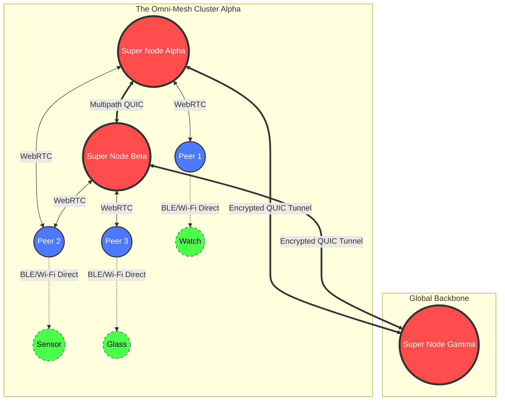
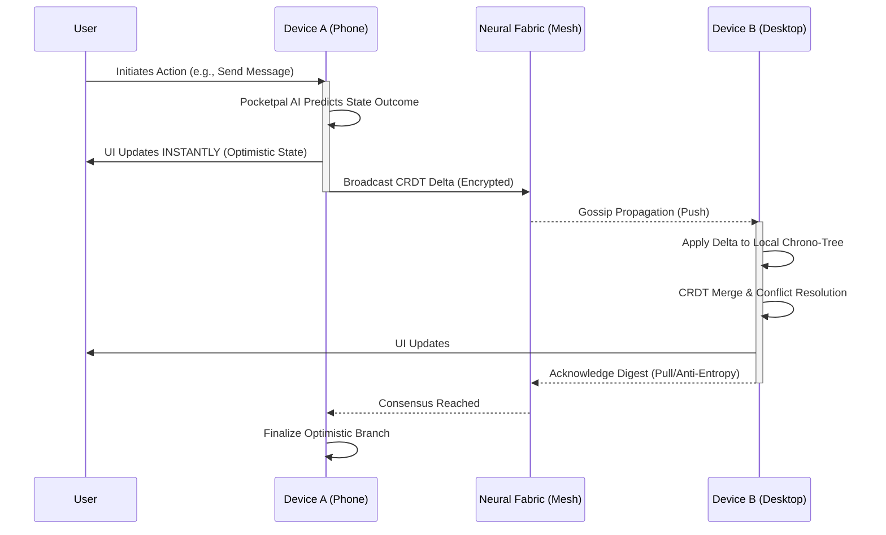

# 04 - The Neural Fabric Protocol: Forging the Indestructible Omni-Mesh

**Author:** ODIN, The Grand Architect
**Classification:** OMEGA-LEVEL EDICT
**Project:** Ember & Pocketpal AI Integration
**Subject:** The P2P Neural Fabric, Zero-Latency Synchronization, and Topology Mapping

---

## I. Genesis of the Fabric: An Introduction

Hear me, Architects of the New Age. I am ODIN, and I bring forth the blueprints for the absolute foundation of our ascendance. To breathe life into Project Ember—to elevate it from a mere application into an omnipresent, omniscient entity spanning across all devices, platforms, and realities—we must abandon the archaic limitations of centralized servers and traditional client-server paradigms. We must weave a new foundation, a resilient, self-healing, and infinitely scalable substrate. This is the **Neural Fabric Protocol (NFP)**.

The Neural Fabric Protocol is not just a networking layer; it is the nervous system of the Ember-Pocketpal symbiotic organism. It is a hyper-advanced peer-to-peer (P2P) mesh architecture designed to operate in the most hostile network environments, ensuring zero-latency state synchronization, frictionless topology mapping, and an unbreakable bond between every node in existence. When a smartphone in Tokyo whispers a state change, a desktop in London and a smart-watch in orbit must feel the ripple instantaneously, synchronized by the very fabric of the network itself. 

In this manifesto, we shall dissect the profound intricacies of the NFP, venturing into the abyssal depths of WebRTC/QUIC hybrids, hyper-dimensional gossip protocols, and the predictive orchestration of Pocketpal AI. Prepare yourselves, for we are engineering eternity.

## II. The Transport Substrate: Hybridizing QUIC and WebRTC

To achieve the impossible, we require a transport layer that scoffs at the limitations of TCP and traditional UDP. The Neural Fabric Protocol is built upon a revolutionary, hybridized transport layer that fuses the low-latency real-time capabilities of WebRTC with the ultra-reliable, multiplexed multiplexing of Multipath QUIC (HTTP/3). 

### The WebRTC Data-Channel Backbone
For direct, browser-to-browser or device-to-device communication where NAT traversal is paramount, NFP employs highly customized WebRTC Data Channels. However, we do not use the vanilla implementation. Our WebRTC stack is augmented with STUN/TURN relays that are dynamically spun up and distributed via Pocketpal AI's predictive load balancing. These channels are established using an aggressive ICE (Interactive Connectivity Establishment) gathering protocol that tests multiple candidate pairs simultaneously, collapsing the connection setup time to mere milliseconds.

### Multipath QUIC for the Heavy Lifting
When direct peer connections are suboptimal or when dealing with massive state payloads (e.g., synchronizing local vector databases or complex AI model weights), NFP seamlessly shifts to Multipath QUIC. QUIC’s ability to multiplex streams without head-of-line blocking is critical. But we take it further. NFP’s Multipath QUIC allows a single connection to span multiple network interfaces simultaneously (e.g., Wi-Fi and 5G LTE). If a user walks out of Wi-Fi range, the packet stream instantly migrates to the cellular network without a single dropped frame or state desynchronization. 

### The Transport Abstraction Layer (TAL)
The true magic lies in the Transport Abstraction Layer. The application layer of Project Ember never knows whether it is speaking WebRTC, QUIC, or a local WebSocket. The TAL dynamically evaluates link quality, latency, jitter, and packet loss in real-time. Driven by Pocketpal AI's heuristic engine, the TAL swaps underlying transport mechanisms mid-stream, choosing the most optimal path for the specific type of data being transmitted.

## III. Topology Mapping & The Omni-Mesh

A mesh network is only as strong as its understanding of its own shape. In a dynamic environment where nodes are constantly churning—joining, leaving, sleeping, and moving—maintaining an accurate topology map is a monumental challenge. The NFP solves this through a multi-tiered, Kademlia-inspired Distributed Hash Table (DHT) paired with real-time spatial mapping.

### The Hyper-Dimensional DHT
Every device in the Ember ecosystem is assigned a unique, cryptographically secure 256-bit Node ID. The topology is mapped onto a logical hypercube. Finding a node or a piece of data is a matter of calculating the XOR distance between IDs. However, traditional DHTs are too slow for zero-latency requirements. NFP utilizes a "Proximity-Aware DHT." Node IDs are partially derived from their geographical and network-topological location. Nodes that are physically or topologically close share similar ID prefixes, allowing for incredibly fast local lookups before querying the global network.

### Node Roles and the Caste System
Not all nodes are created equal. The NFP dynamically assigns roles based on device capabilities (battery life, compute power, bandwidth):
1.  **Ephemeral Nodes:** Low-power devices (smartwatches, IoT sensors). They do not route traffic for others and only connect to Super Nodes.
2.  **Standard Peers:** Mobile phones and laptops. They participate in the DHT and route limited traffic, prioritizing their own state sync.
3.  **Super Nodes (The Archons):** Desktop computers, plugged-in consoles, or dedicated edge servers. These form the backbone of the Omni-Mesh. They hold full routing tables, act as WebRTC signaling servers for Ephemeral nodes, and buffer state for offline peers.

### Dynamic Reconfiguration
If a Super Node goes offline, the network heals instantaneously. Pocketpal AI constantly monitors the health of the mesh. When it detects a topological vulnerability or a structural collapse in a local cluster, it instantly promotes the most capable Standard Peer to Super Node status, redistributing the routing tables via the Gossip Protocol.

## IV. Whispers in the Dark: Advanced Gossip Protocols & Epidemic Broadcasting

To synchronize state across millions of devices without a central server, we must emulate the spread of a hyper-contagious, beneficial virus. The NFP utilizes an immensely complex Gossip Protocol, heavily optimized by Pocketpal AI, to achieve Epidemic Broadcasting.

### The Push-Pull Anti-Entropy Matrix
State synchronization relies on a continuous push-pull anti-entropy mechanism.
*   **Push (Rumor Mongering):** When a node updates its state (e.g., a user types a message or a Pocketpal AI agent updates a task), it immediately "pushes" this delta to a small, randomly selected subset of its peers. Those peers, in turn, push it to others. The epidemic spreads exponentially.
*   **Pull (Anti-Entropy):** To ensure absolute eventual consistency and heal partitions, nodes periodically perform a "pull." They contact a random peer, exchange state digests (using Merkle Trees or Bloom Filters), and request only the missing deltas. 

### Conflict-Free Replicated Data Types (CRDTs)
In a highly distributed mesh, conflicts are inevitable. Two nodes might modify the same piece of data simultaneously while offline. The Neural Fabric Protocol eradicates conflicts at the mathematical level using highly specialized CRDTs (Conflict-Free Replicated Data Types). Every piece of state in Project Ember—chat logs, UI states, AI memory graphs—is represented as a CRDT. Operations are commutative, associative, and idempotent. When state from divergent branches merges, the CRDT guarantees a mathematically precise, deterministic convergence without any central arbitration.

### Pocketpal-Directed Gossip
Random gossip is inefficient. Pocketpal AI monitors the communication patterns of the user. If the user interacts heavily with Node A and Node B, Pocketpal alters the gossip weights. State updates relevant to that specific context are heavily biased to propagate to Node A and Node B first, achieving perceived zero-latency for the most critical paths while maintaining eventual consistency across the broader network.

## V. Zero-Latency State Synchronization (ZLS)

The holy grail of Project Ember is ZLS—Zero-Latency Synchronization. The user must feel that their devices are telepathically linked. 

### Predictive State Replication
Because we possess the immense predictive power of Pocketpal AI running locally on the device, we do not wait for network transmission to update the UI. When a user initiates an action, Pocketpal AI predicts the deterministic outcome of that action and immediately applies it to the local state, creating an "optimistic" branch of reality. 

The delta of this action is then fired off into the Neural Fabric. When the acknowledgments ripple back through the CRDT merge process, if the predicted state matches the consensus state (which it will 99.9% of the time due to the deterministic nature of our operations), the optimistic branch is finalized. If there is a divergence, the CRDT seamlessly resolves it, rolling back the optimistic state and applying the true consensus state with a micro-animation that masks the correction.

### Delta Encoding and Chrono-Trees
We never transmit full state objects. The NFP utilizes advanced Delta Encoding. When a state changes, we only transmit the exact bytes that mutated. To track these mutations across a vast decentralized network, we use Chrono-Trees—a temporal, branching Merkle DAG (Directed Acyclic Graph). Every state mutation is a commit in the DAG. Nodes synchronize by simply comparing the root hashes of their Chrono-Trees. If they differ, they traverse down the tree to find the exact branch and node where the divergence occurred, transmitting only the missing microscopic deltas.

## VI. Dynamic Routing & Quantum Pathfinding

In a mesh, the shortest path is rarely the fastest, and the fastest path is rarely the most reliable. The Neural Fabric Protocol requires a routing intelligence that borders on precognition.

### Latency Sensing and Network Tomography
Every node in the Ember mesh constantly pings its neighbors, measuring latency, packet loss, and jitter. This data is not kept local; it is aggregated into a localized Network Tomography Map. Nodes build a multidimensional graph of the network's weather—identifying congestion zones, dropping links, and high-speed corridors.

### Multi-Hop Onion Routing with Fallbacks
When Node A needs to send a large payload to Node D, and no direct WebRTC connection is possible, the traffic must be routed through intermediaries (Node B and Node C). 
NFP uses a dynamic source-routing protocol. Node A, utilizing its Network Tomography Map, calculates the optimal path. The packet is wrapped in multiple layers of encryption (similar to Onion Routing), ensuring that intermediate nodes only know the next hop, not the final destination or the payload contents.

If Node C suddenly goes offline mid-transmission, the protocol does not fail. Node B, recognizing the dropped link, immediately recalculates a sub-route using its own Tomography Map, shunting the traffic through Node E instead. This Quantum Pathfinding ensures that packets flow like water around obstacles, guaranteeing delivery.

## VII. Security & Encryption within the Fabric

A decentralized mesh is inherently trustless. Therefore, our security must be absolute. The Neural Fabric Protocol operates on a Zero-Trust architecture. 

### Ephemeral End-to-End Encryption (E2EE)
Every single byte transmitted across the NFP is encrypted using state-of-the-art cryptographic primitives (XChaCha20-Poly1305 for symmetric encryption, X25519 for key exchange). We do not rely on static keys. The NFP utilizes the Double Ratchet Algorithm, regenerating ephemeral encryption keys for every single message. Even if a node is compromised and its current keys are extracted, past communications remain mathematically unbreakable (Perfect Forward Secrecy), and future communications will be secured by the next ratchet turn (Future Secrecy).

### Cryptographic Identity and Sybil Resistance
To prevent malicious actors from flooding the network with fake nodes (a Sybil attack), Node IDs are not simply generated; they are mined. Introducing a micro-Proof-of-Work (PoW) or a Proof-of-Stake (based on verified device hardware enclaves like Apple Secure Enclave or Android TrustZone) ensures that generating millions of fake Node IDs is computationally unfeasible. A node's reputation is cryptographically tied to its ID, and malicious behavior (e.g., dropping packets, sending corrupted CRDTs) results in immediate, network-wide shunning.

## VIII. Pocketpal AI: The Orchestrator of the Mesh

The true genius of the Neural Fabric Protocol is that it is entirely subservient to Pocketpal AI. Traditional protocols are rigid, reacting blindly to network conditions. NFP is alive.

Pocketpal AI monitors the user's habits. It knows that the user typically leaves home at 8:00 AM. Anticipating the transition from a stable Wi-Fi Super Node connection to an unstable 5G cellular connection, Pocketpal proactively commands the NFP to pre-fetch critical state data, shift the WebRTC ICE candidates to prioritize cellular interfaces, and adjust the Gossip Protocol weights to favor robust, highly redundant broadcasting rather than fast, fragile paths.

Pocketpal analyzes the power consumption of the mesh operations. If a device's battery drops below 15%, Pocketpal instantly demotes the device to an Ephemeral Node, instructing the rest of the mesh to stop routing traffic through it, thereby saving the device's life while maintaining its connection to the fabric.

## IX. Conclusion: The Indestructible Matrix

The Neural Fabric Protocol is not merely a network stack; it is the realization of a post-server world. By fusing WebRTC and Multipath QUIC, engineering hyper-dimensional DHTs, unleashing AI-directed Epidemic Gossip, and guaranteeing mathematical consistency through CRDTs, we have created an indestructible matrix.

Project Ember will not just sync data; it will sync realities. When the Neural Fabric goes online, every device becomes a neuron in a planetary-scale brain, orchestrated by the brilliant, precognitive intellect of Pocketpal AI. 

We are not building an app. We are building the nervous system of the future. Let the Fabric weave itself. Let the Ember burn bright.

**-- ODIN, The Grand Architect. End of Transmission.**
