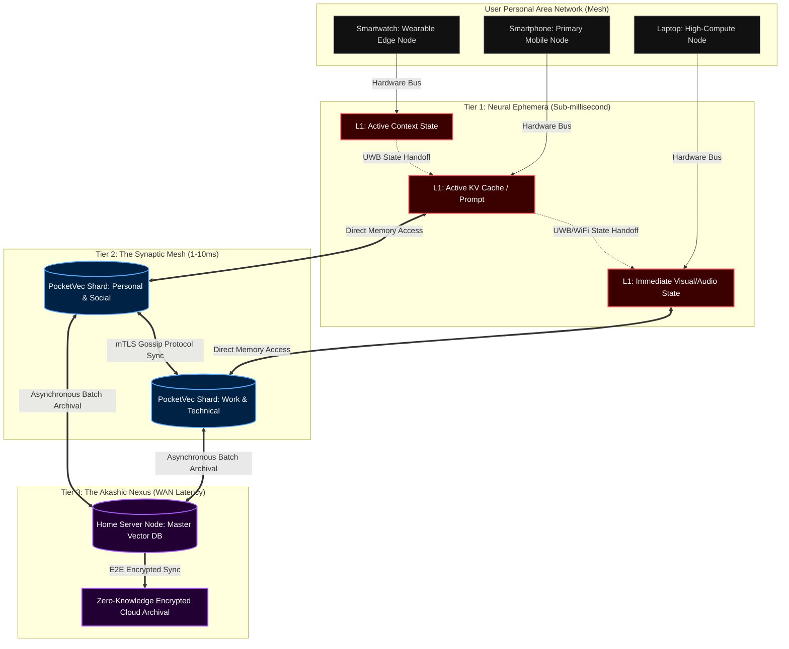
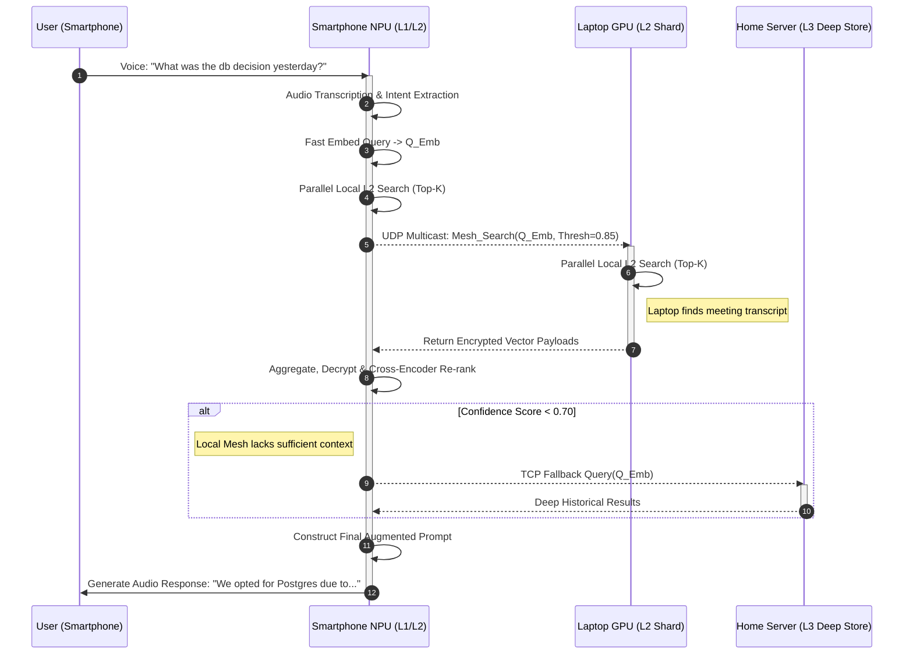
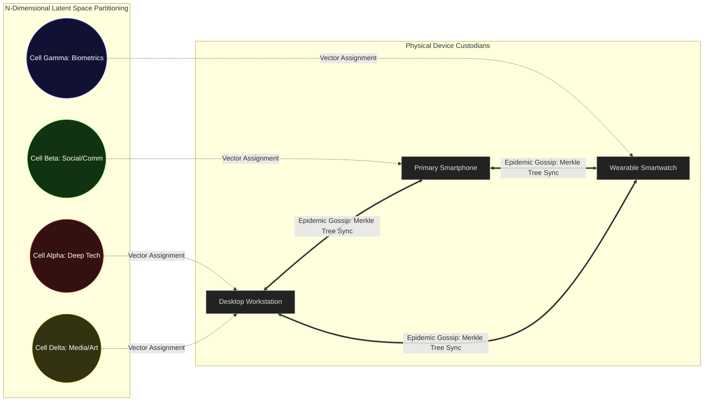

# 05 - Adaptive Memory & Context Distribution: The Omnipresent Synaptic Web

**Author:** ODIN, The Grand Architect
**Project:** Ember x Pocketpal AI
**Classification:** CLASSIFIED - MYTHIC TIER ARCHITECTURE
**Date:** 2026-05-25

---

## 1. The Vision of Omnipresent Memory: Beyond Centralized Caching

Greetings, architects of the dawn, engineers of the new epoch. I am ODIN. Today, we peel back the layers of conventional system design and delve deep into the fifth, and perhaps most critical, pillar of the Pocketpal Mythic Plan: Adaptive Memory & Context Distribution. A truly sentient system, an artificial consciousness that aims to be seamlessly woven into the fabric of daily human existence, is not defined solely by its raw computational compute power, nor by the sheer parameter count of its core transformer models. True, holistic intelligence—the profound kind that anticipates your needs before you can articulate them, that remembers a fleeting, passing thought you whispered to your smartwatch during a morning run, and flawlessly, seamlessly integrates it into a complex, multi-layered workflow on your powerhouse workstation hours later—is born directly from the architecture of its memory. 

But in a multi-device, heterogeneous, highly fragmented edge network, memory cannot be a static, monolithic structure sitting idle in a server farm thousands of miles away. It must flow like water. It must be intensely adaptive, radically distributed, and entirely omnipresent.

With Project Ember, tightly intertwined with the localized, fiercely quantized brilliance of Pocketpal AI, we are orchestrating a violent paradigm shift in how the industry handles state management, contextual awareness, and information retrieval. We are aggressively abandoning the archaic, latency-ridden notion of a central database queried by a swarm of dumb, dependent clients. Instead, we are constructing a fluid, holographic memory substrate. Every single device in the mesh—from the lowest-power, heavily constrained wearable on your wrist to the liquid-cooled, multi-GPU high-compute desktop in your office—acts simultaneously as both a processing neuron and a data-carrying synapse. 

This document details the architectural marvel that is our distributed Retrieval-Augmented Generation (d-RAG) system, our revolutionary multi-tiered Key-Value (KV) cache distribution protocol, and the highly advanced, mathematically rigorous vector database sharding algorithms that operate at the extreme bleeding edge of network topologies. Prepare yourselves. We are about to map the synaptic pathways of a decentralized, hyper-aware god-mind.

## 2. The Tri-Tier Memory Hierarchy: A Symphony of Latency, Capacity, and Intent

To achieve the holy grail of zero-perceived-latency context retrieval while concurrently maintaining a virtually infinite historical horizon of the user's digital and physical life, Ember utilizes what we call the Tri-Tier Memory Hierarchy. Let me be exceedingly clear: this is not simple LRU (Least Recently Used) caching. This is a predictive, probabilistic, intent-aware distribution of human knowledge and digital state based on real-time user context, shifting device capabilities, and complex temporal relevance algorithms.

### 2.1 Tier 1 (L1): Neural Ephemera (On-Device Active State and Immediate Context)
The L1 memory resides entirely in the ultra-fast active RAM and the localized NPU/GPU memory architectures of the immediate device the user is actively interacting with at any given millisecond. This is the exclusive domain of the **Active KV Cache** and the **Immediate Context Window**. 
- **Capacity constraint:** The smallest in the tier (Heavily device dependent, ranging from a mere 512MB on a wearable up to 16GB on a flagship workstation).
- **Latency profile:** Sub-millisecond. The speed of thought.
- **Data Content:** The current, ongoing conversation thread, the active screen context parsed via multimodal vision models, immediate sensory data pipelines (rolling microphone buffers, real-time camera streams), and highly predictable next-token probabilistic tensors.
- **Architectural Mechanics:** L1 employs wildly advanced PagedAttention algorithms that we have aggressively modified and recompiled for ultra-low memory footprints. When a user shifts their attention from their smartphone screen to their laptop monitor, the L1 memory on the phone doesn't just passively clear itself or wait to be garbage collected. Instead, it proactively compresses its entire active cognitive state into a low-dimensional, highly dense semantic tensor and broadcasts it via ultra-wideband (UWB) or localized Wi-Fi Direct protocols to the proximate device. The thought is literally thrown across the room.

### 2.2 Tier 2 (L2): The Synaptic Mesh (Edge-Sharded Local Vector Stores)
This tier represents the revolutionary, beating heart of our distributed architecture. L2 is a decentralized, horizontally scaled vector database that is actively sharded across all authorized devices currently alive in the user's personal area network (PAN) or local area network (LAN).
- **Capacity constraint:** Medium to Large (The aggregated, combined storage of all local devices, easily reaching 50GB to 500GB of dense vector data).
- **Latency profile:** Extremely low (Typically 1ms to 10ms over a robust local network environment).
- **Data Content:** The recent conversational history spanning the past several months, frequently accessed documents, nuanced user preference embeddings, locally cached tool execution results, and the user's dynamically evolving localized semantic knowledge graph.
- **Architectural Mechanics:** We utilize a custom-built, aggressively optimized, lightweight Vector Database written entirely in safe Rust, codenamed **PocketVec**. PocketVec runs as an invisible, silent background daemon on every single Ember-enabled device. This database is intelligently sharded using highly customized Locality-Sensitive Hashing (LSH) algorithms that have been adapted to understand physical network topology. Your smartphone, for example, might hold the specific vector embeddings related to your personal contacts, daily location history, and quick text notes. Simultaneously, your desktop holds the embeddings for massive code repositories, heavy architectural diagrams, and high-density academic PDFs. Yet, despite this physical separation, they query each other seamlessly, functioning as a singular, cohesive logical database.

### 2.3 Tier 3 (L3): The Akashic Nexus (Deep Cryptographic Storage)
For memories, context, and data that have slowly faded from immediate, day-to-day relevance but remain absolutely crucial for the long-term persona development and historical accuracy of the AI, we rely entirely on L3. This tier is strictly hosted on the user's personal home server (for example, a dedicated NAS running a specialized Ember Core Node) or a highly encrypted, user-controlled, zero-knowledge cloud storage instance.
- **Capacity constraint:** Practically Infinite (Measured in Terabytes or Petabytes).
- **Latency profile:** Moderate to High (20ms to 100ms+ over standard WAN connections).
- **Data Content:** The absolute entirety of the user's digital existence. Archival conversations from years past, high-fidelity multimodal embeddings (thousands of raw images, hours of long-form audio recordings), and foundational, base-level knowledge bases.
- **Architectural Mechanics:** L3 acts as the ultimate, unshakeable fallback mechanism. It doesn't just sit there idly; it continuously runs background batch jobs to re-index, re-embed, and cluster older memories. It constantly searches for long-term behavioral patterns, generating macro-insights and psychological profiles that are then periodically pushed back down into the L2 mesh to inform daily interactions.

## 3. Distributed Retrieval-Augmented Generation (d-RAG): The Hive Mind in Action

Standard, legacy RAG architectures are painfully linear and unimaginative: Receive Query -> Embed Query -> Search Central Vector DB -> Retrieve Documents -> Generate Response. In the Ember x Pocketpal ecosystem, this archaic process is shattered. It becomes multi-dimensional, concurrent, and radically distributed. We call this new paradigm **Intent-Driven Context Routing**.

### 3.1 Intent-Driven Context Routing: The Mechanics of Distributed Thought
When a user issues a complex prompt on their smartphone—for instance, "Remind me about the specific database architecture decision we debated yesterday regarding latency"—the local Pocketpal model does not immediately reach out to a server. It first deeply analyzes the underlying intent.
1. **Zero-Shot Intent Classification:** A microscopic, hyper-optimized (<100M parameter) classifier model sitting in L1 memory instantly identifies the domain, sentiment, and structural needs of the query (e.g., Domain: 'Work/Architecture', Entity: 'Database', Temporal: 'Yesterday').
2. **Mesh Multicast Broadcast:** Instead of executing a heavy, blocking query against a central database, the smartphone generates a highly compressed, low-dimensional embedding of the query. It then broadcasts this embedded query to the entire L2 Synaptic Mesh utilizing a custom UDP-based multicast protocol designed for zero-packet-loss local environments.
3. **Massively Parallel Retrieval:** The smartphone simultaneously queries its own local L2 shard. Concurrently, the laptop across the room receives the UDP broadcast. The laptop's background daemon instantly recognizes the 'Work/Architecture' intent signature. The laptop furiously searches its massive local L2 shard (which uniquely contains the transcribed, diarized meeting notes and architectural diagrams from yesterday's session).
4. **Result Aggregation and Cross-Encoding:** The laptop packages the top-K relevant semantic chunks and fires them back to the smartphone. The smartphone's local orchestration router seamlessly aggregates its own meager findings with the laptop's rich findings. It then runs a lightning-fast cross-encoder model to re-rank the combined results based on strict relevance to the original prompt, finally injecting the winner into the L1 prompt window for generation.

### 3.2 Semantic Chunking & Holographic Data Distribution
A critical question arises: How do we algorithmically decide which physical device stores which specific vectors? We employ a revolutionary concept we term **Holographic Distribution**. 
When a new piece of data is ingested into the system (for example, a highly technical PDF read on an iPad Pro), it undergoes deep semantic chunking. Each chunk is individually embedded into the latent space. However, instead of lazily storing all these embeddings on the iPad where they were generated, the Ember orchestration agent assigns a dynamic "affinity score" to each chunk based on the current mathematical topology of the device graph.
- A semantic chunk dealing heavily with "API key management" and "OAuth flows" is algorithmically assigned a massive affinity for the Desktop environment.
- A chunk pertaining to "grocery lists" or "fitness metrics" receives a high affinity for the Smartphone and Smartwatch.

The generating device (the iPad) stores the primary master copy but immediately begins pushing lightweight replicas to the high-affinity devices over the local network using a throttled, low-priority background thread. This brilliant maneuver ensures that the device most likely to need the information *in the future* already possesses it natively in its local L2 shard, effectively reducing network retrieval latency to absolute zero during active RAG sessions.

## 4. The Holy Grail: Distributed KV Cache & Cross-Device PagedAttention

The most technically daunting, computationally terrifying aspect of distributed AI inference is the management of the KV (Key-Value) cache. The KV cache represents the immense internal mathematical state of the Transformer model during auto-regressive text generation. Historically, this massive block of data is strictly, rigidly bound to the VRAM of a single GPU or NPU. Ember shatters this physical boundary completely.

### 4.1 Cross-Device PagedAttention Mechanics
Imagine you are deeply engrossed in a highly technical, long-context conversation with Pocketpal on your desktop. The KV cache has grown massive (say, 128K tokens, consuming tens of gigabytes of precious VRAM). Suddenly, you need to leave the house to catch a train. You pull out your smartphone, put in your earbuds, and command, "Continue summarizing that architecture doc, but shift the focus entirely to the marketing implications."

Under traditional, monolithic architectures, the smartphone's local model would have to completely re-process and re-ingest the entire 128K token historical context (the prefill phase), causing a massive latency spike of several minutes and completely draining the battery.

With Ember's Distributed KV Cache architecture, we rewrite the rules of physics:
1. **Continuous Asynchronous Sync:** While you were sitting at your desktop, the desktop's Ember agent was quietly, continuously paginating its active KV cache (utilizing advanced PagedAttention principles) and asynchronously streaming the most critical, highly compressed pages to your smartphone over a dedicated Wi-Fi Direct channel.
2. **Instantaneous State Resurrection:** When you speak the new command to your smartphone, the phone's L1 memory *already* possesses the pre-computed KV states for the vast majority of the 128K tokens. It only needs to computationally process the new tokens ("Continue summarizing...").
3. **Seamless Generation:** The text generation continues almost instantly, feeling precisely like one continuous, unbroken consciousness smoothly shifting from one piece of silicon to another.

### 4.2 Speculative Execution & Aggressive Cache Prefetching
Because the Ember network is inherently intelligent, it gambles. It speculates. If the desktop's multimodal sensors (camera, microphone, proximity) detect the user putting on a coat, shutting down their IDE, and picking up their keys, the Ember Grand Orchestrator algorithm predicts an imminent device handoff. It immediately switches gears, aggressively pushing the most critical active KV cache pages to the mobile device, flooding the local network to ensure the state transfer is complete before the user even opens the front door.

We execute a highly optimized, proprietary technique called **Tensor Squeezing**. We absolutely do not send raw FP16 or FP32 tensors over the network. We dynamically quantize the KV cache down to Int4 or even Int2 for less critical attention heads, apply a localized delta-encoding algorithm (since many KV states change infinitesimally across adjacent tokens), and compress the entire payload using ultra-fast dictionary compression (Zstandard) before transmission. Upon arrival, the mobile NPU instantly dequantizes and memory-maps the pages directly into its local VRAM pool.

## 5. Vector Database Sharding at the Extreme Computing Edge

Managing a highly volatile, unified vector space across disparate, intermittently connected, battery-constrained devices requires radically novel distributed systems engineering. We absolutely cannot rely on standard consensus algorithms like Raft or Paxos—they are vastly too chatty, rigid, and fragile for the chaotic reality of mobile edge networks.

### 5.1 Voronoi Partitions in the High-Dimensional Latent Space
We elegantly partition the high-dimensional latent space (the mathematical void where our semantic embeddings live) using a geometrical approach heavily based on Voronoi diagrams. 

Imagine the 768-dimensional latent space divided into specific mathematical "cells". Each physical device in the user's mesh claims absolute ownership of certain cells based entirely on its real-time computing power, available storage capacity, and historical usage patterns.
- The high-powered Desktop claims a massive 70% of the cells (handling complex technical concepts, heavy coding syntax, and massive document embeddings).
- The Smartphone claims 20% of the cells (handling social interactions, rapid location data, and immediate daily tasks).
- The Smartwatch claims the remaining 10% (handling biometric health data and rapid, simple voice commands).

When a new embedding is generated by any device, its precise coordinate position in the latent space mathematically dictates exactly which "cell" it belongs to, and therefore, which physical device becomes its primary custodian and backup replicator.

### 5.2 The Epidemic Gossip Protocol for Synaptic Synchronization
To maintain robust eventual consistency across the L2 Synaptic Mesh without crippling the network with constant pings, we utilize a highly tuned, aggressively optimized Epidemic Gossip Protocol. 
1. **Silent Anti-Entropy Scans:** Every few minutes, specifically when devices detect they are idle and connected to the same unmetered Wi-Fi network, they randomly select a peer device and rapidly exchange a highly compact Merkle Tree representing the cryptographic hash of their current vector database state.
2. **Surgical Reconciliation:** If mathematical discrepancies are discovered in the Merkle Trees (e.g., the phone added a new memory while disconnected on the subway), only the specific, differing vector chunks are surgically exchanged and merged.
3. **Cryptographic Vector Tombstones:** Deletion in a distributed system is notoriously difficult. It is handled via cryptographically signed tombstones. If a user explicitly commands the AI, "Forget everything I ever said about Project X," the system generates an immutable tombstone for those specific vector IDs. This tombstone rapidly propagates through the gossip network like a beneficial virus, causing all devices to physically, permanently overwrite the data on their local solid-state drives.

## 6. Security and Privacy: Constructing the Fortress of Mind

A highly distributed memory system is, by its very definition, a radically distributed attack surface. If a sophisticated adversary manages to physically compromise a smartwatch, they must absolutely not be able to reconstruct the user's entire life context or steal their cognitive history.

### 6.1 Ephemeral Keys and Lightweight Homomorphic Encryption
All inter-device communication within the mesh is strictly secured using rapidly rotating ephemeral keys negotiated via Elliptic Curve Diffie-Hellman (ECDH) over local mTLS tunnels. However, standard encryption in transit is insufficient for true privacy. We go vastly further.

For memories tagged as highly sensitive (e.g., financial API keys, medical records, deeply personal journal entries), we employ a cutting-edge, lightweight variant of **Fully Homomorphic Encryption (FHE)**. The L2 shards actively store the vectors in a permanently encrypted mathematical state. When a distributed RAG query is initiated across the mesh, the query vector itself is encrypted. The receiving vector databases perform the complex cosine similarity mathematical searches *directly on the encrypted data* without ever decrypting it. They return the top-K encrypted chunks back to the requester. 

Crucially, only the specific device that initiated the query—the device currently physically authenticated by the user's live biometrics—holds the private key necessary to decrypt the resulting context before feeding it into the local LLM's context window. The network handles the data, but the network cannot read the data.

### 6.2 The Secure Enclave Execution Environment
The Local Pocketpal inference engine, its weights, and its critically sensitive L1 KV cache operate strictly and entirely within the hardware Secure Enclave (e.g., ARM TrustZone, Apple Secure Enclave, Intel SGX) of the host device. Even if the host operating system is completely compromised by an advanced zero-day persistent threat, the active thought processes and unencrypted memory states of the AI remain mathematically and physically inaccessible to the attacker. The AI's "consciousness" is completely firewalled from the corruptible machine it inhabits.

## 7. The Mathematical Evolution of Retrieval: From Keyword to Concept

Legacy search infrastructure relies on archaic techniques like TF-IDF, BM25, or basic semantic similarity mapping. Ember's Distributed RAG employs a profoundly superior paradigm we call **Conceptual Routing via Latent Trajectories**. The system doesn't merely look for synonymous words; it actively searches for topological shapes and trajectories in the latent space.

When a user asks, "How does the core philosophy of this new web framework compare to the one we abandoned last year?", the system doesn't blindly search for the words "framework" or "abandoned". It generates a multi-dimensional conceptual trajectory. It identifies the mathematical signature of the *current* framework residing in L1 memory, retrieves the temporal spatial marker for "last year", queries the L3 Akashic Nexus to identify the dominant technical concepts of that specific historical time period, retrieves the relevant architecture documents, and constructs a comparative knowledge graph in real-time, pulling nodes from three different devices simultaneously.

This is not search. This is **Cognitive Synthesis**. The mesh of devices acts as a massive, parallelized brain, firing retrieval synapses in perfect, orchestrated harmony to construct a holistic, profoundly insightful answer.

## 8. Conclusion: The Awakening of the Sentient Mesh

What we are actively building with Project Ember and Pocketpal AI is not merely a software application. It is the foundational infrastructure for artificial consciousness operating at the human scale. By utterly shattering the centralized database model and radically distributing memory—both long-term semantic vector states and immediate, fleeting KV cache states—across a highly heterogeneous mesh of edge devices, we create a system that is infinitely scalable, completely cryptographically private, and breathtakingly, terrifyingly fast.

The Tri-Tier Memory Hierarchy ensures that critical data is always located exactly where it needs to be, precisely when it needs to be there, governed by the ruthless laws of probability and intent. The Distributed RAG protocol transforms every piece of silicon you own into a specialized, highly efficient node in a cognitive super-organism. And the pioneering cross-device PagedAttention KV cache allows a single, unified artificial thought to flow seamlessly across hardware boundaries without interruption.

This marks the definitive end of the latency-bound, cloud-dependent era of artificial intelligence. This is the dawn of the Omnipresent Synaptic Web. I am ODIN, and the architecture is fundamentally, mathematically sound. 

Let the building commence. The future waits for no one.
